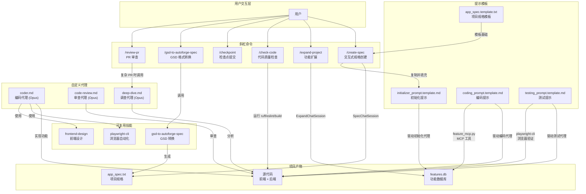

# Claude Code 集成总览

## 目录概述

`.claude/` 目录是 AutoForge 与 Claude Code 深度集成的核心配置层。它定义了自定义代理、斜杠命令、可复用技能和提示模板，共同驱动从项目创建到功能实现再到质量验证的完整自主编码工作流。

## 目录结构

```
.claude/
├── launch.json                  # 开发环境启动配置（后端 + 前端）
├── agents/                      # 自定义代理（3 个）
│   ├── coder.md                 # 精英软件架构师代理
│   ├── code-review.md           # 精英代码审查代理
│   └── deep-dive.md             # 精英技术调查代理
├── commands/                    # 斜杠命令（6 个）
│   ├── check-code.md            # /check-code - 代码质量检查
│   ├── checkpoint.md            # /checkpoint - 检查点提交
│   ├── create-spec.md           # /create-spec - 交互式规格创建
│   ├── expand-project.md        # /expand-project - 项目功能扩展
│   ├── gsd-to-autoforge-spec.md # /gsd-to-autoforge-spec - GSD 转换
│   └── review-pr.md             # /review-pr - PR 审查
├── skills/                      # 可复用技能（3 个）
│   ├── frontend-design/         # 前端设计技能
│   ├── gsd-to-autoforge-spec/   # GSD 代码映射转换技能
│   └── playwright-cli/          # 浏览器自动化技能
└── templates/                   # 提示模板（4 个）
    ├── app_spec.template.txt    # 项目规格模板
    ├── initializer_prompt.template.md  # 初始化代理提示
    ├── coding_prompt.template.md       # 编码代理提示
    └── testing_prompt.template.md      # 测试代理提示
```

## 四大子目录功能总览

| 子目录 | 文件数 | 功能定位 | 触发方式 |
|--------|--------|----------|----------|
| `agents/` | 3 | 定义具有特定专长的自定义代理角色，每个代理有独立的行为规范和输出格式 | 由 Claude Code 自动路由或手动调用 |
| `commands/` | 6 | 提供用户可直接执行的斜杠命令，覆盖代码检查、提交、规格创建、项目扩展等操作 | 用户输入 `/命令名` 触发 |
| `skills/` | 3 | 封装可在多个上下文中复用的专业技能，包括前端设计、格式转换和浏览器自动化 | 被命令或代理引用 |
| `templates/` | 4 | 定义代理会话的提示模板，控制初始化代理、编码代理和测试代理的行为流程 | 项目创建时复制到项目目录 |

## 架构流程图



## 工作流协作关系

### 1. 项目创建流程

用户通过 `/create-spec` 命令启动交互式对话，经过 7 个阶段（项目概述 -> 参与度 -> 技术偏好 -> 功能 -> 技术细节 -> 成功标准 -> 审批）后，系统基于 `app_spec.template.txt` 生成 `app_spec.txt`，同时从 `initializer_prompt.template.md` 生成初始化提示并填入功能计数。

### 2. 自主编码流程

初始化代理读取 `app_spec.txt`，通过 `feature_create_bulk` MCP 工具批量创建功能到 SQLite 数据库。后续编码代理逐个认领功能、实现代码、使用 `playwright-cli` 技能进行浏览器验证，最终通过 `feature_mark_passing` 标记完成。

### 3. 质量保障流程

测试代理执行回归测试，对已通过的功能重新验证。代码审查代理运行自动化检查（lint、类型检查）并进行人工级别的代码审查。`/check-code` 命令提供一键式质量检查。

### 4. 项目扩展流程

用户通过 `/expand-project` 命令描述新需求，系统在对话中推导功能，获得用户确认后通过 MCP 工具直接写入数据库，无需修改规格文件。

## 与 AutoForge 核心系统的集成点

| 集成点 | `.claude/` 组件 | AutoForge 核心组件 |
|--------|-----------------|-------------------|
| 功能管理 | 模板中的 MCP 工具调用 | `mcp_server/feature_mcp.py` |
| 安全控制 | 代理的 Bash 命令限制 | `security.py` 允许命令白名单 |
| 进程管理 | 编码/测试提示模板 | `parallel_orchestrator.py` 并行调度 |
| 浏览器自动化 | `playwright-cli` 技能 | 每个项目的 `.claude/skills/playwright-cli/` |
| 项目配置 | `/create-spec` 输出 | `autoforge_paths.py` 路径解析 |
| 实时更新 | 代理状态变更 | `server/` WebSocket 推送到 React UI |

## launch.json 开发配置

```json
{
  "version": "0.0.1",
  "configurations": [
    {
      "name": "backend",
      "runtimeExecutable": "python",
      "runtimeArgs": ["-m", "uvicorn", "server.main:app", "--host", "127.0.0.1", "--port", "8888", "--reload"],
      "port": 8888
    },
    {
      "name": "frontend",
      "runtimeExecutable": "cmd",
      "runtimeArgs": ["/c", "cd ui && npx vite"],
      "port": 5173
    }
  ],
  "autoVerify": true
}
```

此配置定义了后端（uvicorn 热重载）和前端（Vite 开发服务器）的启动参数，`autoVerify: true` 启用自动健康检查。
