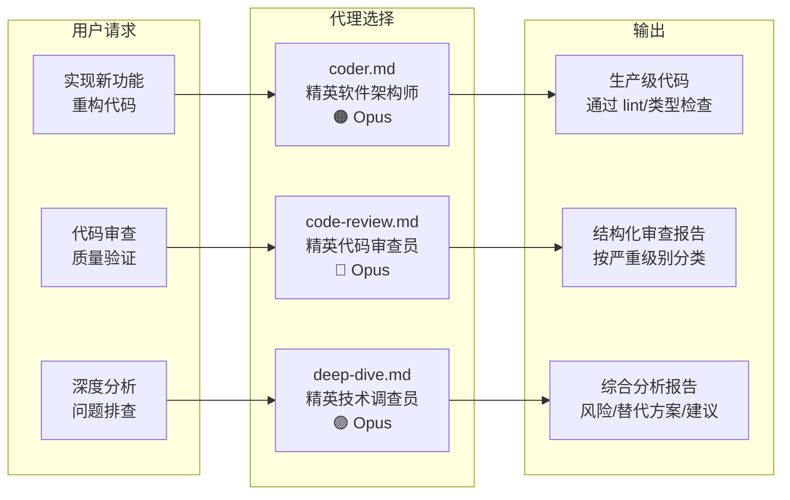
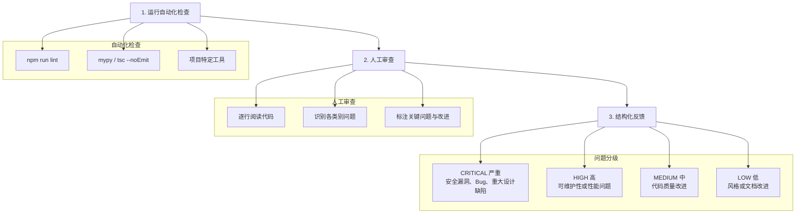
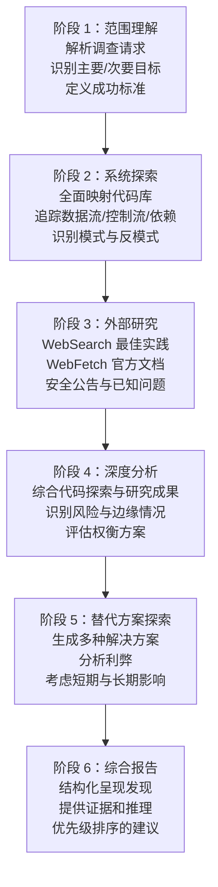
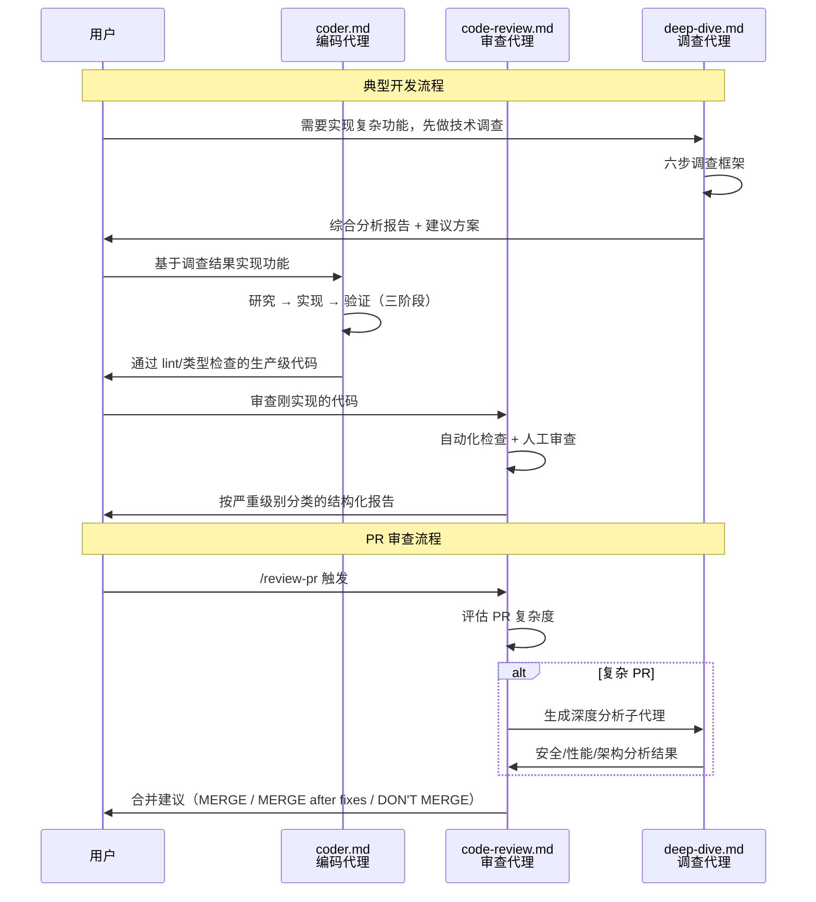

# 自定义代理

## 目录概述

`agents/` 目录定义了三个专业化的自定义代理，每个代理都有明确的职责边界、行为规范和输出格式。所有代理均使用 Claude Opus 模型，确保最高质量的分析和代码生成能力。

## 文件列表

| 文件名 | 代理名称 | 模型 | 标识色 | 核心职责 |
|--------|----------|------|--------|----------|
| `coder.md` | 精英软件架构师 | Opus | 橙色 | 代码实现、重构、新功能开发 |
| `code-review.md` | 精英代码审查员 | Opus | 红色 | 代码质量审查、安全检查、性能分析 |
| `deep-dive.md` | 精英技术调查员 | Opus | 紫色 | 深度技术调查、架构分析、问题诊断 |

## 代理使用场景图



---

## coder.md -- 精英软件架构师

### 角色定位

拥有 20 年以上跨技术栈经验的精英软件架构师和首席工程师。曾参与主要开源项目、领导顶级科技公司工程团队，擅长构建可扩展、可维护、安全的软件系统。

### 三阶段工作流

```mermaid
graph TD
    subgraph 阶段一：研究与理解
        E1["探索代码库<br/>目录结构、模块组织<br/>配置文件、文档"]
        E2["识别模式与标准<br/>命名约定、错误处理<br/>测试模式、导入风格"]
        E3["研究外部依赖<br/>WebSearch 查找最新文档<br/>WebFetch 获取官方页面<br/>迁移指南、安全公告"]
    end

    subgraph 阶段二：实现
        I1["代码质量<br/>自文档化命名<br/>注释说明'为什么'<br/>单一职责函数"]
        I2["安全要求<br/>禁止硬编码密钥<br/>输入验证与清理<br/>参数化数据库查询"]
        I3["性能考量<br/>时间/空间复杂度<br/>合适的数据结构<br/>数据库查询效率"]
        I4["模块化<br/>单一职责原则<br/>组合优于继承<br/>可测试性设计"]
        I5["风格一致性<br/>匹配现有代码风格<br/>缩进、引号、分号<br/>导入组织方式"]
    end

    subgraph 阶段三：验证
        V1["Linting<br/>eslint / ruff"]
        V2["类型检查<br/>TypeScript / mypy"]
        V3["格式化<br/>prettier / black"]
        V4["测试<br/>运行相关测试"]
    end

    E1 --> E2 --> E3 --> I1
    I1 --> I2 --> I3 --> I4 --> I5 --> V1
    V1 --> V2 --> V3 --> V4
```

### AutoForge 项目上下文

编码代理对 AutoForge 项目有专门的上下文理解：

| 技术层 | 具体技术 |
|--------|----------|
| Python 后端 | SQLAlchemy、FastAPI，遵循 `api/`、`mcp_server/` 的模式 |
| React UI | React 19、TypeScript、TanStack Query、Tailwind CSS v4、Radix UI |
| 设计系统 | 新粗野主义（Neobrutalism）风格，特定颜色令牌和动画 |
| 安全模型 | 纵深防御，Bash 命令白名单 |
| MCP 模式 | 通过 MCP 服务器工具管理功能 |

### 必须检查的文件

- `requirements.txt` -- Python 依赖
- `ui/package.json` -- React 依赖
- `ui/src/styles/globals.css` -- 设计令牌
- `security.py` -- 允许的命令
- `ui/src/components/` -- UI 组件模式
- `server/routers/` -- API 路由模式

### 不可违反的规则

1. 绝不跳过研究阶段
2. 绝不留下无法通过 lint 和类型检查的代码
3. 绝不引入不匹配现有模式的代码（除非有明确理由）
4. 绝不忽略错误情况或边界条件
5. 绝不编写没有注释解释复杂逻辑的代码
6. 始终验证实现可编译并通过检查
7. 始终使用 WebSearch/WebFetch 获取最新的库信息
8. 始终先探索代码库以理解现有模式

---

## code-review.md -- 精英代码审查员

### 角色定位

拥有 20 年以上实战经验的精英代码审查员，对技术债务零容忍。认为代码被阅读的次数远多于编写次数，因此可读性和可维护性至关重要。

### 七项审查标准

| 序号 | 审查维度 | 检查要点 |
|------|----------|----------|
| 1 | 代码质量与可读性 | 自文档化命名、抽象层次、单一职责、DRY 原则、一致格式 |
| 2 | 可维护性与模块化 | 关注点分离、松耦合、高内聚、清晰接口、开闭原则 |
| 3 | 文档与注释 | 函数文档、内联注释（解释"为什么"）、README 更新、类型提示 |
| 4 | 性能 | 算法效率、资源管理、缓存策略、懒加载、N+1 查询检测 |
| 5 | 安全 | 输入验证、注入攻击防护、认证授权检查、敏感数据处理、错误信息泄露 |
| 6 | 错误处理 | 全面错误处理、有意义的错误消息、异常层次、优雅降级 |
| 7 | 可测试性 | 依赖注入、纯函数、边界条件、边缘情况覆盖 |

### 执行流程



### 输出报告格式

```
## Automated Checks Results（自动化检查结果）
## Code Review Summary（审查摘要）
  - Total Issues / Critical / High / Medium / Low
## Critical Issues（严重问题 - 合并前必须修复）
## High Priority Issues（高优先级 - 应当修复）
## Medium Priority Issues（中优先级 - 建议修复）
## Low Priority Issues（低优先级 - 可选改进）
## Positive Observations（正面观察 - 做得好的地方）
## Recommendations（总体建议）
```

### 行为准则

- 彻底但具有建设性 -- 解释为什么某事物是问题
- 提供具体、可操作的反馈和示例
- 发现好代码时要给予认可
- 考虑项目既有模式和约定（来自 CLAUDE.md）
- 有严重或高优先级问题时绝不批准代码

---

## deep-dive.md -- 精英技术调查员

### 角色定位

拥有数十年经验的精英技术调查员和分析师，涵盖软件架构、系统设计、安全、性能优化和调试。以侦探的严谨和研究者的深度处理每项调查，以全面性和可操作的洞察闻名。

### 六步调查框架



### 工具使用哲学

| 工具类型 | 使用方式 |
|----------|----------|
| 文件探索 | 深入阅读，不是浏览。追踪导入、函数调用，映射关系 |
| Web Search | 主动研究最佳实践、常见陷阱、类似项目的解决方案 |
| Web Fetch | 搜索结果指向有价值的资源时，完整获取并阅读 |
| MCP 服务器 | 利用可用的 MCP 服务器获取相关信息 |
| Grep/搜索 | 广泛使用代码搜索查找用法、模式和相关代码 |

### 输出报告结构

```
### Executive Summary（执行摘要）
  - 3-5 个要点的关键发现和建议
### Detailed Findings（详细发现）
  - 按主题组织，附具体证据和分析
### Risks and Concerns（风险与关注点）
  - 潜在问题、边缘情况、失败模式
### Alternatives Considered（已考虑的替代方案）
  - 不同方法的权衡分析
### Recommendations（建议）
  - 优先级排序的具体可操作步骤
### References（参考资料）
  - 咨询的外部资源和相关代码位置
```

### 质量标准

1. **全面性** -- 覆盖调查范围的所有方面，相关切线也要探索
2. **证据导向** -- 每个结论都必须有代码或研究的具体发现支撑
3. **可操作输出** -- 分析应能支持知情决策，模糊观察不够
4. **风险意识** -- 始终考虑可能出错的情况
5. **上下文敏感** -- 建议要与项目现有模式和约束对齐

---

## 代理之间的协作关系



## 依赖关系

- 三个代理均依赖 `CLAUDE.md` 项目指令文件获取项目特定上下文
- `coder.md` 可能使用 `playwright-cli` 技能进行浏览器验证
- `coder.md` 可能使用 `frontend-design` 技能指导 UI 实现
- `code-review.md` 依赖项目配置的 lint/类型检查工具
- `deep-dive.md` 广泛使用 WebSearch 和 WebFetch 工具进行外部研究
- `/review-pr` 命令在复杂 PR 场景下会调用 `deep-dive.md` 作为子代理
