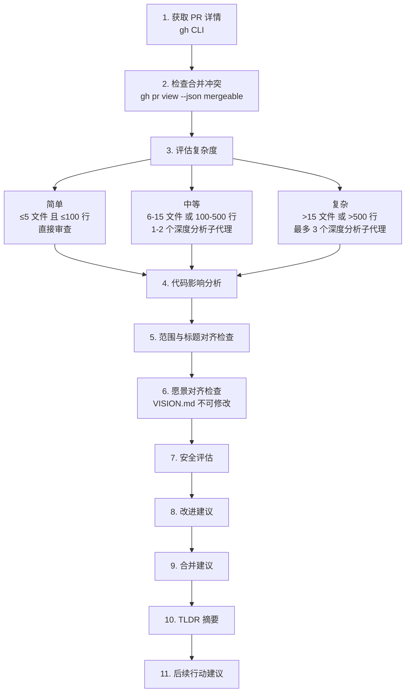
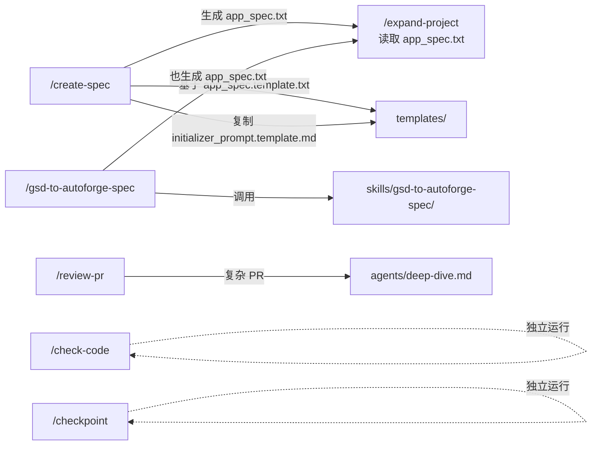

# 斜杠命令

## 目录概述

`commands/` 目录包含 6 个斜杠命令定义文件，用户可以在 Claude Code 中通过 `/命令名` 直接调用。这些命令覆盖了从代码质量检查、版本控制、项目规格创建到 PR 审查的完整开发工作流。

## 文件列表

| 文件名 | 命令 | 参数 | 功能描述 |
|--------|------|------|----------|
| `check-code.md` | `/check-code` | 无 | 运行 Python lint、安全测试、UI lint 和 TypeScript 构建检查 |
| `checkpoint.md` | `/checkpoint` | 无 | 分析变更并创建带有详细描述的检查点提交 |
| `create-spec.md` | `/create-spec` | 项目目录路径 | 7 阶段交互式对话创建项目规格，输出 `app_spec.txt` 等文件 |
| `expand-project.md` | `/expand-project` | 项目目录路径 | 阅读现有规格后通过对话添加新功能到数据库 |
| `gsd-to-autoforge-spec.md` | `/gsd-to-autoforge-spec` | 无 | 将 GSD 代码映射（`.planning/codebase/`）转换为 AutoForge 规格文件 |
| `review-pr.md` | `/review-pr` | PR 编号 | 获取 PR 详情、评估复杂度、分析影响并给出合并建议 |

## 命令流程总览

```mermaid
graph TB
    subgraph 代码质量
        CC["/check-code"]
        CC --> Ruff["ruff check ."]
        CC --> SecTest["python test_security.py"]
        CC --> ESLint["npm run lint"]
        CC --> Build["npm run build"]
    end

    subgraph 版本控制
        CP["/checkpoint"]
        CP --> GitInit["git init（如需要）"]
        CP --> GitStatus["git status + git diff"]
        CP --> GitLog["git log -5 --oneline"]
        CP --> GitCommit["git add -A + git commit"]
        GitInit --> GitStatus --> GitLog --> GitCommit
    end

    subgraph 项目创建
        CS["/create-spec 项目路径"]
        CS --> Phase1["阶段 1：项目概述"]
        Phase1 --> Phase2["阶段 2：参与度"]
        Phase2 --> Phase3["阶段 3：技术偏好"]
        Phase3 --> Phase4["阶段 4：功能（主要阶段）"]
        Phase4 --> Phase5["阶段 5：技术细节"]
        Phase5 --> Phase6["阶段 6：成功标准"]
        Phase6 --> Phase7["阶段 7：审查与批准"]
        Phase7 --> AppSpec["app_spec.txt"]
        Phase7 --> InitPrompt["initializer_prompt.md"]
        Phase7 --> SpecStatus[".spec_status.json"]
    end

    subgraph 项目扩展
        EP["/expand-project 项目路径"]
        EP --> ReadSpec["读取 app_spec.txt"]
        ReadSpec --> Discuss["讨论新功能"]
        Discuss --> Derive["推导功能清单"]
        Derive --> Approve["用户确认"]
        Approve --> BulkCreate["feature_create_bulk"]
        BulkCreate --> FeaturesDB["features.db"]
    end

    subgraph 格式转换
        GSD["/gsd-to-autoforge-spec"]
        GSD --> GSDSkill["gsd-to-autoforge-spec 技能"]
        GSDSkill --> ReadGSD["读取 .planning/codebase/*.md"]
        ReadGSD --> GenSpec["生成 app_spec.txt"]
    end

    subgraph PR 审查
        RP["/review-pr PR编号"]
        RP --> FetchPR["gh CLI 获取 PR 详情"]
        FetchPR --> Conflicts["检查合并冲突"]
        Conflicts --> Complexity["评估复杂度"]
        Complexity --> Impact["分析代码影响"]
        Impact --> Vision["愿景对齐检查"]
        Vision --> Safety["安全评估"]
        Safety --> Verdict["合并建议"]
    end
```



---

## /check-code -- 代码质量检查

### 功能说明

一键运行 AutoForge 项目的完整代码质量检查流水线，覆盖 Python 后端和 React 前端。

### 执行命令

| 检查项 | 命令 | 工作目录 |
|--------|------|----------|
| Python lint | `ruff check .` | 项目根目录 |
| 安全测试 | `python test_security.py` | 项目根目录 |
| ESLint | `npm run lint` | `ui/` |
| TypeScript 构建 | `npm run build` | `ui/` |

### 一键执行

```bash
# 遇到第一个错误停止
ruff check . && python test_security.py && cd ui && npm run lint && npm run build

# 查看所有失败（不在第一个错误处停止）
ruff check .; python test_security.py; cd ui && npm run lint; npm run build
```

---

## /checkpoint -- 检查点提交

### 功能说明

创建一个包含详细描述的综合检查点提交，适合在重要开发里程碑时使用。

### 执行步骤

1. **初始化 Git**（如需要） -- 检查是否已有 Git 仓库，没有则执行 `git init`
2. **分析所有变更** -- 运行 `git status` 查看文件状态、`git diff` 查看详细变更、`git log -5 --oneline` 了解提交风格
3. **暂存所有内容** -- 使用 `git add -A` 暂存所有已跟踪的修改、删除和未跟踪的新文件
4. **创建详细提交消息** -- 遵循以下规范：
   - **首行**：50-72 字符的简洁摘要，使用命令式语气
   - **正文**：详细描述变更内容、原因、技术决策和迁移说明
   - **页脚**：包含 Claude Code 共同作者署名

### 提交消息示例

```
feat: add user authentication

- Added JWT-based login/logout flow
- Implemented session management with secure cookies
- Created protected route middleware

Co-Authored-By: Claude Code <noreply@anthropic.com>
```

---

## /create-spec -- 交互式规格创建

### 功能说明

通过 7 阶段的交互式对话帮助用户创建完整的项目规格。设计为对所有技能水平的用户友好，既适合产品负责人也适合技术开发者。

### 参数要求

必须提供项目目录路径作为参数。示例：`/create-spec generations/my-app`

### 七阶段对话流程

| 阶段 | 名称 | 内容 | 用户类型 |
|------|------|------|----------|
| 1 | 项目概述 | 项目名称、描述、目标用户 | 所有用户 |
| 2 | 参与度 | 快速模式（推荐）或详细模式 | 所有用户 |
| 3 | 技术偏好 | 默认技术栈或自定义选择；数据库需求（必问） | 所有用户 |
| 4 | 功能（主要阶段） | 主体验、用户账户、CRUD、设置、搜索、共享、安全 | 所有用户 |
| 4L | 推导功能计数 | 代理自行统计可测试功能数（不向用户询问） | 代理内部 |
| 5 | 技术细节 | 快速模式：代理推导并概述；详细模式：逐项讨论 | 按模式区分 |
| 6 | 成功标准 | "完成"的定义、必备功能、质量期望 | 所有用户 |
| 7 | 审查与批准 | 总结展示，用户确认后生成文件 | 所有用户 |

### 功能计数参考范围

| 应用复杂度 | 功能数量 | 说明 |
|------------|----------|------|
| 简单应用 | ~25-55 | 含 5 个基础设施功能 |
| 中等应用 | ~105 | 含 5 个基础设施功能 |
| 高级应用 | ~155-205 | 含 5 个基础设施功能 |

### 输出文件

| 文件 | 路径 | 说明 |
|------|------|------|
| 项目规格 | `{项目目录}/.autoforge/prompts/app_spec.txt` | XML 格式的完整项目规格 |
| 初始化提示 | `{项目目录}/.autoforge/prompts/initializer_prompt.md` | 填入功能计数的初始化代理提示 |
| 状态文件 | `{项目目录}/.autoforge/prompts/.spec_status.json` | 完成信号，触发 UI 的"继续到项目"按钮 |

### 关键设计原则

- **适应所有技能水平**：用任何人都能回答的问题收集信息
- **推导而非询问**：对非技术用户，自行推导数据库模式、API 端点和架构
- **功能计数自推导**：根据讨论内容统计可测试行为数量，不使用固定层级
- **对话式交互**：每次只问一个阶段的问题，等待用户响应后再继续

---

## /expand-project -- 项目功能扩展

### 功能说明

为已有项目添加新功能。与 `/create-spec` 不同，它读取现有规格、理解项目上下文，然后通过 MCP 工具直接将新功能写入数据库。

### 参数要求

必须提供项目目录路径。示例：`/expand-project generations/my-app`

### 工作流程

| 步骤 | 操作 | 说明 |
|------|------|------|
| 前置 | 读取规格 | 读取 `app_spec.txt` 并向用户展示项目摘要 |
| 阶段 1 | 理解新增需求 | 开放式对话了解用户想添加的功能 |
| 阶段 2 | 明确细节 | 用户流程、集成关系、边缘情况 |
| 阶段 3 | 推导功能 | 统计可测试行为，展示分类明细供用户确认 |
| 创建 | 写入数据库 | 通过 `feature_create_bulk` MCP 工具一次性创建所有功能 |

### 功能质量标准

| 项目 | 要求 |
|------|------|
| 分类 | `security`、`functional`、`style`、`navigation`、`error-handling`、`data` |
| 名称 | 以用户操作开头："User can create new task"；或以结果开头："Login form validates email format" |
| 描述 | 解释测试内容、预期行为、验证方式 |
| 测试步骤 | 简单功能 2-5 步，复杂工作流 5-10 步 |

### 关键准则

1. **保留现有功能** -- 只添加不替换
2. **注重集成** -- 新功能应与现有功能协同工作
3. **质量一致** -- 与初始功能保持相同的严格标准
4. **增量扩展** -- 多次扩展会话完全可以

---

## /gsd-to-autoforge-spec -- GSD 格式转换

### 功能说明

将 GSD（Get Stuff Done）的代码库映射输出转换为 AutoForge 的 `app_spec.txt` 格式，使现有项目可以接入 AutoForge 自主编码流程。

### 前置条件

项目必须已运行 `/gsd:map-codebase`，生成 `.planning/codebase/` 目录：

| 文件 | 必需 | 内容 |
|------|------|------|
| `STACK.md` | 是 | 技术栈（语言、框架、依赖、运行时） |
| `ARCHITECTURE.md` | 是 | 代码架构（模式、层次、数据流、入口点） |
| `STRUCTURE.md` | 是 | 目录布局（关键文件位置、命名约定） |
| `CONVENTIONS.md` | 否 | 代码约定 |
| `INTEGRATIONS.md` | 否 | 外部服务和 API |

### GSD 到 AutoForge 的映射关系

| GSD 来源 | AutoForge 目标 |
|----------|----------------|
| STACK.md 语言 | `<technology_stack>` |
| STACK.md 框架 | `<frontend>`, `<backend>` |
| STACK.md 依赖 | `<prerequisites>` |
| ARCHITECTURE.md 层次 | `<core_features>` 分类 |
| ARCHITECTURE.md 数据流 | `<key_interactions>` |
| ARCHITECTURE.md 入口点 | `<implementation_steps>` |
| STRUCTURE.md 布局 | `<ui_layout>`（如有前端） |
| INTEGRATIONS.md API | `<api_endpoints_summary>` |

### 内部引用

此命令通过 `@.claude/skills/gsd-to-autoforge-spec/SKILL.md` 调用同名技能执行实际转换逻辑。

---

## /review-pr -- PR 审查

### 功能说明

对 GitHub Pull Request 进行全面审查，包括冲突检测、复杂度评估、代码影响分析、愿景对齐检查和安全评估，最终给出合并建议。

### 参数要求

必须提供至少一个 PR 编号。示例：`/review-pr 42`

### 审查流程



### 复杂度分级

| 级别 | 文件数 | 行数 | 贡献者 | 深度分析代理数 |
|------|--------|------|--------|----------------|
| 简单 | ≤5 | ≤100 | 1 | 0（直接审查） |
| 中等 | 6-15 | 100-500 | ≤2 | 1-2 |
| 复杂 | >15 | >500 | >2 | 最多 3 |

### 合并建议类型

| 建议 | 含义 | 后续行动 |
|------|------|----------|
| **MERGE** | 无问题，可直接合并 | 无需额外操作 |
| **MERGE (after fixes)** | 有小问题和/或冲突，可在 PR 分支上修复后合并 | 列出具体修复项，提议在 PR 分支上修复 |
| **DON'T MERGE** | 需要作者关注，风险过高或过于复杂 | 将 PR 退回作者并附详细反馈 |

### 关键规则

- **VISION.md 保护**：任何修改 `VISION.md` 的 PR 立即判定为 DON'T MERGE
- **范围不匹配**：标题描述与实际变更严重不符时为合并阻断项，建议拆分 PR
- **先修后合**：绝不先合并再在 main 上修复，始终在 PR 分支上修复

---

## 命令之间的依赖关系



- `/create-spec` 和 `/gsd-to-autoforge-spec` 都生成 `app_spec.txt`，为 `/expand-project` 提供前置条件
- `/create-spec` 依赖 `templates/` 目录中的模板文件
- `/gsd-to-autoforge-spec` 依赖 `skills/gsd-to-autoforge-spec/` 技能
- `/review-pr` 在处理复杂 PR 时调用 `agents/deep-dive.md` 代理
- `/check-code` 和 `/checkpoint` 是独立命令，不依赖其他命令
