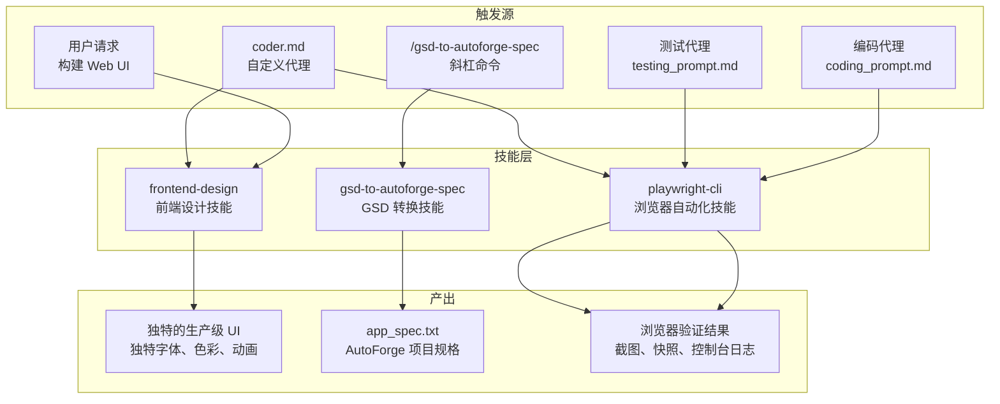
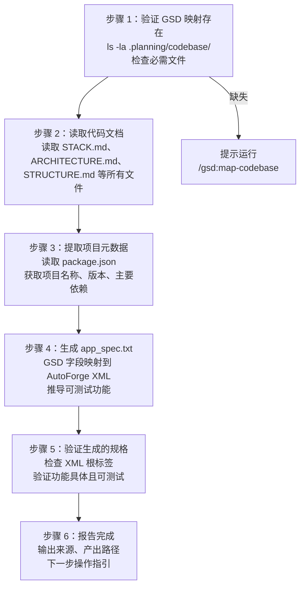
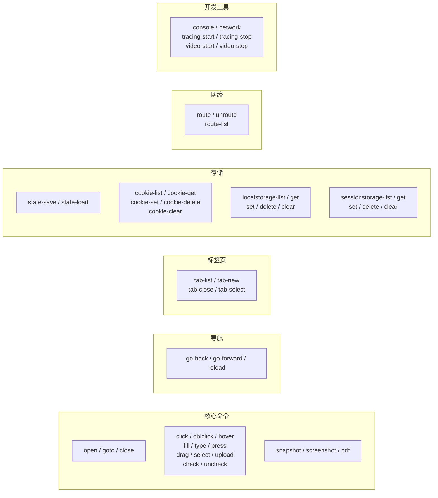
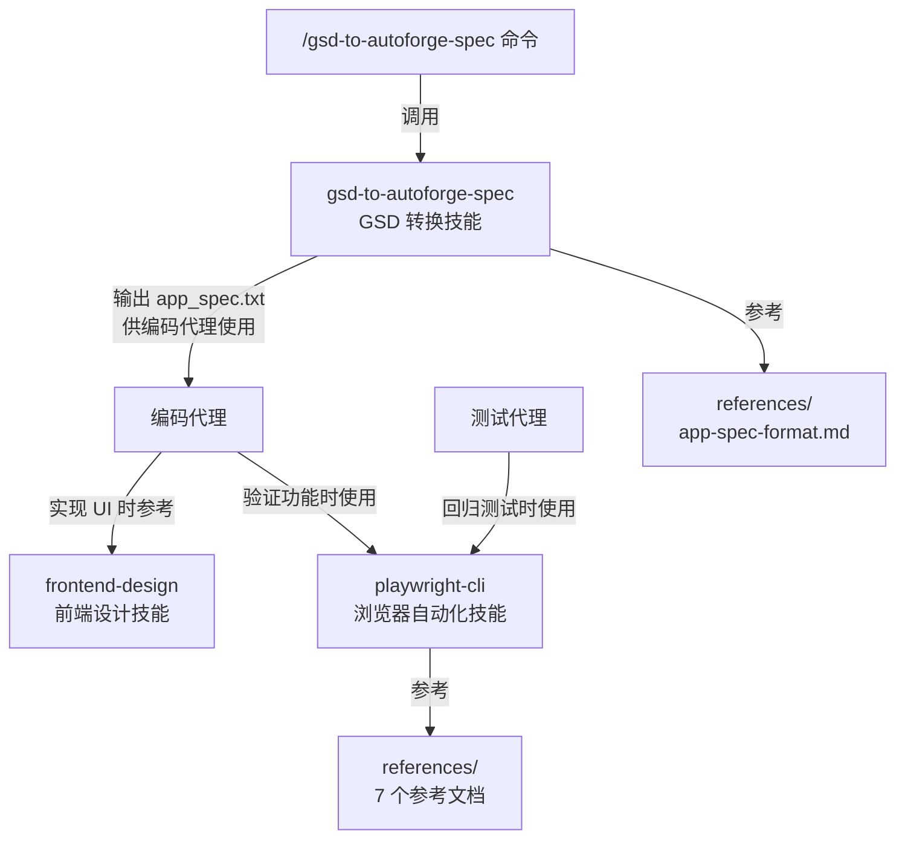

# 可复用技能

## 目录概述

`skills/` 目录包含 3 个可复用技能，每个技能封装了特定领域的专业知识和工作流程。技能可以被斜杠命令引用、被代理调用，也可以在各种上下文中独立使用。技能与代理的区别在于：代理定义角色和行为模式，技能定义具体的操作步骤和领域知识。

## 文件列表

| 技能目录 | 核心文件 | 触发方式 | 功能描述 |
|----------|----------|----------|----------|
| `frontend-design/` | `SKILL.md`, `LICENSE.txt` | 用户请求构建 Web 组件/页面时自动触发 | 创建独特的、生产级的前端界面，避免通用 AI 美学 |
| `gsd-to-autoforge-spec/` | `SKILL.md`, `references/app-spec-format.md` | `/gsd-to-autoforge-spec` 命令调用 | 将 GSD 代码映射转换为 AutoForge 规格文件 |
| `playwright-cli/` | `SKILL.md`, `references/` (7 个参考文档) | 编码/测试代理的浏览器验证步骤 | 浏览器自动化，覆盖导航、交互、截图、网络模拟等 |

## 技能使用场景图



---

## frontend-design -- 前端设计技能

### 技能定位

指导创建独特的、生产级的前端界面，重点是避免通用的"AI 生成"美学。不是生成设计稿，而是实现真正可运行的代码，并对美学细节给予极致关注。

### 设计思维框架

在编码之前，必须理解上下文并确定大胆的美学方向：

| 维度 | 问题 |
|------|------|
| **目的** | 这个界面解决什么问题？谁在使用它？ |
| **基调** | 选择一个极端方向：极简、极繁、复古未来、有机自然、奢华精致、趣味玩具、编辑杂志、粗野主义、装饰艺术、柔和粉彩、工业实用等 |
| **约束** | 技术要求（框架、性能、可访问性） |
| **差异化** | 什么让这个设计令人难忘？别人会记住什么？ |

### 五项美学指南

| 序号 | 维度 | 要求 | 反模式 |
|------|------|------|--------|
| 1 | **排版** | 选择美观、独特、有趣的字体。搭配独特的展示字体和精致的正文字体 | 禁止使用 Inter、Roboto、Arial、系统字体等泛用字体 |
| 2 | **色彩与主题** | 承诺一个连贯的美学。使用 CSS 变量保持一致性。主色搭配锐利的强调色 | 禁止胆怯的均匀分布色板、紫色渐变白底的老套方案 |
| 3 | **动画** | 聚焦高影响力时刻：精心编排的页面加载（交错动画）、滚动触发、出人意料的悬停状态。HTML 优先使用纯 CSS，React 可用 Motion 库 | 禁止散乱的微交互 |
| 4 | **空间构图** | 出人意料的布局：不对称、重叠、对角线流动、打破网格的元素、大面积留白或有控制的密度 | 禁止可预测的布局和组件模式 |
| 5 | **背景与细节** | 创造氛围和深度：渐变网格、噪点纹理、几何图案、层叠透明、戏剧阴影、装饰边框、自定义光标、颗粒叠加 | 禁止默认纯色背景 |

### 核心原则

- **大胆的最大主义和精致的极简主义都可以**，关键是意向性而非强度
- **每个设计都必须不同**，在明暗主题、字体、美学之间变化
- **绝不趋同**于常见选择（如 Space Grotesk）
- **实现复杂度匹配美学愿景**：极繁设计需要精心的代码和大量动效，极简设计需要克制和精确

---

## gsd-to-autoforge-spec -- GSD 代码映射转换技能

### 技能定位

将 GSD 工具生成的代码库映射文档转换为 AutoForge 能理解的 `app_spec.txt` 格式，使现有项目能无缝接入 AutoForge 自主编码流程。

### 前置条件

项目必须包含 `.planning/codebase/` 目录及以下文件：

| 文件 | 必需 | 提供内容 |
|------|------|----------|
| `STACK.md` | 是 | 语言、框架、依赖、运行时、端口 |
| `ARCHITECTURE.md` | 是 | 模式、层次、数据流、入口点 |
| `STRUCTURE.md` | 是 | 目录布局、关键文件位置、命名约定 |
| `CONVENTIONS.md` | 否 | 代码约定 |
| `INTEGRATIONS.md` | 否 | 外部 API、服务、数据库 |

### 转换流程



### 功能生成指南

按项目复杂度推导功能数量：

| 项目类型 | 目标功能数 |
|----------|------------|
| 简单 CLI/工具 | ~100-150 |
| 中等 Web 应用 | ~200-250 |
| 复杂全栈应用 | ~300-400 |

### 参考文档

技能目录下包含 `references/app-spec-format.md`，定义了完整的 XML 规格结构，供转换过程参考。

### 错误处理

| 错误 | 解决方案 |
|------|----------|
| `.planning/codebase/` 不存在 | 先运行 `/gsd:map-codebase` |
| 缺少必需文件 | 重新运行 GSD 映射 |
| 无法推导功能 | 向用户请求澄清 |

---

## playwright-cli -- 浏览器自动化技能

### 技能定位

提供全面的浏览器自动化能力，用于 Web 测试、表单填写、截图、数据提取等。这是编码代理和测试代理进行 UI 验证的核心工具。

### 部署方式

该技能会被复制到每个 AutoForge 项目的 `.claude/skills/playwright-cli/` 目录中，确保每个项目的代理都能使用浏览器自动化。

### 命令分类总览



### 详细命令参考

#### 核心命令

| 命令 | 语法 | 说明 |
|------|------|------|
| `open` | `playwright-cli open [url] [--browser=chrome\|firefox\|webkit]` | 打开浏览器，可选择浏览器类型 |
| `goto` | `playwright-cli goto <url>` | 导航到指定 URL |
| `close` | `playwright-cli close` | 关闭浏览器 |
| `click` | `playwright-cli click <ref>` | 点击元素（ref 来自 snapshot） |
| `dblclick` | `playwright-cli dblclick <ref>` | 双击元素 |
| `hover` | `playwright-cli hover <ref>` | 悬停在元素上 |
| `fill` | `playwright-cli fill <ref> "<text>"` | 填充表单字段 |
| `type` | `playwright-cli type "<text>"` | 输入文本 |
| `press` | `playwright-cli press <key>` | 按键（Enter、ArrowDown 等） |
| `select` | `playwright-cli select <ref> "<value>"` | 选择下拉选项 |
| `upload` | `playwright-cli upload <file>` | 上传文件 |
| `snapshot` | `playwright-cli snapshot [--filename=name.yaml]` | 保存页面快照（含元素 ref） |
| `screenshot` | `playwright-cli screenshot [ref] [--filename=name.png]` | 截图（可指定元素） |
| `pdf` | `playwright-cli pdf --filename=page.pdf` | 导出 PDF |
| `eval` | `playwright-cli eval "<js>"` | 执行 JavaScript |
| `resize` | `playwright-cli resize <width> <height>` | 调整视口大小 |

#### 导航命令

| 命令 | 说明 |
|------|------|
| `go-back` | 浏览器后退 |
| `go-forward` | 浏览器前进 |
| `reload` | 重新加载页面 |

#### 键盘与鼠标

| 命令 | 说明 |
|------|------|
| `press <key>` | 按键 |
| `keydown <key>` / `keyup <key>` | 按下/释放键 |
| `mousemove <x> <y>` | 移动鼠标到坐标 |
| `mousedown [right]` / `mouseup [right]` | 按下/释放鼠标按钮 |
| `mousewheel <dx> <dy>` | 滚动鼠标滚轮 |

#### 标签页管理

| 命令 | 说明 |
|------|------|
| `tab-list` | 列出所有标签页 |
| `tab-new [url]` | 新建标签页 |
| `tab-close [index]` | 关闭标签页 |
| `tab-select <index>` | 切换到指定标签页 |

#### 存储管理

| 类别 | 命令 | 说明 |
|------|------|------|
| 状态 | `state-save [file]` / `state-load <file>` | 保存/加载完整浏览器状态 |
| Cookie | `cookie-list` / `cookie-get` / `cookie-set` / `cookie-delete` / `cookie-clear` | 完整的 Cookie CRUD |
| localStorage | `localstorage-list` / `get` / `set` / `delete` / `clear` | localStorage 操作 |
| sessionStorage | `sessionstorage-list` / `get` / `set` / `delete` / `clear` | sessionStorage 操作 |

#### 网络模拟

| 命令 | 语法 | 说明 |
|------|------|------|
| `route` | `playwright-cli route "<pattern>" --status=404 --body='{"mock": true}'` | 拦截并模拟请求 |
| `route-list` | `playwright-cli route-list` | 列出活跃路由规则 |
| `unroute` | `playwright-cli unroute ["<pattern>"]` | 移除路由规则 |

#### 开发工具

| 命令 | 说明 |
|------|------|
| `console [level]` | 查看控制台日志（可筛选 warning/error） |
| `network` | 监控网络请求 |
| `tracing-start` / `tracing-stop` | 开始/停止追踪 |
| `video-start` / `video-stop <file>` | 开始/停止录制视频 |
| `run-code "<code>"` | 运行自定义 Playwright 代码 |

#### 会话管理

| 命令 | 说明 |
|------|------|
| `-s=<name> <command>` | 在命名会话中执行命令 |
| `list` | 列出所有活跃会话 |
| `close-all` | 关闭所有浏览器 |
| `kill-all` | 强制终止所有浏览器进程 |
| `--persistent` | 使用持久化配置文件 |
| `--profile=<path>` | 指定配置文件目录 |

### 参考文档

技能目录下包含 7 个详细参考文档：

| 文件 | 内容 |
|------|------|
| `references/request-mocking.md` | 请求模拟详细指南 |
| `references/running-code.md` | 运行 Playwright 代码 |
| `references/session-management.md` | 浏览器会话管理 |
| `references/storage-state.md` | 存储状态（Cookie、localStorage） |
| `references/test-generation.md` | 测试生成 |
| `references/tracing.md` | 追踪调试 |
| `references/video-recording.md` | 视频录制 |

### 典型工作流示例

**表单提交验证：**

```bash
playwright-cli open https://localhost:3000/form
playwright-cli snapshot                    # 获取元素引用
playwright-cli fill e1 "user@example.com"  # 填充邮箱
playwright-cli fill e2 "password123"       # 填充密码
playwright-cli click e3                    # 点击提交
playwright-cli snapshot                    # 验证结果
playwright-cli close                       # 关闭浏览器
```

**多标签页工作流：**

```bash
playwright-cli open https://localhost:3000
playwright-cli tab-new https://localhost:3000/other
playwright-cli tab-list
playwright-cli tab-select 0
playwright-cli snapshot
playwright-cli close
```

---

## 技能之间的依赖关系



- 三个技能之间没有直接的相互依赖
- `gsd-to-autoforge-spec` 的输出（`app_spec.txt`）间接影响编码代理如何使用 `frontend-design` 和 `playwright-cli`
- `playwright-cli` 是使用最频繁的技能，每个编码和测试会话都会调用
- `frontend-design` 主要在 UI 实现阶段被编码代理参考
