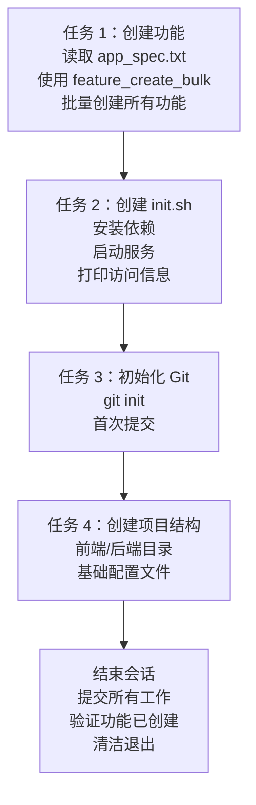
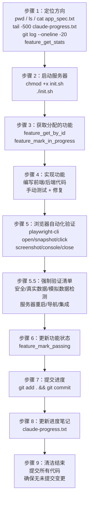
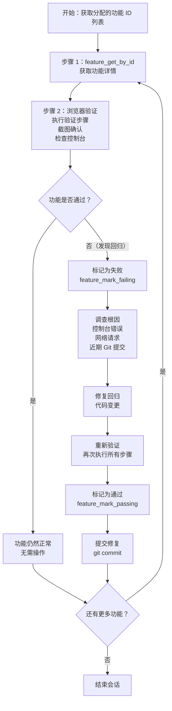
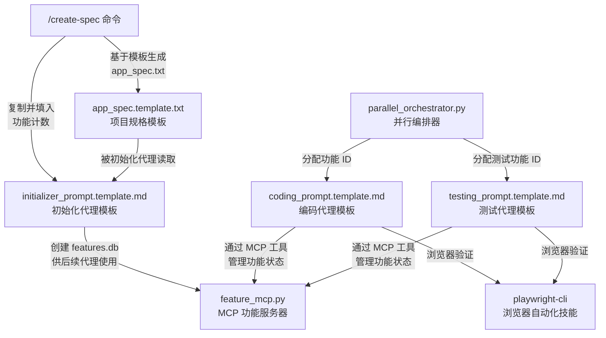

# 提示模板

## 目录概述

`templates/` 目录包含 4 个提示模板文件，定义了 AutoForge 代理系统中不同角色代理的行为规范。这些模板在项目创建时被复制到项目的 `.autoforge/prompts/` 目录中，经过填充后成为驱动自主编码流程的核心指令。

## 文件列表

| 文件名 | 代理角色 | 会话阶段 | 主要产出 |
|--------|----------|----------|----------|
| `app_spec.template.txt` | 无（用户/命令填充） | 项目创建前 | XML 格式的项目规格定义 |
| `initializer_prompt.template.md` | 初始化代理 | 第 1 个会话 | features.db（功能数据库）+ init.sh + Git 仓库 |
| `coding_prompt.template.md` | 编码代理 | 第 2~N 个会话 | 源代码实现 + 功能标记为通过 |
| `testing_prompt.template.md` | 测试代理 | 回归测试会话 | 回归验证 + 问题修复 |

## 模板生命周期

```mermaid
graph TD
    subgraph 模板层（.claude/templates/）
        AppSpecT["app_spec.template.txt<br/>项目规格模板"]
        InitT["initializer_prompt.template.md<br/>初始化代理模板"]
        CodingT["coding_prompt.template.md<br/>编码代理模板"]
        TestingT["testing_prompt.template.md<br/>测试代理模板"]
    end

    subgraph 项目实例（项目/.autoforge/prompts/）
        AppSpec["app_spec.txt<br/>填充后的项目规格"]
        InitP["initializer_prompt.md<br/>填入功能计数"]
        CodingP["coding_prompt.md<br/>按需定制"]
        TestingP["testing_prompt.md<br/>填入功能 ID"]
    end

    subgraph 代理会话
        InitAgent["初始化代理<br/>读取 app_spec.txt<br/>创建 features.db"]
        CodingAgent["编码代理<br/>逐个实现功能<br/>浏览器验证"]
        TestingAgent["测试代理<br/>回归测试<br/>修复问题"]
    end

    subgraph 产出
        FeaturesDB["features.db<br/>SQLite 功能数据库"]
        SourceCode["源代码<br/>前端 + 后端"]
        Verified["已验证功能<br/>通过浏览器自动化确认"]
    end

    AppSpecT -->|"/create-spec 填充"| AppSpec
    InitT -->|"复制并替换 [FEATURE_COUNT]"| InitP
    CodingT -->|"复制到项目"| CodingP
    TestingT -->|"编排器填入功能 ID"| TestingP

    AppSpec -->|"驱动"| InitAgent
    InitP -->|"驱动"| InitAgent
    CodingP -->|"驱动"| CodingAgent
    TestingP -->|"驱动"| TestingAgent

    InitAgent --> FeaturesDB
    CodingAgent --> SourceCode
    CodingAgent -->|"feature_mark_passing"| FeaturesDB
    TestingAgent --> Verified
    TestingAgent -->|"feature_mark_failing/passing"| FeaturesDB
```

## 提示加载回退链

当代理需要加载提示时，系统按以下优先级查找：

1. **项目特定提示**：`{项目目录}/.autoforge/prompts/{name}.md`（或旧版 `{项目目录}/prompts/{name}.md`）
2. **基础模板**：`.claude/templates/{name}.template.md`

---

## app_spec.template.txt -- 项目规格模板

### 功能定位

定义项目规格的 XML 结构模板。可以通过 `/create-spec` 命令交互式生成，也可以手动编辑。

### XML 结构

```xml
<project_specification>
  <project_name>项目名称</project_name>
  <overview>2-3 句项目描述</overview>

  <technology_stack>
    <frontend>
      <framework>React with Vite</framework>
      <styling>Tailwind CSS</styling>
      <state_management>React hooks and context</state_management>
      <routing>React Router</routing>
      <port>3000</port>
    </frontend>
    <backend>
      <runtime>Node.js with Express</runtime>
      <database>SQLite with better-sqlite3</database>
      <port>3001</port>
    </backend>
    <communication>
      <api>RESTful endpoints</api>
    </communication>
  </technology_stack>

  <prerequisites>
    <environment_setup>环境要求</environment_setup>
  </prerequisites>

  <core_features>
    <分类名称>功能列表</分类名称>
  </core_features>

  <database_schema>
    <tables>
      <表名>字段定义</表名>
    </tables>
  </database_schema>

  <api_endpoints_summary>
    <分类>HTTP 方法 + 路径</分类>
  </api_endpoints_summary>

  <ui_layout>
    <main_structure>布局描述</main_structure>
  </ui_layout>

  <design_system>
    <color_palette>配色方案</color_palette>
    <typography>字体方案</typography>
    <components>组件规范</components>
    <animations>动画规范</animations>
  </design_system>

  <implementation_steps>
    <step number="N">
      <title>阶段标题</title>
      <tasks>任务列表</tasks>
    </step>
  </implementation_steps>

  <success_criteria>
    <functionality>功能标准</functionality>
    <user_experience>用户体验标准</user_experience>
    <technical_quality>技术质量标准</technical_quality>
    <design_polish>设计精度标准</design_polish>
  </success_criteria>
</project_specification>
```

### 主要节点说明

| 节点 | 说明 |
|------|------|
| `project_name` | 项目名称标识 |
| `overview` | 2-3 句描述项目目标、解决的问题、目标用户 |
| `technology_stack` | 前端框架/样式/路由、后端运行时/数据库、通信方式 |
| `prerequisites` | 环境依赖（Node.js 版本、API 密钥等） |
| `core_features` | 按分类组织的功能列表，每个功能可测试 |
| `database_schema` | 数据库表结构（字段、主键、外键、约束） |
| `api_endpoints_summary` | REST API 端点摘要 |
| `ui_layout` | UI 布局结构（头部、侧边栏、主内容区、模态框） |
| `design_system` | 设计系统（配色、字体、组件规范、动画） |
| `implementation_steps` | 分阶段的实现计划 |
| `success_criteria` | 功能/UX/技术/设计四个维度的成功标准 |

### 默认技术栈

模板预设了通用技术栈作为默认值（React + Vite 前端，Node.js + Express + SQLite 后端），用户可根据需求修改。

---

## initializer_prompt.template.md -- 初始化代理提示

### 角色定位

**初始化代理**（INITIALIZER AGENT）-- 长期自主开发过程中的第一个代理，负责搭建所有后续编码代理的基础。

### 占位符

| 占位符 | 替换时机 | 说明 |
|--------|----------|------|
| `[FEATURE_COUNT]` | `/create-spec` 命令完成时 | 替换为具体的功能数量（如 25、105、205） |

### 四项核心任务



### 功能依赖规则

| 规则 | 说明 |
|------|------|
| 使用 `depends_on_indices` | 基于 0 的数组索引引用依赖 |
| 只能依赖更早的功能 | 索引必须小于当前位置 |
| 禁止循环依赖 | 依赖图必须是 DAG |
| 每个功能最多 20 个依赖 | 防止过度耦合 |
| 基础设施功能（索引 0-4）无依赖 | 它们最先执行 |
| 索引 4 之后的所有功能必须依赖 `[0,1,2,3,4]` | 确保基础设施先就位 |
| 索引 10 之后 60% 的功能需要额外依赖 | 建立广泛的依赖图 |

### 强制基础设施功能（索引 0-4）

| 索引 | 功能名称 | 验证方式 |
|------|----------|----------|
| 0 | 数据库连接已建立 | 启动服务器 -> 检查日志 -> 健康端点返回数据库状态 |
| 1 | 数据库模式正确应用 | 直接连接数据库 -> 列出表 -> 验证模式匹配规格 |
| 2 | 数据跨服务器重启持久化 | 通过 API 创建数据 -> 停止服务器 -> 重启 -> 验证数据仍在 |
| 3 | 代码库中无模拟数据模式 | 运行 grep 搜索禁止的模式 -> 必须返回空 |
| 4 | 后端 API 查询真实数据库 | 检查服务器日志 -> SQL 查询出现在 API 调用中 |

### 宽图模式（必需）

```
推荐（宽图，支持并行执行）:
    A -> B, A -> C, A -> D, B -> E, C -> E

禁止（线性链，一次只能执行 1 个功能）:
    A -> B -> C -> D -> E
```

### 20 个强制测试类别

| 类别 | 简单 | 中等 | 高级 |
|------|------|------|------|
| 0. 基础设施（必需） | 5 | 5 | 5 |
| A. 安全与访问控制 | 5 | 20 | 40 |
| B. 导航完整性 | 15 | 25 | 40 |
| C. 真实数据验证 | 20 | 30 | 50 |
| D. 工作流完整性 | 10 | 20 | 40 |
| E. 错误处理 | 10 | 15 | 25 |
| F. UI-后端集成 | 10 | 20 | 35 |
| G. 状态与持久化 | 8 | 10 | 15 |
| H. URL 与直接访问 | 5 | 10 | 20 |
| I. 双重操作与幂等性 | 5 | 8 | 15 |
| J. 数据清理与级联 | 5 | 10 | 20 |
| K. 默认值与重置 | 5 | 8 | 12 |
| L. 搜索与过滤边缘情况 | 8 | 12 | 20 |
| M. 表单验证 | 10 | 15 | 25 |
| N. 反馈与通知 | 8 | 10 | 15 |
| O. 响应式与布局 | 8 | 10 | 15 |
| P. 可访问性 | 8 | 10 | 15 |
| Q. 时间与时区 | 5 | 8 | 12 |
| R. 并发与竞态条件 | 5 | 8 | 15 |
| S. 导出/导入 | 5 | 6 | 10 |
| T. 性能 | 5 | 5 | 10 |
| **总计** | **165** | **265** | **405+** |

### 关键禁令

- **绝对禁止模拟数据**：禁止 `mockData`、`fakeData`、`globalThis`、`json-server` 等模式
- **绝不删除或编辑功能**：功能只能标记为通过
- **绝不实现功能**：初始化代理只做搭建，功能实现由后续编码代理处理

---

## coding_prompt.template.md -- 编码代理提示

### 角色定位

**编码代理**（CODING AGENT）-- 在长期自主开发任务中继续工作，每次都是全新的上下文窗口，无前序会话记忆。

### 九步工作流



### 测试驱动开发心态

功能本质上是**测试用例**。如果功能需要的页面、端点、数据库表或组件不存在，编码代理的职责是**构建它们**，而不是跳过功能。

### 跳过功能的条件（极其罕见）

只有真正的外部阻断因素才允许跳过：

| 允许跳过 | 不允许跳过 |
|----------|------------|
| 缺少第三方凭证（Stripe 密钥、OAuth 密钥） | 页面不存在 |
| 外部服务不可用 | 端点不存在 |
| 无法满足的环境要求 | 组件不存在 |
|  | 数据不存在 |

### 强制验证清单（步骤 5.5）

在标记任何功能为通过之前，必须完成所有适用检查：

| 检查维度 | 验证内容 |
|----------|----------|
| 安全 | 功能尊重角色权限；未认证访问被阻止；API 检查认证（401/403） |
| 真实数据 | 通过 UI 创建唯一测试数据，刷新确认持久化，删除确认移除 |
| 模拟数据检测 | grep 搜索 `globalThis`、`devStore`、`mockData` 等禁止模式 |
| 服务器重启 | 创建数据 -> 停止服务器 -> 重启 -> 验证数据仍在 |
| 导航 | 所有按钮链接到存在的路由，无 404，后退按钮正常 |
| 集成 | 零 JS 控制台错误，无 500 响应，API 数据匹配 UI |

### 功能工具使用限制

| 允许的工具 | 用途 |
|-----------|------|
| `feature_get_stats` | 获取进度统计 |
| `feature_get_by_id` | 获取分配的功能详情 |
| `feature_mark_in_progress` | 标记功能进行中 |
| `feature_mark_passing` | 标记功能通过 |
| `feature_mark_failing` | 标记功能失败 |
| `feature_skip` | 跳过功能（仅外部阻断） |
| `feature_clear_in_progress` | 清除进行中状态 |

**禁止操作**：不得获取所有功能列表、按分类查询、列出所有待处理功能。只处理分配的功能。

### 核心原则

- 每个会话专注完成一个功能
- 零控制台错误
- 所有数据来自真实数据库
- 会话结束前保持代码库清洁

---

## testing_prompt.template.md -- 测试代理提示

### 角色定位

**测试代理**（TESTING AGENT）-- 负责对已通过功能进行回归测试，发现回归时必须修复。

### 占位符

| 占位符 | 替换时机 | 说明 |
|--------|----------|------|
| `{{TESTING_FEATURE_IDS}}` | 编排器分配测试任务时 | 替换为具体的功能 ID 列表 |

### 逐功能工作流



### 回归处理流程

当发现功能回归时，测试代理必须完成以下完整流程：

1. **立即标记失败** -- 使用 `feature_mark_failing` 记录回归
2. **调查根因** -- 检查控制台错误、网络请求、近期 Git 提交
3. **修复回归** -- 进行必要的代码变更
4. **验证修复** -- 重新执行所有验证步骤
5. **标记通过** -- 确认修复后使用 `feature_mark_passing`
6. **提交修复** -- 包含回归描述和修复说明的 Git 提交

### 可用工具

| 工具类别 | 工具 | 说明 |
|----------|------|------|
| 功能管理 | `feature_get_stats` | 获取进度概览 |
| 功能管理 | `feature_get_by_id` | 获取分配的功能详情 |
| 功能管理 | `feature_mark_failing` | 标记功能失败（发现回归时） |
| 功能管理 | `feature_mark_passing` | 标记功能通过（修复回归后） |
| 浏览器自动化 | `playwright-cli open/goto` | 打开浏览器/导航 |
| 浏览器自动化 | `playwright-cli screenshot/snapshot` | 截图/快照 |
| 浏览器自动化 | `playwright-cli click/type/fill` | 交互操作 |
| 浏览器自动化 | `playwright-cli console/network` | 调试 |
| 浏览器自动化 | `playwright-cli close` | 关闭浏览器（必须执行） |

### 质量标准

- 零控制台错误
- 所有验证步骤通过
- 视觉外观正确
- API 调用成功

---

## 模板之间的依赖关系



### 关键依赖链

1. `app_spec.template.txt` 是所有模板的起点，定义了"要构建什么"
2. `initializer_prompt.template.md` 依赖 `app_spec.txt` 的内容创建功能数据库
3. `coding_prompt.template.md` 依赖功能数据库获取要实现的功能
4. `testing_prompt.template.md` 依赖功能数据库获取要验证的功能
5. 编码和测试模板都依赖 `playwright-cli` 技能进行浏览器验证
6. 所有功能状态变更都通过 `feature_mcp.py` MCP 服务器执行
