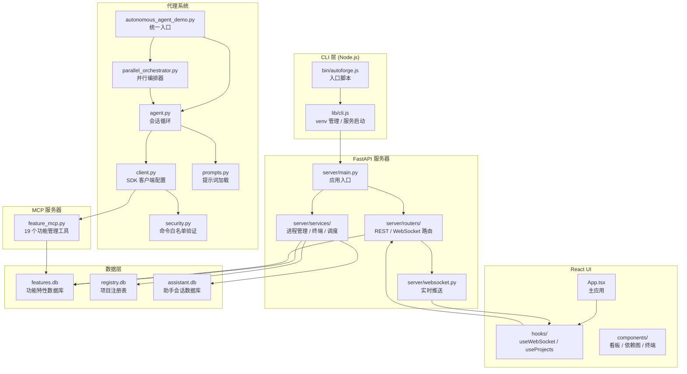
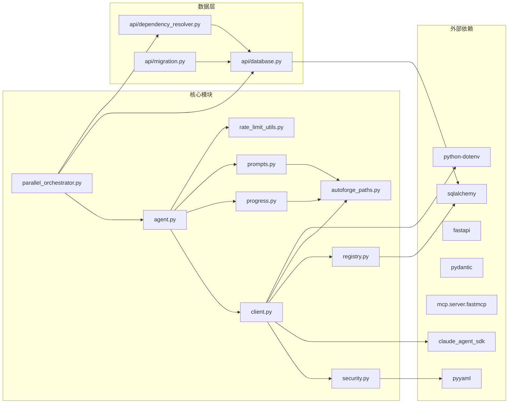

# AutoForge 项目总览

## 目录：项目根目录 `/`

## 功能概述

AutoForge 是一个自主编码代理系统，基于 Claude Agent SDK 构建，能够通过多轮会话（Session）自动完成完整应用程序的开发。系统采用 **双代理模式**（Two-Agent Pattern）：

1. **初始化代理（Initializer Agent）** -- 第一轮会话读取应用规格说明（app_spec），解析后在 SQLite 数据库中创建功能特性（Feature）列表。
2. **编码代理（Coding Agent）** -- 后续会话逐一实现功能特性，通过 lint、类型检查和浏览器测试验证后标记为通过。

系统提供 React Web UI 用于实时监控代理进度，包括看板视图、依赖图可视化、AI 助手面板、内置终端以及开发服务器管理。同时支持并行模式，可同时运行最多 5 个编码代理，结合依赖感知调度实现高效开发。

## 技术栈

| 层级 | 技术 |
|------|------|
| 后端运行时 | Python 3.11+, FastAPI, SQLAlchemy, SQLite |
| 前端 UI | React 19, TypeScript, Vite 7, TanStack Query, Tailwind CSS v4, Radix UI |
| CLI 封装 | Node.js 20+, npm 全局安装包 |
| 代理引擎 | Claude Agent SDK, Claude Code CLI |
| 浏览器自动化 | Playwright CLI |
| 图布局 | dagre（依赖图可视化） |
| 终端仿真 | xterm.js |

## 架构总览图



## 目录结构

| 目录/文件 | 说明 |
|-----------|------|
| `bin/` | Node.js CLI 入口脚本（`autoforge.js`） |
| `lib/` | CLI 核心逻辑（`cli.js`：Python 检测、venv 管理、服务器启动） |
| `api/` | 数据层：SQLAlchemy 模型、依赖解析器、JSON 迁移工具 |
| `mcp_server/` | MCP 功能管理服务器，暴露 19 个工具给代理使用 |
| `server/` | FastAPI 服务器主目录 |
| `server/routers/` | REST/WebSocket 路由（项目、功能、代理控制、终端等） |
| `server/services/` | 服务层（进程管理、终端管理、调度服务、助手会话等） |
| `server/utils/` | 工具函数（进程管理、项目路径解析、输入验证） |
| `ui/` | React 前端应用 |
| `ui/src/components/` | UI 组件（看板、依赖图、终端、助手面板、设置等） |
| `ui/src/hooks/` | React Hooks（WebSocket、项目 API 调用） |
| `ui/src/lib/` | 工具库（REST API 客户端、TypeScript 类型定义） |
| `ui/src/styles/` | 全局样式和设计令牌（Tailwind CSS v4 `@theme`） |
| `.claude/` | Claude Code 集成（斜杠命令、自定义代理、技能、提示词模板） |
| `examples/` | 配置示例（项目命令白名单、组织级配置） |
| `docs/` | 项目文档 |

## 核心 Python 模块

| 模块 | 文件 | 说明 |
|------|------|------|
| 入口与启动 | `start.py` | CLI 启动器，提供项目创建/选择菜单 |
| 入口与启动 | `autonomous_agent_demo.py` | 代理运行入口，支持 `--yolo`、`--parallel`、`--batch-size` 等参数 |
| 代理核心 | `agent.py` | 代理会话循环，处理 SDK 消息流、速率限制、错误重试 |
| 代理核心 | `client.py` | Claude SDK 客户端配置，集成安全钩子、MCP 服务器、Vertex AI 支持 |
| 代理核心 | `parallel_orchestrator.py` | 并行编排器，依赖感知调度，子进程管理 |
| 安全 | `security.py` | Bash 命令白名单验证，层级化允许/阻止命令配置 |
| 提示词 | `prompts.py` | 提示词模板加载，支持项目级覆盖和批量特性提示 |
| 进度追踪 | `progress.py` | 进度查询、数据库操作、Webhook 通知 |
| 项目注册 | `registry.py` | 项目名称到路径的映射，全局设置模型，模型配置 |
| 路径解析 | `autoforge_paths.py` | 中心化路径解析，支持三路径向后兼容和自动迁移 |
| 认证 | `auth.py` | Claude CLI 认证错误检测 |
| 环境变量 | `env_constants.py` | 共享环境变量常量（API 密钥变量名列表） |
| 速率限制 | `rate_limit_utils.py` | 速率限制检测、重试时间解析、指数退避与抖动 |
| 清理 | `temp_cleanup.py` | 临时文件清理工具 |

## 关键设计模式

### 1. 提示词回退链（Prompt Fallback Chain）

```
1. 项目级: {project_dir}/.autoforge/prompts/{name}.md
2. 旧版项目级: {project_dir}/prompts/{name}.md
3. 基础模板: .claude/templates/{name}.template.md
```

优先使用项目自定义提示词，若不存在则回退到基础模板。允许每个项目针对自身需求定制代理行为。

### 2. 代理会话流程（Agent Session Flow）

```
1. 检查 .autoforge/features.db 是否有功能特性
   - 无 → 运行初始化代理（读取 app_spec，创建功能列表）
   - 有 → 运行编码代理（实现功能特性）
2. 创建 ClaudeSDKClient（配置安全层）
3. 发送提示词并流式处理响应
4. 会话完成后等待 3 秒自动继续下一轮
5. 所有功能通过时自动退出
```

### 3. 实时 WebSocket 更新

UI 通过 WebSocket `/ws/projects/{project_name}` 接收实时更新：

| 消息类型 | 说明 |
|----------|------|
| `progress` | 测试通过计数（passing、in_progress、total） |
| `agent_status` | 运行状态（running / paused / stopped / crashed） |
| `log` | 代理输出行，可选 featureId/agentIndex 用于归属 |
| `feature_update` | 功能状态变更通知 |
| `agent_update` | 多代理状态更新（thinking / working / testing / success / error） |

### 4. 并行模式（Parallel Mode）

当使用 `--parallel` 运行时，编排器执行如下流程：

1. 以子进程形式启动多个 Claude 代理（最多 `--max-concurrency` 个，上限 5）
2. 每个代理通过 `feature_claim_and_get` 原子性地认领功能
3. 依赖未满足的功能会被跳过
4. 浏览器会话通过 `PLAYWRIGHT_CLI_SESSION` 环境变量隔离
5. `AgentTracker` 解析输出并发送 `agent_update` 消息到 UI

进程限制：
- `MAX_PARALLEL_AGENTS = 5` -- 最大并行编码代理数
- `MAX_TOTAL_AGENTS = 10` -- 代理总数硬限制（编码 + 测试）
- 总进程数不超过 11 个 Python 进程（1 编排器 + 5 编码 + 5 测试）

### 5. 多功能批量处理（Multi-Feature Batching）

代理可以在单次会话中实现多个功能（`--batch-size`，范围 1-15，默认 3）：

- `--batch-size N` -- 每个编码代理批次的最大功能数
- `--testing-batch-size N` -- 每个测试批次的功能数（1-15，默认 3）
- `--batch-features 1,2,3` -- 指定功能 ID 进行批量实现
- `prompts.py` 提供 `get_batch_feature_prompt()` 生成多功能提示词

### 6. 纵深防御安全模型（Defense-in-Depth Security）

安全层级从外到内：

```
层级 1: OS 级沙箱 -- Bash 命令隔离，防止文件系统逃逸
层级 2: 文件系统限制 -- 仅允许访问项目目录（./** 相对路径）
层级 3: 命令白名单验证 -- 层级化配置：
         ├── 硬编码阻止列表（security.py）-- 永不允许（dd, sudo, shutdown 等）
         ├── 组织级阻止列表（~/.autoforge/config.yaml）-- 不可覆盖
         ├── 组织级允许列表（~/.autoforge/config.yaml）-- 全项目可用
         ├── 全局允许列表（security.py）-- 默认命令（npm, git, curl 等）
         └── 项目级允许列表（.autoforge/allowed_commands.yaml）-- 项目特定命令
```

## 安装与运行

### npm 全局安装（推荐）

```bash
npm install -g autoforge-ai
autoforge                    # 启动服务器（首次运行自动配置 Python venv）
autoforge config             # 编辑 ~/.autoforge/.env 配置
autoforge config --show      # 打印当前配置
autoforge --port 9999        # 自定义端口
autoforge --no-browser       # 不自动打开浏览器
autoforge --repair           # 删除并重建 ~/.autoforge/venv/
```

### 从源码运行（开发模式）

```bash
# 启动 Web UI（提供预构建的 React 应用）
./start_ui.sh     # macOS/Linux
start_ui.bat      # Windows

# CLI 菜单
./start.sh        # macOS/Linux
start.bat         # Windows
```

### Python 后端（手动）

```bash
# 创建并激活虚拟环境
python -m venv venv
source venv/bin/activate  # macOS/Linux

# 安装依赖
pip install -r requirements.txt

# 运行主 CLI 启动器
python start.py

# 直接运行代理
python autonomous_agent_demo.py --project-dir /path/to/my-app

# YOLO 模式：快速原型开发，跳过浏览器测试
python autonomous_agent_demo.py --project-dir my-app --yolo

# 并行模式：最多 3 个代理并发
python autonomous_agent_demo.py --project-dir my-app --parallel --max-concurrency 3

# 批量模式：每个会话实现最多 3 个功能
python autonomous_agent_demo.py --project-dir my-app --batch-size 3
```

### React UI 开发

```bash
cd ui
npm install
npm run dev      # 开发服务器（热重载）
npm run build    # 生产构建
npm run lint     # ESLint 检查
```

## 测试

### Python 测试

```bash
ruff check .                               # 代码规范检查
mypy .                                     # 类型检查
python test_security.py                    # 安全单元测试（12 个）
python test_security_integration.py        # 集成测试（9 个）
python -m pytest test_client.py            # 客户端测试（20 个）
python -m pytest test_dependency_resolver.py  # 依赖解析器测试（12 个）
python -m pytest test_rate_limit_utils.py  # 速率限制测试（22 个）
```

### React UI 测试

```bash
cd ui
npm run lint          # ESLint
npm run build         # TypeScript 类型检查 + 构建
npm run test:e2e      # Playwright 端到端测试
npm run test:e2e:ui   # Playwright 测试（带 UI）
```

## 依赖关系



## 项目生成目录结构

AutoForge 生成的项目具有如下结构：

```
my-app/
├── .autoforge/
│   ├── prompts/
│   │   ├── app_spec.txt          # 应用规格说明（XML 格式）
│   │   ├── initializer_prompt.md # 初始化提示词
│   │   └── coding_prompt.md      # 编码提示词
│   ├── features.db               # SQLite 功能数据库
│   ├── .agent.lock               # 代理锁文件（防止多实例）
│   ├── allowed_commands.yaml     # 项目级命令白名单（可选）
│   └── .gitignore
├── .claude/
│   └── skills/playwright-cli/    # Playwright 浏览器自动化技能
├── .playwright/
│   └── cli.config.json           # 浏览器配置（无头模式、视口等）
├── CLAUDE.md                     # 项目级 Claude 指令
├── app_spec.txt                  # 根目录副本（兼容性）
└── [应用源代码...]
```
