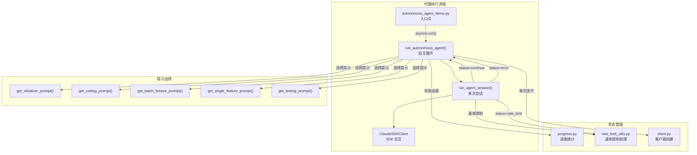

# `agent.py` -- 代理会话循环与自主执行引擎

> 源文件路径: `agent.py`

## 功能概述

`agent.py` 是 AutoForge 代理系统的核心会话执行模块，实现了自主编码代理的完整运行循环。它负责与 Claude SDK 客户端交互，发送提示、流式接收响应、解析工具使用结果，并根据会话状态（成功/速率限制/错误）决定后续行为。

该模块包含两个核心异步函数：`run_agent_session` 负责单次会话的执行和消息处理，`run_autonomous_agent` 则实现了完整的多迭代自主循环，包含智能的速率限制退避策略、自动继续机制以及项目完成检测。

代理会话支持多种模式运行：初始化器模式（创建功能清单）、编码模式（实现功能）、测试模式（回归测试），并可按单功能或批量功能模式执行。所有模式都遵循统一的会话循环结构。

## 依赖关系

### 导入依赖

| 模块 | 说明 |
|------|------|
| `asyncio` | 异步等待（会话间延迟、速率限制等待） |
| `io` | Windows 控制台 UTF-8 编码修复 |
| `re` | 正则匹配速率限制重置时间 |
| `sys` | 平台检测、标准输出控制 |
| `datetime` / `timedelta` | 速率限制时间计算 |
| `pathlib.Path` | 路径操作 |
| `zoneinfo.ZoneInfo` | 时区感知的速率限制重置时间解析 |
| `claude_agent_sdk.ClaudeSDKClient` | SDK 客户端类型引用 |
| `client` | `create_client` -- 创建安全配置的客户端实例 |
| `progress` | `count_passing_tests`、`has_features`、`print_progress_summary`、`print_session_header` |
| `prompts` | `copy_spec_to_project`、`get_batch_feature_prompt`、`get_coding_prompt`、`get_initializer_prompt`、`get_single_feature_prompt`、`get_testing_prompt` |
| `rate_limit_utils` | `calculate_error_backoff`、`calculate_rate_limit_backoff`、`clamp_retry_delay`、`is_rate_limit_error`、`parse_retry_after` |

### 被依赖

| 模块 | 引用内容 |
|------|----------|
| `autonomous_agent_demo.py` | `from agent import run_autonomous_agent` -- 作为子进程模式的直接执行入口 |

## 关键类/函数

### `run_agent_session(client, message, project_dir) -> tuple[str, str]`

- **参数**:
  - `client: ClaudeSDKClient` -- 已配置的 SDK 客户端
  - `message: str` -- 发送给代理的提示文本
  - `project_dir: Path` -- 项目目录路径
- **返回值**: `(status, response_text)` 元组，其中 `status` 为：
  - `"continue"` -- 代理正常完成，可继续
  - `"error"` -- 发生错误
  - `"rate_limit"` -- 触发速率限制，`response_text` 包含等待秒数或 `"unknown"`
- **说明**: 执行单次代理会话，流式处理 `AssistantMessage`（文本和工具调用）与 `UserMessage`（工具结果）。内置 `MessageParseError` 重试机制（最多 50 次），用于处理 CLI 发出的未知消息类型（如 `rate_limit_event`）

### `run_autonomous_agent(project_dir, model, ...) -> None`

- **参数**:
  - `project_dir: Path` -- 项目目录
  - `model: str` -- Claude 模型标识
  - `max_iterations: Optional[int]` -- 最大迭代次数（`None` 为无限）
  - `yolo_mode: bool` -- 是否启用 YOLO 快速原型模式
  - `feature_id: Optional[int]` -- 单功能模式的功能 ID
  - `feature_ids: Optional[list[int]]` -- 批量模式的功能 ID 列表
  - `agent_type: Optional[str]` -- 代理类型（`"initializer"`/`"coding"`/`"testing"`/`None` 自动检测）
  - `testing_feature_id: Optional[int]` -- 测试代理的目标功能 ID（旧版单功能模式）
  - `testing_feature_ids: Optional[list[int]]` -- 测试代理的批量功能 ID 列表
- **返回值**: 无
- **说明**: 完整的自主循环引擎，包含以下核心逻辑：
  1. 根据代理类型自动选择提示模板
  2. 每次迭代创建新的客户端实例（全新上下文）
  3. 智能速率限制处理（解析 `retry-after` 或指数退避）
  4. 速率限制重置时间解析（支持 "resets at 3:00 PM (US/Eastern)" 格式）
  5. 错误线性退避（上限 5 分钟）
  6. 项目完成自动退出
  7. 单功能/批量/测试代理在一次会话后退出

## 配置常量

| 常量 | 值 | 说明 |
|------|-----|------|
| `AUTO_CONTINUE_DELAY_SECONDS` | `3` | 会话间自动继续的默认延迟秒数 |

## 架构图

## 注意事项

1. **Windows UTF-8 修复**: 在 Windows 平台上重新包装 `sys.stdout/stderr` 为 UTF-8 编码，防止 Claude 输出包含 emoji 时 `print()` 崩溃。
2. **MessageParseError 重试**: SDK 对未知 CLI 消息类型会抛出此异常（如 `rate_limit_event`），但子进程仍然存活，因此通过重启异步生成器来恢复读取。最多重试 50 次。
3. **每次迭代创建新客户端**: 每次循环迭代都调用 `create_client()` 获取全新客户端，确保上下文不在会话间累积。
4. **会话退出条件**:
   - 初始化器代理：不检查功能完成状态
   - 单功能/批量/测试代理：单次会话后自动退出（由编排器管理生命周期）
   - 通用编码代理：检测到所有功能通过或响应包含 "all features are passing" 时退出
5. **速率限制处理层次**: 先尝试从异常消息中解析 `retry-after` 秒数，再尝试从响应文本中解析重置时间（支持时区），最后回退到指数退避策略。
