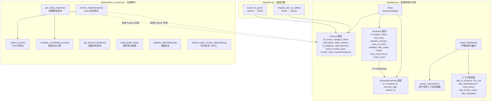
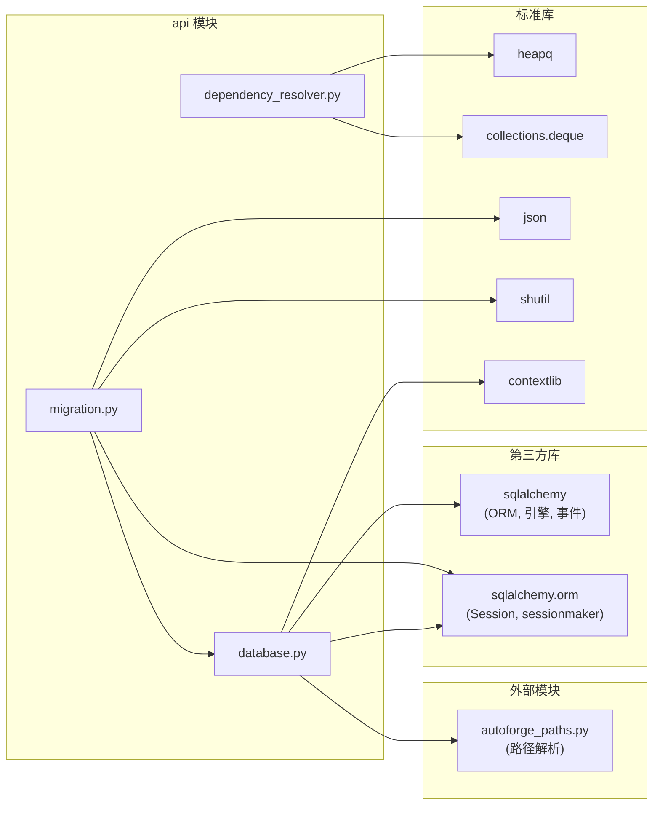

# API 层

## 目录：`api/`

## 功能概述

`api/` 目录是 AutoForge 的数据访问层，负责定义数据库模型、管理数据库连接、提供依赖解析算法以及处理从旧版 JSON 格式到 SQLite 的数据迁移。该层被 MCP 服务器、FastAPI 路由以及并行编排器直接调用，是整个系统的数据基础。

核心设计原则：
- **原子事务操作** -- 使用 `BEGIN IMMEDIATE` 事务防止并行模式下的竞态条件
- **向后兼容迁移** -- 通过 `ALTER TABLE` 逐步添加新列，旧数据库无缝升级
- **防御性编程** -- NULL 值安全处理、深度限制防止栈溢出、环形依赖检测

## 文件列表

| 文件 | 行数 | 说明 |
|------|------|------|
| `__init__.py` | - | 包初始化文件 |
| `database.py` | ~562 | SQLAlchemy 模型定义（Feature、Schedule、ScheduleOverride）、数据库引擎创建与缓存、IMMEDIATE 事务配置、6 个迁移函数、`atomic_transaction` 上下文管理器 |
| `dependency_resolver.py` | ~450 | Kahn 算法拓扑排序、DFS 环形依赖检测、调度评分（解锁量 + 深度 + 优先级）、就绪/阻塞特性查询、图可视化数据构建 |
| `migration.py` | ~157 | JSON 到 SQLite 迁移（`feature_list.json` → `features.db`）、SQLite 到 JSON 导出 |

## 架构图



## 模块详细说明

### database.py -- 数据模型与连接管理

#### 数据模型

**Feature（功能特性）**

核心业务实体，代表一个待实现的功能特性或测试用例。

| 字段 | 类型 | 说明 |
|------|------|------|
| `id` | Integer, PK | 主键，自增 |
| `priority` | Integer | 优先级（数值越小越优先），默认 999 |
| `category` | String(100) | 分类（如 "Authentication", "API", "UI"） |
| `name` | String(255) | 功能名称 |
| `description` | Text | 详细描述 |
| `steps` | JSON | 实现/验证步骤（JSON 数组） |
| `passes` | Boolean | 是否通过，默认 False |
| `in_progress` | Boolean | 是否进行中，默认 False |
| `dependencies` | JSON | 依赖的功能 ID 列表，NULL 表示无依赖 |
| `needs_human_input` | Boolean | 是否等待人工输入 |
| `human_input_request` | JSON | 代理的结构化请求 |
| `human_input_response` | JSON | 人工的响应数据 |

复合索引 `ix_feature_status`：`(passes, in_progress, needs_human_input)`，优化状态查询。

**Schedule（调度计划）**

基于时间的代理自动启停计划。

| 字段 | 类型 | 说明 |
|------|------|------|
| `id` | Integer, PK | 主键 |
| `project_name` | String(50) | 关联的项目名称 |
| `start_time` | String(5) | 开始时间（"HH:MM" 格式，UTC） |
| `duration_minutes` | Integer | 持续时长（1-1440 分钟），有 CHECK 约束 |
| `days_of_week` | Integer | 星期位域（Mon=1, Tue=2, ..., Sun=64，127=每天） |
| `enabled` | Boolean | 是否启用 |
| `yolo_mode` | Boolean | YOLO 模式标志 |
| `model` | String(50) | 使用的模型，NULL 表示使用全局默认 |
| `max_concurrency` | Integer | 最大并发数（1-5），有 CHECK 约束 |
| `crash_count` | Integer | 崩溃计数（窗口开始时重置） |

**ScheduleOverride（调度覆盖）**

对调度窗口的手动覆盖记录。

| 字段 | 类型 | 说明 |
|------|------|------|
| `id` | Integer, PK | 主键 |
| `schedule_id` | Integer, FK | 关联的调度 ID（级联删除） |
| `override_type` | String(10) | 覆盖类型："start" 或 "stop" |
| `expires_at` | DateTime | 覆盖过期时间（UTC） |

#### 引擎创建与缓存

`create_database(project_dir)` 是数据库初始化的入口函数：

1. **缓存检查** -- 通过 `_engine_cache` 字典避免为同一项目重复创建引擎
2. **日志模式选择** -- 检测网络文件系统（NFS/SMB/CIFS），在网络路径使用 DELETE 模式（避免 WAL 模式导致数据库损坏），本地路径使用 WAL 模式
3. **PRAGMA 配置** -- 在事件钩子注册之前设置 `journal_mode` 和 `busy_timeout=30000`
4. **IMMEDIATE 事务** -- 通过 SQLAlchemy 事件钩子配置 `BEGIN IMMEDIATE`，确保事务开始时立即获取写锁
5. **表创建与迁移** -- 调用 `create_all()` 创建表结构，然后依次运行 6 个迁移函数

#### IMMEDIATE 事务机制

```python
# 禁用 pysqlite 的隐式事务处理
@event.listens_for(engine, "connect")
def do_connect(dbapi_connection, connection_record):
    dbapi_connection.isolation_level = None

# 所有事务使用 IMMEDIATE 模式
@event.listens_for(engine, "begin")
def do_begin(conn):
    conn.exec_driver_sql("BEGIN IMMEDIATE")
```

**为什么使用 IMMEDIATE 事务？**
- 在事务开始时立即获取写锁，防止读取过时数据
- 无论之前的 ORM 操作如何，都能正确工作
- 面向未来：不会因 Python 3.16 移除 pysqlite 遗留模式而中断

#### 迁移函数

| 函数 | 说明 |
|------|------|
| `_migrate_add_in_progress_column` | 为旧数据库添加 `in_progress` 列 |
| `_migrate_fix_null_boolean_fields` | 修复 `passes` 和 `in_progress` 中的 NULL 值为 0 |
| `_migrate_add_dependencies_column` | 添加 `dependencies` 列（TEXT 类型，NULL 默认值） |
| `_migrate_add_testing_columns` | 遗留迁移（已不操作），保留用于向后兼容 |
| `_migrate_add_human_input_columns` | 添加人工输入相关的 3 个列 |
| `_migrate_add_schedules_tables` | 创建 `schedules` 和 `schedule_overrides` 表 |

#### atomic_transaction 上下文管理器

```python
with atomic_transaction(session_maker) as session:
    feature = session.query(Feature).filter(...).first()
    feature.priority = new_priority
    # 退出时自动提交；异常时自动回滚
```

该上下文管理器确保在并行模式下多进程并发访问 SQLite 数据库时的数据一致性。

---

### dependency_resolver.py -- 依赖解析器

#### 核心算法

**Kahn 算法拓扑排序 (`resolve_dependencies`)**

使用优先级感知的最小堆（`heapq`）实现 Kahn 算法：

1. 构建入度表和邻接表
2. 将所有入度为 0 的节点推入最小堆（按优先级排序）
3. 循环弹出堆顶节点，将其添加到有序列表，并更新邻居的入度
4. 若有序列表长度小于功能总数，说明存在环形依赖，调用 DFS 检测具体环路

**DFS 环形依赖检测 (`_detect_cycles`)**

使用递归栈追踪方式检测强连通分量中的环路。维护 `visited`（全局已访问）和 `rec_stack`（当前递归路径）两个集合，当遇到递归栈中的节点时记录环路。

**环形依赖预防 (`would_create_circular_dependency`)**

在添加新依赖之前，从目标节点开始 DFS 尝试到达源节点。若可达，则添加该依赖会创建环路。设有深度限制 `MAX_DEPENDENCY_DEPTH = 50` 防止栈溢出，超过深度限制时保守地返回 True（假设存在环路）。

#### 调度评分 (`compute_scheduling_scores`)

为并行模式的功能调度提供优先级评分：

```
score = (1000 * unblock) + (100 * depth_score) + (10 * priority_factor)
```

| 因子 | 权重 | 含义 |
|------|------|------|
| `unblock`（解锁量） | 1000 | 完成该功能后能解锁的下游功能数量（0-1 归一化） |
| `depth_score`（深度分） | 100 | 距离图根节点的距离，越近分越高（0-1 归一化） |
| `priority_factor`（优先级因子） | 10 | 用户设定的优先级，数值越小分越高（0-1 归一化） |

使用 BFS 从根节点计算深度，使用反向拓扑序计算传递性下游节点数。

#### 辅助查询函数

| 函数 | 说明 |
|------|------|
| `are_dependencies_satisfied` | 检查功能的所有依赖是否已通过 |
| `get_blocking_dependencies` | 获取阻塞该功能的未完成依赖 ID 列表 |
| `get_ready_features` | 获取可以开始工作的功能列表（未通过、未进行中、依赖已满足） |
| `get_blocked_features` | 获取被阻塞的功能列表（附带 `blocked_by` 字段） |
| `validate_dependencies` | 验证依赖列表（自引用、存在性、重复、上限检查） |
| `build_graph_data` | 构建图可视化数据（nodes + edges） |

#### 安全限制

| 常量 | 值 | 说明 |
|------|-----|------|
| `MAX_DEPENDENCIES_PER_FEATURE` | 20 | 每个功能最大依赖数，防止 DoS |
| `MAX_DEPENDENCY_DEPTH` | 50 | 环形检测最大递归深度，防止栈溢出 |

---

### migration.py -- 数据迁移

#### JSON 到 SQLite 迁移 (`migrate_json_to_sqlite`)

自动将旧版 `feature_list.json` 文件迁移到 SQLite 数据库：

1. 检查 `feature_list.json` 是否存在
2. 检查数据库是否已有数据（若有则跳过）
3. 逐一导入功能数据，兼容新旧两种 JSON 格式
4. 导入成功后将原文件重命名为 `feature_list.json.backup.{timestamp}`

#### SQLite 到 JSON 导出 (`export_to_json`)

将数据库中的功能数据导出为 JSON 文件，用于调试或回退到旧格式。按优先级和 ID 排序输出。

## 依赖关系



## 关键模式

### 原子 SQL 操作

并行模式下多个代理进程同时访问同一个 SQLite 数据库。为防止竞态条件，所有写操作使用原子 `UPDATE ... WHERE` 语句：

```sql
-- 原子性认领：只有未被认领的功能才能被成功认领
UPDATE features
SET in_progress = 1
WHERE id = :id AND passes = 0 AND in_progress = 0 AND needs_human_input = 0
```

`rowcount == 0` 表示认领失败（已被其他进程认领），无需额外的锁机制。

### 向后兼容迁移

迁移采用非破坏性策略：
- 使用 `PRAGMA table_info()` 检查列是否存在后再添加
- 新列使用 `DEFAULT` 值确保旧数据兼容
- `dependencies` 列使用 NULL 默认值（应用层将 NULL 视为空列表）
- 迁移函数按顺序执行，每个函数幂等（可安全重复运行）

### 防御性编程

- `Feature.get_dependencies_safe()` 安全提取依赖列表，处理 NULL 和格式错误的数据
- `Feature.to_dict()` 将 NULL 布尔值优雅地转换为 False
- `_is_network_path()` 跨平台检测网络文件系统（Windows UNC/映射盘，Linux /proc/mounts）
- 环形检测设有深度限制，超限时保守地假设存在环路

### 优先级感知调度

`compute_scheduling_scores` 综合考虑三个维度为功能排序，确保在并行模式下优先处理高价值功能（能解锁最多下游工作的功能排在最前）。
