# `database.py` -- SQLAlchemy 数据模型与数据库连接管理

> 源文件路径: `api/database.py`

## 功能概述

`database.py` 是 AutoForge 系统的数据持久层核心，定义了基于 SQLAlchemy ORM 的全部数据库模型，并提供数据库引擎的创建、缓存、迁移与会话管理功能。

该文件包含三个核心 ORM 模型：`Feature`（功能特性）、`Schedule`（定时调度）和 `ScheduleOverride`（调度覆盖），它们共同构成了项目功能追踪与自动化调度的数据基础。每个项目使用独立的 SQLite 数据库文件（`features.db`），存放在项目的 `.autoforge/` 目录下。

此外，该文件实现了完整的数据库生命周期管理：引擎缓存避免重复创建连接、多个增量迁移函数保证新旧版本数据库的兼容性、IMMEDIATE 事务模式防止并行模式下的竞态条件、网络文件系统检测以自动切换日志模式（WAL/DELETE）防止数据损坏。`atomic_transaction` 上下文管理器为并行多代理场景提供了安全的原子事务封装。

## 依赖关系

### 导入依赖

| 模块 | 说明 |
|------|------|
| `sqlalchemy` | ORM 框架，提供 Column、create_engine、event、text 等核心组件 |
| `sqlalchemy.orm` | DeclarativeBase、Session、relationship、sessionmaker |
| `sqlalchemy.types.JSON` | JSON 类型列（用于 steps、dependencies 等字段） |
| `autoforge_paths` | 延迟导入，提供 `get_features_db_path()` 路径解析 |
| `contextlib` | `contextmanager` 装饰器，用于 `atomic_transaction` |
| `datetime` | UTC 时间戳生成 |
| `pathlib.Path` | 文件路径操作 |
| `sys` | 平台检测（Windows/Unix） |

### 被依赖

| 模块 | 引用内容 |
|------|----------|
| `api/__init__.py` | 导出 `Feature`, `create_database`, `get_database_path` |
| `api/migration.py` | 导入 `Feature` 模型用于 JSON 迁移 |
| `mcp_server/feature_mcp.py` | 导入 `Feature`, `atomic_transaction`, `create_database` |
| `parallel_orchestrator.py` | 导入 `Feature`, `create_database` 用于并行调度 |
| `server/services/process_manager.py` | 延迟导入 `Feature` 查询功能状态 |
| `server/services/scheduler_service.py` | 延迟导入 `Schedule`, `ScheduleOverride`, `create_database` |
| `server/routers/features.py` | 延迟导入 `Feature`, `create_database` 处理 REST API |
| `server/routers/projects.py` | 延迟导入 `dispose_engine` 释放数据库连接 |
| `server/routers/schedules.py` | 延迟导入 `Schedule`, `ScheduleOverride`, `create_database` |

## 关键类/函数

### `class Feature(Base)`

功能特性 ORM 模型，映射到 `features` 表。

- **字段**：
  - `id` (Integer, PK): 自增主键
  - `priority` (Integer): 优先级，数值越小优先级越高，默认 999
  - `category` (String(100)): 功能分类（如 "Authentication"、"UI"）
  - `name` (String(255)): 功能名称
  - `description` (Text): 详细描述
  - `steps` (JSON): 实现/验证步骤列表
  - `passes` (Boolean): 是否已通过验证，默认 False
  - `in_progress` (Boolean): 是否正在处理中，默认 False
  - `dependencies` (JSON, nullable): 依赖的功能 ID 列表
  - `needs_human_input` (Boolean): 是否需要人工输入，默认 False
  - `human_input_request` (JSON, nullable): Agent 的结构化请求
  - `human_input_response` (JSON, nullable): 人工的响应数据
- **复合索引**: `ix_feature_status` 覆盖 `passes`, `in_progress`, `needs_human_input`
- **方法**:
  - `to_dict() -> dict`: 转换为可序列化字典，兼容处理 NULL 遗留值
  - `get_dependencies_safe() -> list[int]`: 安全提取依赖列表，处理 NULL 和格式异常

### `class Schedule(Base)`

定时调度 ORM 模型，映射到 `schedules` 表。

- **字段**: `project_name`, `start_time` (HH:MM 格式), `duration_minutes` (1-1440), `days_of_week` (位域编码), `enabled`, `yolo_mode`, `model`, `max_concurrency` (1-5), `crash_count`
- **约束**: 四个 CHECK 约束确保数据完整性
- **关联**: 一对多关联 `ScheduleOverride`，级联删除
- **方法**:
  - `to_dict() -> dict`: 序列化为字典
  - `is_active_on_day(weekday: int) -> bool`: 检查指定星期几是否激活

### `class ScheduleOverride(Base)`

调度覆盖 ORM 模型，映射到 `schedule_overrides` 表。

- **字段**: `schedule_id` (FK), `override_type` ("start"/"stop"), `expires_at` (UTC), `created_at`
- **关联**: 多对一关联 `Schedule`

### `create_database(project_dir: Path) -> tuple`

创建数据库引擎与会话工厂。

- **参数**: `project_dir` - 项目根目录
- **返回**: `(engine, SessionLocal)` 元组
- **行为**:
  1. 检查引擎缓存，命中则直接返回
  2. 检测网络文件系统，选择 WAL 或 DELETE 日志模式
  3. 创建 SQLAlchemy 引擎（30 秒锁超时）
  4. 在事件钩子之前设置 PRAGMA（journal_mode, busy_timeout）
  5. 配置 IMMEDIATE 事务模式
  6. 执行所有增量迁移
  7. 缓存并返回

### `dispose_engine(project_dir: Path) -> bool`

释放并清除缓存的数据库引擎，关闭所有连接。

- **参数**: `project_dir` - 项目根目录
- **返回**: 是否成功释放引擎
- **用途**: 在删除数据库文件前调用，释放 Windows 文件锁

### `atomic_transaction(session_maker) -> Generator`

原子事务上下文管理器，为并行模式提供安全的读-改-写操作。

- **参数**: `session_maker` - SQLAlchemy sessionmaker
- **产出**: 带有自动 commit/rollback 的 Session
- **特性**: 通过 BEGIN IMMEDIATE 获取写锁，防止过期读取

### 迁移函数

| 函数 | 说明 |
|------|------|
| `_migrate_add_in_progress_column(engine)` | 添加 `in_progress` 列 |
| `_migrate_fix_null_boolean_fields(engine)` | 修复 NULL 布尔值 |
| `_migrate_add_dependencies_column(engine)` | 添加 `dependencies` 列 |
| `_migrate_add_testing_columns(engine)` | 遗留空操作（保持兼容） |
| `_migrate_add_human_input_columns(engine)` | 添加人工输入相关列 |
| `_migrate_add_schedules_tables(engine)` | 创建调度相关表 |

### `_is_network_path(path: Path) -> bool`

检测路径是否位于网络文件系统（NFS、SMB、CIFS 等），用于决定 SQLite 日志模式。

- **Windows**: 检查 UNC 路径和映射网络驱动器
- **Unix**: 解析 `/proc/mounts` 检查挂载类型

### `_configure_sqlite_immediate_transactions(engine)`

通过 SQLAlchemy 事件钩子配置 IMMEDIATE 事务模式。

- 禁用 pysqlite 隐式事务处理
- 每个事务以 `BEGIN IMMEDIATE` 开始
- 兼容未来 Python 3.16 移除 pysqlite 遗留模式

## 架构图

```mermaid
graph TD
    subgraph ORM_Models ["ORM 数据模型"]
        Feature["Feature<br/>功能特性表"]
        Schedule["Schedule<br/>定时调度表"]
        ScheduleOverride["ScheduleOverride<br/>调度覆盖表"]
    end

    Schedule -- "一对多 (cascade)" --> ScheduleOverride

    subgraph DB_Lifecycle ["数据库生命周期"]
        create_database["create_database()<br/>创建引擎 + 会话工厂"]
        dispose_engine["dispose_engine()<br/>释放引擎缓存"]
        engine_cache["_engine_cache<br/>引擎缓存 (dict)"]
        atomic_tx["atomic_transaction()<br/>原子事务上下文"]
    end

    create_database --> engine_cache
    dispose_engine --> engine_cache

    subgraph Migrations ["增量迁移"]
        M1["add_in_progress_column"]
        M2["fix_null_boolean_fields"]
        M3["add_dependencies_column"]
        M4["add_human_input_columns"]
        M5["add_schedules_tables"]
    end

    create_database --> M1 & M2 & M3 & M4 & M5

    subgraph Consumers ["使用方"]
        MCP["mcp_server/feature_mcp.py"]
        Parallel["parallel_orchestrator.py"]
        FeaturesRouter["server/routers/features.py"]
        SchedulesRouter["server/routers/schedules.py"]
        Scheduler["server/services/scheduler_service.py"]
    end

    MCP --> Feature & atomic_tx & create_database
    Parallel --> Feature & create_database
    FeaturesRouter --> Feature & create_database
    SchedulesRouter --> Schedule & ScheduleOverride & create_database
    Scheduler --> Schedule & ScheduleOverride & create_database
```

## 注意事项

1. **引擎缓存**: `_engine_cache` 是模块级全局字典，以项目路径（POSIX 格式）为键。同一进程内不会为同一项目重复创建引擎，但跨进程（如并行模式）各自独立缓存。

2. **网络文件系统**: WAL 模式在 NFS/SMB/CIFS 上不可靠，可能导致数据库损坏。`_is_network_path` 自动检测并回退到 DELETE 模式，但检测依赖 `/proc/mounts`（Linux）或 Windows API，macOS 上可能无法可靠检测所有网络挂载。

3. **IMMEDIATE 事务**: 所有事务都使用 `BEGIN IMMEDIATE` 而非默认的 `BEGIN DEFERRED`，这在并行模式下至关重要。虽然会增加少量锁竞争，但避免了过期读取导致的数据不一致。

4. **迁移顺序**: 迁移函数必须按照添加顺序执行，每个迁移都是幂等的（先检查列是否存在再添加）。`_migrate_add_testing_columns` 保留为空函数以确保向后兼容。

5. **NULL 兼容性**: `Feature.to_dict()` 和 `get_dependencies_safe()` 都对 NULL 值做了防御性处理，确保旧版数据库中未经迁移的记录也能正常工作。

6. **busy_timeout**: 设置为 30 秒，在并行模式下多个进程竞争写锁时提供充足的等待时间。配合 IMMEDIATE 模式，可以有效避免 "database is locked" 错误。
