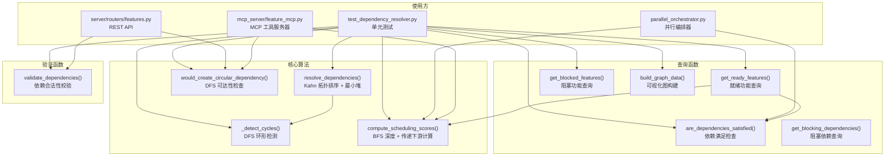

# `dependency_resolver.py` -- 依赖关系解析与拓扑排序引擎

> 源文件路径: `api/dependency_resolver.py`

## 功能概述

`dependency_resolver.py` 是 AutoForge 系统的依赖关系处理核心，提供基于 Kahn 算法的拓扑排序、DFS 环形依赖检测、依赖验证、调度评分以及就绪/阻塞状态查询等功能。

该模块以纯函数风格实现，不依赖任何数据库或 ORM 组件，所有函数接收标准 Python 字典列表（feature dicts）作为输入，返回排序结果或状态信息。这种设计使其既可被 MCP 服务器直接调用，也可在 REST API 路由或并行编排器中复用，同时便于独立单元测试。

核心算法包括：使用最小堆实现优先级感知的 Kahn 拓扑排序，用于确定功能实现顺序；DFS 递归路径追踪用于检测和报告环形依赖；多维调度评分算法（解锁潜力 + 图深度 + 用户优先级）用于在并行模式下优化代理分配；以及 `get_ready_features` 和 `get_blocked_features` 用于实时查询可执行和被阻塞的功能列表。

## 依赖关系

### 导入依赖

| 模块 | 说明 |
|------|------|
| `heapq` | 标准库，最小堆实现，用于优先级感知的拓扑排序 |
| `collections.deque` | 双端队列，用于 BFS 广度优先遍历（O(1) popleft） |
| `typing.TypedDict` | 类型定义，`DependencyResult` 结果结构 |

### 被依赖

| 模块 | 引用内容 |
|------|----------|
| `mcp_server/feature_mcp.py` | `MAX_DEPENDENCIES_PER_FEATURE`, `compute_scheduling_scores`, `would_create_circular_dependency` |
| `parallel_orchestrator.py` | `are_dependencies_satisfied`, `compute_scheduling_scores` |
| `server/routers/features.py` | `MAX_DEPENDENCIES_PER_FEATURE`, `would_create_circular_dependency` |
| `test_dependency_resolver.py` | 全部公开函数（单元测试，12 个测试用例） |

## 关键类/函数

### `class DependencyResult(TypedDict)`

依赖解析结果的类型定义。

- `ordered_features: list[dict]` -- 拓扑排序后的功能列表
- `circular_dependencies: list[list[int]]` -- 检测到的环形依赖列表
- `blocked_features: dict[int, list[int]]` -- 被阻塞的功能及其阻塞者
- `missing_dependencies: dict[int, list[int]]` -- 引用了不存在依赖的功能

### `resolve_dependencies(features: list[dict]) -> DependencyResult`

基于 Kahn 算法的拓扑排序，带优先级感知。

- **参数**: `features` - 功能字典列表，需包含 `id`, `priority`, `passes`, `dependencies` 字段
- **返回**: `DependencyResult` 包含排序结果、环形依赖、阻塞和缺失信息
- **算法**:
  1. 构建有向无环图（邻接表 + 入度表）
  2. 将入度为 0 的节点按 `(priority, id)` 放入最小堆
  3. 每次弹出最小优先级节点，更新邻接节点入度
  4. 未被排序的节点属于环形依赖，调用 `_detect_cycles` 定位具体环

### `are_dependencies_satisfied(feature, all_features, passing_ids=None) -> bool`

检查单个功能的所有依赖是否已通过。

- **参数**:
  - `feature` - 待检查的功能字典
  - `all_features` - 所有功能字典列表
  - `passing_ids` - 可选的预计算已通过 ID 集合（避免循环调用时的 O(n^2) 复杂度）
- **返回**: 所有依赖均已通过则返回 True

### `get_blocking_dependencies(feature, all_features, passing_ids=None) -> list[int]`

获取阻塞当前功能的未完成依赖 ID 列表。

- **参数**: 同 `are_dependencies_satisfied`
- **返回**: 未通过的依赖 ID 列表

### `would_create_circular_dependency(features, source_id, target_id) -> bool`

检测添加依赖是否会创建环形依赖（DFS 可达性检查）。

- **参数**:
  - `features` - 所有功能字典列表
  - `source_id` - 将获得依赖的功能 ID
  - `target_id` - 将成为依赖的功能 ID
- **返回**: 会产生环则返回 True
- **安全措施**: `MAX_DEPENDENCY_DEPTH = 50` 防止栈溢出（超过深度按有环处理）

### `validate_dependencies(feature_id, dependency_ids, all_feature_ids) -> tuple[bool, str]`

验证依赖列表的合法性。

- **检查项**: 数量限制（最多 20 个）、自引用、存在性、重复性
- **返回**: `(is_valid, error_message)` 元组

### `compute_scheduling_scores(features: list[dict]) -> dict[int, float]`

计算功能的调度优先级分数，用于并行模式下的代理分配优化。

- **评分公式**: `score = 1000 * unblock + 100 * depth_score + 10 * priority_factor`
  - `unblock` (0-1): 解锁下游功能的数量归一化值，权重最高
  - `depth_score` (0-1): 图深度分数，越接近根节点越高
  - `priority_factor` (0-1): 用户优先级转换值
- **算法**: BFS 计算深度 + 反向拓扑序计算传递下游数量
- **返回**: `{feature_id: score}` 字典，分数越高越优先调度

### `get_ready_features(features: list[dict], limit=10) -> list[dict]`

获取可立即开始的功能列表。

- **就绪条件**: 未通过、未在进行中、所有依赖已满足
- **排序**: 按调度分数降序、优先级升序、ID 升序
- **返回**: 至多 `limit` 个就绪功能

### `get_blocked_features(features: list[dict]) -> list[dict]`

获取被阻塞的功能列表。

- **返回**: 每个功能额外包含 `blocked_by` 字段，列出阻塞者 ID

### `build_graph_data(features: list[dict]) -> dict`

构建可视化图数据结构。

- **返回**: `{"nodes": [...], "edges": [...]}`，节点包含 `status`（done/blocked/in_progress/pending），边表示依赖方向

### `_detect_cycles(features, feature_map) -> list[list[int]]`

DFS 环形依赖检测（内部函数）。

- **算法**: 维护 visited 集合和递归栈（rec_stack），通过路径追踪定位具体环
- **返回**: 环形依赖列表，每个环是一组功能 ID

## 架构图

## 注意事项

1. **纯函数设计**: 该模块不依赖任何数据库连接或全局状态，所有函数接收标准 dict 列表并返回结果。这使其在不同上下文（MCP 服务器、REST API、编排器）中都可安全使用，且易于单元测试。

2. **安全防护常量**:
   - `MAX_DEPENDENCIES_PER_FEATURE = 20`: 防止单个功能拥有过多依赖导致图复杂度爆炸
   - `MAX_DEPENDENCY_DEPTH = 50`: 防止 DFS 递归栈溢出，超过深度时保守地假定存在环

3. **性能考虑**: `are_dependencies_satisfied` 和 `get_blocking_dependencies` 都接受可选的 `passing_ids` 参数。在循环中批量调用时应预计算该集合，避免 O(n^2) 复杂度退化为每次调用都扫描全量功能列表。

4. **调度评分权重**: 解锁潜力（1000x）远大于深度（100x）和优先级（10x）。这意味着在并行模式下，系统倾向于优先实现能解锁更多后续功能的"关键路径"节点，即使其用户优先级较低。

5. **环形依赖处理**: `resolve_dependencies` 在检测到环后仍会将环内节点追加到排序结果末尾（而非丢弃），确保调用者能获得完整的功能列表。`_detect_cycles` 可能返回不完整的环信息（只报告首个发现的环），但对于用户反馈已足够。

6. **BFS 环形安全**: `compute_scheduling_scores` 中的 BFS 使用 visited 集合防止环形依赖导致无限循环，未被 BFS 访问的孤立节点深度默认为 0。
