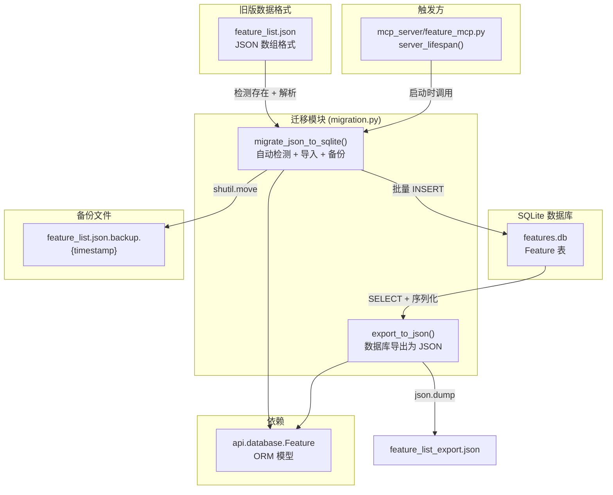

# `migration.py` -- JSON 到 SQLite 数据迁移工具

> 源文件路径: `api/migration.py`

## 功能概述

`migration.py` 提供从旧版 JSON 文件格式到 SQLite 数据库的自动迁移功能，以及从数据库导出回 JSON 的反向操作。它是 AutoForge 数据层演进过程中的关键兼容性组件。

早期版本的 AutoForge 使用 `feature_list.json` 文件存储功能列表，后来改为 SQLite 数据库（`features.db`）以支持并发访问、原子操作和更复杂的查询。该模块在 MCP 服务器启动时自动检测旧版 JSON 文件，将数据导入 SQLite 数据库，并将原始文件重命名为带时间戳的备份。

导出功能 `export_to_json` 提供了反向操作，可将数据库内容导出为 JSON 格式，用于调试、数据备份或在特殊情况下回退到旧格式。整个迁移过程是幂等且安全的：如果数据库已有数据则自动跳过，如果备份重命名失败也不会丢失已导入的数据。

## 依赖关系

### 导入依赖

| 模块 | 说明 |
|------|------|
| `json` | JSON 文件读写 |
| `shutil` | 文件移动（原子重命名备份） |
| `datetime` | 生成备份文件的时间戳 |
| `pathlib.Path` | 文件路径操作 |
| `sqlalchemy.orm.Session` | 数据库会话类型 |
| `sqlalchemy.orm.sessionmaker` | 会话工厂类型 |
| `api.database.Feature` | Feature ORM 模型，用于数据库读写 |

### 被依赖

| 模块 | 引用内容 |
|------|----------|
| `mcp_server/feature_mcp.py` | 导入 `migrate_json_to_sqlite`，在 MCP 服务器启动时执行自动迁移 |

## 关键类/函数

### `migrate_json_to_sqlite(project_dir: Path, session_maker: sessionmaker) -> bool`

检测并执行从 JSON 到 SQLite 的数据迁移。

- **参数**:
  - `project_dir` - 项目根目录（应包含 `feature_list.json`）
  - `session_maker` - SQLAlchemy 会话工厂
- **返回**: `True` 表示执行了迁移，`False` 表示跳过
- **流程**:
  1. 检查 `feature_list.json` 是否存在，不存在则返回 False
  2. 查询数据库是否已有数据，有则跳过（防止重复导入）
  3. 解析 JSON 文件，验证格式为数组
  4. 逐条创建 Feature 记录，兼容新旧 JSON 格式：
     - 旧格式（无 id/priority/name）: 使用索引作为 id 和 priority
     - 新格式: 直接使用各字段值
  5. 提交事务并验证导入数量
  6. 将 JSON 文件重命名为 `feature_list.json.backup.{timestamp}`
- **错误处理**:
  - JSON 解析失败: 打印错误，返回 False
  - IO 错误: 打印错误，返回 False
  - 数据库写入异常: 回滚事务，返回 False
  - 备份重命名失败: 打印警告但不影响迁移结果（数据已在数据库中）

### `export_to_json(project_dir: Path, session_maker: sessionmaker, output_file: Path | None = None) -> Path`

将数据库中的功能导出为 JSON 文件。

- **参数**:
  - `project_dir` - 项目根目录
  - `session_maker` - SQLAlchemy 会话工厂
  - `output_file` - 输出文件路径，默认为 `{project_dir}/feature_list_export.json`
- **返回**: 导出文件的 Path
- **排序**: 按 priority 升序、id 升序
- **格式**: 使用 `Feature.to_dict()` 序列化，带 2 空格缩进

## 架构图

## 注意事项

1. **幂等性保证**: `migrate_json_to_sqlite` 在数据库已有数据时自动跳过，因此多次调用不会产生重复数据。但它不检查数据的一致性（如 JSON 文件更新后数据库不会同步）。

2. **格式兼容**: 导入时兼容两种 JSON 格式。早期版本的 `feature_list.json` 可能不包含 `id`、`priority`、`name` 字段，此时使用数组索引作为替代值，`category` 默认为 "uncategorized"。

3. **备份安全**: 即使备份重命名失败（如权限问题），迁移也被视为成功，因为数据已在数据库中。下次启动时因数据库已有数据而跳过迁移，不会重复处理。

4. **仅 MCP 触发**: 目前只有 `feature_mcp.py` 的 `server_lifespan` 在启动时调用迁移函数。REST API 服务器和并行编排器不触发迁移，它们假设数据库已就绪。

5. **无回滚机制**: `export_to_json` 是单向导出工具，不提供从导出文件重新导入的功能。如需还原，需要手动将导出文件重命名为 `feature_list.json` 并删除 `features.db`。

6. **事务安全**: 导入操作在单个事务内完成，如遇异常则整体回滚，不会留下部分导入的脏数据。
