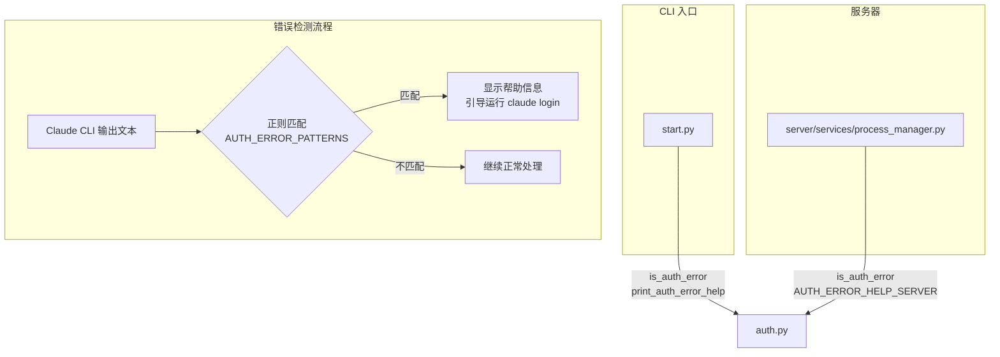

# `auth.py` -- Claude CLI 认证错误检测

> 源文件路径: `auth.py`

## 功能概述

`auth.py` 提供了统一的 **Claude CLI 认证错误检测功能**，供 CLI 入口（`start.py`）和服务器端（`process_manager.py`）共同使用，确保认证错误的检测逻辑和用户提示信息在整个系统中保持一致。

该模块通过正则表达式匹配多种常见的认证错误文本模式（如 "not logged in"、"authentication failed"、"unauthorized" 等），并提供两种场景下的帮助信息：CLI 终端输出格式和 WebSocket 流式传输格式。

## 依赖关系

### 导入依赖

| 模块 | 说明 |
|------|------|
| `re` | 正则表达式匹配 |

### 被依赖

| 模块 | 引用内容 |
|------|----------|
| `start.py` | `is_auth_error`, `print_auth_error_help` -- CLI 启动时检测认证错误 |
| `server/services/process_manager.py` | `is_auth_error`, `AUTH_ERROR_HELP_SERVER` -- 服务端代理进程监控中检测认证错误 |

## 关键类/函数

### `AUTH_ERROR_PATTERNS: list[str]`
- **类型**: 正则表达式字符串列表
- **说明**: 认证错误的匹配模式列表，包含 10 种常见模式：
  - `not logged in` / `not authenticated`
  - `authentication failed/required/error`
  - `login required`
  - `please run claude login`
  - `unauthorized`
  - `invalid token/credential/api key`
  - `expired token/session/credential`
  - `could not authenticate`
  - `sign in to/required`

### `is_auth_error(text: str) -> bool`
- **参数**: `text` -- 待检查的输出文本
- **返回值**: 如果文本匹配任一认证错误模式则返回 `True`
- **说明**: 大小写不敏感匹配。空字符串直接返回 `False`。

### `AUTH_ERROR_HELP_CLI: str`
- **类型**: 字符串常量
- **说明**: CLI 场景下的帮助信息，指导用户运行 `claude login` 进行身份验证。

### `AUTH_ERROR_HELP_SERVER: str`
- **类型**: 字符串常量
- **说明**: 服务端场景下的帮助信息，格式更宽以适配 WebSocket 日志流。

### `print_auth_error_help() -> None`
- **说明**: 打印 CLI 版本的认证错误帮助信息。

## 架构图

## 注意事项

1. **大小写不敏感**: `is_auth_error` 将文本转为小写后匹配，可以识别各种大小写组合的错误信息。
2. **空值安全**: 传入空字符串或 `None`（虽然类型标注为 `str`）时会安全返回 `False`。
3. **两种帮助信息**: CLI 和 Server 版本的帮助文本内容相同，但格式不同 -- CLI 版较窄（适配终端），Server 版较宽（适配日志流）。
4. **无状态模块**: 所有函数都是纯函数，无副作用（除 `print_auth_error_help` 会输出到 stdout）。
