# `autoforge_paths.py` -- 项目路径解析与布局迁移中枢

> 源文件路径: `autoforge_paths.py`

## 功能概述

`autoforge_paths.py` 是 AutoForge 的**路径解析核心模块**，负责统一管理项目内所有 AutoForge 相关文件（数据库、锁文件、配置文件、提示词目录等）的路径定位。

该模块实现了**三路径回退策略（tri-path resolution）**，确保在项目目录布局从旧版迁移到新版的过程中，所有文件路径都能被正确解析：

1. 优先检查新布局：`project_dir/.autoforge/X`
2. 其次检查旧目录：`project_dir/.autocoder/X`（旧版目录名）
3. 最后检查根目录：`project_dir/X`（最早期的平铺布局）
4. 若均不存在，默认使用新布局路径（用于新项目创建）

此外，模块还提供了 `migrate_project_layout()` 函数，能够将旧布局项目安全地迁移到 `.autoforge/` 目录下，包括 SQLite 数据库的 WAL 刷新与完整性校验。

## 依赖关系

### 导入依赖

| 模块 | 说明 |
|------|------|
| `logging` | 日志记录 |
| `shutil` | 文件/目录复制与移动操作 |
| `sqlite3` | SQLite 数据库操作（WAL 刷新、完整性校验） |
| `pathlib.Path` | 路径操作 |

### 被依赖

| 模块 | 引用内容 |
|------|----------|
| `progress.py` | `get_features_db_path`, `get_progress_cache_path` |
| `client.py` | `get_claude_settings_path` |
| `prompts.py` | `get_prompts_dir`, `ensure_autoforge_dir`, `get_autoforge_dir` |
| `autonomous_agent_demo.py` | `migrate_project_layout` |
| `parallel_orchestrator.py` | `get_pause_drain_path` |
| `api/database.py` | `get_features_db_path` |
| `server/routers/projects.py` | `has_agent_running`, `get_features_db_path`, `get_prompts_dir`, `ensure_autoforge_dir` |
| `server/routers/features.py` | `get_features_db_path` |
| `server/routers/spec_creation.py` | `get_prompts_dir` |
| `server/routers/expand_project.py` | `get_prompts_dir` |
| `server/services/process_manager.py` | `get_agent_lock_path`, `get_features_db_path`, `get_pause_drain_path`, `get_autoforge_dir` |
| `server/services/assistant_database.py` | `get_assistant_db_path` |
| `server/services/assistant_chat_session.py` | `get_prompts_dir`, `get_claude_assistant_settings_path` |
| `server/services/spec_chat_session.py` | `get_prompts_dir`, `get_claude_settings_path` |
| `server/services/expand_chat_session.py` | `get_prompts_dir`, `get_expand_settings_path` |
| `server/services/scheduler_service.py` | `get_features_db_path` |
| `server/services/dev_server_manager.py` | `get_devserver_lock_path`, `get_autoforge_dir` |

## 关键类/函数

### `_resolve_path(project_dir: Path, filename: str) -> Path`
- **参数**: `project_dir` -- 项目根目录; `filename` -- 目标文件名
- **返回值**: 解析后的文件路径
- **说明**: 私有函数，实现三路径回退策略。依次检查 `.autoforge/`、`.autocoder/`、项目根目录，返回第一个存在的路径；若均不存在则返回 `.autoforge/` 下的路径。

### `_resolve_dir(project_dir: Path, dirname: str) -> Path`
- **参数**: `project_dir` -- 项目根目录; `dirname` -- 目标目录名
- **返回值**: 解析后的目录路径
- **说明**: 与 `_resolve_path` 逻辑相同，专用于目录（如 `prompts/`）。

### `get_autoforge_dir(project_dir: Path) -> Path`
- **返回值**: `.autoforge` 目录路径（不创建）
- **说明**: 简单返回路径，不执行任何 I/O 操作。

### `ensure_autoforge_dir(project_dir: Path) -> Path`
- **返回值**: `.autoforge` 目录路径
- **说明**: 创建 `.autoforge/` 目录（如不存在），并写入 `.gitignore` 文件以排除运行时文件。

### `get_features_db_path(project_dir: Path) -> Path`
- **说明**: 解析 `features.db` 的路径，使用三路径回退。

### `get_agent_lock_path(project_dir: Path) -> Path`
- **说明**: 解析 `.agent.lock` 锁文件路径。

### `get_pause_drain_path(project_dir: Path) -> Path`
- **说明**: 返回 `.pause_drain` 信号文件路径。始终使用新布局位置（瞬态信号文件）。

### `get_prompts_dir(project_dir: Path) -> Path`
- **说明**: 解析 `prompts/` 提示词目录路径。

### `get_expand_settings_path(project_dir: Path, uuid_hex: str) -> Path`
- **说明**: 返回扩展会话的临时设置文件路径，始终存储在 `.autoforge/` 下。

### `has_agent_running(project_dir: Path) -> bool`
- **返回值**: 是否有代理或开发服务器正在运行
- **说明**: 检查三个位置（根目录、`.autocoder/`、`.autoforge/`）是否存在锁文件。

### `migrate_project_layout(project_dir: Path) -> list[str]`
- **返回值**: 已迁移项目列表的描述字符串
- **说明**: 将旧布局项目迁移到 `.autoforge/`。流程包括：
  1. 安全检查（代理运行中则跳过）
  2. 重命名 `.autocoder/` 为 `.autoforge/`
  3. 迁移 `prompts/` 目录
  4. 迁移 SQLite 数据库（含 WAL 刷新和完整性校验）
  5. 迁移简单文件（锁文件、设置文件等）

## 架构图

```mermaid
graph TD
    subgraph 路径解析核心
        AP[autoforge_paths.py]
    end

    subgraph 核心模块
        PR[progress.py]
        PM[prompts.py]
        CL[client.py]
        AD[autonomous_agent_demo.py]
        PO[parallel_orchestrator.py]
    end

    subgraph 数据层
        DB[api/database.py]
    end

    subgraph 服务器层
        RP[server/routers/projects.py]
        RF[server/routers/features.py]
        RS[server/routers/spec_creation.py]
        SPM[server/services/process_manager.py]
        ADB[server/services/assistant_database.py]
        ACS[server/services/assistant_chat_session.py]
        SCS[server/services/spec_chat_session.py]
        ECS[server/services/expand_chat_session.py]
        SS[server/services/scheduler_service.py]
        DSM[server/services/dev_server_manager.py]
    end

    PR -->|get_features_db_path<br/>get_progress_cache_path| AP
    PM -->|get_prompts_dir<br/>ensure_autoforge_dir<br/>get_autoforge_dir| AP
    CL -->|get_claude_settings_path| AP
    AD -->|migrate_project_layout| AP
    PO -->|get_pause_drain_path| AP
    DB -->|get_features_db_path| AP
    RP -->|has_agent_running<br/>get_features_db_path| AP
    RF -->|get_features_db_path| AP
    SPM -->|get_agent_lock_path<br/>get_pause_drain_path| AP
    ADB -->|get_assistant_db_path| AP
    ACS -->|get_prompts_dir| AP
    SCS -->|get_prompts_dir<br/>get_claude_settings_path| AP
    ECS -->|get_prompts_dir<br/>get_expand_settings_path| AP
    SS -->|get_features_db_path| AP
    DSM -->|get_devserver_lock_path| AP
```

## 注意事项

1. **迁移安全性**: `migrate_project_layout` 在检测到代理正在运行时会跳过迁移，避免破坏正在使用的数据库文件。
2. **SQLite 迁移完整性**: 数据库迁移时会先刷新 WAL（`PRAGMA wal_checkpoint(TRUNCATE)`），复制后执行 `PRAGMA integrity_check`，确保副本完整无损。若校验失败会自动回滚。
3. **部分迁移安全**: 每个文件/目录的迁移是独立的。即使某步失败，三路径回退机制仍能正确定位文件。
4. **`.gitignore` 自动管理**: `ensure_autoforge_dir` 会自动写入 `.gitignore`，排除 `features.db`、锁文件等运行时文件。
5. **该模块无外部第三方依赖**: 仅使用 Python 标准库，是整个系统的最底层模块之一。
