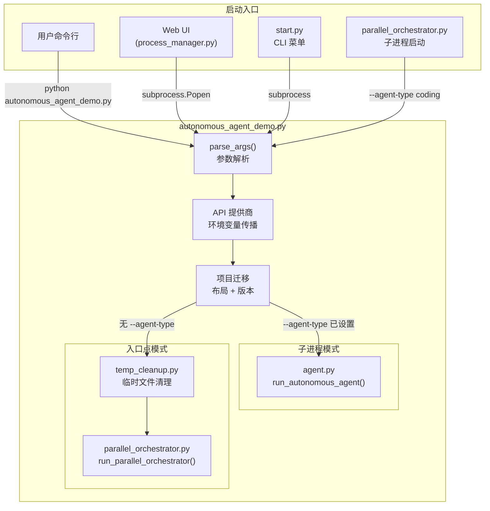

# `autonomous_agent_demo.py` -- 自主代理统一入口

> 源文件路径: `autonomous_agent_demo.py`

## 功能概述

`autonomous_agent_demo.py` 是 AutoForge 代理系统的统一入口脚本，也是整个系统中最重要的命令行接口。它根据运行模式分发到两条不同的执行路径：**子进程模式**（由编排器启动，直接执行特定代理角色）和**入口点模式**（用户或 Web UI 启动，使用统一编排器管理完整生命周期）。

作为子进程模式时，它直接调用 `agent.py` 中的 `run_autonomous_agent()` 执行单次代理会话（初始化/编码/测试）。作为入口点模式时，它启动 `parallel_orchestrator.py` 中的统一编排器来管理多个并发代理。

该脚本还负责项目布局迁移（`.autoforge/` 目录结构）、版本迁移、临时文件清理以及 UI 配置的 API 提供商设置传播等启动前准备工作。

## 依赖关系

### 导入依赖

| 模块 | 说明 |
|------|------|
| `argparse` | 命令行参数解析 |
| `asyncio` | 异步执行入口（`asyncio.run()`） |
| `pathlib.Path` | 路径操作 |
| `dotenv` | 从 `.env` 加载环境变量（必须在其他模块导入前调用） |
| `os` | 环境变量设置（API 提供商覆盖） |
| `agent` | `run_autonomous_agent` -- 子进程模式的代理执行函数 |
| `registry` | `DEFAULT_MODEL`、`get_effective_sdk_env`、`get_project_path` |
| `autoforge_paths` | `migrate_project_layout` -- 项目布局迁移（延迟导入） |
| `prompts` | `migrate_project_to_current` -- 版本迁移（延迟导入） |
| `temp_cleanup` | `cleanup_stale_temp` -- 启动前临时文件清理（延迟导入） |
| `parallel_orchestrator` | `run_parallel_orchestrator` -- 统一编排器（延迟导入） |

### 被依赖

| 模块 | 引用内容 |
|------|----------|
| `parallel_orchestrator.py` | 作为子进程通过 `subprocess.Popen` 启动（`--agent-type` 参数） |
| `server/services/process_manager.py` | Web UI 通过子进程启动（`--project-dir` + `--concurrency` 等参数） |
| `start.py` | CLI 菜单启动代理 |
| `package.json` | npm 包的 `files` 清单中包含此文件 |

## 关键类/函数

### `parse_args() -> argparse.Namespace`

- **返回值**: 解析后的命令行参数命名空间
- **说明**: 定义并解析所有命令行参数，包括：

| 参数 | 类型 | 默认值 | 说明 |
|------|------|--------|------|
| `--project-dir` | str | (必需) | 项目目录绝对路径或注册名称 |
| `--max-iterations` | int | None | 最大迭代次数 |
| `--model` | str | DEFAULT_MODEL | Claude 模型标识 |
| `--yolo` | flag | False | YOLO 快速原型模式 |
| `--concurrency` / `-c` | int | 1 | 并发编码代理数（1-5） |
| `--parallel` / `-p` | int | None | **已弃用**，`--concurrency` 的别名 |
| `--feature-id` | int | None | 单功能 ID（编排器子进程用） |
| `--feature-ids` | str | None | 逗号分隔的批量功能 ID |
| `--agent-type` | choice | None | 代理类型：initializer/coding/testing |
| `--testing-feature-id` | int | None | 测试目标功能 ID（旧版单功能模式） |
| `--testing-feature-ids` | str | None | 逗号分隔的测试功能 ID |
| `--testing-ratio` | int | 1 | 测试代理比例（0-3） |
| `--testing-batch-size` | int | 3 | 测试批次功能数（1-15） |
| `--batch-size` | int | 3 | 编码批次功能数（1-15） |

### `main() -> None`

- **说明**: 主入口函数，执行流程如下：
  1. 调用 `parse_args()` 解析参数
  2. 通过 `get_effective_sdk_env()` 将 UI 配置的 API 提供商设置传播到当前进程环境
  3. 处理已弃用的 `--parallel` 参数
  4. 解析项目目录（绝对路径直接使用，相对路径从注册表查找）
  5. 执行项目布局迁移和版本迁移
  6. 解析逗号分隔的功能 ID 列表
  7. 根据 `--agent-type` 是否设置分发到子进程模式或入口点模式

## 架构图

## 执行模式对照

| 场景 | `--agent-type` | 执行路径 | 调用者 |
|------|---------------|----------|--------|
| 初始化器子进程 | `initializer` | `run_autonomous_agent()` | `ParallelOrchestrator._run_initializer()` |
| 编码代理子进程 | `coding` | `run_autonomous_agent()` | `ParallelOrchestrator._spawn_coding_agent()` |
| 测试代理子进程 | `testing` | `run_autonomous_agent()` | `ParallelOrchestrator._spawn_testing_agent()` |
| 用户直接运行 | 未设置 | `run_parallel_orchestrator()` | 用户命令行 / Web UI |

## 注意事项

1. **环境变量加载顺序**: `load_dotenv()` 必须在导入其他模块之前调用，因为某些模块在加载时就读取环境变量。这是 `import os` 被放在 `load_dotenv()` 之后的原因。
2. **API 提供商传播**: 使用 `os.environ.setdefault()` 传播 UI 配置的 API 设置，确保显式环境变量和 `.env` 文件优先级更高。
3. **已弃用参数**: `--parallel` 是 `--concurrency` 的旧名称，使用时会打印警告并自动映射。
4. **并发数钳制**: `--concurrency` 的值会被钳制到 1-5 范围内，超出范围时打印提示。
5. **项目迁移幂等性**: `migrate_project_layout()` 和 `migrate_project_to_current()` 都是幂等操作，可安全重复调用。
6. **错误处理**: `KeyboardInterrupt` 被捕获并提示用户重新运行以继续，其他异常通过 `raise` 重新抛出以便调试。
