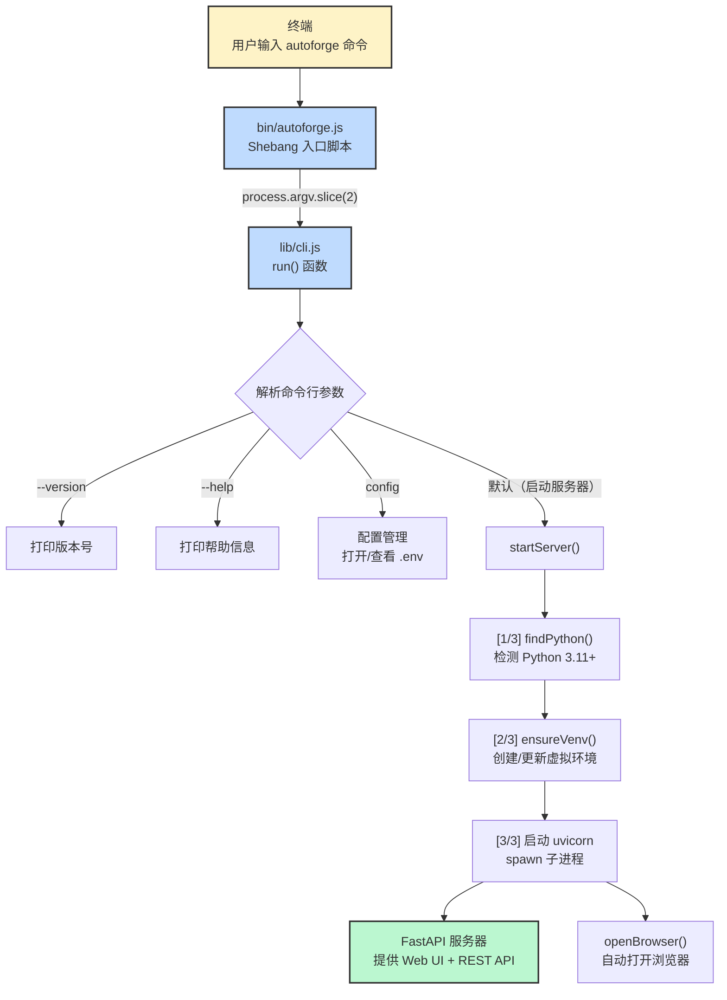
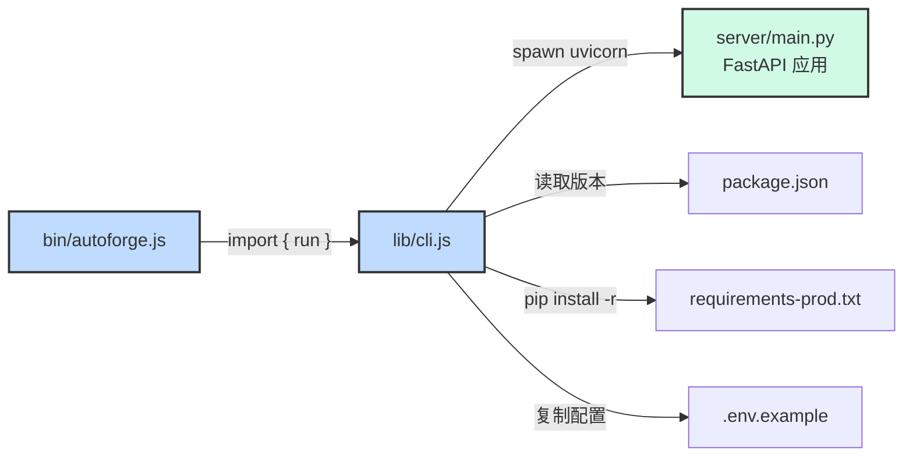

# `bin/` - npm CLI 入口

## 目录概述

`bin/` 目录包含 AutoForge npm 全局包的入口脚本。当用户通过 `npm install -g autoforge-ai` 安装后，执行 `autoforge` 命令时，系统会首先调用此目录下的 `autoforge.js` 脚本。该脚本是整个 CLI 工具链的起点，负责接收命令行参数并将控制权转交给 `lib/cli.js` 中的核心逻辑。

## 文件列表

| 文件 | 大小 | 说明 |
|------|------|------|
| `autoforge.js` | ~3 行 | npm 全局包入口脚本（shebang 脚本） |

## 文件详解

### `autoforge.js`

这是一个极简的 Node.js 可执行脚本，整个文件仅有三行代码：

```javascript
#!/usr/bin/env node
import { run } from '../lib/cli.js';
run(process.argv.slice(2));
```

**逐行解析：**

1. **`#!/usr/bin/env node`** - Shebang 行，告诉操作系统使用 Node.js 解释器执行此文件。`/usr/bin/env` 确保跨平台兼容性，会在系统 PATH 中查找 `node` 可执行文件。
2. **`import { run } from '../lib/cli.js'`** - 使用 ES Module 语法从 `lib/cli.js` 导入 `run` 函数。项目在 `package.json` 中声明了 `"type": "module"` 以启用 ESM 支持。
3. **`run(process.argv.slice(2))`** - 调用 `run` 函数，传入去除前两个元素（`node` 路径和脚本路径）后的命令行参数数组。

### 与 `package.json` 的关系

在 `package.json` 中，`bin` 字段将 `autoforge` 命令映射到此文件：

```json
{
  "name": "autoforge-ai",
  "bin": {
    "autoforge": "./bin/autoforge.js"
  },
  "type": "module"
}
```

当 npm 全局安装此包时，会在系统的全局 `bin` 目录（如 `/usr/local/bin/`）中创建一个符号链接，指向 `autoforge.js`。这使得用户可以在终端中直接运行 `autoforge` 命令。

## 架构图



## 依赖关系



### 上游依赖

| 依赖 | 类型 | 说明 |
|------|------|------|
| `lib/cli.js` | 内部模块 | 提供 `run()` 函数，包含所有 CLI 逻辑 |
| Node.js 20+ | 运行时 | `package.json` 中 `engines` 字段要求 |

### 下游消费者

| 消费者 | 说明 |
|--------|------|
| npm 全局安装 | `npm install -g autoforge-ai` 后创建符号链接 |
| 用户终端 | 直接执行 `autoforge` 命令 |

## 关键模式

### 职责分离

`autoforge.js` 严格遵循"薄入口"模式 -- 它不包含任何业务逻辑，仅负责：

1. 声明运行时环境（shebang）
2. 导入核心模块
3. 传递命令行参数

所有实际逻辑（Python 检测、虚拟环境管理、服务器启动等）均封装在 `lib/cli.js` 中。这种分离使得入口点保持稳定，核心逻辑可以独立演进。

### 零外部依赖

整个 npm 包（`bin/` 和 `lib/`）仅使用 Node.js 内置模块，不依赖任何第三方 npm 包。这确保了安装速度快、攻击面小、版本兼容性强。

### 命令行参数传递

使用 `process.argv.slice(2)` 是 Node.js CLI 工具的标准模式。`slice(2)` 去除了 `process.argv` 中的前两个元素：
- `argv[0]` = Node.js 可执行文件路径
- `argv[1]` = 当前脚本文件路径
- `argv[2+]` = 用户实际输入的参数

例如，当用户运行 `autoforge --port 9999 --no-browser` 时，`run()` 接收到的参数为 `['--port', '9999', '--no-browser']`。
