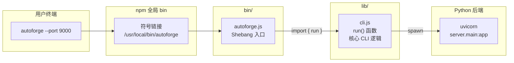

# `autoforge.js` — npm 全局包入口脚本（Shebang 入口）

> 源文件路径: `bin/autoforge.js`

## 功能概述

`autoforge.js` 是 AutoForge npm 全局包的命令行入口点，仅有 3 行代码。当用户通过 `npm install -g autoforge-ai` 安装包后，在终端输入 `autoforge` 命令时，操作系统通过 shebang (`#!/usr/bin/env node`) 调用 Node.js 执行此文件。

该文件遵循"薄入口"设计模式 —— 它不包含任何业务逻辑，仅负责从 `lib/cli.js` 导入 `run()` 函数并传入经过处理的命令行参数 (`process.argv.slice(2)`)。所有实际的 CLI 逻辑（Python 检测、虚拟环境管理、服务器启动等）全部封装在 `lib/cli.js` 中。

这种分离使得入口点保持极度稳定，核心逻辑可以独立演进而不影响 npm 的 `bin` 配置。

## 依赖关系

### 导入依赖

| 模块 | 说明 |
|------|------|
| `../lib/cli.js` | 核心 CLI 模块，提供 `run()` 导出函数 |

### 被依赖

| 模块 | 引用内容 |
|------|----------|
| `package.json` | `"bin": { "autoforge": "./bin/autoforge.js" }` — 注册为 npm 全局命令 |
| 操作系统 | npm 全局安装时在系统 `bin` 目录创建符号链接指向此文件 |

## 关键类/函数

此文件不定义任何函数或类。其完整源代码如下：

```javascript
#!/usr/bin/env node
import { run } from '../lib/cli.js';
run(process.argv.slice(2));
```

### 代码逐行解析

1. **`#!/usr/bin/env node`** — Shebang 行。在 Unix/macOS 系统上，当直接执行此文件时（如 `./autoforge.js`），操作系统会通过 `env` 在 `$PATH` 中查找 `node` 解释器来运行脚本。在 Windows 上 npm 会生成 `.cmd` 包装脚本来处理此逻辑。

2. **`import { run } from '../lib/cli.js'`** — 使用 ES Module 语法导入核心 CLI 函数。项目在 `package.json` 中声明了 `"type": "module"` 以启用 ESM 支持。

3. **`run(process.argv.slice(2))`** — 将用户输入的命令行参数（去除 `node` 路径和脚本路径后的部分）传递给 `run()` 函数处理。

## 架构图



## 注意事项

1. **ESM 要求**: 此文件使用 `import` 语法，依赖 `package.json` 中的 `"type": "module"` 声明。如果将项目改为 CommonJS 模式，需要同步修改此文件。

2. **Node.js 版本**: `package.json` 中的 `"engines": { "node": ">=20" }` 声明了最低 Node.js 20 的要求。

3. **npm 符号链接**: npm 全局安装时会在系统的全局 `bin` 目录（如 `/usr/local/bin/`、`%AppData%\npm\` 等）创建符号链接或 `.cmd` 包装器，使 `autoforge` 命令可在终端中直接使用。

4. **不要在此文件添加逻辑**: 此文件应始终保持最小化。任何新功能都应添加到 `lib/cli.js` 中，以维持入口点的稳定性。
