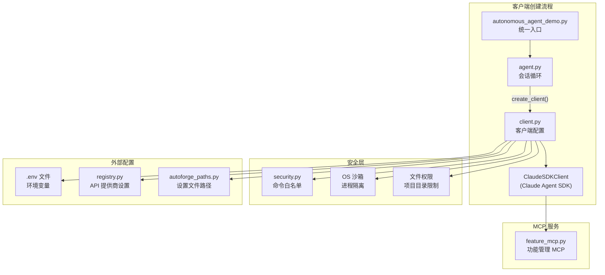

# `client.py` -- Claude SDK 客户端配置与创建

> 源文件路径: `client.py`

## 功能概述

`client.py` 是 AutoForge 系统中负责创建和配置 Claude Agent SDK 客户端的核心模块。它为每种代理类型（编码、测试、初始化器）构建定制化的安全沙箱环境，并管理与 Claude API 的连接参数。

该文件实现了 **纵深防御（Defense-in-Depth）** 安全策略，涵盖三层安全机制：操作系统级沙箱隔离、文件系统权限限制以及 Bash 命令白名单验证。同时，它还处理 Vertex AI 模型名称转换、MCP 工具服务器配置、额外只读路径验证以及上下文压缩（PreCompact）钩子等关键功能。

此模块是整个代理执行链中不可或缺的一环：`autonomous_agent_demo.py` 启动代理后调用 `agent.py`，而 `agent.py` 依赖 `client.py` 来创建经过安全配置的 `ClaudeSDKClient` 实例。

## 依赖关系

### 导入依赖

| 模块 | 说明 |
|------|------|
| `json` | 序列化安全设置为 JSON 文件 |
| `os` | 读取环境变量（EXTRA_READ_PATHS、CLAUDE_CODE_USE_VERTEX 等） |
| `re` | 正则匹配 Vertex AI 模型名称格式 |
| `shutil` | 查找系统 Claude CLI 路径 |
| `sys` | 获取当前 Python 解释器路径 |
| `pathlib.Path` | 路径操作 |
| `claude_agent_sdk` | Claude Agent SDK 核心类（ClaudeAgentOptions、ClaudeSDKClient） |
| `claude_agent_sdk.types` | 钩子类型定义（HookContext、HookInput、HookMatcher 等） |
| `dotenv` | 从 `.env` 文件加载环境变量 |
| `security` | Bash 安全钩子和敏感目录列表 |
| `autoforge_paths` | 获取 Claude 设置文件路径（延迟导入） |
| `registry` | 获取 SDK 环境变量覆盖（延迟导入） |

### 被依赖

| 模块 | 引用内容 |
|------|----------|
| `agent.py` | `from client import create_client` -- 在代理会话循环中创建客户端 |
| `test_client.py` | `from client import (...)` -- 单元测试验证客户端配置逻辑 |

## 关键类/函数

### `convert_model_for_vertex(model: str) -> str`

- **参数**: `model` -- Anthropic 格式的模型名称（如 `claude-sonnet-4-5-20250929`）
- **返回值**: Vertex AI 格式的模型名称（如 `claude-sonnet-4-5@20250929`）；若未启用 Vertex AI 或不匹配日期模式则原样返回
- **说明**: 自动检测 `CLAUDE_CODE_USE_VERTEX` 环境变量，将日期后缀的分隔符从 `-` 转换为 `@`

### `get_extra_read_paths() -> list[Path]`

- **参数**: 无（从环境变量 `EXTRA_READ_PATHS` 读取）
- **返回值**: 经过验证和规范化的 `Path` 列表
- **说明**: 解析逗号分隔的绝对路径列表，执行以下验证：
  - 必须是绝对路径
  - 必须存在且为目录
  - 不能是或包含敏感目录（`.ssh`、`.aws`、`.gnupg` 等）
  - 通过 `Path.resolve()` 规范化以防止 `..` 遍历攻击

### `create_client(project_dir, model, yolo_mode, agent_type) -> ClaudeSDKClient`

- **参数**:
  - `project_dir: Path` -- 项目目录路径
  - `model: str` -- Claude 模型标识
  - `yolo_mode: bool` -- 是否跳过浏览器测试（默认 `False`）
  - `agent_type: str` -- 代理类型，取值 `"coding"`、`"testing"` 或 `"initializer"`
- **返回值**: 配置完成的 `ClaudeSDKClient` 实例
- **说明**: 核心工厂函数，根据代理类型选择不同的 MCP 工具集和最大轮数（coding/initializer=300, testing=100），配置安全沙箱、文件权限和 Bash 安全钩子

### `bash_hook_with_context(input_data, tool_use_id, context)` (内部闭包)

- **说明**: 包装 `bash_security_hook`，将 `project_dir` 注入上下文中用于命令白名单验证

### `pre_compact_hook(input_data, tool_use_id, context) -> SyncHookJSONOutput` (内部闭包)

- **说明**: PreCompact 钩子，在上下文压缩时提供自定义指令，指导压缩器保留工作流关键状态（功能 ID、测试结果等）并丢弃冗余内容（截图数据、重复文件读取等）

## 常量定义

| 常量 | 说明 |
|------|------|
| `CODING_AGENT_TOOLS` | 编码代理可用的 12 个 MCP 工具 |
| `TESTING_AGENT_TOOLS` | 测试代理可用的 8 个 MCP 工具 |
| `INITIALIZER_AGENT_TOOLS` | 初始化器代理可用的 8 个 MCP 工具 |
| `ALL_FEATURE_MCP_TOOLS` | 三种代理工具的并集（用于安全权限层） |
| `BUILTIN_TOOLS` | 内置工具列表（Read、Write、Edit、Glob、Grep、Bash、WebFetch、WebSearch） |
| `EXTRA_READ_PATHS_VAR` | 环境变量名 `"EXTRA_READ_PATHS"` |
| `EXTRA_READ_PATHS_BLOCKLIST` | 敏感目录黑名单，引用 `security.SENSITIVE_DIRECTORIES` |

## 架构图

## 注意事项

1. **代理类型工具隔离**: 不同代理类型只暴露各自需要的 MCP 工具子集（通过 `allowed_tools` 控制 LLM 可见范围），但安全权限层允许所有工具（防止 MCP 服务器响应失败）。
2. **Vertex AI 兼容性**: 启用 Vertex AI 时自动转换模型名称格式，同时禁用 `context-1m-2025-08-07` beta（第三方 API 不支持）。
3. **系统 CLI 优先**: 优先使用系统安装的 `claude` CLI 而非捆绑版本，以避免 Windows 上 Bun 运行时崩溃（exit code 3）。
4. **PreCompact 钩子**: 类型系统中尚未包含 `PreCompactHookSpecificOutput` 变体，但 CLI 协议实际接受该格式，因此使用 `type: ignore` 注释绕过类型检查。
5. **缓冲区大小**: `max_buffer_size` 设为 10MB 以支持大型 Playwright 截图的传输。
6. **敏感路径阻断**: `EXTRA_READ_PATHS` 的验证逻辑会双向检查 -- 既阻止对敏感目录本身的访问，也阻止包含敏感目录的父目录。
