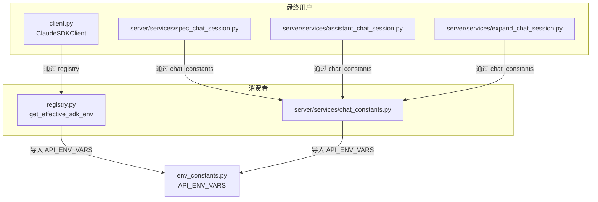

# `env_constants.py` -- 环境变量常量定义（API 配置单一事实来源）

> 源文件路径: `env_constants.py`

## 功能概述

`env_constants.py` 是一个轻量级的常量定义模块，作为**环境变量转发列表的单一事实来源（Single Source of Truth）**。

该模块定义了 `API_ENV_VARS` 列表，包含所有需要转发给 Claude CLI 子进程的环境变量名称。这些环境变量覆盖了核心 API 配置、模型层级覆盖以及 Vertex AI 配置三个方面，使得 AutoForge 能够使用替代 API 端点（如 Ollama、GLM、Vertex AI）而不影响用户的全局 Claude Code 设置。

该模块被 `client.py`（代理会话）和 `server/services/chat_constants.py`（聊天会话）共同导入，避免了在多处维护重复的环境变量列表。

## 依赖关系

### 导入依赖

| 模块 | 说明 |
|------|------|
| （无） | 该模块不导入任何外部模块，仅定义常量 |

### 被依赖

| 模块 | 引用内容 |
|------|----------|
| `registry.py` | `API_ENV_VARS` -- 在 `get_effective_sdk_env()` 中用于构建 SDK 环境变量 |
| `server/services/chat_constants.py` | `API_ENV_VARS` -- 在聊天会话中转发环境变量 |

## 关键类/函数

### `API_ENV_VARS: list[str]`
- **类型**: 字符串列表
- **说明**: 需要转发给 Claude CLI 子进程的环境变量名称列表。包含以下三类：

**核心 API 配置：**
| 变量名 | 说明 |
|--------|------|
| `ANTHROPIC_BASE_URL` | 自定义 API 端点（如 `https://api.z.ai/api/anthropic`） |
| `ANTHROPIC_AUTH_TOKEN` | API 认证令牌 |
| `ANTHROPIC_API_KEY` | API 密钥（Kimi 等供应商使用） |
| `API_TIMEOUT_MS` | 请求超时时间（毫秒） |

**模型层级覆盖：**
| 变量名 | 说明 |
|--------|------|
| `ANTHROPIC_DEFAULT_SONNET_MODEL` | Sonnet 模型覆盖 |
| `ANTHROPIC_DEFAULT_OPUS_MODEL` | Opus 模型覆盖 |
| `ANTHROPIC_DEFAULT_HAIKU_MODEL` | Haiku 模型覆盖 |

**Vertex AI 配置：**
| 变量名 | 说明 |
|--------|------|
| `CLAUDE_CODE_USE_VERTEX` | 启用 Vertex AI 模式（设为 `"1"`） |
| `CLOUD_ML_REGION` | GCP 区域（如 `us-east5`） |
| `ANTHROPIC_VERTEX_PROJECT_ID` | GCP 项目 ID |

## 架构图

## 注意事项

1. **单一事实来源**: 所有需要转发给子进程的环境变量名称只在此处定义，切勿在其他模块中硬编码。
2. **无外部依赖**: 该模块是纯常量定义，无任何导入语句，可被安全地在任意时刻导入。
3. **环境隔离**: 这些变量的设计目的是让 AutoForge 启动的 Claude CLI 子进程使用独立的 API 配置，不会与主机上的全局设置冲突。
4. **Vertex AI 注意**: 使用 Vertex AI 时，模型名称中需要用 `@` 替代 `-`（如 `claude-sonnet-4-5@20250929`）。
