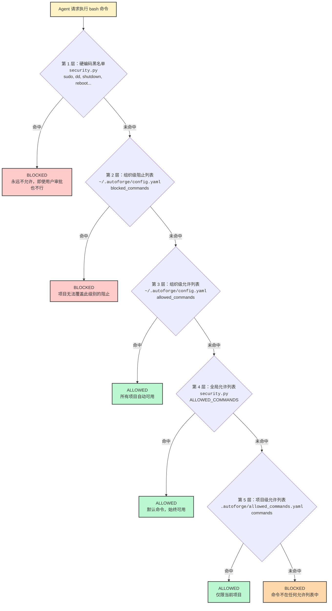
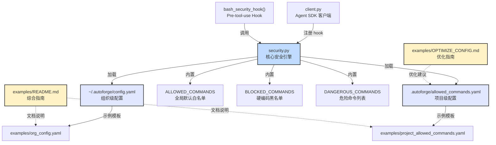
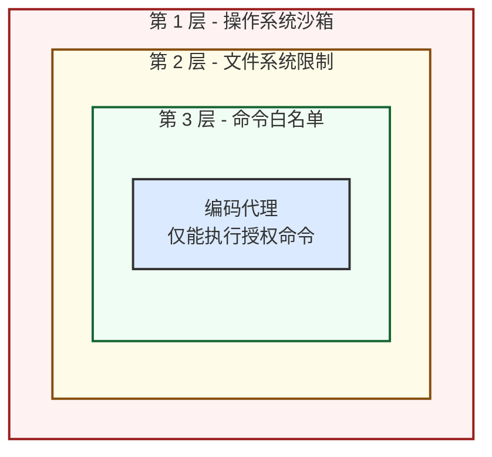

# `examples/` - 配置示例

## 目录概述

`examples/` 目录包含 AutoForge 安全配置系统的示例文件和文档指南。该目录为用户提供了项目级和组织级安全配置的完整参考，涵盖命令白名单、黑名单、通配符优化以及多层级安全策略的最佳实践。

AutoForge 采用纵深防御（defense-in-depth）安全模型，通过分层命令控制确保自治编码代理仅能执行经过明确授权的 bash 命令。

## 文件列表

| 文件 | 大小 | 说明 |
|------|------|------|
| `README.md` | ~14 KB | 安全配置综合指南：快速入门、项目/组织配置、命令层级、模式匹配、常见用例、安全最佳实践、默认允许命令、硬编码黑名单、故障排除 |
| `OPTIMIZE_CONFIG.md` | ~6 KB | `allowed_commands.yaml` 冗余优化指南：使用通配符将 65 个命令精简为 15 个 |
| `org_config.yaml` | ~5 KB | 组织级安全配置模板：`~/.autoforge/config.yaml`，包含 `allowed_commands` 和 `blocked_commands` |
| `project_allowed_commands.yaml` | ~4 KB | 项目级命令配置模板：`.autoforge/allowed_commands.yaml`，最多 100 个命令，含模式匹配示例 |

## 文件详解

### `README.md` - 安全配置综合指南

这是 examples 目录的主文档，提供了完整的安全配置参考。主要章节包括：

| 章节 | 内容 |
|------|------|
| Quick Start | 项目级和组织级配置的快速入门 |
| Project-Level Configuration | 项目 `.autoforge/allowed_commands.yaml` 的用法和限制 |
| Organization-Level Configuration | 组织 `~/.autoforge/config.yaml` 的用法和策略 |
| Command Hierarchy | 五层命令检查优先级说明 |
| Pattern Matching | 精确匹配、前缀通配符、本地脚本路径三种模式 |
| Common Use Cases | iOS、Rust、API 测试、企业/创业团队等场景示例 |
| Security Best Practices | DO / DON'T 安全实践清单 |
| Default Allowed Commands | 所有项目默认可用的命令列表 |
| Hardcoded Blocklist | 永远不允许的命令列表 |
| Troubleshooting | 常见错误和解决方案 |
| Testing | 单元测试和集成测试运行方法 |

### `OPTIMIZE_CONFIG.md` - 配置优化指南

针对 `allowed_commands.yaml` 配置过度冗长的问题，提供了系统性的优化方法：

**核心思想：** 使用通配符（`*`）替代逐一列举子命令。

**优化示例：**

| 优化前 | 优化后 | 节省 |
|--------|--------|------|
| `flutter`, `flutter test`, `flutter build apk` 等 25 条 | `flutter*` 1 条 | 24 条 |
| `dart`, `dart format`, `dart analyze` 等 8 条 | `dart*` 1 条 | 7 条 |
| 总计 65 条 | 15 条 | 77% |

**优化检查清单：**

1. 是否同时存在基础命令和对应通配符？（如 `flutter` + `flutter*`，后者已覆盖前者）
2. 是否逐一列出了子命令？（如 `flutter test`、`flutter build`，可用 `flutter*` 替代）
3. 是否可以对脚本进行分组？

**常用通配符速查表：**

| 替代前 | 替代后 | 覆盖范围 |
|--------|--------|----------|
| `flutter`, `flutter test`, `flutter build`, `flutter run` | `flutter*` | 所有 flutter 命令 |
| `dart`, `dart format`, `dart analyze`, `dart pub` | `dart*` | 所有 dart 工具 |
| `cargo`, `cargo build`, `cargo test`, `cargo run` | `cargo*` | 所有 cargo 命令 |
| `npm`, `npm install`, `npm run`, `npm test` | `npm*` | 所有 npm 命令 |

### `org_config.yaml` - 组织级配置模板

**文件位置：** `~/.autoforge/config.yaml`（需手动创建，默认不存在）

**用途：** 定义适用于所有项目的全局安全策略。

**配置结构：**

```yaml
version: 1

# 组织级允许命令 -- 所有项目自动可用
allowed_commands: []
  # - name: jq
  #   description: JSON processor

# 组织级阻止命令 -- 项目无法覆盖
blocked_commands: []
  # - aws
  # - kubectl

# 全局设置
approval_timeout_minutes: 5
```

**三种组织类型的配置策略：**

| 类型 | allowed_commands | blocked_commands | 策略 |
|------|-----------------|------------------|------|
| 创业/小团队 | `python3`, `jq` | 空（依赖硬编码黑名单） | 宽松 |
| 企业/合规 | 空（项目需显式声明） | `aws`, `gcloud`, `kubectl`, `terraform`, `psql` | 严格 |
| 开发团队 | `jq`, `python3`, `pytest` | `aws`, `kubectl`, `terraform` | 平衡 |

### `project_allowed_commands.yaml` - 项目级配置模板

**文件位置：** `{project_dir}/.autoforge/allowed_commands.yaml`（创建项目时自动生成）

**用途：** 定义单个项目特有的命令权限。

**配置结构：**

```yaml
version: 1

commands: []
  # iOS 开发
  # - name: swift*
  #   description: All Swift development tools
  # - name: xcodebuild
  #   description: Xcode build system

  # Rust 开发
  # - name: cargo
  #   description: Rust package manager
  # - name: rustc
  #   description: Rust compiler

  # 项目脚本
  # - name: ./scripts/build.sh
  #   description: Project build script
```

**限制与规则：**

| 规则 | 说明 |
|------|------|
| 最大 100 条命令 | 超出限制将导致配置被拒绝 |
| 不可覆盖组织级阻止列表 | `blocked_commands` 中的命令永远不允许 |
| 不可允许硬编码黑名单命令 | `sudo`、`dd`、`shutdown` 等永不允许 |
| 必须包含 `version` 字段 | 缺失将导致配置无效 |

**支持的命令模式：**

| 模式 | 语法 | 示例 | 匹配 |
|------|------|------|------|
| 精确匹配 | `name: swift` | `swift` | 仅 `swift` |
| 前缀通配符 | `name: swift*` | `swift*` | `swift`、`swiftc`、`swiftlint`、`swiftformat` |
| 本地脚本 | `name: ./scripts/build.sh` | `./scripts/build.sh` | 从任意目录通过文件名匹配 |

## 架构图

### 命令安全层级



### 配置文件关系



## 依赖关系

### 上游依赖（谁使用这些配置文件）

| 模块 | 调用方式 | 说明 |
|------|----------|------|
| `security.py` | `load_org_config()` | 加载组织级配置文件 |
| `security.py` | `load_project_commands()` | 加载项目级配置文件 |
| `security.py` | `get_effective_commands()` | 合并所有层级，计算最终有效命令集 |
| `security.py` | `bash_security_hook()` | Pre-tool-use Hook，在每次 bash 调用前验证 |
| `client.py` | `ClaudeSDKClient` | 将 `bash_security_hook` 注册为安全钩子 |

### 相关测试文件

| 文件 | 测试数量 | 说明 |
|------|----------|------|
| `test_security.py` | 12 个单元测试 | 模式匹配、YAML 加载验证、黑名单执行、层级解析 |
| `test_security_integration.py` | 9 个集成测试 | 使用真实安全钩子的端到端测试 |

### 文件路径映射

| 示例文件 | 实际部署位置 | 创建方式 |
|----------|-------------|----------|
| `examples/org_config.yaml` | `~/.autoforge/config.yaml` | 用户手动复制和编辑 |
| `examples/project_allowed_commands.yaml` | `{project}/.autoforge/allowed_commands.yaml` | 项目创建时自动生成 |

## 关键模式

### 纵深防御（Defense-in-Depth）

安全模型的核心理念是多层防御，即使某一层被绕过，上层仍然能提供保护：

1. **操作系统沙箱** - 系统级别的进程隔离
2. **文件系统限制** - 仅允许访问项目目录
3. **命令白名单** - 分层的命令允许/阻止列表



### 分层安全模型

五个层级从高到低形成严格的优先级链：

| 优先级 | 层级 | 配置位置 | 可覆盖性 |
|--------|------|----------|----------|
| 最高 | 硬编码黑名单 | `security.py` BLOCKED_COMMANDS | 不可覆盖，代码层面硬编码 |
| 高 | 组织级阻止列表 | `~/.autoforge/config.yaml` blocked_commands | 不可被项目覆盖 |
| 中 | 组织级允许列表 | `~/.autoforge/config.yaml` allowed_commands | 所有项目自动继承 |
| 中 | 全局默认允许列表 | `security.py` ALLOWED_COMMANDS | 始终可用 |
| 最低 | 项目级允许列表 | `.autoforge/allowed_commands.yaml` commands | 仅对当前项目生效 |

**核心规则：** 阻止列表（blocklist）始终优先于允许列表（allowlist）。如果一个命令在任何较高层级被阻止，较低层级无法将其允许。

### 通配符模式匹配

`security.py` 中的 `matches_pattern()` 函数支持三种匹配模式：

| 模式 | 实现 | 安全措施 |
|------|------|----------|
| 精确匹配 | `command == pattern` | 无额外风险 |
| 前缀通配符 | `command.startswith(prefix)` | 拒绝裸通配符 `*`，防止匹配所有命令 |
| 脚本路径 | `os.path.basename()` 匹配 | 支持相对路径和绝对路径 |

**安全措施：** 裸通配符 `"*"` 被显式拒绝，防止配置错误导致所有命令被允许。

### 敏感命令额外验证

部分命令即使在白名单中，仍需要额外的参数级验证：

| 命令 | 验证函数 | 限制 |
|------|----------|------|
| `pkill` | `validate_pkill_command()` | 仅允许终止开发相关进程（node、npm、vite 等） |
| `chmod` | `validate_chmod_command()` | 仅允许 `+x` 模式（设置可执行权限） |
| `init.sh` | `validate_init_script()` | 仅允许 `./init.sh` 路径 |
| `playwright-cli` | `validate_playwright_command()` | 阻止 `run-code` 和 `eval` 子命令 |

### 默认允许命令清单

以下命令在所有项目中默认可用，无需额外配置：

| 类别 | 命令 |
|------|------|
| 文件查看 | `ls`, `cat`, `head`, `tail`, `wc`, `grep` |
| 文件操作 | `cp`, `mkdir`, `mv`, `rm`, `touch` |
| 目录与输出 | `pwd`, `echo` |
| Shell 脚本 | `sh`, `bash`, `sleep` |
| 版本控制 | `git` |
| Node.js | `npm`, `npx`, `pnpm`, `node` |
| 容器 | `docker` |
| 进程管理 | `ps`, `lsof`, `kill`, `pkill`（仅限开发进程） |
| 网络 | `curl` |
| 权限 | `chmod`（仅限 `+x` 模式） |
| 浏览器自动化 | `playwright-cli`（限制子命令） |
| 初始化 | `init.sh`（仅限 `./init.sh`） |

### 硬编码黑名单

以下命令永远不允许执行，任何配置层级都无法覆盖：

| 类别 | 命令 | 风险说明 |
|------|------|----------|
| 磁盘操作 | `dd`, `mkfs`, `fdisk`, `parted` | 可能导致数据丢失或磁盘损坏 |
| 系统控制 | `shutdown`, `reboot`, `poweroff`, `halt`, `init` | 可能导致系统停机 |
| 权限变更 | `chown`, `chgrp` | 可能导致文件权限混乱 |
| 系统服务 | `systemctl`, `service`, `launchctl` | 可能影响系统服务运行 |
| 网络安全 | `iptables`, `ufw` | 可能影响网络安全规则 |
| 权限提升 | `sudo`, `su`, `doas` | 可能获取超级用户权限 |
| 云平台 CLI | `aws`, `gcloud`, `az` | 可能修改生产环境基础设施 |
| 容器编排 | `kubectl`, `docker-compose` | 可能影响生产环境部署 |
