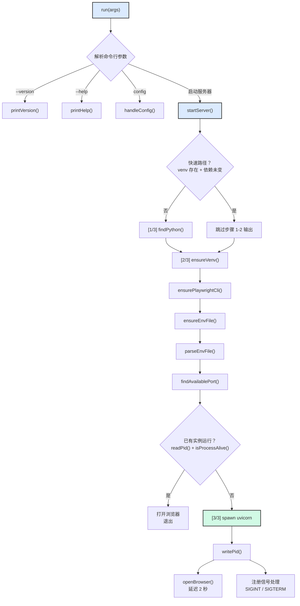
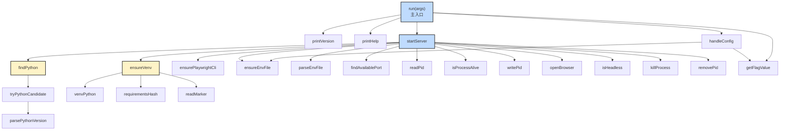
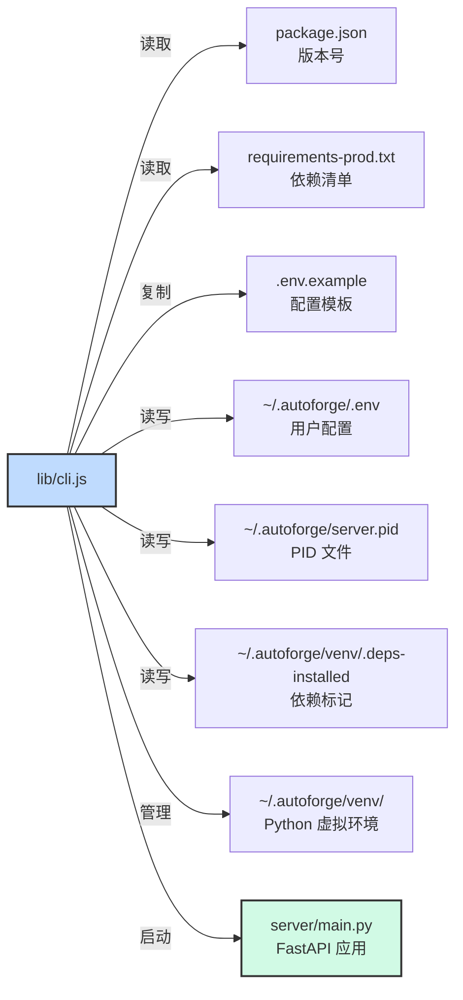

# `lib/` - Node.js CLI 实现

## 目录概述

`lib/` 目录包含 AutoForge npm CLI 工具的核心实现。唯一的文件 `cli.js` 承载了从 Python 检测、虚拟环境管理、配置加载到 uvicorn 服务器启动的全部逻辑。该模块完全使用 Node.js 内置模块实现，不依赖任何第三方 npm 包。

## 文件列表

| 文件 | 大小 | 说明 |
|------|------|------|
| `cli.js` | ~835 行 | CLI 核心实现，包含 Python 检测、虚拟环境管理、配置加载、端口扫描、PID 管理、服务器启动及信号处理 |

## 功能模块详解

### 路径与配置常量

`cli.js` 在顶部定义了一组关键路径常量，构成整个 CLI 的文件系统基础：

| 常量 | 值 | 说明 |
|------|------|------|
| `PKG_DIR` | `dirname(dirname(import.meta.url))` | npm 包根目录（`lib/` 的上级目录） |
| `CONFIG_HOME` | `~/.autoforge/` | 用户配置主目录 |
| `VENV_DIR` | `~/.autoforge/venv/` | Python 虚拟环境目录 |
| `DEPS_MARKER` | `~/.autoforge/venv/.deps-installed` | 依赖安装标记文件（JSON 格式） |
| `PID_FILE` | `~/.autoforge/server.pid` | 服务器进程 PID 文件 |
| `REQUIREMENTS_FILE` | `{PKG_DIR}/requirements-prod.txt` | 生产环境依赖清单 |
| `ENV_EXAMPLE` | `{PKG_DIR}/.env.example` | 配置模板文件 |
| `ENV_FILE` | `~/.autoforge/.env` | 用户配置文件 |
| `IS_WIN` | `platform() === 'win32'` | Windows 平台检测标志 |

### Python 检测 - `findPython()`

跨平台检测 Python 3.11+ 解释器，确保系统具备运行 AutoForge 后端的能力。

**检测顺序（平台相关）：**

| 平台 | 候选列表 | 说明 |
|------|----------|------|
| Windows | `python` -> `py -3` -> `python3` | Windows 通常使用 `python` 或 Python Launcher (`py`) |
| macOS/Linux | `python3` -> `python` | Unix 系统优先使用 `python3` |

**环境变量覆盖：** 设置 `AUTOFORGE_PYTHON` 环境变量可跳过自动检测，直接指定 Python 解释器路径。

**检测流程：**

1. 通过 `execFileSync` 执行 `{candidate} --version`，获取版本字符串
2. 使用 `parsePythonVersion()` 解析 "Python X.Y.Z" 格式
3. 验证版本号 >= 3.11
4. 验证 `venv` 模块可用（`import ensurepip`），处理 Debian/Ubuntu 需要单独安装 `python3-venv` 的情况
5. 返回 `{ exe, version, tooOld }` 结果对象

**辅助函数：**

- `parsePythonVersion(raw)` - 正则解析 "Python 3.13.6" 格式，返回 `{ major, minor, patch, raw }`
- `tryPythonCandidate(candidate)` - 尝试单个 Python 候选项，支持字符串和数组格式（如 `['py', '-3']`）

### 虚拟环境管理 - `ensureVenv()`

管理 `~/.autoforge/venv/` 中的 Python 虚拟环境，使用复合标记文件实现智能更新。

**复合标记文件** (`.deps-installed`)：

```json
{
  "requirements_hash": "sha256 哈希值",
  "python_version": "3.13",
  "python_path": "/Users/xxx/.autoforge/venv/bin/python",
  "created_at": "2024-01-01T00:00:00.000Z"
}
```

**判断逻辑：**

| 条件 | 动作 |
|------|------|
| `forceRecreate` 为 true（`--repair` 标志） | 删除并重建虚拟环境 |
| 虚拟环境 Python 可执行文件不存在 | 创建虚拟环境 |
| 标记文件中 Python 主次版本与当前不匹配 | 重建虚拟环境 |
| 标记文件中记录的 Python 路径已不存在 | 重建虚拟环境 |
| `requirements_hash` 与当前不匹配 | 仅重新安装依赖 |
| 以上条件均不满足 | 快速路径，跳过所有设置 |

**相关辅助函数：**

- `venvPython()` - 返回虚拟环境中 Python 可执行文件路径（Windows: `Scripts/python.exe`，Unix: `bin/python`）
- `requirementsHash()` - 计算 `requirements-prod.txt` 的 SHA-256 哈希
- `readMarker()` - 读取并解析标记文件 JSON

### 配置文件管理 - `parseEnvFile()` / `ensureEnvFile()`

管理 `~/.autoforge/.env` 配置文件的读写。

**`parseEnvFile(filePath)`：**

解析 `.env` 文件为键值对象。处理规则：
- 忽略空行和 `#` 开头的注释行
- 按第一个 `=` 分割键值
- 自动去除值两端的匹配引号（单引号或双引号）
- 返回 `{ KEY: "value" }` 格式的对象

**`ensureEnvFile()`：**

首次运行时创建配置文件：
- 如果 `~/.autoforge/.env` 已存在，返回 `false`
- 如果 `.env.example` 存在，复制为初始配置
- 否则创建最小占位文件
- 返回 `true` 表示新创建了文件

### 端口检测 - `findAvailablePort()`

从指定端口（默认 8888）开始扫描可用 TCP 端口。

**实现策略：** 通过生成子 Node.js 进程尝试绑定端口。如果绑定成功（进程退出码 0），则端口可用；如果绑定失败（进程退出码 1），继续尝试下一个端口。最多尝试 20 个端口（8888-8907）。

### PID 管理

四个函数协同管理服务器进程的 PID 文件（`~/.autoforge/server.pid`）：

| 函数 | 说明 |
|------|------|
| `readPid()` | 读取 PID 文件，返回数值或 `null` |
| `isProcessAlive(pid)` | 使用 `process.kill(pid, 0)` 信号 0 检测进程存活状态 |
| `writePid(pid)` | 写入 PID 到文件 |
| `removePid()` | 删除 PID 文件（静默处理不存在的情况） |

PID 文件用于检测服务器是否已在运行，避免重复启动。启动时检测到已有活跃进程会直接打开浏览器而非启动新实例。

### 浏览器与无头环境检测 - `openBrowser()` / `isHeadless()`

**`openBrowser(url)`** - 跨平台打开默认浏览器：

| 平台 | 实现 |
|------|------|
| Windows | `start "" "{url}"` (cmd 内置命令) |
| macOS | `open {url}` |
| Linux | `xdg-open {url}` (仅在有显示服务器且非 SSH 会话时) |

**`isHeadless()`** - 检测无头环境（不应打开浏览器的场景）：

| 条件 | 说明 |
|------|------|
| `process.env.CI` | CI/CD 环境 |
| `process.env.CODESPACES` | GitHub Codespaces |
| `process.env.SSH_TTY` | SSH 远程会话 |
| Linux 无 `DISPLAY`/`WAYLAND_DISPLAY` | 无图形界面的 Linux |

### 进程清理 - `killProcess()`

平台特定的进程终止：

| 平台 | 实现 | 说明 |
|------|------|------|
| Windows | `taskkill /pid {pid} /t /f` | `/t` 终止进程树，`/f` 强制终止 |
| macOS/Linux | `process.kill(pid, 'SIGTERM')` | 发送 SIGTERM 信号 |

### Playwright CLI 管理 - `ensurePlaywrightCli()`

检查并安装全局 `playwright-cli` 工具，用于浏览器自动化测试：

1. 尝试执行 `playwright-cli --version` 检测是否已安装
2. 如未安装，运行 `npm install -g @playwright/cli`
3. 返回 `true`（可用）或 `false`（安装失败）

### CLI 命令处理

`run()` 函数作为主入口，解析命令行参数并分发到对应处理器：

| 命令/标志 | 处理函数 | 说明 |
|-----------|----------|------|
| `--version` / `-v` | `printVersion()` | 打印版本号 |
| `--help` / `-h` | `printHelp()` | 打印帮助信息 |
| `config` | `handleConfig()` | 配置管理子命令 |
| `config --path` | `handleConfig()` | 打印配置文件路径 |
| `config --show` | `handleConfig()` | 显示当前生效的配置 |
| `--port PORT` | `startServer()` | 指定自定义端口 |
| `--host HOST` | `startServer()` | 指定绑定主机（默认 `127.0.0.1`） |
| `--no-browser` | `startServer()` | 禁止自动打开浏览器 |
| `--repair` | `startServer()` | 删除并重建虚拟环境 |
| `--dev` | 报错退出 | 开发模式需要克隆仓库 |
| 默认（无参数） | `startServer()` | 启动服务器 |

**参数解析辅助：** `getFlagValue(args, flag)` 从参数数组中提取标志的值（如 `--port 9000` 中的 `9000`）。

### 服务器启动流程 - `startServer()`

三步启动流程，包含快速路径优化：

```
[1/3] 检查 Python   → findPython()
[2/3] 设置环境      → ensureVenv() + ensurePlaywrightCli()
[3/3] 启动服务器    → spawn uvicorn
```

**快速路径：** 当虚拟环境已就绪且依赖未变更时，跳过步骤 [1/3] 和 [2/3] 的输出，直接启动服务器。

**服务器进程：** 使用 `child_process.spawn()` 启动 uvicorn：

```javascript
spawn(pyExe, ['-m', 'uvicorn', 'server.main:app', '--host', host, '--port', port], {
  cwd: PKG_DIR,
  env: { ...process.env, ...dotenvVars, PYTHONPATH: PKG_DIR },
  stdio: 'inherit',
});
```

**安全警告：** 当 `--host` 设置为非 `127.0.0.1` 时，CLI 会打印安全警告，提醒用户服务器将对外开放。同时设置 `AUTOFORGE_ALLOW_REMOTE=1` 环境变量通知 FastAPI 服务器。

### 信号处理与优雅关闭

注册 `SIGINT` 和 `SIGTERM` 信号处理器：

```javascript
process.on('SIGINT', () => {
  killProcess(child.pid);
  removePid();
  process.exit(0);
});
```

当子进程自行退出时，同样清理 PID 文件并传播退出码：

```javascript
child.on('exit', (code) => {
  removePid();
  process.exit(code ?? 1);
});
```

## 架构图

### 启动流程



### 函数关系图



## 依赖关系

### Node.js 内置模块

`cli.js` 仅使用 Node.js 内置模块，确保零外部依赖：

| 模块 | 导入 | 用途 |
|------|------|------|
| `node:child_process` | `execFileSync`, `spawn`, `execSync` | 执行 Python、pip、浏览器等外部进程 |
| `node:crypto` | `createHash` | 计算 requirements 文件的 SHA-256 哈希 |
| `node:fs` | `existsSync`, `readFileSync`, `writeFileSync`, `mkdirSync`, `unlinkSync`, `rmSync`, `copyFileSync` | 文件系统操作 |
| `node:module` | `createRequire` | 读取 `package.json` 版本号 |
| `node:net` | `createServer` | TCP 端口可用性检测 |
| `node:os` | `homedir`, `platform` | 获取用户主目录和操作系统类型 |
| `node:path` | `join`, `dirname` | 路径拼接和目录解析 |
| `node:url` | `fileURLToPath` | 将 `import.meta.url` 转为文件路径 |

### 文件系统依赖



### 上游调用者

| 调用者 | 说明 |
|--------|------|
| `bin/autoforge.js` | 唯一入口，调用 `run()` 函数 |

### 下游依赖

| 依赖 | 说明 |
|------|------|
| Python 3.11+ | 系统中必须安装的 Python 解释器 |
| `requirements-prod.txt` | pip 安装的 Python 运行时依赖 |
| `server/main.py` | uvicorn 启动的 FastAPI 应用 |
| `playwright-cli` | 可选的全局 npm 包，用于浏览器自动化 |

## 关键模式

### 零外部依赖架构

整个 `lib/cli.js` 仅使用 Node.js 内置模块（`node:child_process`、`node:crypto`、`node:fs`、`node:net`、`node:os`、`node:path`、`node:url`、`node:module`）。这一设计决策带来以下优势：

- **安装速度快** - npm 安装无需下载额外依赖
- **安全性高** - 消除了供应链攻击风险
- **兼容性强** - 只要求 Node.js 20+
- **包体积小** - 发布的 tarball 约 600KB

### 复合标记文件策略

使用 JSON 格式的 `.deps-installed` 标记文件替代简单的存在性检测，实现了精细的缓存失效：

1. **依赖哈希** (`requirements_hash`) - `requirements-prod.txt` 变更时重装依赖
2. **Python 版本** (`python_version`) - Python 主次版本变更时重建虚拟环境
3. **Python 路径** (`python_path`) - Python 可执行文件被删除时重建
4. **创建时间** (`created_at`) - 用于诊断和审计

标记文件仅在 pip 安装成功后写入，防止部分安装状态导致的问题。

### 快速路径优化

`startServer()` 实现了快速路径检测：当虚拟环境已就绪且依赖哈希匹配时，跳过 Python 检测和安装步骤的用户输出，直接启动服务器。这使得日常启动（非首次）几乎瞬间完成。

### 跨平台兼容性

CLI 在多个层面处理平台差异：

| 功能 | Windows | macOS | Linux |
|------|---------|-------|-------|
| Python 搜索 | `python` -> `py -3` -> `python3` | `python3` -> `python` | `python3` -> `python` |
| venv Python 路径 | `Scripts/python.exe` | `bin/python` | `bin/python` |
| 进程终止 | `taskkill /pid /t /f` | `SIGTERM` | `SIGTERM` |
| 打开浏览器 | `start ""` (cmd) | `open` | `xdg-open` |

### 优雅关闭机制

服务器启动后注册双重清理机制：

1. **信号处理** - `SIGINT`（Ctrl+C）和 `SIGTERM` 触发 `killProcess()` + `removePid()`
2. **子进程退出监听** - uvicorn 进程自行退出时清理 PID 文件并传播退出码

这确保了无论以何种方式停止，PID 文件都会被清理，避免残留状态影响下次启动。

### 防重复启动

启动前检查 PID 文件和进程存活状态。如果发现已有运行实例，不启动新服务器，而是打开浏览器指向已有实例，避免端口冲突和资源浪费。
