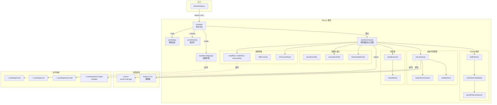

# `cli.js` — npm CLI 核心模块，管理 Python 环境、配置加载与服务器生命周期

> 源文件路径: `lib/cli.js`

## 功能概述

`cli.js` 是 AutoForge npm 全局包 (`autoforge-ai`) 的核心模块，包含命令行工具的全部业务逻辑。它是一个纯 Node.js 模块，**不依赖任何外部 npm 包**（仅使用 `node:*` 内置模块），这使得 npm 包保持零运行时依赖。

该模块承担六大职责：(1) 跨平台 Python 3.11+ 解释器检测与版本验证；(2) 虚拟环境 (`~/.autoforge/venv/`) 的创建、维护与依赖安装，使用复合标记文件实现增量更新；(3) 用户配置文件 (`~/.autoforge/.env`) 的初始化与解析；(4) TCP 端口可用性检测；(5) uvicorn 服务器进程的启动与 PID 文件管理；(6) 信号处理与优雅关闭。

设计上追求"快速路径"体验 —— 当虚拟环境已就绪且依赖未变更时，跳过所有检测步骤直接启动服务器，实现亚秒级启动。

## 依赖关系

### 导入依赖

| 模块 | 说明 |
|------|------|
| `node:child_process` | `execFileSync` / `execSync` / `spawn` — 执行 Python 命令和启动服务器 |
| `node:crypto` | `createHash` — 计算 requirements 文件的 SHA-256 哈希 |
| `node:fs` | 文件系统操作（读写标记文件、PID 文件、配置文件等） |
| `node:module` | `createRequire` — 读取 `package.json` 版本号 |
| `node:net` | `createServer` — 端口可用性探测 |
| `node:os` | `homedir` / `platform` — 用户主目录和平台检测 |
| `node:path` | `join` / `dirname` — 路径拼接 |
| `node:url` | `fileURLToPath` — ES Module 的 `import.meta.url` 转换为文件路径 |

### 被依赖

| 模块 | 引用内容 |
|------|----------|
| `bin/autoforge.js` | `import { run } from '../lib/cli.js'` — 唯一直接调用者 |

## 关键类/函数

### Python 检测

#### `parsePythonVersion(raw) -> object | null`
- **参数**: `raw` — Python 版本输出字符串（如 `"Python 3.13.6"`）
- **返回值**: `{ major, minor, patch, raw }` 对象，解析失败返回 `null`

#### `tryPythonCandidate(candidate) -> object | null`
- **参数**: `candidate` — Python 命令候选（字符串或数组，如 `'python3'` 或 `['py', '-3']`）
- **返回值**: `{ exe, version, tooOld }` 对象，不可用时返回 `null`
- **说明**: 尝试执行候选命令的 `--version`，解析输出并检查版本 >= 3.11。

#### `findPython() -> object`
- **返回值**: `{ exe, version }` 对象
- **说明**: 按平台顺序搜索 Python 解释器。支持 `AUTOFORGE_PYTHON` 环境变量覆盖。搜索顺序：Windows 为 `python -> py -3 -> python3`，macOS/Linux 为 `python3 -> python`。找到候选后还会验证 `ensurepip` 模块可用性（检测 Debian/Ubuntu 缺少 `python3-venv` 的情况）。

### 虚拟环境管理

#### `venvPython() -> string`
- **返回值**: venv 中 Python 可执行文件的完整路径

#### `requirementsHash() -> string`
- **返回值**: `requirements-prod.txt` 的 SHA-256 哈希值
- **说明**: 用于检测依赖文件是否变更，决定是否需要重新安装。

#### `readMarker() -> object | null`
- **返回值**: 标记文件内容（JSON 对象）或 `null`
- **说明**: 读取 `~/.autoforge/venv/.deps-installed` 复合标记，包含 `requirements_hash`、`python_version`、`python_path`、`created_at` 字段。

#### `ensureVenv(python, forceRecreate) -> boolean`
- **参数**: `python` — `findPython()` 返回值, `forceRecreate` — 是否强制重建
- **返回值**: `true` 表示环境已就绪（快速路径），`false` 表示执行了安装步骤
- **说明**: 核心环境管理函数。检测条件包括：venv Python 可执行文件是否存在、Python 大版本是否变化、依赖哈希是否匹配。需要时删除旧 venv 并重建。安装完成后写入复合标记文件，防止部分状态。

### 配置管理

#### `parseEnvFile(filePath) -> object`
- **返回值**: 键值对对象
- **说明**: 解析 `.env` 文件格式，处理注释行、空行和引号值。

#### `ensureEnvFile() -> boolean`
- **返回值**: `true` 表示文件是新创建的
- **说明**: 首次运行时从包内的 `.env.example` 复制到 `~/.autoforge/.env`。

#### `handleConfig(args)`
- **说明**: 处理 `autoforge config` 子命令。支持 `--path`（打印路径）、`--show`（显示生效配置）和默认行为（打开编辑器）。

### 端口与进程管理

#### `findAvailablePort(start, maxAttempts) -> number`
- **说明**: 通过实际绑定 TCP socket 探测可用端口。使用两阶段策略：先尝试 `net.createServer`，再用子进程方式回退。

#### `readPid() / writePid(pid) / removePid()`
- **说明**: PID 文件 (`~/.autoforge/server.pid`) 的读写删操作，用于检测已运行的实例和信号处理。

#### `isProcessAlive(pid) -> boolean`
- **说明**: 使用 `process.kill(pid, 0)` 信号 0 检测进程是否存活（不发送实际信号）。

#### `killProcess(pid)`
- **说明**: 跨平台进程终止。Windows 使用 `taskkill /t /f`（终止进程树），Unix 发送 `SIGTERM`。

### 浏览器与环境检测

#### `openBrowser(url)`
- **说明**: 跨平台打开默认浏览器。Windows 用 `start`，macOS 用 `open`，Linux 用 `xdg-open`（检查 `DISPLAY`/`WAYLAND_DISPLAY` 和 SSH 会话）。

#### `isHeadless() -> boolean`
- **说明**: 检测无头/CI 环境（`CI`、`CODESPACES`、`SSH_TTY` 环境变量，或 Linux 无显示服务器）。

### Playwright CLI

#### `ensurePlaywrightCli(showProgress) -> boolean`
- **说明**: 检测 `playwright-cli` 是否已全局安装，若未安装则尝试 `npm install -g @playwright/cli`。

### 核心入口

#### `run(args)` (导出函数)
- **参数**: `args` — 命令行参数数组 (`process.argv.slice(2)`)
- **说明**: 唯一的导出函数，是整个 CLI 的入口。解析命令行标志后分派到对应处理函数：`--version`、`--help`、`--dev`（报错提示需要克隆仓库）、`config` 子命令、或默认的服务器启动。

#### `startServer(opts)`
- **参数**: `opts` — `{ port, host, noBrowser, repair }` 选项对象
- **说明**: 服务器启动主流程。包含快速路径优化（跳过 Python 搜索和进度输出）、重复实例检测、环境变量合并、uvicorn 子进程启动、PID 管理和信号处理（`SIGINT`/`SIGTERM`）。

#### `getFlagValue(args, flag) -> string | null`
- **说明**: 从参数数组中提取标志的值（如 `['--port', '9000']` 中提取 `'9000'`）。

## 架构图

## 注意事项

1. **零外部依赖**: 整个模块仅使用 Node.js 内置模块（`node:child_process`、`node:crypto`、`node:fs`、`node:net`、`node:os`、`node:path`、`node:url`、`node:module`）。这是刻意的设计选择，使得 npm 包无需 `node_modules`，减小安装体积并消除依赖冲突风险。

2. **复合标记文件**: `~/.autoforge/venv/.deps-installed` 以 JSON 格式存储 `requirements_hash`（依赖文件哈希）和 `python_version`（Python 大版本号）。只有在 pip 安装成功后才写入，防止因安装中断导致的部分状态问题。

3. **快速路径优化**: 当 venv 已就绪且依赖哈希匹配时，`startServer()` 跳过 Python 搜索和进度输出，直接启动服务器，实现亚秒级启动体验。

4. **跨平台 Python 搜索**: 搜索顺序因平台而异：Windows 优先 `python`（因为大多数安装器注册此命令），然后 `py -3`（Python Launcher），最后 `python3`；macOS/Linux 优先 `python3`（避免可能指向 Python 2 的 `python`）。

5. **venv 模块检测**: 在 Debian/Ubuntu 上，Python 的 venv 模块被剥离到 `python3-venv` 包中。`findPython()` 会通过 `import ensurepip` 检测此问题并给出明确的安装指引。

6. **PID 文件防重复启动**: 通过 `~/.autoforge/server.pid` 文件和 `process.kill(pid, 0)` 信号检测防止启动多个服务器实例。检测到已运行实例时直接打开浏览器而非报错。

7. **`--dev` 模式限制**: npm 全局安装的包不包含 Vite 开发服务器配置。`--dev` 标志会直接报错，提示用户需要克隆源码仓库并使用 `start_ui.sh`。

8. **信号处理**: 注册 `SIGINT` 和 `SIGTERM` 处理器，在退出前终止 uvicorn 子进程并清理 PID 文件。子进程自行退出时也会清理 PID 文件并传播退出码。

9. **`requirements-prod.txt` vs `requirements.txt`**: npm 包使用精简的 `requirements-prod.txt`（排除 ruff、mypy、pytest 等开发工具），而源码开发模式使用完整的 `requirements.txt`。
