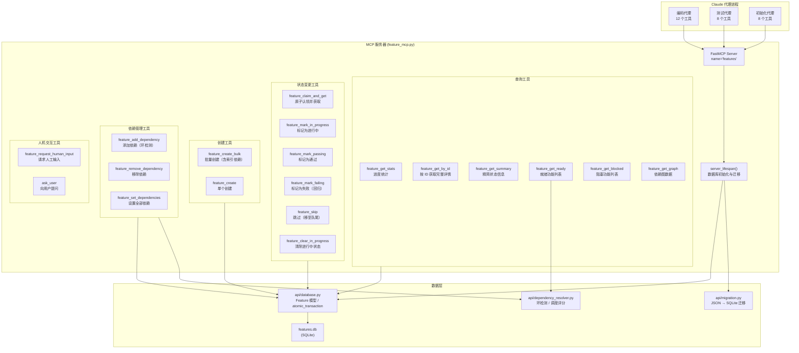
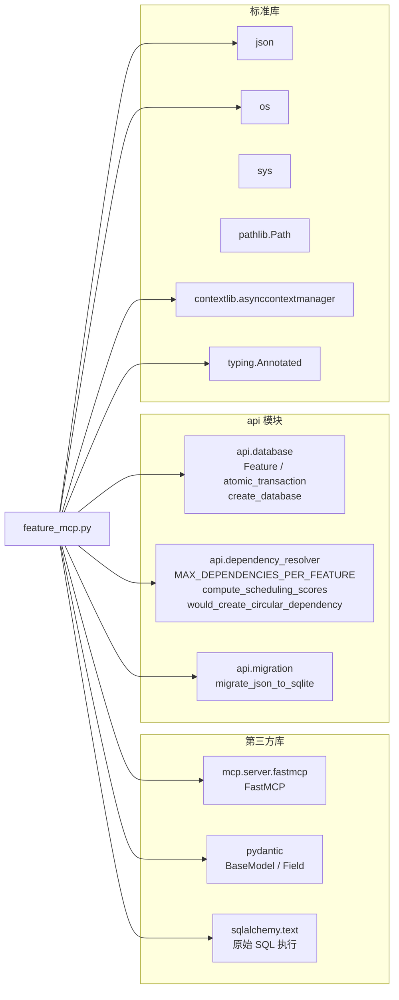

# MCP 服务器

## 目录：`mcp_server/`

## 功能概述

`mcp_server/` 目录包含 AutoForge 的 MCP（Model Context Protocol）功能管理服务器。该服务器基于 FastMCP 框架构建，为 Claude 代理提供 19 个功能管理工具，是代理与功能数据库之间的唯一通信桥梁。

MCP 服务器作为子进程启动，每个代理实例独立运行一个 MCP 服务器进程。在并行模式下，多个 MCP 服务器进程同时访问同一个 SQLite 数据库，通过原子 SQL 操作（而非进程内锁）保证数据一致性。

核心设计原则：
- **跨进程并行安全** -- 使用原子 `UPDATE ... WHERE` 语句替代线程锁，因为锁只在单进程内有效
- **原子认领-获取** -- `feature_claim_and_get` 将认领和读取合并为单一操作，避免竞态
- **三阶段批量创建** -- 验证、创建、关联依赖分三阶段在单一事务中完成
- **Pydantic 输入验证** -- 所有工具入参通过 Pydantic 模型和 `Annotated[..., Field()]` 验证

## 文件列表

| 文件 | 行数 | 说明 |
|------|------|------|
| `__init__.py` | - | 包初始化文件 |
| `feature_mcp.py` | ~1142 | FastMCP 服务器，定义 19 个 MCP 工具，Pydantic 输入验证，原子 SQL 操作 |

## 架构图



## 工具详细说明

### 查询工具（6 个）

| 工具 | 参数 | 返回值 | 说明 |
|------|------|--------|------|
| `feature_get_stats` | 无 | `{passing, in_progress, needs_human_input, total, percentage}` | 使用单条聚合 SQL 查询获取进度统计，替代 3 次独立 COUNT 查询 |
| `feature_get_by_id` | `feature_id: int` | 完整功能详情 JSON | 获取单个功能的全部字段，包括描述和步骤 |
| `feature_get_summary` | `feature_id: int` | `{id, name, passes, in_progress, needs_human_input, dependencies}` | 精简版查询，仅返回状态信息，显著减少响应体积 |
| `feature_get_ready` | `limit: int = 10` | `{features, count, total_ready}` | 获取就绪功能（未通过、未进行中、依赖已满足、未等待人工输入），按调度评分排序 |
| `feature_get_blocked` | `limit: int = 20` | `{features, count, total_blocked}` | 获取被阻塞功能列表，每个功能附带 `blocked_by` 字段 |
| `feature_get_graph` | 无 | `{nodes, edges}` | 构建依赖图可视化数据，节点包含状态（pending/in_progress/done/blocked/needs_human_input） |

### 状态变更工具（6 个）

| 工具 | 参数 | 原子性保证 | 说明 |
|------|------|------------|------|
| `feature_claim_and_get` | `feature_id: int` | `UPDATE WHERE passes=0 AND in_progress=0 AND needs_human_input=0` | 原子认领并返回完整详情；幂等设计，已认领时仍返回详情 |
| `feature_mark_in_progress` | `feature_id: int` | `UPDATE WHERE passes=0 AND in_progress=0 AND needs_human_input=0` | 标记为进行中，防止其他代理同时工作 |
| `feature_mark_passing` | `feature_id: int` | `UPDATE WHERE passes=0` | 标记为通过并清除 in_progress；带状态守卫防止并行模式下的重复标记 |
| `feature_mark_failing` | `feature_id: int` | 先检查存在性再原子更新 | 标记为失败（回归检测），设置 passes=0, in_progress=0 |
| `feature_skip` | `feature_id: int` | 子查询 `SELECT MAX(priority)+1` | 将功能移至队列末尾，原子计算新优先级防止两个功能获得相同优先级 |
| `feature_clear_in_progress` | `feature_id: int` | 幂等更新 | 清除进行中状态，用于放弃功能或解除卡住状态 |

### 创建工具（2 个）

| 工具 | 参数 | 说明 |
|------|------|------|
| `feature_create_bulk` | `features: list[dict]` | 三阶段批量创建（详见下文） |
| `feature_create` | `category, name, description, steps` | 在 `atomic_transaction` 内原子获取下一个优先级值并创建功能 |

### 依赖管理工具（3 个）

| 工具 | 参数 | 安全检查 | 说明 |
|------|------|----------|------|
| `feature_add_dependency` | `feature_id, dependency_id` | 自引用、存在性、上限、环形依赖 | 在 IMMEDIATE 事务内进行环形检测，写锁保护快照一致性 |
| `feature_remove_dependency` | `feature_id, dependency_id` | 存在性 | 原子读-修改-写操作 |
| `feature_set_dependencies` | `feature_id, dependency_ids: list[int]` | 自引用、存在性、重复、上限、环形依赖 | 一次性替换所有依赖，在事务内构造测试图进行环形检测 |

### 人机交互工具（2 个）

| 工具 | 参数 | 说明 |
|------|------|------|
| `feature_request_human_input` | `feature_id, prompt, fields: list[dict]` | 请求人工结构化输入；字段类型支持 text/textarea/select/boolean；严格验证字段格式 |
| `ask_user` | `questions: list[dict]` | 向用户提问并提供可选选项（2-4 个），用户的选择作为下一条消息返回 |

## 代理类型与工具权限

不同类型的代理只能看到和使用其角色对应的工具子集：

| 工具 | 编码代理 | 测试代理 | 初始化代理 |
|------|:--------:|:--------:|:----------:|
| `feature_get_stats` | Y | Y | Y |
| `feature_get_by_id` | Y | Y | - |
| `feature_get_summary` | Y | Y | - |
| `feature_get_ready` | Y | Y | Y |
| `feature_get_blocked` | Y | Y | Y |
| `feature_get_graph` | Y | Y | Y |
| `feature_claim_and_get` | Y | - | - |
| `feature_mark_in_progress` | Y | - | - |
| `feature_mark_passing` | Y | Y | - |
| `feature_mark_failing` | Y | Y | - |
| `feature_skip` | Y | - | - |
| `feature_clear_in_progress` | Y | - | - |
| `feature_create_bulk` | - | - | Y |
| `feature_create` | - | - | Y |
| `feature_add_dependency` | - | - | Y |
| `feature_set_dependencies` | - | - | Y |
| `feature_remove_dependency` | - | - | - |
| `feature_request_human_input` | * | - | - |
| `ask_user` | * | * | * |

注意：
- `feature_remove_dependency` 仅供 UI/编排器使用，不暴露给任何代理类型。
- 标注 `*` 的工具（`feature_request_human_input`、`ask_user`）在 MCP 服务器中已定义，在安全权限层（`ALL_FEATURE_MCP_TOOLS`）中被允许调用，但未包含在任何代理类型的 `allowed_tools` 列表中，因此 LLM 默认不会在工具列表中看到它们。

## Pydantic 输入验证模型

| 模型 | 用途 | 关键约束 |
|------|------|----------|
| `MarkPassingInput` | 标记通过 | `feature_id: int, ge=1` |
| `SkipFeatureInput` | 跳过功能 | `feature_id: int, ge=1` |
| `MarkInProgressInput` | 标记进行中 | `feature_id: int, ge=1` |
| `ClearInProgressInput` | 清除进行中 | `feature_id: int, ge=1` |
| `RegressionInput` | 回归测试 | `limit: int, ge=1, le=10, default=3` |
| `FeatureCreateItem` | 创建功能项 | `category: min_length=1, max_length=100`; `name: max_length=255`; `steps: min_length=1` |
| `BulkCreateInput` | 批量创建 | `features: list, min_length=1` |

工具参数同时使用 `Annotated[type, Field(...)]` 注解进行运行时验证，确保参数类型和范围正确。

## 依赖关系



## 关键模式

### 1. 跨进程并行协调

在并行模式下，多个代理进程各自启动独立的 MCP 服务器实例，同时访问同一个 `features.db` 文件。早期版本使用 `threading.Lock()` 进行同步，但该锁仅在单进程内有效，在跨进程场景下无用。

当前方案使用原子 SQL 操作替代锁：

```python
# 原子认领：利用 WHERE 条件确保只有一个进程能成功
result = session.execute(text("""
    UPDATE features
    SET in_progress = 1
    WHERE id = :id AND passes = 0 AND in_progress = 0 AND needs_human_input = 0
"""), {"id": feature_id})

# rowcount == 0 表示认领失败（已被其他进程认领）
if result.rowcount == 0:
    # 查询具体失败原因（已通过/已认领/等待人工输入）
    ...
```

配合 `BEGIN IMMEDIATE` 事务（在 `database.py` 中通过引擎事件钩子配置），SQLite 在事务开始时立即获取写锁，避免了先读后写模式中的过时读取问题。

### 2. 原子认领-获取（Atomic Claim-and-Get）

`feature_claim_and_get` 将两个操作合并为一个工具调用：

1. **认领**（`UPDATE ... WHERE in_progress=0`） -- 原子标记为进行中
2. **获取**（`SELECT`） -- 返回完整功能详情

这消除了分步调用 `feature_mark_in_progress` + `feature_get_by_id` 之间的竞态窗口。同时该工具设计为幂等：如果功能已被当前代理认领，仍会返回详情。

### 3. 三阶段批量创建（Three-Phase Bulk Creation）

`feature_create_bulk` 在单一 `atomic_transaction` 内分三阶段执行：

**阶段一：验证**
- 检查所有功能的必填字段（category, name, description, steps）
- 验证 `depends_on_indices` 的有效性：
  - 索引必须为非负整数
  - 不允许前向引用（只能依赖当前索引之前的功能）
  - 不允许重复
  - 不超过 `MAX_DEPENDENCIES_PER_FEATURE`（20）上限

**阶段二：创建**
- 为所有功能分配连续优先级（从 `MAX(priority) + 1` 开始）
- 创建 Feature 对象并添加到会话
- 调用 `session.flush()` 获取数据库分配的 ID

**阶段三：依赖关联**
- 将基于索引的依赖（`depends_on_indices: [0, 2]`）转换为实际的功能 ID
- 这是因为创建时 ID 尚未分配，所以使用批次内的数组索引表示依赖关系

```python
# 索引依赖示例：功能 3 依赖于批次中索引 0 和 1 的功能
features[2]["depends_on_indices"] = [0, 1]
# 阶段三转换为：
created_features[2].dependencies = [created_features[0].id, created_features[1].id]
```

### 4. 服务器生命周期管理

MCP 服务器使用 `asynccontextmanager` 管理生命周期：

```python
@asynccontextmanager
async def server_lifespan(server: FastMCP):
    # 启动：初始化数据库，运行 JSON 迁移
    _engine, _session_maker = create_database(PROJECT_DIR)
    migrate_json_to_sqlite(PROJECT_DIR, _session_maker)
    yield
    # 关闭：释放数据库连接
    if _engine:
        _engine.dispose()
```

`PROJECT_DIR` 通过环境变量 `PROJECT_DIR` 传入，由 `client.py` 在启动 MCP 服务器子进程时设置。

### 5. 调度评分排序

`feature_get_ready` 不是简单地按优先级排序就绪功能，而是调用 `compute_scheduling_scores()` 计算综合评分：

```python
scores = compute_scheduling_scores(all_dicts)
ready.sort(key=lambda f: (-scores.get(f["id"], 0), f["priority"], f["id"]))
```

评分公式为 `(1000 * 解锁量) + (100 * 深度分) + (10 * 优先级因子)`，确保能解锁最多下游工作的功能被优先安排。

### 6. 人工输入请求的状态机

`feature_request_human_input` 实现了一个严格的状态转换：

```
in_progress = 1, passes = 0
       ↓ (代理调用 feature_request_human_input)
needs_human_input = 1, in_progress = 0
       ↓ (人工通过 UI 提交响应)
needs_human_input = 0, in_progress = 0  (回到待处理队列)
       ↓ (代理重新认领，获取 human_input_response)
in_progress = 1, passes = 0
```

原子 `UPDATE` 语句确保只有 `in_progress = 1 AND passes = 0` 的功能才能被转入人工输入等待状态，防止对已完成或未开始的功能发起无效请求。

字段验证非常严格：
- 每个字段必须有 `id` 和 `label`
- 字段类型限定为 `text`、`textarea`、`select`、`boolean`
- `select` 类型必须提供 `options` 数组，每个选项必须有 `value` 和 `label`
- 非 `select` 类型不允许携带 `options`
- 字段 `id` 不允许重复
