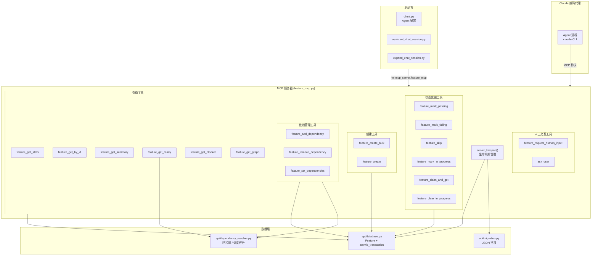

# `feature_mcp.py` -- MCP 功能管理工具服务器

> 源文件路径: `mcp_server/feature_mcp.py`

## 功能概述

`feature_mcp.py` 是 AutoForge 系统中 Agent 与功能数据库之间的唯一交互接口，基于 FastMCP 框架实现了 19 个 MCP 工具（Tools），覆盖功能的完整生命周期管理：查询统计、状态变更、创建管理、依赖操作和人工输入请求。

该文件是 Agent 会话中最核心的外部工具提供者。当 Claude 编码代理需要查看下一个待实现功能、标记功能完成或添加依赖关系时，都通过调用这些 MCP 工具完成。每个工具都是独立的 JSON-in/JSON-out 函数，使用 Pydantic 进行输入验证，使用 SQLAlchemy 原始 SQL（`text()`）执行原子更新，确保在并行模式下（多个 MCP 服务器进程同时运行）的数据一致性。

服务器通过 `server_lifespan` 异步上下文管理器管理生命周期：启动时初始化数据库引擎和会话工厂，并执行 JSON 到 SQLite 的自动迁移；关闭时释放数据库引擎资源。每个 Agent 进程运行独立的 MCP 服务器实例，通过 SQLite 的 IMMEDIATE 事务模式协调并发访问。

## 依赖关系

### 导入依赖

| 模块 | 说明 |
|------|------|
| `mcp.server.fastmcp.FastMCP` | MCP 服务器框架 |
| `pydantic.BaseModel` / `Field` | 输入数据验证 |
| `sqlalchemy.text` | 原始 SQL 执行（原子更新操作） |
| `api.database.Feature` | Feature ORM 模型 |
| `api.database.atomic_transaction` | 原子事务上下文管理器 |
| `api.database.create_database` | 数据库引擎与会话工厂创建 |
| `api.dependency_resolver.MAX_DEPENDENCIES_PER_FEATURE` | 依赖数量上限常量 |
| `api.dependency_resolver.compute_scheduling_scores` | 调度评分算法 |
| `api.dependency_resolver.would_create_circular_dependency` | 环形依赖检测 |
| `api.migration.migrate_json_to_sqlite` | JSON 到 SQLite 自动迁移 |

### 被依赖

| 模块 | 引用内容 |
|------|----------|
| `client.py` | 配置 Agent 进程启动参数 `["-m", "mcp_server.feature_mcp"]` |
| `server/services/assistant_chat_session.py` | 配置助手会话的 MCP 服务器参数 |
| `server/services/expand_chat_session.py` | 配置项目扩展会话的 MCP 服务器参数 |

## 关键类/函数

### 生命周期管理

#### `server_lifespan(server: FastMCP)` (async context manager)

MCP 服务器的生命周期管理器。

- **启动**: 创建项目目录、初始化数据库（`create_database`）、执行 JSON 迁移（`migrate_json_to_sqlite`）
- **关闭**: 释放数据库引擎（`_engine.dispose()`）

#### `get_session() -> Session`

获取新的数据库会话，如数据库未初始化则抛出 `RuntimeError`。

### 查询工具

#### `feature_get_stats() -> str`

获取功能完成进度统计（通过、进行中、需人工输入、总数、百分比）。使用单条聚合 SQL（`func.count` + `func.sum(case(...))`）替代多次查询。

#### `feature_get_by_id(feature_id: int) -> str`

按 ID 获取功能完整详情（名称、描述、步骤、状态、依赖等）。

#### `feature_get_summary(feature_id: int) -> str`

获取功能摘要信息（仅 id、name、passes、in_progress、needs_human_input、dependencies），响应体积远小于 `feature_get_by_id`。

#### `feature_get_ready(limit: int = 10) -> str`

获取可立即开始的功能列表。就绪条件：未通过、未进行中、不需要人工输入、所有依赖已满足。按调度分数排序（`compute_scheduling_scores`）。

#### `feature_get_blocked(limit: int = 20) -> str`

获取被依赖阻塞的功能列表，每个功能附加 `blocked_by` 字段。

#### `feature_get_graph() -> str`

获取依赖图数据（nodes + edges），节点包含计算后的 status（done/needs_human_input/blocked/in_progress/pending）。

### 状态变更工具

#### `feature_mark_passing(feature_id: int) -> str`

标记功能为通过。使用原子 `UPDATE ... WHERE passes = 0` 防止并行模式下的重复标记。同时清除 `in_progress` 标志。

#### `feature_mark_failing(feature_id: int) -> str`

标记功能为失败（回归检测）。将 `passes` 设为 0，清除 `in_progress`。

#### `feature_skip(feature_id: int) -> str`

跳过功能，将其优先级设为当前最大值 +1（移到队列末尾）。使用原子子查询 `SET priority = (SELECT MAX(priority) + 1 FROM features)` 防止竞争条件。

#### `feature_mark_in_progress(feature_id: int) -> str`

标记功能为进行中。原子声明：`UPDATE ... WHERE passes=0 AND in_progress=0 AND needs_human_input=0`，确保不会重复声明。

#### `feature_claim_and_get(feature_id: int) -> str`

原子声明并获取功能详情。合并 `mark_in_progress` + `get_by_id`，具有幂等性（已声明时仍返回详情）。返回额外 `already_claimed` 字段。

#### `feature_clear_in_progress(feature_id: int) -> str`

清除进行中状态，功能回到待处理队列。幂等操作。

### 创建工具

#### `feature_create_bulk(features: list[dict]) -> str`

批量创建功能。

- **三遍处理**:
  1. 验证所有功能的必填字段和 `depends_on_indices` 合法性
  2. 创建 Feature 记录并获取自增 ID
  3. 将索引引用（`depends_on_indices`）转换为实际 ID
- **原子性**: 整个操作在 `atomic_transaction` 中完成
- **约束**: `depends_on_indices` 只允许引用之前的功能（禁止前向引用）

#### `feature_create(category, name, description, steps) -> str`

创建单个功能。使用原子事务获取下一个 priority 值，防止并行创建时的优先级冲突。

### 依赖管理工具

#### `feature_add_dependency(feature_id: int, dependency_id: int) -> str`

添加依赖关系。在 IMMEDIATE 事务内执行：自引用检查、存在性检查、数量上限检查、重复检查、环形依赖检查（`would_create_circular_dependency`）。

#### `feature_remove_dependency(feature_id: int, dependency_id: int) -> str`

移除依赖关系。原子读-改-写操作。

#### `feature_set_dependencies(feature_id: int, dependency_ids: list[int]) -> str`

一次性设置功能的所有依赖（替换已有依赖）。验证自引用、数量上限、重复、存在性和环形依赖。

### 人工交互工具

#### `feature_request_human_input(feature_id: int, prompt: str, fields: list[dict]) -> str`

请求人工结构化输入。

- **字段类型**: text、textarea、select（需 options）、boolean
- **状态变更**: 设置 `needs_human_input=1`、清除 `in_progress`、存储请求、清除旧响应
- **前置条件**: 功能必须处于 in_progress 状态

#### `ask_user(questions: list[dict]) -> str`

向用户提出结构化选择题。每个问题包含 header、question、2-4 个选项。返回确认消息，用户响应将作为下一条消息到达。

### Pydantic 输入模型

| 模型 | 用途 |
|------|------|
| `MarkPassingInput` | 标记通过的输入 |
| `SkipFeatureInput` | 跳过功能的输入 |
| `MarkInProgressInput` | 标记进行中的输入 |
| `ClearInProgressInput` | 清除进行中的输入 |
| `RegressionInput` | 回归查询的输入（limit 参数） |
| `FeatureCreateItem` | 单个功能创建的数据结构 |
| `BulkCreateInput` | 批量创建的输入包装 |

## 架构图

## 注意事项

1. **并行安全**: 所有状态变更工具使用原始 SQL `text()` + `WHERE` 条件守卫实现原子更新，而非 ORM 的读-改-写模式。这是因为在并行模式下多个 MCP 服务器进程共享同一 SQLite 数据库，ORM 层面的锁（如 `threading.Lock`）无法跨进程生效。

2. **幂等性设计**: `feature_claim_and_get` 在功能已被声明时仍返回功能详情（而非报错），`feature_clear_in_progress` 无论当前状态如何都将 `in_progress` 设为 0。这种幂等性设计简化了代理的错误恢复逻辑。

3. **环形依赖检测时机**: `feature_add_dependency` 和 `feature_set_dependencies` 在 IMMEDIATE 事务内执行环形检测。写锁保证了检测期间依赖图的快照不会被其他进程修改，从而避免 TOCTOU（Time-of-check to time-of-use）漏洞。

4. **批量创建的索引引用**: `feature_create_bulk` 使用 `depends_on_indices`（数组索引）而非功能 ID 来表达批内依赖，因为 ID 在创建前是未知的。索引只能引用之前的功能（禁止前向引用），这隐式保证了无环性。

5. **PROJECT_DIR 环境变量**: MCP 服务器通过 `PROJECT_DIR` 环境变量获取项目路径，由 `client.py` 在启动子进程时设置。如果未设置则默认为当前目录（`.`）。

6. **错误返回格式**: 所有工具统一使用 `json.dumps({"error": "..."})` 返回错误信息，而非抛出异常。这是 MCP 工具的设计约定——Agent 需要能够解析错误并决定下一步操作，而非因异常中断会话。

7. **`ask_user` 特殊性**: 该工具与其他工具不同，它不操作数据库，而是返回一个确认消息。用户的实际响应通过 Agent 会话的消息流传递，不经过 MCP 协议。

8. **调度评分排序**: `feature_get_ready` 使用 `compute_scheduling_scores` 对就绪功能排序，优先返回能解锁更多下游功能的"关键路径"节点，而非简单按 priority 排序。这显著提升了并行模式下的整体吞吐量。
