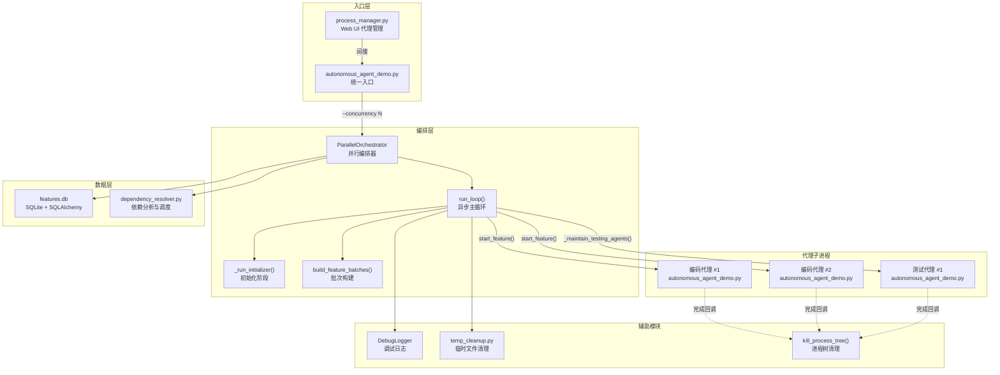

# `parallel_orchestrator.py` -- 并行代理编排器

> 源文件路径: `parallel_orchestrator.py`

## 功能概述

`parallel_orchestrator.py` 是 AutoForge 系统的核心编排引擎，负责管理所有代理的完整生命周期。它统一处理三个阶段：初始化（从 app_spec 创建功能）、编码代理并行实现功能、以及测试代理独立运行回归测试。

该编排器实现了 **依赖感知调度** 算法，确保功能仅在其所有依赖均已通过后才启动。它支持批量功能分配（每个编码代理可一次处理多个功能）、加权测试批次选择（优先测试高影响力功能），以及优雅暂停（Drain 模式）等高级特性。

进程管理方面，编排器通过子进程方式启动代理（每个代理是一个独立的 `autonomous_agent_demo.py` 进程），使用线程安全的状态管理和事件驱动的完成通知机制，保证主循环在代理完成时能立即响应而非固定间隔轮询。

## 依赖关系

### 导入依赖

| 模块 | 说明 |
|------|------|
| `asyncio` | 异步事件循环、等待和超时 |
| `atexit` | 注册退出清理处理器 |
| `logging` | 日志记录 |
| `os` | 环境变量、进程 ID |
| `re` | 正则匹配代理输出中的功能声明 |
| `signal` | SIGTERM 信号处理 |
| `subprocess` | 启动代理子进程 |
| `sys` | Python 解释器路径、平台检测 |
| `threading` | 线程安全锁、事件、输出读取线程 |
| `datetime` / `timezone` | 会话时间跟踪 |
| `pathlib.Path` | 路径操作 |
| `sqlalchemy.text` | WAL 检查点 SQL |
| `api.database` | `Feature` ORM 模型、`create_database` 数据库工厂 |
| `api.dependency_resolver` | `are_dependencies_satisfied`、`compute_scheduling_scores` 调度算法 |
| `progress` | `has_features` 检测是否需要初始化 |
| `server.utils.process_utils` | `kill_process_tree` 进程树清理 |
| `autoforge_paths` | `get_pause_drain_path` 暂停信号路径（延迟导入） |
| `registry` | `DEFAULT_MODEL`、`get_project_path` 项目注册（仅在 `main()` 中） |
| `temp_cleanup` | `cleanup_stale_temp`、`cleanup_project_screenshots` 临时文件清理（延迟导入） |

### 被依赖

| 模块 | 引用内容 |
|------|----------|
| `autonomous_agent_demo.py` | `from parallel_orchestrator import run_parallel_orchestrator` -- 入口点模式的编排调用 |
| `server/services/process_manager.py` | 通过 `autonomous_agent_demo.py` 间接使用（Web UI 启动代理时） |

## 关键类/函数

### `class DebugLogger`

线程安全的调试日志记录器，写入 `orchestrator_debug.log` 文件。

- `start_session()` -- 清除旧日志并标记新会话开始
- `log(category, message, **kwargs)` -- 写入带时间戳的日志条目
- `section(title)` -- 写入分隔线标题

### `class ParallelOrchestrator`

并行代理编排器的核心类。

#### 构造函数

```python
__init__(self, project_dir, max_concurrency=3, model=None, yolo_mode=False,
         testing_agent_ratio=1, testing_batch_size=3, batch_size=3,
         on_output=None, on_status=None)
```

- `max_concurrency: int` -- 最大并发编码代理数（1-5，受 `MAX_PARALLEL_AGENTS` 限制）
- `testing_agent_ratio: int` -- 维持的回归测试代理数量（0-3）
- `testing_batch_size: int` -- 每个测试批次的功能数（1-15）
- `batch_size: int` -- 每个编码代理的功能批次大小（1-15）
- `on_output/on_status` -- 输出和状态变更回调

#### 核心方法

### `get_ready_features(feature_dicts, scheduling_scores) -> list[dict]`

- **说明**: 获取依赖已满足且可立即执行的功能列表，按调度分数排序
- **排除条件**: 已通过、进行中、已在运行、超过最大重试次数、依赖未满足、需要人工输入

### `get_resumable_features(feature_dicts, scheduling_scores) -> list[dict]`

- **说明**: 获取上次会话中断的进行中功能（`in_progress=True, passes=False`），可恢复执行

### `build_feature_batches(ready, all_features, scheduling_scores) -> list[list[dict]]`

- **说明**: 构建依赖感知的功能批次，算法分两阶段：
  1. **链式扩展**: 从就绪功能出发，查找其依赖者（若假设前序功能通过则依赖满足）
  2. **同类别填充**: 用同一类别的就绪功能填满剩余槽位

### `start_feature(feature_id, resume=False) -> tuple[bool, str]`

- **说明**: 启动单个编码代理子进程，执行容量检查和数据库状态更新

### `start_feature_batch(feature_ids, resume=False) -> tuple[bool, str]`

- **说明**: 启动批量编码代理子进程，单事务标记所有功能为进行中

### `_spawn_coding_agent(feature_id) -> tuple[bool, str]`

- **说明**: 创建编码代理子进程，配置 `PLAYWRIGHT_CLI_SESSION` 环境变量隔离浏览器会话

### `_spawn_testing_agent() -> tuple[bool, str]`

- **说明**: 创建测试代理子进程，使用 `_get_test_batch()` 选择加权测试批次

### `_get_test_batch(batch_size) -> list[int]`

- **说明**: 加权选择测试批次，优先级：未最近测试 > 被依赖数多 > 依赖数多

### `_maintain_testing_agents(feature_dicts) -> None`

- **说明**: 每次主循环迭代时独立维护测试代理数量至目标比例

### `run_loop() -> None`

- **说明**: 异步主循环，包含初始化阶段、功能恢复、就绪功能调度、Drain 模式处理

### `_on_agent_complete(feature_id, return_code, agent_type, proc) -> None`

- **说明**: 代理完成回调，清理状态、更新数据库、触发事件通知主循环

### `cleanup() -> None`

- **说明**: 强制 WAL 检查点并释放数据库连接，防止重启时缓存陈旧

### `run_parallel_orchestrator(...) -> None`（模块级函数）

- **说明**: 顶层异步函数，创建编排器实例、注册 atexit 清理和 SIGTERM 信号处理器，运行主循环

## 进程限制常量

| 常量 | 值 | 说明 |
|------|-----|------|
| `MAX_PARALLEL_AGENTS` | `5` | 最大并发编码代理数 |
| `MAX_TOTAL_AGENTS` | `10` | 编码+测试代理的硬上限 |
| `DEFAULT_CONCURRENCY` | `3` | 默认并发编码代理数 |
| `DEFAULT_TESTING_BATCH_SIZE` | `3` | 默认测试批次功能数 |
| `POLL_INTERVAL` | `5` | 主循环轮询间隔（秒） |
| `MAX_FEATURE_RETRIES` | `3` | 单功能最大重试次数 |
| `INITIALIZER_TIMEOUT` | `1800` | 初始化器超时时间（30 分钟） |

## 架构图



## 注意事项

1. **线程安全**: 所有对 `running_coding_agents` 和 `running_testing_agents` 的访问都通过 `self._lock` 保护。事件信号通过 `call_soon_threadsafe` 跨线程安全触发。
2. **进程树清理**: 代理子进程完成时必须调用 `kill_process_tree()` 清理子进程（如 Claude CLI），否则会累积僵尸进程。
3. **数据库连接刷新**: 初始化阶段完成后必须 `dispose()` 旧引擎并重新创建连接，否则 SQLAlchemy 可能看不到子进程提交的数据。
4. **WAL 检查点**: `cleanup()` 在释放连接前执行 `PRAGMA wal_checkpoint(FULL)`，确保所有挂起写入刷新到主数据库文件。
5. **Drain 模式**: 通过文件系统信号（`get_pause_drain_path()`）实现优雅暂停，等待所有运行中代理完成后进入暂停状态，移除信号文件后恢复。
6. **测试代理并发**: 多个测试代理可以同时测试同一功能，这是设计决策 -- 简化架构避免不必要的协调机制。
7. **SIGINT 不注册**: 故意不注册 `SIGINT` 处理器，让 Python 自然抛出 `KeyboardInterrupt` 以便 `except` 块正常工作。
8. **Windows 兼容**: 子进程使用 `CREATE_NO_WINDOW` 标志避免弹出控制台窗口，使用 UTF-8 编码避免 CP1252 编码问题。
