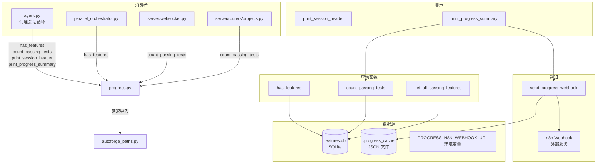

# `progress.py` -- 进度追踪与 Webhook 通知

> 源文件路径: `progress.py`

## 功能概述

`progress.py` 提供了自主编码代理的**进度追踪和报告功能**，通过直接访问 SQLite 数据库查询特性（feature）的完成状态，并支持通过 Webhook 向外部系统（如 n8n）发送进度通知。

模块的核心职责包括三个方面：

1. **数据库查询**: 直接通过 SQLite 连接查询 `features.db`，获取特性的通过/进行中/总数等统计信息。这种方式（而非通过 API）确保了即使 API 服务器未启动时也能正常工作。

2. **Webhook 通知**: 当通过测试的特性数量增加时，自动向配置的 Webhook URL 发送 JSON 通知。使用本地缓存文件（`.progress_cache`）追踪上次通知的状态，避免重复通知。

3. **会话显示**: 提供格式化的会话头部和进度摘要打印功能，用于 CLI 输出。

## 依赖关系

### 导入依赖

| 模块 | 说明 |
|------|------|
| `json` | JSON 序列化/反序列化（缓存文件、Webhook 载荷） |
| `os` | 环境变量读取（`PROGRESS_N8N_WEBHOOK_URL`） |
| `sqlite3` | SQLite 数据库直接访问 |
| `urllib.request` | HTTP 请求（Webhook 通知） |
| `contextlib.closing` | 连接自动关闭 |
| `datetime` | 时间戳生成 |
| `pathlib.Path` | 路径操作 |
| `autoforge_paths` | `get_features_db_path`, `get_progress_cache_path` -- 延迟导入 |

### 被依赖

| 模块 | 引用内容 |
|------|----------|
| `agent.py` | `has_features`, `count_passing_tests`, `print_session_header`, `print_progress_summary` |
| `parallel_orchestrator.py` | `has_features` |
| `server/websocket.py` | `count_passing_tests` |
| `server/routers/projects.py` | `count_passing_tests` |

## 关键类/函数

### 常量

#### `WEBHOOK_URL: str | None`
- **说明**: 从 `PROGRESS_N8N_WEBHOOK_URL` 环境变量读取的 Webhook 地址。未配置时为 `None`，所有 Webhook 通知将被静默跳过。

#### `SQLITE_TIMEOUT: int`
- **值**: 30（秒）
- **说明**: SQLite 连接超时设置，用于并行模式下多代理同时访问数据库时的锁等待。

### 数据库查询

#### `has_features(project_dir: Path) -> bool`
- **参数**: `project_dir` -- 项目目录路径
- **返回值**: 项目是否已有特性
- **说明**: 用于判断是否需要运行初始化代理。检查顺序：
  1. 旧版 JSON 文件（`feature_list.json`）
  2. SQLite 数据库（`features.db` 中是否有记录）

#### `count_passing_tests(project_dir: Path) -> tuple[int, int, int, int]`
- **参数**: `project_dir` -- 项目目录路径
- **返回值**: `(passing, in_progress, total, needs_human_input)` 四元组
- **说明**: 使用单次聚合查询获取所有统计信息。具有三级回退机制，兼容不同版本的数据库 schema（含/不含 `needs_human_input` 列、含/不含 `in_progress` 列）。

#### `get_all_passing_features(project_dir: Path) -> list[dict]`
- **参数**: `project_dir` -- 项目目录路径
- **返回值**: 通过特性的列表，每项含 `id`、`category`、`name`
- **说明**: 用于 Webhook 通知中报告具体的已通过特性。

### Webhook 通知

#### `send_progress_webhook(passing: int, total: int, project_dir: Path) -> None`
- **参数**: `passing` -- 当前通过数; `total` -- 总数; `project_dir` -- 项目目录
- **说明**: 核心 Webhook 通知逻辑：
  1. 读取缓存文件获取上次通知时的状态
  2. 仅在通过数增加时发送通知
  3. 检测新增的具体特性（通过比对 ID 集合）
  4. 兼容旧版缓存格式（仅有计数、无 ID 列表）
  5. 向 n8n 发送 JSON 数组格式的载荷
  6. 更新缓存文件

**Webhook 载荷结构：**
```json
{
    "event": "test_progress",
    "passing": 5,
    "total": 10,
    "percentage": 50.0,
    "previous_passing": 3,
    "tests_completed_this_session": 2,
    "completed_tests": ["Auth Login", "Data Table CRUD"],
    "project": "my-app",
    "timestamp": "2026-03-24T12:00:00Z"
}
```

### 显示函数

#### `print_session_header(session_num: int, is_initializer: bool) -> None`
- **说明**: 打印格式化的会话头部，区分 "INITIALIZER" 和 "CODING AGENT"。

#### `print_progress_summary(project_dir: Path) -> None`
- **说明**: 打印当前进度摘要并触发 Webhook 通知。

## 架构图



## 注意事项

1. **直接 SQLite 访问**: 该模块绕过 SQLAlchemy ORM，直接使用 `sqlite3` 模块访问数据库。这是有意为之 -- 确保在 API 服务器未启动时也能查询进度。
2. **Schema 兼容性**: `count_passing_tests` 使用三级 try/except 回退，兼容不同版本的数据库结构（有/无 `needs_human_input` 列、有/无 `in_progress` 列）。
3. **并行模式安全**: SQLite 连接设置了 30 秒超时，适配多代理并发访问场景。
4. **Webhook 幂等性**: 通过缓存文件追踪已通知的特性 ID 集合，即使代理重启也不会重复通知已完成的特性。
5. **缓存格式迁移**: 能够检测旧版缓存格式（仅有 `count`，无 `passing_ids`），此时不报告具体新增特性，避免误报。
6. **延迟导入**: 对 `autoforge_paths` 使用函数内导入，避免模块加载时的循环依赖。
