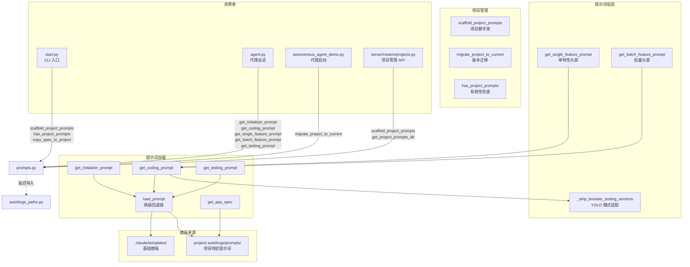

# `prompts.py` -- 提示词模板加载与项目版本迁移

> 源文件路径: `prompts.py`

## 功能概述

`prompts.py` 是 AutoForge 的**提示词管理中枢**，负责加载、组装和分发各类代理所需的提示词模板。它实现了**两级回退链**：优先加载项目特定的提示词，若不存在则回退到基础模板。

模块的核心功能包括三个层面：

1. **提示词加载与回退**: 支持初始化提示词（`initializer_prompt`）、编码提示词（`coding_prompt`）、测试提示词（`testing_prompt`）和应用规格（`app_spec`）的加载，每种都有项目级和模板级两层回退。

2. **提示词组装**: 针对不同的代理运行模式（单特性、批量特性、YOLO 模式、测试模式），在基础提示词上叠加相应的头部指令和模式适配修改。

3. **项目版本迁移**: 维护项目内部的迁移版本号（`.migration_version`），支持将旧版项目的提示词从 MCP-based Playwright 迁移到 Playwright CLI 格式。

## 依赖关系

### 导入依赖

| 模块 | 说明 |
|------|------|
| `re` | 正则表达式（提示词内容替换） |
| `shutil` | 文件复制（模板脚手架） |
| `pathlib.Path` | 路径操作 |
| `autoforge_paths` | `get_prompts_dir`, `ensure_autoforge_dir`, `get_autoforge_dir` -- 延迟导入 |

### 被依赖

| 模块 | 引用内容 |
|------|----------|
| `start.py` | `scaffold_project_prompts`, `has_project_prompts`, `copy_spec_to_project`, `get_project_prompts_dir`, `get_app_spec` |
| `agent.py` | `get_initializer_prompt`, `get_coding_prompt`, `get_single_feature_prompt`, `get_batch_feature_prompt`, `get_testing_prompt`, `get_app_spec` |
| `autonomous_agent_demo.py` | `migrate_project_to_current` |
| `server/routers/projects.py` | `get_project_prompts_dir`, `scaffold_project_prompts` |

## 关键类/函数

### 常量

#### `TEMPLATES_DIR: Path`
- **值**: `{项目根目录}/.claude/templates/`
- **说明**: 基础模板目录路径。

#### `CURRENT_MIGRATION_VERSION: int`
- **值**: `1`
- **说明**: 当前迁移版本号。新项目创建时直接设为此值。

### 提示词加载

#### `load_prompt(name: str, project_dir: Path | None) -> str`
- **参数**: `name` -- 提示词名称（不含扩展名）; `project_dir` -- 项目目录（可选）
- **返回值**: 提示词内容字符串
- **异常**: `FileNotFoundError` -- 所有位置均未找到
- **说明**: 回退链：
  1. `{project_dir}/.autoforge/prompts/{name}.md`（项目特定）
  2. `.claude/templates/{name}.template.md`（基础模板）

#### `get_initializer_prompt(project_dir: Path | None) -> str`
- **说明**: 加载初始化代理提示词。

#### `get_coding_prompt(project_dir: Path | None, yolo_mode: bool) -> str`
- **说明**: 加载编码代理提示词。YOLO 模式下会剥离浏览器测试相关章节。

#### `get_testing_prompt(project_dir, testing_feature_id, testing_feature_ids) -> str`
- **说明**: 加载测试代理提示词。支持三种模式：
  - 批量模式：替换 `{{TESTING_FEATURE_IDS}}` 为逗号分隔的 ID 列表
  - 单特性模式：替换为单个 ID
  - 无分配模式：替换为 `(none assigned)`

#### `get_app_spec(project_dir: Path) -> str`
- **说明**: 加载应用规格文件，检查 `prompts/app_spec.txt` 和 `app_spec.txt`（旧版位置）。

### 提示词组装

#### `get_single_feature_prompt(feature_id: int, project_dir, yolo_mode) -> str`
- **说明**: 为并行模式的单代理构建提示词，在基础编码提示词前添加特性分配头部。

#### `get_batch_feature_prompt(feature_ids: list[int], project_dir, yolo_mode) -> str`
- **说明**: 为批量模式构建提示词，在基础编码提示词前添加批量特性分配头部和工作流说明。

### YOLO 模式

#### `_strip_browser_testing_sections(prompt: str) -> str`
- **说明**: 从提示词中剥离浏览器自动化测试相关章节，替换为 YOLO 模式指导：
  - STEP 5 替换为简化的验证步骤（仅 lint/type-check）
  - 浏览器自动化参考章节替换为 YOLO 验证说明
  - 标记规则从 "BROWSER AUTOMATION" 改为 "lint/type-check"
- 若未找到可替换内容，会打印警告。

### 项目脚手架

#### `scaffold_project_prompts(project_dir: Path) -> Path`
- **返回值**: 提示词目录路径
- **说明**: 创建新项目的完整脚手架：
  1. 创建 `.autoforge/` 目录和 `.gitignore`
  2. 复制模板文件（`app_spec.txt`、`coding_prompt.md`、`initializer_prompt.md`、`testing_prompt.md`）
  3. 复制 `allowed_commands.yaml` 示例
  4. 复制 Playwright CLI 技能
  5. 更新项目 `.gitignore`（添加 `.playwright-cli/` 和 `.playwright/`）
  6. 创建 `.playwright/cli.config.json` 浏览器配置
  7. 设置迁移版本号为当前版本

#### `has_project_prompts(project_dir: Path) -> bool`
- **说明**: 检查项目是否已有有效的提示词（`app_spec.txt` 存在且包含 `<project_specification>` 标签）。

#### `copy_spec_to_project(project_dir: Path) -> None`
- **说明**: 将应用规格复制到项目根目录（向后兼容）。

### 版本迁移

#### `migrate_project_to_current(project_dir: Path) -> list[str]`
- **返回值**: 迁移描述列表
- **说明**: 幂等迁移函数，可在每次代理启动时安全调用。当前支持：
  - v0 -> v1: 从 MCP-based Playwright 迁移到 Playwright CLI

#### `_migrate_v0_to_v1(project_dir: Path) -> list[str]`
- **说明**: v0 到 v1 迁移的四个子步骤：
  - A. 复制 `playwright-cli` 技能到项目
  - B. 创建 `.playwright/cli.config.json`
  - C. 更新 `.gitignore`
  - D. 更新 `coding_prompt.md` 和 `testing_prompt.md`

## 架构图

## 注意事项

1. **回退链顺序**: 项目特定提示词优先于基础模板，允许用户完全自定义提示词而不影响全局模板。
2. **YOLO 模式安全**: 即使在 YOLO 模式下，lint 和 type-check 仍然执行 -- 只是跳过了浏览器自动化测试。
3. **迁移幂等性**: `migrate_project_to_current` 通过版本号文件确保每次迁移只执行一次。新项目直接设为当前版本，永远不触发迁移。
4. **延迟导入**: 对 `autoforge_paths` 使用函数内导入，避免模块加载时的循环依赖。
5. **模板占位符**: 测试提示词使用 `{{TESTING_FEATURE_IDS}}` 占位符，在运行时替换为实际的特性 ID。
6. **迁移检测**: `_migrate_coding_prompt_to_cli` 通过检测 "Playwright MCP" 或 "browser_navigate" 等关键字判断是否需要迁移。
7. **脚手架完整性**: `scaffold_project_prompts` 不仅创建提示词文件，还设置了 Playwright CLI 技能、浏览器配置、`.gitignore` 等完整的项目基础设施。
