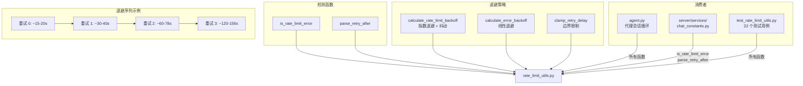

# `rate_limit_utils.py` -- API 速率限制检测与退避策略

> 源文件路径: `rate_limit_utils.py`

## 功能概述

`rate_limit_utils.py` 提供了 API 速率限制（Rate Limit）的**检测、解析和退避计算**功能。当 Claude API 返回 429 错误或其他速率限制相关信息时，该模块负责准确识别这些错误，并计算合理的重试等待时间。

模块的设计特别注意了**误报避免**: 使用带有词边界（`\b`）的正则表达式，防止将 "PR #429" 或 "Node v14.29.0" 等文本误判为速率限制错误。同时提供两种退避策略：用于速率限制的指数退避（含随机抖动）和用于普通错误的线性退避。

## 依赖关系

### 导入依赖

| 模块 | 说明 |
|------|------|
| `random` | 用于退避策略的随机抖动（jitter） |
| `re` | 正则表达式匹配 |
| `typing.Optional` | 类型标注 |

### 被依赖

| 模块 | 引用内容 |
|------|----------|
| `agent.py` | `is_rate_limit_error`, `parse_retry_after`, `calculate_rate_limit_backoff`, `calculate_error_backoff`, `clamp_retry_delay` -- 代理会话循环中的错误处理 |
| `server/services/chat_constants.py` | `is_rate_limit_error`, `parse_retry_after` -- 聊天会话中的速率限制处理 |
| `test_rate_limit_utils.py` | 所有公开函数 -- 单元测试（22 个测试用例） |

## 关键类/函数

### `RATE_LIMIT_REGEX_PATTERNS: list[str]`
- **类型**: 正则表达式字符串列表
- **说明**: 8 种速率限制错误匹配模式，包括：
  - `rate limit` / `rate_limit` / `ratelimit`
  - `too many requests`
  - `http 429` / `status 429` / `error 429`
  - `429 too many`
  - `server/api/system is overloaded`
  - `quota exceeded`

### `is_rate_limit_error(error_message: str) -> bool`
- **参数**: `error_message` -- 错误消息文本
- **返回值**: 是否为速率限制错误
- **说明**: 使用预编译的正则表达式进行高效匹配，大小写不敏感。

### `parse_retry_after(error_message: str) -> Optional[int]`
- **参数**: `error_message` -- 错误消息文本
- **返回值**: 应等待的秒数，若无法解析则返回 `None`
- **说明**: 从错误消息中提取 retry-after 信息，支持以下格式：
  - `Retry-After: 60`
  - `retry after 60 seconds`
  - `try again in 5 seconds`
  - `30 seconds remaining`
- 需要明确的 "seconds" 单位或位于字符串末尾，避免错误匹配 "30 minutes"。

### `calculate_rate_limit_backoff(retries: int) -> int`
- **参数**: `retries` -- 连续重试次数（从 0 开始）
- **返回值**: 延迟秒数（含抖动，范围 1-3600）
- **说明**: 指数退避策略 -- `min(15 * 2^retries, 3600)` + 0-30% 随机抖动。序列大约为：15-20s, 30-40s, 60-78s, 120-156s...。较低的起始延迟允许从瞬态限制中快速恢复，抖动防止多代理同时重试的"惊群效应"。

### `calculate_error_backoff(retries: int) -> int`
- **参数**: `retries` -- 连续重试次数（从 1 开始）
- **返回值**: 延迟秒数（范围 1-300）
- **说明**: 线性退避策略 -- `min(30 * retries, 300)`。序列为：30s, 60s, 90s, 120s... 最大 300s（5 分钟）。

### `clamp_retry_delay(delay_seconds: int) -> int`
- **参数**: `delay_seconds` -- 原始延迟值
- **返回值**: 限制在 1-3600 秒范围内的延迟值
- **说明**: 通用的延迟值边界限制函数。

## 架构图

## 注意事项

1. **词边界防误报**: 所有正则模式使用 `\b` 词边界，避免将 "PR #429"、"HTTP/2 429 in header" 以外的正常文本误判为速率限制。
2. **预编译正则**: `_RATE_LIMIT_REGEX` 在模块加载时编译，避免运行时重复编译开销。
3. **抖动的重要性**: 在并行模式下多个代理可能同时遇到速率限制，随机抖动可有效分散重试请求，避免再次触发限制。
4. **两种退避策略**: 速率限制使用指数退避（更积极的退让），普通错误使用线性退避（更温和的重试）。
5. **`parse_retry_after` 的防御性**: 明确要求 "seconds" 单位或字符串末尾位置，不会误将 "30 minutes" 解析为 30 秒。
