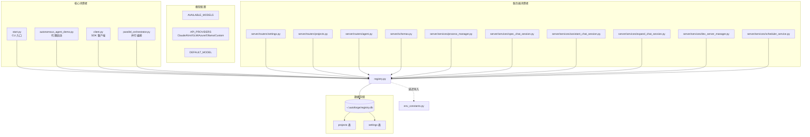

# `registry.py` -- 项目注册表与全局设置管理

> 源文件路径: `registry.py`

## 功能概述

`registry.py` 是 AutoForge 的**项目注册与全局设置管理模块**，负责维护项目名称到路径的映射关系以及全局配置（模型选择、YOLO 模式、API 供应商等）。

该模块使用 SQLite 数据库（`~/.autoforge/registry.db`）作为持久化存储，通过 SQLAlchemy ORM 管理两张表：`projects`（项目注册信息）和 `settings`（全局键值对设置）。数据库引擎采用线程安全的单例模式，支持并发访问和自动重试机制。

此外，模块还定义了**可用模型列表**（`AVAILABLE_MODELS`）、**API 供应商配置**（`API_PROVIDERS`）以及 **SDK 环境变量构建逻辑**（`get_effective_sdk_env`），是连接用户配置与 Claude CLI 子进程的桥梁。

## 依赖关系

### 导入依赖

| 模块 | 说明 |
|------|------|
| `logging` | 日志记录 |
| `os` | 环境变量读取 |
| `re` | 正则表达式（项目名验证） |
| `threading` | 线程安全锁 |
| `time` | 重试等待 |
| `contextlib` | 上下文管理器 |
| `datetime` | 时间戳 |
| `pathlib.Path` | 路径操作 |
| `sqlalchemy` | ORM（Column, DateTime, Integer, String, create_engine, text） |
| `sqlalchemy.orm` | ORM（DeclarativeBase, sessionmaker） |
| `env_constants` | `API_ENV_VARS` -- 延迟导入，用于 `get_effective_sdk_env` |

### 被依赖

| 模块 | 引用内容 |
|------|----------|
| `start.py` | `register_project`, `unregister_project`, `get_project_path`, `list_registered_projects`, `validate_project_path`, `cleanup_stale_projects`, `set_project_concurrency`, `DEFAULT_MODEL`, `get_all_settings` |
| `autonomous_agent_demo.py` | `DEFAULT_MODEL`, `get_effective_sdk_env`, `get_project_path` |
| `client.py` | `get_effective_sdk_env` |
| `parallel_orchestrator.py` | `DEFAULT_MODEL`, `get_project_path` |
| `server/schemas.py` | `DEFAULT_MODEL`, `VALID_MODELS`, `get_all_settings` |
| `server/routers/settings.py` | 多个设置相关函数和常量 |
| `server/routers/projects.py` | 多个项目管理函数 |
| `server/routers/agent.py` | `DEFAULT_MODEL`, `get_all_settings` |
| `server/utils/project_helpers.py` | `get_project_path` |
| `server/services/process_manager.py` | `get_effective_sdk_env`, `list_registered_projects` |
| `server/services/spec_chat_session.py` | `DEFAULT_MODEL`, `get_effective_sdk_env` |
| `server/services/assistant_chat_session.py` | `DEFAULT_MODEL`, `get_effective_sdk_env` |
| `server/services/expand_chat_session.py` | `DEFAULT_MODEL`, `get_effective_sdk_env` |
| `server/services/dev_server_manager.py` | `list_registered_projects` |
| `server/services/scheduler_service.py` | `list_registered_projects` |

## 关键类/函数

### 模型与供应商配置

#### `AVAILABLE_MODELS: list[dict]`
- **说明**: 可用模型列表，每项包含 `id` 和 `name`。当前支持 Claude Opus 和 Claude Sonnet。

#### `LEGACY_MODEL_MAP: dict[str, str]`
- **说明**: 旧版模型 ID 映射表，用于自动迁移（如 `claude-opus-4-5-20251101` -> `claude-opus-4-6`）。

#### `DEFAULT_MODEL: str`
- **说明**: 默认模型 ID。优先读取 `ANTHROPIC_DEFAULT_OPUS_MODEL` 环境变量，否则使用 `"claude-opus-4-6"`。

#### `API_PROVIDERS: dict[str, dict]`
- **说明**: API 供应商定义，支持 Claude、Kimi、GLM、Azure、Ollama、Custom 六种。

### SQLAlchemy 模型

#### `class Project(Base)`
- **字段**: `name`（主键，最长 50 字符）、`path`（POSIX 格式路径）、`created_at`、`default_concurrency`（默认 3）

#### `class Settings(Base)`
- **字段**: `key`（主键）、`value`、`updated_at`

### 异常类

#### `RegistryError` / `RegistryNotFound` / `RegistryCorrupted` / `RegistryPermissionDenied`
- **说明**: 注册表操作的异常层级体系。

### 项目 CRUD

#### `register_project(name: str, path: Path) -> None`
- **说明**: 注册新项目，名称限制为字母、数字、连字符、下划线（1-50 字符）。

#### `unregister_project(name: str) -> bool`
- **说明**: 删除注册项目，返回是否找到并删除。

#### `get_project_path(name: str) -> Path | None`
- **说明**: 按名称查找项目路径。

#### `list_registered_projects() -> dict[str, dict]`
- **说明**: 获取所有已注册项目的信息字典。

#### `set_project_concurrency(name: str, concurrency: int) -> bool`
- **说明**: 设置项目默认并发度（1-5）。

### 设置 CRUD

#### `get_setting(key: str, default: str | None) -> str | None`
- **说明**: 按键获取设置值，支持默认值回退。数据库错误时静默返回默认值。

#### `set_setting(key: str, value: str) -> None`
- **说明**: 创建或更新设置（upsert 语义）。

#### `get_all_settings() -> dict[str, str]`
- **说明**: 获取所有设置。**含旧版模型 ID 自动迁移逻辑** -- 首次读取时将 `LEGACY_MODEL_MAP` 中的旧 ID 静默替换为新 ID。

### SDK 环境变量

#### `get_effective_sdk_env() -> dict[str, str]`
- **说明**: 根据当前 API 供应商设置构建 Claude SDK 环境变量字典。
  - **Claude 供应商**: 透传现有环境变量
  - **其他供应商**: 从存储的设置构建环境变量，清除可能泄露的凭据
  - 自动清除非 Vertex AI 供应商的 Vertex 相关变量

### 数据库连接

#### `_get_engine() -> tuple`
- **说明**: 线程安全的数据库引擎单例（双重检查锁定模式）。自动执行 schema 迁移（如添加 `default_concurrency` 列）。

#### `_with_retry(func, *args, **kwargs)`
- **说明**: 数据库操作重试封装，支持 SQLite busy 错误的指数退避（0.1s, 0.2s, 0.4s）。

## 架构图

## 注意事项

1. **POSIX 路径格式**: 项目路径以 POSIX 格式（正斜杠）存储，确保跨平台兼容性。
2. **线程安全**: 数据库引擎使用双重检查锁定单例模式，`_get_session` 上下文管理器自动处理提交/回滚。
3. **自动迁移**: 支持 `~/.autocoder/` -> `~/.autoforge/` 目录迁移、`default_concurrency` 列添加、旧版模型 ID 更新。
4. **凭据隔离**: `get_effective_sdk_env` 在切换供应商时会清除不相关的凭据变量，防止旧凭据泄露给新供应商。
5. **SQLite 超时**: 连接超时设为 30 秒，最大重试 3 次，配合指数退避处理数据库锁定。
6. **环境变量优先**: `DEFAULT_MODEL` 优先读取 `ANTHROPIC_DEFAULT_OPUS_MODEL` 环境变量，适配 Foundry 和自定义部署场景。
