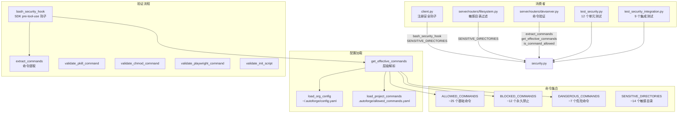

# `security.py` -- Bash 命令安全验证（允许列表机制）

> 源文件路径: `security.py`

## 功能概述

`security.py` 是 AutoForge 的**安全核心模块**，实现了基于允许列表（allowlist）的 Bash 命令验证机制。它作为 Claude Agent SDK 的 `pre-tool-use` 钩子运行，在每个 Bash 命令执行前进行安全检查，仅允许明确许可的命令通过。

模块实现了**分层命令控制体系**（优先级从高到低）：
1. **硬编码阻止列表** -- 永远不可执行的危险命令（如 `dd`、`sudo`、`shutdown`）
2. **组织级阻止列表** -- `~/.autoforge/config.yaml` 中定义，不可被项目覆盖
3. **组织级允许列表** -- `~/.autoforge/config.yaml` 中定义，对所有项目生效
4. **全局允许列表** -- 模块内置的默认命令集（如 `npm`、`git`、`curl` 等）
5. **项目级允许列表** -- `.autoforge/allowed_commands.yaml` 中定义的项目特定命令

此外，对敏感命令（`pkill`、`chmod`、`init.sh`、`playwright-cli`）进行额外的参数级验证。

## 依赖关系

### 导入依赖

| 模块 | 说明 |
|------|------|
| `logging` | 日志记录 |
| `os` | 路径操作（`os.path.basename`） |
| `re` | 正则表达式（命令字符串分割） |
| `shlex` | Shell 命令安全解析 |
| `pathlib.Path` | 路径操作 |
| `typing.Optional` | 类型标注 |
| `yaml` | YAML 配置文件解析（PyYAML） |

### 被依赖

| 模块 | 引用内容 |
|------|----------|
| `client.py` | `SENSITIVE_DIRECTORIES`, `bash_security_hook` -- Agent 客户端安全钩子注册 |
| `server/routers/filesystem.py` | `SENSITIVE_DIRECTORIES` -- 文件系统浏览器敏感目录过滤 |
| `server/routers/devserver.py` | `extract_commands`, `get_effective_commands`, `is_command_allowed` -- 开发服务器命令验证 |
| `test_security.py` | 多个函数和常量 -- 安全单元测试（12 个用例） |
| `test_security_integration.py` | `bash_security_hook` -- 安全集成测试（9 个用例） |

## 关键类/函数

### 常量

#### `ALLOWED_COMMANDS: set[str]`
- **说明**: 全局允许的命令集（约 25 个），包括文件检查（`ls`、`cat`）、Node.js 开发（`npm`、`npx`）、版本控制（`git`）、进程管理（`ps`、`kill`）等。

#### `BLOCKED_COMMANDS: set[str]`
- **说明**: 永远不允许的命令集（约 12 个），包括磁盘操作（`dd`、`mkfs`）、系统控制（`shutdown`、`reboot`）、权限变更（`chown`）、系统服务（`systemctl`）、网络安全（`iptables`）。

#### `DANGEROUS_COMMANDS: set[str]`
- **说明**: 危险但可能需审批的命令（约 7 个），包括权限提升（`sudo`、`su`）、云 CLI（`aws`、`gcloud`、`az`）、容器编排（`kubectl`）。当前作为阻止命令处理。

#### `SENSITIVE_DIRECTORIES: set[str]`
- **说明**: 敏感目录集合（相对于 home 目录），如 `.ssh`、`.aws`、`.gnupg` 等，用于 `EXTRA_READ_PATHS` 验证和文件系统浏览器过滤。

#### `COMMANDS_NEEDING_EXTRA_VALIDATION: set[str]`
- **说明**: 需要额外参数级验证的命令：`pkill`、`chmod`、`init.sh`、`playwright-cli`。

### 命令解析

#### `extract_commands(command_string: str) -> list[str]`
- **参数**: `command_string` -- 完整的 Shell 命令字符串
- **返回值**: 提取的命令名称列表
- **说明**: 处理管道（`|`）、命令链接（`&&`、`||`、`;`）和子 shell。使用 `shlex` 安全解析，对解析失败的命令有回退提取逻辑。

#### `split_command_segments(command_string: str) -> list[str]`
- **参数**: `command_string` -- 完整的 Shell 命令字符串
- **返回值**: 按 `&&`、`||`、`;` 分割的命令段列表
- **说明**: 用于后续对每个命令段进行独立的安全验证。

### 命令验证

#### `validate_pkill_command(command_string: str, extra_processes: set[str] | None) -> tuple[bool, str]`
- **说明**: 仅允许杀死开发相关进程（默认：`node`、`npm`、`npx`、`vite`、`next`）。支持通过配置扩展允许列表。

#### `validate_chmod_command(command_string: str) -> tuple[bool, str]`
- **说明**: 仅允许 `+x` 模式（使文件可执行），禁止递归操作和其他权限变更。

#### `validate_playwright_command(command_string: str) -> tuple[bool, str]`
- **说明**: 阻止 `run-code` 和 `eval` 子命令（可绕过安全沙箱执行任意代码）。

### 配置加载

#### `load_org_config() -> Optional[dict]`
- **说明**: 加载 `~/.autoforge/config.yaml` 组织级配置，含版本验证和结构校验。

#### `load_project_commands(project_dir: Path) -> Optional[dict]`
- **说明**: 加载 `.autoforge/allowed_commands.yaml` 项目级配置，强制 100 个命令上限。

#### `get_effective_commands(project_dir: Path | None) -> tuple[set[str], set[str]]`
- **说明**: 执行分层命令层级解析，返回 `(allowed, blocked)` 命令集合。

### 模式匹配

#### `matches_pattern(command: str, pattern: str) -> bool`
- **说明**: 支持精确匹配（`swift`）、前缀通配（`swift*`）、路径模式（`./scripts/build.sh`）。裸通配符 `*` 被拒绝以防安全风险。

### 安全钩子

#### `async bash_security_hook(input_data, tool_use_id, context) -> dict`
- **说明**: Agent SDK 的 `pre-tool-use` 钩子入口。对每个 Bash 工具调用执行完整的安全验证流程：提取命令 -> 检查阻止列表 -> 检查允许列表 -> 额外参数验证。返回空字典表示允许，返回 `{"decision": "block", "reason": "..."}` 表示阻止。

## 架构图

## 注意事项

1. **安全优先**: 无法解析的命令会被**阻止**（fail-safe），而非放行。
2. **shlex 回退**: 当 `shlex.split()` 因引号不匹配等失败时，使用 `_extract_primary_command` 作为回退解析器，记录日志后仍然进行验证。
3. **裸通配符防护**: `*` 作为单独的模式被明确拒绝，防止意外允许所有命令。
4. **阻止列表优先**: 即使命令同时出现在允许列表和阻止列表中，阻止列表始终优先。
5. **项目命令上限**: 单个项目最多允许 100 条自定义命令，超出则整个配置被拒绝。
6. **pkill 安全**: 默认仅允许杀死 `node`、`npm`、`npx`、`vite`、`next` 进程，可通过配置文件扩展。
7. **异步钩子**: `bash_security_hook` 是 `async` 函数，与 Claude Agent SDK 的异步工具调用链兼容。
