# server/ -- FastAPI 服务器总览

## 目录概述

`server/` 目录是 AutoForge 的后端核心,基于 FastAPI 构建。它提供 REST API、WebSocket 实时通信、静态文件服务等功能,是 React UI 与底层代理系统之间的桥梁。

## 功能概述

服务器负责以下核心职责:

- **项目管理**: 通过注册表(registry)管理项目的创建、查询、更新和删除
- **功能特性管理**: 对 SQLite 中的 Feature 表进行 CRUD 操作,支持依赖图和批量创建
- **代理控制**: 启动/停止/暂停/恢复编码代理子进程,支持并行模式和优雅暂停(drain mode)
- **实时通信**: 通过 WebSocket 向前端推送进度更新、代理状态变化、日志输出
- **终端仿真**: 基于 PTY 的交互式终端,支持多标签页
- **开发服务器**: 项目开发服务器的生命周期管理
- **AI 辅助功能**: Spec 创建、项目扩展、只读助手聊天三种对话式会话
- **定时调度**: 基于 APScheduler 的自动化代理调度
- **全局设置**: 模型选择、YOLO 模式、批处理大小等全局配置

## 文件列表

| 文件 | 大小 | 职责说明 |
|------|------|---------|
| `__init__.py` | 0.4 KB | 包初始化,修复 Windows asyncio 子进程支持 |
| `main.py` | 9.1 KB | FastAPI 应用入口,生命周期管理,CORS/安全中间件,路由注册,静态文件服务 |
| `schemas.py` | 21.6 KB | 所有 Pydantic 请求/响应模型定义 |
| `websocket.py` | 38.3 KB | WebSocket 连接管理,代理/编排器状态追踪,进度轮询 |
| `routers/` | -- | REST/WebSocket 路由模块(12 个路由文件) |
| `services/` | -- | 业务逻辑服务(10 个服务文件) |
| `utils/` | -- | 工具函数(3 个工具文件) |

---

## main.py -- 应用入口

### 生命周期管理(Lifespan)

**启动阶段(Startup):**

1. **清理临时文件**: 调用 `temp_cleanup.cleanup_stale_temp()` 清理 Playwright 配置文件、`.node` 缓存等过期临时文件
2. **清理孤立锁文件**: 调用 `cleanup_orphaned_locks()` 和 `cleanup_orphaned_devserver_locks()` 清理上次运行遗留的 `.agent.lock` / `.devserver.lock`
3. **启动调度服务**: 调用 `get_scheduler().start()` 启动 APScheduler,加载已有定时任务

**关闭阶段(Shutdown):**

按照依赖顺序逐步清理(先停调度器防止触发新启动,再停所有运行中的管理器):
1. `cleanup_scheduler()` -- 停止调度服务
2. `cleanup_all_managers()` -- 停止所有代理进程
3. `cleanup_assistant_sessions()` -- 清理助手聊天会话
4. `cleanup_all_expand_sessions()` -- 清理扩展会话
5. `cleanup_all_terminals()` -- 停止所有终端会话
6. `cleanup_all_devservers()` -- 停止所有开发服务器

### CORS 配置

- **默认模式**: 仅允许 `localhost:5173`(Vite 开发服务器)和 `localhost:8888`(生产环境)
- **远程模式**: 当环境变量 `AUTOFORGE_ALLOW_REMOTE=1` 时,允许所有来源(`*`)

### 安全中间件

当未启用远程访问时,注册 HTTP 中间件 `require_localhost`,拒绝非 `127.0.0.1`/`::1`/`localhost` 的请求,返回 403。

### 路由注册

依次注册 12 个路由模块:projects、features、agent、schedules、devserver、spec_creation、expand_project、filesystem、assistant_chat、settings、terminal、scaffold。

### 端点

| 端点 | 方法 | 说明 |
|------|------|------|
| `/api/health` | GET | 健康检查,返回 `{"status": "healthy"}` |
| `/api/setup/status` | GET | 系统环境检测(Claude CLI、凭据、Node.js、npm) |
| `/ws/projects/{project_name}` | WebSocket | 项目实时更新(进度、代理状态、日志) |
| `/` | GET | 提供 React SPA 的 `index.html` |
| `/{path:path}` | GET | SPA 路由回退,含路径遍历防护 |

### 静态文件服务

当 `ui/dist/` 目录存在时,将 `/assets` 挂载为静态文件目录,并为所有未匹配的路径返回 `index.html` 以支持 SPA 路由。通过 `file_path.relative_to(UI_DIST_DIR)` 防止路径遍历攻击。

---

## schemas.py -- Pydantic 数据模型

所有 API 的请求和响应模型均在此文件中定义,按功能域分组。

### 项目相关(Project)

| 模型 | 用途 |
|------|------|
| `ProjectCreate` | 创建项目请求(name + path + spec_method) |
| `ProjectStats` | 项目统计(passing/in_progress/total/percentage) |
| `ProjectSummary` | 项目列表摘要 |
| `ProjectDetail` | 项目详情(含 prompts_dir) |
| `ProjectPrompts` | 项目提示文件内容(app_spec/initializer/coding) |
| `ProjectPromptsUpdate` | 更新提示文件请求 |
| `ProjectSettingsUpdate` | 更新项目设置(default_concurrency: 1-5) |

### 功能特性相关(Feature)

| 模型 | 用途 |
|------|------|
| `FeatureBase` | 基础属性(category/name/description/steps/dependencies) |
| `FeatureCreate` | 创建功能请求(含可选 priority) |
| `FeatureUpdate` | 部分更新请求 |
| `FeatureResponse` | 响应模型(含 blocked/blocking_dependencies/human_input 计算属性) |
| `FeatureListResponse` | 按状态分组(pending/in_progress/done/needs_human_input) |
| `FeatureBulkCreate` | 批量创建请求(features + starting_priority) |
| `FeatureBulkCreateResponse` | 批量创建响应(created count + features) |
| `HumanInputField` | 人工输入字段定义(text/textarea/select/boolean) |
| `HumanInputRequest` | 代理请求人工输入(prompt + fields) |
| `HumanInputResponse` | 人工回复(fields dict) |

### 依赖图相关(Dependency Graph)

| 模型 | 用途 |
|------|------|
| `DependencyGraphNode` | 图节点(id/name/category/status/priority/dependencies) |
| `DependencyGraphEdge` | 图边(source -> target) |
| `DependencyGraphResponse` | 完整依赖图(nodes + edges) |
| `DependencyUpdate` | 依赖更新请求(最多 20 个依赖) |

### 代理相关(Agent)

| 模型 | 用途 |
|------|------|
| `AgentStartRequest` | 启动请求(yolo_mode/model/max_concurrency/testing_agent_ratio) |
| `AgentStatus` | 当前状态(stopped/running/paused/crashed/pausing/paused_graceful) |
| `AgentActionResponse` | 操作响应(success/status/message) |

### WebSocket 消息

| 模型 | type 字段 | 说明 |
|------|-----------|------|
| `WSProgressMessage` | `progress` | 进度更新(passing/in_progress/total/percentage) |
| `WSFeatureUpdateMessage` | `feature_update` | 功能状态变化(feature_id/passes) |
| `WSLogMessage` | `log` | 代理日志(line/timestamp/featureId/agentIndex) |
| `WSAgentStatusMessage` | `agent_status` | 代理状态变化(status) |
| `WSAgentUpdateMessage` | `agent_update` | 多代理状态(agentIndex/agentName/agentType/state/thought) |

**`AgentState`** 类型: `idle` | `thinking` | `working` | `testing` | `success` | `error` | `struggling`

**`AgentType`** 类型: `coding` | `testing`

**`AGENT_MASCOTS`** 列表: `["Spark", "Fizz", "Octo", "Hoot", "Buzz"]` -- 五个代理吉祥物名称,按索引轮流分配。

### 其他模型分组

| 分组 | 模型 |
|------|------|
| 系统检查 | `SetupStatus`(claude_cli/credentials/node/npm) |
| Spec 聊天 | `ImageAttachment`(filename/mimeType/base64Data,最大 5MB) |
| 文件系统 | `DriveInfo`, `DirectoryEntry`, `DirectoryListResponse`, `PathValidationResponse`, `CreateDirectoryRequest` |
| 设置 | `ModelInfo`, `ProviderInfo`, `ProvidersResponse`, `SettingsResponse`, `SettingsUpdate`, `ModelsResponse` |
| 开发服务器 | `DevServerStartRequest`, `DevServerStatus`, `DevServerActionResponse`, `DevServerConfigResponse`, `DevServerConfigUpdate`, `WSDevLogMessage`, `WSDevServerStatusMessage` |
| 定时调度 | `ScheduleCreate`, `ScheduleUpdate`, `ScheduleResponse`, `ScheduleListResponse`, `NextRunResponse` |

---

## websocket.py -- 实时通信

### ConnectionManager

全局连接管理器,维护每个项目的 WebSocket 连接集合:

- `connect(websocket, project_name)` -- 注册连接
- `disconnect(websocket, project_name)` -- 移除连接
- `broadcast_to_project(project_name, message)` -- 广播消息到项目的所有连接,自动清理断开的连接

### AgentTracker

多代理状态追踪器,使用 `(feature_id, agent_type)` 复合键追踪编码和测试代理:

- **输出解析**: 通过正则匹配 `[Feature #X]` 前缀识别代理输出归属
- **状态检测**: 匹配 `[Tool: Read]`(thinking)、`[Tool: Write]`(working)、`[Tool: Bash]`(testing) 等模式
- **批处理支持**: 追踪 `Started coding agent for features #5, #8, #12` 等批量代理消息
- **生命周期管理**: 自动处理代理启动/完成/失败事件,生成 `agent_update` WebSocket 消息
- **重置机制**: 当代理停止或崩溃时清除所有追踪状态,防止幽灵代理累积

### OrchestratorTracker

编排器状态追踪器,解析编排器标准输出,发射 `orchestrator_update` 消息:

**状态机**: `idle` -> `initializing` -> `scheduling` -> `spawning` -> `monitoring` -> `draining` -> `paused` -> `complete`

追踪事件包括:初始化开始/完成、容量检查、代理生成、代理完成、全部完成、优雅暂停/恢复。

### poll_progress

每 2 秒轮询数据库,获取 `(passing, in_progress, total, needs_human_input)` 统计信息。仅在数值变化时发送 `progress` 消息,避免不必要的网络流量。

### project_websocket

主 WebSocket 端点处理函数:

1. 接受连接并验证项目名称和路径
2. 注册代理管理器和开发服务器管理器的回调
3. 创建 `AgentTracker` 和 `OrchestratorTracker` 实例
4. 发送初始状态(agent_status + dev_server_status + progress)
5. 启动进度轮询任务
6. 处理 ping/pong 心跳
7. 断开时清理所有回调和轮询任务

---

## 架构图

```mermaid
graph TB
    subgraph "客户端层"
        UI["React UI"]
    end

    subgraph "FastAPI 应用 (main.py)"
        APP["FastAPI App"]
        CORS["CORS 中间件"]
        SEC["安全中间件<br/>(localhost限制)"]
        LIFESPAN["生命周期管理<br/>(启动/关闭)"]
        STATIC["静态文件服务<br/>(ui/dist/)"]
    end

    subgraph "路由层 (routers/)"
        R_PROJ["projects"]
        R_FEAT["features"]
        R_AGENT["agent"]
        R_SCHED["schedules"]
        R_DEV["devserver"]
        R_SPEC["spec_creation"]
        R_EXPAND["expand_project"]
        R_FS["filesystem"]
        R_ASST["assistant_chat"]
        R_SET["settings"]
        R_TERM["terminal"]
        R_SCAFF["scaffold"]
    end

    subgraph "WebSocket 层 (websocket.py)"
        WS_EP["/ws/projects/{name}"]
        CONN_MGR["ConnectionManager"]
        AGENT_TRK["AgentTracker"]
        ORCH_TRK["OrchestratorTracker"]
        POLL["poll_progress<br/>(2s 轮询)"]
    end

    subgraph "服务层 (services/)"
        S_PROC["process_manager"]
        S_DEV["dev_server_manager"]
        S_TERM["terminal_manager"]
        S_CONF["project_config"]
        S_SCHED["scheduler_service"]
        S_ASST["assistant_chat_session"]
        S_DB["assistant_database"]
        S_SPEC["spec_chat_session"]
        S_EXPAND["expand_chat_session"]
        S_CONST["chat_constants"]
    end

    subgraph "数据层"
        SQLITE[("SQLite<br/>features.db<br/>assistant.db")]
        REGISTRY[("Registry<br/>registry.db")]
    end

    subgraph "外部进程"
        CLAUDE["Claude Agent SDK"]
        AGENT_PROC["代理子进程<br/>(autonomous_agent_demo.py)"]
        DEV_PROC["开发服务器子进程"]
        PTY_PROC["PTY Shell 进程"]
    end

    UI -- "REST API" --> APP
    UI -- "WebSocket" --> WS_EP

    APP --> CORS --> SEC
    APP --> LIFESPAN
    APP --> STATIC
    APP --> R_PROJ & R_FEAT & R_AGENT & R_SCHED & R_DEV
    APP --> R_SPEC & R_EXPAND & R_FS & R_ASST & R_SET & R_TERM & R_SCAFF

    WS_EP --> CONN_MGR
    WS_EP --> AGENT_TRK
    WS_EP --> ORCH_TRK
    WS_EP --> POLL

    R_AGENT --> S_PROC
    R_DEV --> S_DEV
    R_TERM --> S_TERM
    R_DEV --> S_CONF
    R_SCHED --> S_SCHED
    R_ASST --> S_ASST
    R_ASST --> S_DB
    R_SPEC --> S_SPEC
    R_EXPAND --> S_EXPAND

    S_PROC --> AGENT_PROC
    S_DEV --> DEV_PROC
    S_TERM --> PTY_PROC
    S_ASST --> CLAUDE
    S_SPEC --> CLAUDE
    S_EXPAND --> CLAUDE
    S_SCHED --> S_PROC

    R_FEAT --> SQLITE
    R_SCHED --> SQLITE
    S_DB --> SQLITE
    R_PROJ --> REGISTRY
    POLL --> SQLITE
```

---

## 依赖关系

### 外部依赖

| 包 | 用途 |
|-----|------|
| `fastapi` | Web 框架 |
| `uvicorn` | ASGI 服务器 |
| `pydantic` | 数据验证和序列化 |
| `sqlalchemy` | ORM,数据库操作 |
| `psutil` | 跨平台进程管理 |
| `apscheduler` | 定时任务调度 |
| `claude_agent_sdk` | Claude AI SDK 集成 |
| `python-dotenv` | 环境变量加载 |

### 内部依赖(项目根目录模块)

| 模块 | 使用者 | 用途 |
|------|--------|------|
| `registry.py` | routers, services | 项目注册表,全局设置 |
| `progress.py` | websocket, projects router | 测试通过计数 |
| `security.py` | filesystem, devserver routers | 命令白名单验证 |
| `autoforge_paths.py` | 几乎所有模块 | 路径解析,双路径向后兼容 |
| `auth.py` | process_manager | 认证错误检测 |
| `env_constants.py` | chat_constants | API 环境变量列表 |
| `rate_limit_utils.py` | chat_constants | 限流检测和重试解析 |
| `api/database.py` | features, schedules routers | SQLAlchemy 模型(Feature, Schedule) |
| `api/dependency_resolver.py` | features router | 循环依赖检测(Kahn 算法 + DFS) |

---

## 关键模式

### 延迟导入(Lazy Import)

为避免循环依赖和加速启动,大量模块使用延迟导入模式。例如 `projects.py` 中的 `_init_imports()` 函数在首次调用时才导入 `progress`、`prompts`、`start` 等模块。

### 线程安全的全局注册表

`process_manager.py` 和 `dev_server_manager.py` 使用 `threading.Lock` 保护的全局字典作为管理器注册表,键为 `(project_name, resolved_project_dir)` 复合键,防止不同路径的同名项目互相污染。

### 回调机制

进程管理器支持多个 WebSocket 客户端同时监听,通过 `add_output_callback` / `remove_output_callback` 管理回调集合,使用 `threading.Lock` 保证线程安全。

### 敏感数据过滤

所有进程输出在广播前经过 `sanitize_output()` 处理,匹配并替换 API 密钥、GitHub Token、AWS 密钥等敏感模式为 `[REDACTED]`。
