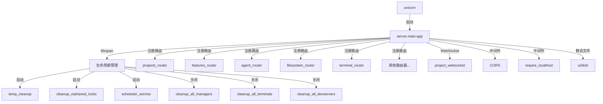

# `main.py` -- FastAPI 应用入口与服务器生命周期管理

> 源文件路径: `server/main.py`

## 功能概述

`main.py` 是整个 AutoForge 后端服务器的主入口文件。它基于 FastAPI 框架构建,负责初始化应用实例、注册所有 API 路由、配置中间件、管理服务器生命周期,并提供静态文件服务以托管 React 前端应用。

该文件定义了一个 `lifespan` 异步上下文管理器,在服务器启动时执行清理操作(清理过期临时文件、孤儿锁文件)并启动调度服务,在关机时按序清理所有运行中的代理进程、聊天会话、终端和开发服务器。

此外,该文件实现了安全中间件,默认仅允许来自 `localhost` 的请求,并通过 `AUTOFORGE_ALLOW_REMOTE` 环境变量控制远程访问权限。当 UI 构建产物存在时,还会挂载静态文件服务,支持 SPA 路由回退。

## 依赖关系

### 导入依赖

| 模块 | 说明 |
|------|------|
| `fastapi` | Web 框架核心 (FastAPI, HTTPException, WebSocket 等) |
| `fastapi.middleware.cors` | CORS 跨域中间件 |
| `fastapi.staticfiles` | 静态文件服务 |
| `fastapi.responses` | FileResponse 文件响应 |
| `dotenv` | 加载 `.env` 环境变量 |
| `server.routers` | 所有 API 路由模块 (12个路由器) |
| `server.schemas` | `SetupStatus` Pydantic 模型 |
| `server.services.assistant_chat_session` | 助手聊天会话清理 |
| `server.services.chat_constants` | `ROOT_DIR` 项目根路径 |
| `server.services.dev_server_manager` | 开发服务器管理与清理 |
| `server.services.expand_chat_session` | 扩展聊天会话清理 |
| `server.services.process_manager` | 代理进程管理与清理 |
| `server.services.scheduler_service` | 调度服务管理 |
| `server.services.terminal_manager` | 终端会话清理 |
| `server.websocket` | WebSocket 处理函数 |
| `temp_cleanup` | 临时文件清理 (延迟导入) |

### 被依赖

| 模块 | 引用内容 |
|------|----------|
| `start_ui.py` | 通过 uvicorn 以 `server.main:app` 启动服务器 |
| `lib/cli.js` | npm CLI 入口通过 uvicorn 启动 `server.main:app` |
| `.claude/launch.json` | 调试配置引用 `server.main:app` |

## 关键类/函数

### `lifespan(app: FastAPI)`
- **类型**: 异步上下文管理器
- **参数**: `app` - FastAPI 应用实例
- **说明**: 管理服务器的启动和关闭生命周期。启动时清理过期临时文件、孤儿锁文件,并启动调度服务;关闭时按序清理调度器、代理进程、聊天会话、终端和开发服务器。

### `require_localhost(request, call_next)`
- **类型**: HTTP 中间件
- **参数**: `request` - 请求对象, `call_next` - 下一个中间件
- **返回值**: HTTP 响应
- **说明**: 安全中间件,仅在非远程模式下激活,拒绝非 localhost 来源的请求。

### `health_check()`
- **路由**: `GET /api/health`
- **返回值**: `{"status": "healthy"}`
- **说明**: 健康检查端点,用于监控服务器状态。

### `setup_status()`
- **路由**: `GET /api/setup/status`
- **返回值**: `SetupStatus` 模型
- **说明**: 检查系统依赖状态,包括 Claude CLI、凭证配置、Node.js 和 npm。

### `websocket_endpoint(websocket, project_name)`
- **路由**: `WS /ws/projects/{project_name}`
- **参数**: `websocket` - WebSocket 连接, `project_name` - 项目名称
- **说明**: WebSocket 端点,委托给 `server.websocket.project_websocket` 处理实时项目更新。

### `serve_spa(path)`
- **路由**: `GET /{path:path}`
- **参数**: `path` - URL 路径
- **返回值**: 静态文件或 `index.html`
- **说明**: SPA 路由处理,先尝试服务静态文件,不存在则回退到 `index.html`。包含路径遍历防护。

## 架构图

## 注意事项

1. **Windows 兼容性**: 文件开头针对 Windows 平台设置了 `WindowsProactorEventLoopPolicy`,以支持 asyncio 子进程。
2. **远程访问安全**: `AUTOFORGE_ALLOW_REMOTE=1` 会禁用 localhost 限制和 CORS 同源策略,应仅在受信任网络环境中使用。
3. **路径遍历防护**: `serve_spa` 函数通过 `relative_to` 检查确保解析后的文件路径在 `UI_DIST_DIR` 范围内。
4. **环境变量**: `dotenv` 在模块顶层加载,确保后续所有模块都能读取 `.env` 配置。
5. **路由器顺序**: API 路由在静态文件挂载之前注册,确保 `/api/` 和 `/ws/` 前缀的请求不会被 SPA 回退路由拦截。
