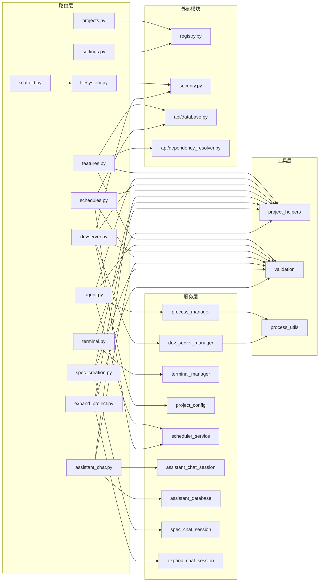

# server/routers/ -- REST/WebSocket 路由

## 目录概述

`routers/` 目录包含 FastAPI 的所有路由模块,每个文件对应一个独立的功能域。路由层负责请求验证、权限检查和响应格式化,将业务逻辑委托给 `services/` 层。

## 文件列表

| 文件 | 大小 | 路由前缀 | 说明 |
|------|------|----------|------|
| `__init__.py` | 1.0 KB | -- | 汇总导出所有 12 个路由 |
| `projects.py` | 17.7 KB | `/api/projects` | 项目 CRUD、提示文件管理、重置 |
| `features.py` | 31.8 KB | `/api/projects/{name}/features` | 功能 CRUD、批量操作、依赖管理 |
| `agent.py` | 6.9 KB | `/api/projects/{name}/agent` | 代理控制(启动/停止/暂停/恢复) |
| `filesystem.py` | 15.2 KB | `/api/filesystem` | 文件系统浏览、路径验证、目录创建 |
| `spec_creation.py` | 14.3 KB | `/api/spec` | Spec 创建会话管理(REST + WebSocket) |
| `expand_project.py` | 9.4 KB | `/api/expand` | 项目扩展会话管理(REST + WebSocket) |
| `assistant_chat.py` | 14.0 KB | `/api/assistant` | 助手对话管理(REST + WebSocket) |
| `terminal.py` | 16.0 KB | `/api/terminal` | 终端会话管理(REST + WebSocket) |
| `devserver.py` | 14.7 KB | `/api/projects/{name}/devserver` | 开发服务器控制和配置 |
| `schedules.py` | 12.3 KB | `/api/projects/{name}/schedules` | 定时调度 CRUD |
| `settings.py` | 6.8 KB | `/api/settings` | 全局设置管理 |
| `scaffold.py` | 4.3 KB | `/api/scaffold` | 项目脚手架(SSE 流式输出) |

---

## 各路由详细说明

### projects.py -- 项目管理

| 方法 | 端点 | 说明 |
|------|------|------|
| GET | `/api/projects` | 列出所有注册项目(含统计信息和 spec 状态) |
| POST | `/api/projects` | 创建新项目(验证名称、路径、重复检查、安全检查) |
| GET | `/api/projects/{name}` | 获取项目详情(含 prompts_dir) |
| DELETE | `/api/projects/{name}` | 删除项目(可选删除文件,检查代理运行中) |
| GET | `/api/projects/{name}/prompts` | 获取提示文件内容(app_spec/initializer/coding) |
| PUT | `/api/projects/{name}/prompts` | 更新提示文件 |
| GET | `/api/projects/{name}/stats` | 获取项目进度统计 |
| POST | `/api/projects/{name}/reset` | 重置项目(quick: 仅删数据库; full: 连 prompts 一起删) |
| PATCH | `/api/projects/{name}/settings` | 更新项目设置(default_concurrency) |

**关键逻辑:**
- 创建项目时检查路径是否在敏感目录(`is_path_blocked`)
- 重置时释放数据库引擎(`dispose_engine`)以解除 Windows 文件锁
- 删除时检查代理是否运行中(`has_agent_running`)
- 跨平台路径比较(Windows 不区分大小写)

### features.py -- 功能特性管理

| 方法 | 端点 | 说明 |
|------|------|------|
| GET | `/api/projects/{name}/features` | 列出所有功能(按 pending/in_progress/done/needs_human_input 分组) |
| POST | `/api/projects/{name}/features` | 创建单个功能(自动分配 priority) |
| POST | `/api/projects/{name}/features/bulk` | 批量创建功能(指定 starting_priority 或自动追加) |
| GET | `/api/projects/{name}/features/graph` | 获取依赖图数据(nodes + edges,用于可视化) |
| GET | `/api/projects/{name}/features/{id}` | 获取单个功能详情 |
| PATCH | `/api/projects/{name}/features/{id}` | 更新功能(已完成的功能不可编辑) |
| DELETE | `/api/projects/{name}/features/{id}` | 删除功能(自动清理其他功能的依赖引用) |
| PATCH | `/api/projects/{name}/features/{id}/skip` | 跳过功能(移到队列末尾) |
| POST | `/api/projects/{name}/features/{id}/resolve-human-input` | 回复人工输入请求 |
| POST | `/api/projects/{name}/features/{id}/dependencies/{dep_id}` | 添加依赖(环形依赖检测) |
| DELETE | `/api/projects/{name}/features/{id}/dependencies/{dep_id}` | 移除依赖 |
| PUT | `/api/projects/{name}/features/{id}/dependencies` | 设置完整依赖列表(替换现有) |

**关键逻辑:**
- `feature_to_response()` 处理遗留 NULL 值,计算 blocked 状态
- 依赖操作使用 `would_create_circular_dependency()` 进行环形检测
- 每个功能最多 `MAX_DEPENDENCIES_PER_FEATURE` 个依赖(安全限制)
- 删除功能时自动从其他功能的依赖列表中移除引用

### agent.py -- 代理控制

| 方法 | 端点 | 说明 |
|------|------|------|
| GET | `/api/projects/{name}/agent/status` | 获取代理状态(含 healthcheck 检测崩溃) |
| POST | `/api/projects/{name}/agent/start` | 启动代理(合并全局设置和请求参数) |
| POST | `/api/projects/{name}/agent/stop` | 停止代理(通知调度器防止自动重启) |
| POST | `/api/projects/{name}/agent/pause` | 暂停代理(psutil.suspend) |
| POST | `/api/projects/{name}/agent/resume` | 恢复暂停的代理(psutil.resume) |
| POST | `/api/projects/{name}/agent/graceful-pause` | 优雅暂停(drain mode,完成当前工作后暂停) |
| POST | `/api/projects/{name}/agent/graceful-resume` | 从优雅暂停恢复 |

**启动参数:**
- `yolo_mode`: YOLO 模式(跳过测试代理)
- `model`: 使用的模型(如 `claude-opus-4-6`)
- `max_concurrency`: 最大并发编码代理数(1-5)
- `testing_agent_ratio`: 回归测试代理数(0-3)
- `batch_size`: 每批功能数(1-15,从全局设置获取)
- `testing_batch_size`: 测试批次大小(1-15)

### filesystem.py -- 文件系统浏览

| 方法 | 端点 | 说明 |
|------|------|------|
| GET | `/api/filesystem/list` | 列出目录内容(仅目录,用于文件夹选择) |
| GET | `/api/filesystem/drives` | 列出可用驱动器(仅 Windows) |
| POST | `/api/filesystem/validate` | 验证路径(存在性、权限、可写性) |
| POST | `/api/filesystem/create-directory` | 创建新目录 |
| GET | `/api/filesystem/home` | 获取用户主目录路径 |

**安全控制:**
- **平台阻止路径**: Windows(`C:\Windows`、`C:\Program Files` 等)、macOS(`/System`、`/Library` 等)、Linux(`/etc`、`/proc` 等)
- **敏感目录阻止**: 与 `security.py` 的 `SENSITIVE_DIRECTORIES` 共用一个来源(`.ssh`、`.aws`、`.gnupg` 等)
- **UNC 路径拦截**: 阻止 `\\server\share` 形式的网络路径
- **隐藏文件过滤**: `.env`、`*.key`、`*.pem`、`*credentials*`、`*secrets*` 模式匹配
- **路径遍历防护**: 阻止 `..` 目录名和特殊字符

### spec_creation.py -- Spec 创建

**REST 端点:**

| 方法 | 端点 | 说明 |
|------|------|------|
| GET | `/api/spec/sessions` | 列出活跃会话 |
| GET | `/api/spec/sessions/{name}` | 获取会话状态 |
| DELETE | `/api/spec/sessions/{name}` | 取消会话 |
| GET | `/api/spec/status/{name}` | 获取 spec 文件状态(轮询 `.spec_status.json`) |

**WebSocket 端点:** `/api/spec/ws/{project_name}`

交互式 spec 创建对话(7 个阶段):
1. 项目概述(名称、描述、受众)
2. 参与级别(快速 vs 详细模式)
3. 技术偏好
4. 功能探索(主要阶段)
5. 技术细节
6. 成功标准
7. 审批和确认

**消息协议:**
- 客户端发送: `start` | `message`(含可选图片附件) | `answer`(结构化回答) | `ping`
- 服务端发送: `text` | `question` | `spec_complete` | `file_written` | `complete` | `error` | `pong` | `response_done`

### expand_project.py -- 项目扩展

**REST 端点:**

| 方法 | 端点 | 说明 |
|------|------|------|
| GET | `/api/expand/sessions` | 列出活跃扩展会话 |
| GET | `/api/expand/sessions/{name}` | 获取扩展会话状态(含 features_created 计数) |
| DELETE | `/api/expand/sessions/{name}` | 取消扩展会话 |

**WebSocket 端点:** `/api/expand/ws/{project_name}`

通过自然语言向现有项目添加功能。要求项目已有 `app_spec.txt`。

**消息协议:**
- 客户端发送: `start` | `message`(含可选图片附件) | `done` | `ping`
- 服务端发送: `text` | `features_created` | `expansion_complete` | `response_done` | `error` | `pong`

### assistant_chat.py -- 助手对话

**REST 端点(对话管理):**

| 方法 | 端点 | 说明 |
|------|------|------|
| GET | `/api/assistant/conversations/{name}` | 列出项目的所有对话 |
| GET | `/api/assistant/conversations/{name}/{id}` | 获取对话详情(含所有消息) |
| POST | `/api/assistant/conversations/{name}` | 创建新对话 |
| DELETE | `/api/assistant/conversations/{name}/{id}` | 删除对话 |

**REST 端点(会话管理):**

| 方法 | 端点 | 说明 |
|------|------|------|
| GET | `/api/assistant/sessions` | 列出活跃会话 |
| GET | `/api/assistant/sessions/{name}` | 获取会话信息(含 conversation_id) |
| DELETE | `/api/assistant/sessions/{name}` | 关闭会话 |

**WebSocket 端点:** `/api/assistant/ws/{project_name}`

只读代码分析助手 + 功能管理。可读取代码、查询功能状态、创建/跳过功能,但不能修改代码文件。

**消息协议:**
- 客户端发送: `start`(含 conversation_id) | `message` | `answer` | `ping`
- 服务端发送: `conversation_created` | `text` | `tool_call` | `question` | `response_done` | `error` | `pong`

### terminal.py -- 终端管理

**REST 端点:**

| 方法 | 端点 | 说明 |
|------|------|------|
| GET | `/api/terminal/{name}` | 列出项目终端(无则自动创建默认终端) |
| POST | `/api/terminal/{name}` | 创建新终端(可选名称) |
| PATCH | `/api/terminal/{name}/{id}` | 重命名终端 |
| DELETE | `/api/terminal/{name}/{id}` | 删除终端(停止会话) |

**WebSocket 端点:** `/api/terminal/ws/{project_name}/{terminal_id}`

双向 PTY 终端 I/O,支持延迟启动(等待首次 resize 消息确定终端尺寸)。

**消息协议:**
- 客户端发送: `input`(base64 编码,64KB 限制) | `resize`(cols: 10-500, rows: 5-200) | `ping`
- 服务端发送: `output`(base64 编码) | `exit`(退出码) | `error` | `pong`

**关键逻辑:**
- 终端 ID 验证: 仅允许 `[a-zA-Z0-9]{1,16}` 格式
- 最后一个客户端断开时自动停止会话
- 后台任务: `send_output_task`(发送输出)+ `monitor_exit_task`(监控退出)

### devserver.py -- 开发服务器

| 方法 | 端点 | 说明 |
|------|------|------|
| GET | `/api/projects/{name}/devserver/status` | 获取开发服务器状态(含 healthcheck) |
| POST | `/api/projects/{name}/devserver/start` | 启动开发服务器(使用配置中的 effective_command) |
| POST | `/api/projects/{name}/devserver/stop` | 停止开发服务器 |
| GET | `/api/projects/{name}/devserver/config` | 获取开发服务器配置(detected/custom/effective) |
| PATCH | `/api/projects/{name}/devserver/config` | 更新自定义命令(null 清除,恢复自动检测) |

**安全控制(双重验证):**
1. `validate_dev_command()`: 对照安全白名单验证(全局 + 组织 + 项目)
2. `validate_custom_command_strict()`: 结构性白名单验证

**允许的运行器**: `npm`、`pnpm`、`yarn`、`npx`、`uvicorn`、`python`、`python3`、`flask`、`poetry`、`cargo`、`go`

**允许的 npm 脚本**: `dev`、`start`、`serve`、`develop`、`server`、`preview`

**允许的 Python 模块**: `uvicorn`、`flask`、`gunicorn`、`http.server`

**阻止的 Shell**: `sh`、`bash`、`zsh`、`cmd`、`powershell`、`pwsh`、`cmd.exe`

### schedules.py -- 定时调度

| 方法 | 端点 | 说明 |
|------|------|------|
| GET | `/api/projects/{name}/schedules` | 列出所有调度(按 start_time 排序) |
| POST | `/api/projects/{name}/schedules` | 创建调度(如在活动窗口内则立即启动代理) |
| GET | `/api/projects/{name}/schedules/next` | 计算下次调度运行(跨所有启用的调度) |
| GET | `/api/projects/{name}/schedules/{id}` | 获取单个调度 |
| PATCH | `/api/projects/{name}/schedules/{id}` | 更新调度(支持 `exclude_unset` 的部分更新) |
| DELETE | `/api/projects/{name}/schedules/{id}` | 删除调度(同时移除 APScheduler 作业) |

**关键设计:**
- 时间存储为 UTC(前端负责本地时间转换)
- `days_of_week` 使用位掩码: Mon=1, Tue=2, Wed=4, Thu=8, Fri=16, Sat=32, Sun=64
- 每个项目最多 `MAX_SCHEDULES_PER_PROJECT = 50` 个调度(防止资源耗尽)
- 创建时检查是否在当前活动窗口内,如在窗口内且无手动停止覆盖则立即启动
- 支持 `ScheduleOverride` 手动覆盖追踪

### settings.py -- 全局设置

| 方法 | 端点 | 说明 |
|------|------|------|
| GET | `/api/settings` | 获取当前全局设置(所有配置项) |
| PATCH | `/api/settings` | 更新全局设置(部分更新) |
| GET | `/api/settings/models` | 获取当前提供商的可用模型列表 |
| GET | `/api/settings/providers` | 获取所有可用 API 提供商列表 |

**设置项:**
- `yolo_mode`: YOLO 模式开关
- `model`: 默认模型
- `testing_agent_ratio`: 测试代理数(0-3)
- `playwright_headless`: 浏览器无头模式
- `batch_size`: 编码批处理大小(1-15)
- `testing_batch_size`: 测试批处理大小(1-15)
- `api_provider`: API 提供商(claude/glm/ollama/kimi/custom)
- `api_base_url`: 自定义 API 基础 URL
- `api_auth_token`: 认证令牌(write-only,永远不返回实际值)
- `api_model`: 提供商特定模型

**提供商切换逻辑:** 当提供商变更时,自动设置对应的默认 base_url 和 model。

### scaffold.py -- 项目脚手架

| 方法 | 端点 | 说明 |
|------|------|------|
| POST | `/api/scaffold/run` | 运行脚手架模板(SSE 流式输出) |

**安全设计:** 只允许硬编码的模板,不接受任意命令:

```python
TEMPLATES = {
    "agentic-starter": ["npx", "create-agentic-app@latest", ".", "-y", "-p", "npm", "--skip-git"],
}
```

SSE 事件类型: `output`(实时输出行) | `complete`(成功/失败 + 退出码) | `error`(错误信息)

---

## 架构图



---

## 依赖关系

### 路由间依赖

- `scaffold.py` 导入 `filesystem.py` 的 `is_path_blocked()` 进行路径安全检查
- `projects.py` 导入 `filesystem.py` 的 `is_path_blocked()` 检查项目创建路径

### 路由 -> 服务依赖

| 路由 | 依赖的服务 |
|------|-----------|
| `agent.py` | `process_manager`, `scheduler_service` |
| `devserver.py` | `dev_server_manager`, `project_config` |
| `terminal.py` | `terminal_manager` |
| `schedules.py` | `scheduler_service` |
| `assistant_chat.py` | `assistant_chat_session`, `assistant_database` |
| `spec_creation.py` | `spec_chat_session` |
| `expand_project.py` | `expand_chat_session` |
| `settings.py` | `chat_constants`(仅 ROOT_DIR) |

### 所有路由共用的工具

- `utils/project_helpers.py`: 几乎所有路由(除 `filesystem.py`、`settings.py`、`scaffold.py`)都通过 `get_project_path()` 查找项目路径
- `utils/validation.py`: 所有涉及 `project_name` 参数的路由都使用 `validate_project_name()` 或 `is_valid_project_name()`

---

## 关键模式

### WebSocket 会话复用

`spec_creation`、`expand_project`、`assistant_chat` 三个 WebSocket 路由均采用相同的模式:
1. 断开连接时**不删除**会话(允许重连恢复)
2. 通过 REST 端点 `DELETE /sessions/{name}` 显式关闭会话
3. 支持 `start` -> `message` -> `message` ... 的对话流

### 安全验证层级

`devserver.py` 展示了多层安全验证的模式:
1. **白名单验证**(`validate_dev_command`): 对照全局 + 组织 + 项目的有效命令列表
2. **结构验证**(`validate_custom_command_strict`): 解析命令结构,只允许已知安全的运行器和参数
3. **Shell 操作符阻止**: 启动时再次检查 `&&`、`||`、`;`、`|` 等危险操作符

### 静态路径优先于参数化路径

`features.py` 中 `/bulk` 和 `/graph` 端点**必须**声明在 `/{feature_id}` 路由之前,否则 FastAPI 会将 `bulk`/`graph` 解析为 feature_id 参数。
