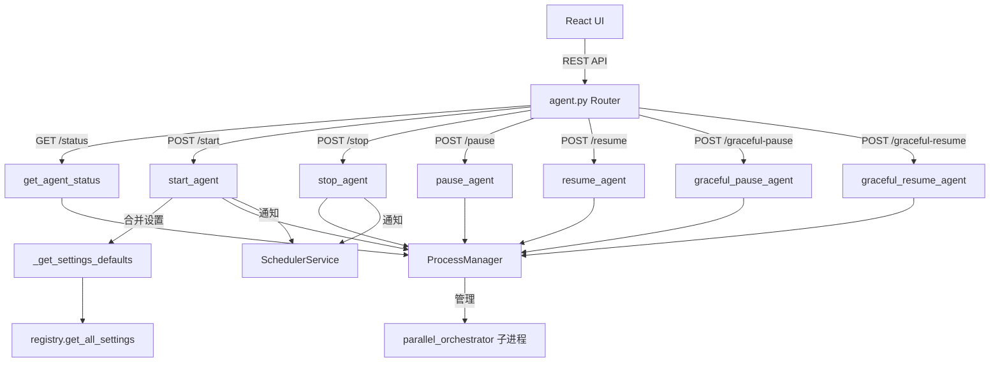

# `agent.py` -- 代理控制 API 路由

> 源文件路径: `server/routers/agent.py`

## 功能概述

`agent.py` 实现了编码代理的生命周期控制 API,挂载在 `/api/projects/{project_name}/agent` 路径下。它提供了代理的启动、停止、暂停、恢复和优雅暂停等操作端点,是 UI 中代理控制按钮的后端支撑。

该路由器在启动代理时负责合并请求参数与全局设置默认值:对于每个可配置项(YOLO 模式、模型选择、并发数、测试代理比例等),优先使用请求中的值,未提供时回退到全局设置。启动和停止操作会通知调度服务,以协调手动操作与定时调度之间的交互。

暂停功能提供两种模式:立即暂停(发送 SIGSTOP/SIGCONT 信号)和优雅暂停(drain 模式,等待当前任务完成后暂停,不会中断正在进行的代理工作)。

## 依赖关系

### 导入依赖

| 模块 | 说明 |
|------|------|
| `fastapi` | `APIRouter`, `HTTPException` |
| `server.schemas` | `AgentActionResponse`, `AgentStartRequest`, `AgentStatus` |
| `server.services.chat_constants` | `ROOT_DIR` 项目根路径 |
| `server.services.process_manager` | `get_manager` 获取进程管理器实例 |
| `server.utils.project_helpers` | `get_project_path` 项目路径查找 |
| `server.utils.validation` | `validate_project_name` 项目名称校验 |
| `registry` | `DEFAULT_MODEL`, `get_all_settings` (延迟导入) |
| `server.services.scheduler_service` | `get_scheduler` 调度服务 (延迟导入) |

### 被依赖

| 模块 | 引用内容 |
|------|----------|
| `server/routers/__init__.py` | `router` 导出为 `agent_router` |
| `server/main.py` | 通过 `agent_router` 注册到 FastAPI 应用 |

## 关键类/函数

### `_get_settings_defaults() -> tuple`
- **返回值**: `(yolo_mode, model, testing_agent_ratio, playwright_headless, batch_size, testing_batch_size)` 六元组
- **说明**: 从全局设置中读取默认配置。处理字符串到布尔/整数的转换,包含完善的异常处理和默认值回退。

### `get_project_manager(project_name: str)`
- **参数**: `project_name` - 项目名称
- **返回值**: `ProcessManager` 实例
- **说明**: 校验项目名称和路径后,获取或创建该项目的进程管理器。

### `get_agent_status(project_name: str)`
- **路由**: `GET /api/projects/{project_name}/agent/status`
- **返回值**: `AgentStatus`
- **说明**: 获取代理当前状态。调用前先执行 `healthcheck()` 检测崩溃进程。

### `start_agent(project_name, request)`
- **路由**: `POST /api/projects/{project_name}/agent/start`
- **参数**: `request` - `AgentStartRequest` (所有字段可选)
- **返回值**: `AgentActionResponse`
- **说明**: 启动代理。合并请求参数与全局默认值,传递给进程管理器的 `start()` 方法。成功后通知调度服务防止自动停止。

### `stop_agent(project_name: str)`
- **路由**: `POST /api/projects/{project_name}/agent/stop`
- **返回值**: `AgentActionResponse`
- **说明**: 停止代理。成功后通知调度服务防止自动启动。

### `pause_agent(project_name: str)`
- **路由**: `POST /api/projects/{project_name}/agent/pause`
- **返回值**: `AgentActionResponse`
- **说明**: 立即暂停代理 (发送 SIGSTOP 信号)。

### `resume_agent(project_name: str)`
- **路由**: `POST /api/projects/{project_name}/agent/resume`
- **返回值**: `AgentActionResponse`
- **说明**: 恢复暂停的代理 (发送 SIGCONT 信号)。

### `graceful_pause_agent(project_name: str)`
- **路由**: `POST /api/projects/{project_name}/agent/graceful-pause`
- **返回值**: `AgentActionResponse`
- **说明**: 请求优雅暂停(drain 模式)。编排器将完成当前正在处理的功能后停止分配新任务。

### `graceful_resume_agent(project_name: str)`
- **路由**: `POST /api/projects/{project_name}/agent/graceful-resume`
- **返回值**: `AgentActionResponse`
- **说明**: 从优雅暂停中恢复,编排器重新开始分配任务。

## 架构图

## 注意事项

1. **参数合并策略**: 启动请求中的参数优先于全局设置。`yolo_mode` 和 `testing_agent_ratio` 使用 `is not None` 检查(因为 `False` 和 `0` 是有效值),而 `model` 使用真值检查。
2. **调度协调**: 手动启动/停止会通知调度服务(`notify_manual_start`/`notify_manual_stop`),防止定时任务在手动操作后立即覆盖用户意图。
3. **健康检查**: `get_agent_status` 在返回状态前执行 `healthcheck()`,确保检测到已崩溃但状态未更新的进程。
4. **暂停模式区别**: `pause` 是进程级信号暂停(立即生效,可能中断正在进行的操作);`graceful_pause` 是应用级暂停(等待当前任务完成,不会中断工作)。
5. **批量大小**: `batch_size` 和 `testing_batch_size` 目前只从全局设置读取,不支持通过 API 请求覆盖。
