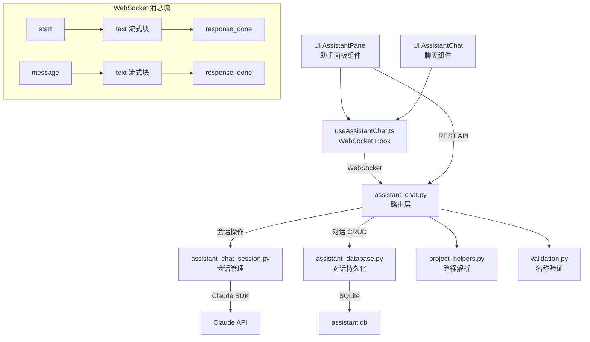

# `assistant_chat.py` -- AI 助手聊天路由

> 源文件路径: `server/routers/assistant_chat.py`

## 功能概述

`assistant_chat.py` 提供了只读项目助手（Project Assistant）的 WebSocket 和 REST API 端点。项目助手是一个可以回答项目相关问题的 AI 聊天功能，用户可以在 AutoForge 界面中通过助手面板与之交互，了解项目的代码结构、功能状态等信息。

该模块负责两大功能领域：一是对话(Conversation)的持久化管理，提供对话的创建、查询、删除等 REST 端点；二是实时聊天的 WebSocket 通信，支持消息流式传输、会话恢复和结构化问答。对话历史通过 SQLite 数据库持久化存储，支持在断开连接后恢复会话。

路由前缀为 `/api/assistant`，WebSocket 端点为 `/api/assistant/ws/{project_name}`。

## 依赖关系

### 导入依赖

| 模块 | 说明 |
|------|------|
| `fastapi` | 提供 `APIRouter`、`HTTPException`、`WebSocket`、`WebSocketDisconnect` |
| `pydantic.BaseModel` | 用于定义本文件中的请求/响应数据模型 |
| `server.services.assistant_chat_session` | 提供 `AssistantChatSession` 类及 `create_session`、`get_session`、`list_sessions`、`remove_session` 会话管理函数 |
| `server.services.assistant_database` | 提供 `create_conversation`、`delete_conversation`、`get_conversation`、`get_conversations` 对话持久化函数 |
| `server.utils.project_helpers` | 通过 `get_project_path` 将项目名称解析为文件系统路径 |
| `server.utils.validation` | 通过 `validate_project_name` 验证项目名称合法性 |

### 被依赖

| 模块 | 引用内容 |
|------|----------|
| `server/routers/__init__.py` | 导入 `router` 作为 `assistant_chat_router` 注册到 FastAPI 应用 |
| `server/main.py` | 通过 `__init__.py` 间接引用，注册到主应用路由 |
| `ui/src/hooks/useAssistantChat.ts` | 前端通过 WebSocket 连接助手聊天端点 |
| `ui/src/App.tsx` | 前端通过 REST API 调用对话管理端点 |

## 关键类/函数

### Pydantic 模型

| 模型 | 说明 |
|------|------|
| `ConversationSummary` | 对话摘要，包含 `id`、`project_name`、`title`、`created_at`、`updated_at`、`message_count` |
| `ConversationMessageModel` | 对话中的单条消息，包含 `id`、`role`、`content`、`timestamp` |
| `ConversationDetail` | 完整对话详情，包含消息列表 `messages: list[ConversationMessageModel]` |
| `SessionInfo` | 活跃会话信息，包含 `project_name`、`conversation_id`、`is_active` |

### REST 端点 -- 对话管理

#### `list_project_conversations(project_name: str)` [GET `/conversations/{project_name}`]
- **返回**: `list[ConversationSummary]`
- **说明**: 列出项目的所有对话记录

#### `get_project_conversation(project_name: str, conversation_id: int)` [GET `/conversations/{project_name}/{conversation_id}`]
- **返回**: `ConversationDetail`
- **说明**: 获取指定对话的完整内容，包含所有历史消息

#### `create_project_conversation(project_name: str)` [POST `/conversations/{project_name}`]
- **返回**: `ConversationSummary`
- **说明**: 为项目创建新的空对话

#### `delete_project_conversation(project_name: str, conversation_id: int)` [DELETE `/conversations/{project_name}/{conversation_id}`]
- **说明**: 删除指定对话

### REST 端点 -- 会话管理

#### `list_active_sessions()` [GET `/sessions`]
- **返回**: `list[str]` -- 活跃会话的项目名称列表

#### `get_session_info(project_name: str)` [GET `/sessions/{project_name}`]
- **返回**: `SessionInfo`
- **说明**: 获取项目的活跃会话信息

#### `close_session(project_name: str)` [DELETE `/sessions/{project_name}`]
- **说明**: 关闭项目的活跃会话

### WebSocket 端点

#### `assistant_chat_websocket(websocket: WebSocket, project_name: str)` [WS `/ws/{project_name}`]
- **说明**: 助手聊天的 WebSocket 主端点，支持以下消息协议：

**客户端 -> 服务器:**

| 类型 | 字段 | 说明 |
|------|------|------|
| `start` | `conversation_id?: int` | 启动或恢复会话，可选指定对话 ID |
| `message` | `content: string` | 发送用户消息 |
| `answer` | `answers: dict` | 回答结构化问题 |
| `ping` | -- | 心跳保活 |

**服务器 -> 客户端:**

| 类型 | 字段 | 说明 |
|------|------|------|
| `conversation_created` | `conversation_id: int` | 新对话已创建 |
| `text` | `content: string` | Claude 的文本流式块 |
| `tool_call` | `tool: string, input: dict` | Claude 正在调用的工具 |
| `question` | `questions: list` | 结构化问题供用户回答 |
| `response_done` | -- | 响应完成 |
| `error` | `content: string` | 错误消息 |
| `pong` | -- | 心跳响应 |

## 架构图

## 注意事项

1. **会话保持**: WebSocket 断开连接时不会自动销毁会话（`finally` 块中不调用 `remove_session`），支持用户重新连接后恢复会话。

2. **先接受后验证**: WebSocket 端点先调用 `websocket.accept()` 再进行项目名称验证。这是因为如果在接受前关闭 WebSocket，Starlette 会返回不透明的 403 错误，用户无法获知具体原因。

3. **对话 vs 会话**: "对话"(Conversation) 是持久化在数据库中的历史记录，"会话"(Session) 是内存中的活跃聊天实例。一个会话可以关联一个对话 ID 用于持久化。

4. **结构化问答**: 支持 `answer` 消息类型处理 Claude 发起的结构化问题，答案会被格式化为自然语言后发送给 Claude 继续对话。

5. **本文件定义了自己的 Pydantic 模型**（如 `ConversationSummary`），而非使用 `server/schemas.py` 中的统一模型，这是因为助手聊天是相对独立的功能模块。
