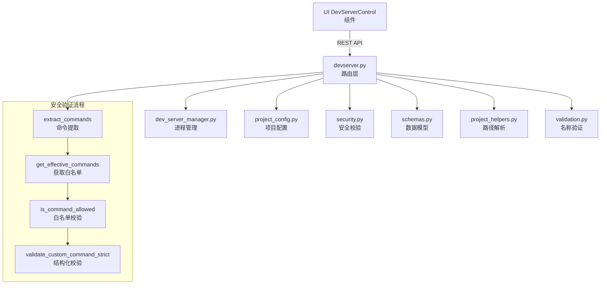

# `devserver.py` -- 开发服务器控制路由

> 源文件路径: `server/routers/devserver.py`

## 功能概述

`devserver.py` 提供了开发服务器(Dev Server)的启动、停止、状态查询和配置管理的 REST API 端点。它是前端 UI 中 DevServerControl 组件的后端支撑，使用户可以直接在 AutoForge 界面中启动和管理项目的开发服务器。

该模块实现了严格的安全验证机制，包括命令白名单校验和结构化命令解析，确保只允许安全的已知命令（如 `npm run dev`、`python -m uvicorn` 等）被执行。所有自定义命令在执行前都会经过双重安全校验：首先通过 `security.py` 的全局安全系统进行白名单匹配，然后通过本模块的结构化解析器进行进一步的严格验证。

路由前缀为 `/api/projects/{project_name}/devserver`，所有端点均需要提供项目名称参数。

## 依赖关系

### 导入依赖

| 模块 | 说明 |
|------|------|
| `fastapi` | 提供 `APIRouter` 和 `HTTPException` |
| `server.schemas` | 提供 `DevServerActionResponse`、`DevServerConfigResponse`、`DevServerConfigUpdate`、`DevServerStartRequest`、`DevServerStatus` 数据模型 |
| `server.services.dev_server_manager` | 通过 `get_devserver_manager` 获取开发服务器进程管理器实例 |
| `server.services.project_config` | 提供 `clear_dev_command`、`get_dev_command`、`get_project_config`、`set_dev_command` 项目配置函数 |
| `server.utils.project_helpers` | 通过 `get_project_path` 将项目名称解析为文件系统路径 |
| `server.utils.validation` | 通过 `validate_project_name` 验证项目名称合法性 |
| `security` | 提供 `extract_commands`、`get_effective_commands`、`is_command_allowed` 安全校验函数 |

### 被依赖

| 模块 | 引用内容 |
|------|----------|
| `server/routers/__init__.py` | 导入 `router` 作为 `devserver_router` 注册到 FastAPI 应用 |
| `server/main.py` | 通过 `__init__.py` 间接引用，注册到主应用路由 |
| `test_devserver_security.py` | 导入 `validate_custom_command_strict`、`ALLOWED_RUNNERS`、`BLOCKED_SHELLS` 等进行安全测试 |
| `ui/src/lib/api.ts` | 前端通过 REST API 调用开发服务器端点 |
| `ui/src/components/DebugLogViewer.tsx` | 前端通过 API 获取开发服务器状态信息 |

## 关键类/函数

### 常量定义

| 常量 | 说明 |
|------|------|
| `ALLOWED_RUNNERS` | 允许的命令运行器集合：`npm`、`pnpm`、`yarn`、`npx`、`uvicorn`、`python`、`python3`、`flask`、`poetry`、`cargo`、`go` |
| `ALLOWED_NPM_SCRIPTS` | 允许的 npm 脚本名称：`dev`、`start`、`serve`、`develop`、`server`、`preview` |
| `ALLOWED_PYTHON_MODULES` | 允许的 Python `-m` 模块：`uvicorn`、`flask`、`gunicorn`、`http.server` |
| `BLOCKED_SHELLS` | 禁止的 shell 解释器：`sh`、`bash`、`zsh`、`cmd`、`powershell`、`pwsh`、`cmd.exe` |

### `get_project_dir(project_name: str) -> Path`
- **参数**: `project_name` -- 项目名称
- **返回**: 已验证的项目目录 `Path` 对象
- **异常**: 当项目未在注册表中找到或目录不存在时抛出 `HTTPException(404)`
- **说明**: 通过注册表查找项目路径并验证其存在性

### `validate_custom_command_strict(cmd: str) -> None`
- **参数**: `cmd` -- 待验证的自定义命令字符串
- **异常**: 验证失败时抛出 `ValueError`
- **说明**: 对开发服务器命令进行严格的结构化白名单验证。使用 `shlex.split` 解析命令，然后逐一校验运行器名称、子命令和参数是否在允许列表中。具体规则包括：
  - 禁止直接使用 shell 解释器（防止命令注入）
  - Python 命令必须使用 `-m <module>` 或 `<script>.py` 形式，禁止 `-c` 一行代码执行
  - npm/pnpm/yarn 只允许运行预定义的安全脚本
  - uvicorn 必须指定 `module:app` 格式，且只允许有限的命令行标志
  - flask 只允许 `flask run [options]` 形式
  - poetry 只允许 `poetry run <command>` 形式

### `validate_dev_command(command: str, project_dir: Path) -> None`
- **参数**: `command` -- 命令字符串；`project_dir` -- 项目目录路径
- **异常**: 命令被阻止或不在白名单时抛出 `HTTPException(400)`
- **说明**: 通过 `security.py` 的安全系统验证命令，提取命令中所有可执行程序，逐一与项目级+组织级+全局白名单进行比对

### `get_devserver_status(project_name: str) -> DevServerStatus` [GET `/status`]
- **说明**: 获取开发服务器当前状态，包括运行状态、PID、检测到的 URL 和启动命令。会自动执行健康检查以检测崩溃的进程

### `start_devserver(project_name: str, request: DevServerStartRequest) -> DevServerActionResponse` [POST `/start`]
- **说明**: 启动开发服务器。禁止直接传入命令（防止任意命令执行），只使用通过配置端点设置的命令。执行前会进行双重安全验证

### `stop_devserver(project_name: str) -> DevServerActionResponse` [POST `/stop`]
- **说明**: 优雅地停止开发服务器进程及其所有子进程

### `get_devserver_config(project_name: str) -> DevServerConfigResponse` [GET `/config`]
- **说明**: 获取开发服务器配置，返回自动检测的项目类型、检测到的命令、自定义命令和最终生效的命令

### `update_devserver_config(project_name: str, update: DevServerConfigUpdate) -> DevServerConfigResponse` [PATCH `/config`]
- **说明**: 更新开发服务器配置。设置自定义命令时会进行安全验证，传入 `null` 可清除自定义命令并恢复为自动检测的命令

## 架构图

## 注意事项

1. **安全纵深防御**: 命令在执行前经过两层验证 -- 首先通过 `security.py` 的全局白名单系统，然后通过本模块的结构化命令解析器。即使配置文件被篡改，运行时验证仍能捕获不安全的命令。

2. **禁止直接命令执行**: `POST /start` 端点不接受请求体中的 `command` 参数，必须通过 `PATCH /config` 端点预先配置命令。这是一项重要的安全限制。

3. **跨平台兼容**: 命令解析使用 `shlex.split` 并根据平台自动调整 POSIX 模式，确保在 Windows 和 Unix 系统上都能正确解析。

4. **运行器白名单设计**: 白名单采用最小权限原则，只允许已知的安全开发工具。对每种运行器都有针对性的参数验证规则，防止参数注入攻击。
