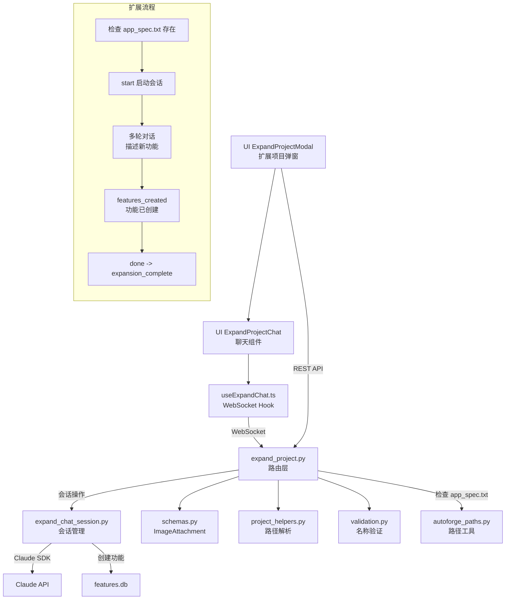

# `expand_project.py` -- 项目扩展路由

> 源文件路径: `server/routers/expand_project.py`

## 功能概述

`expand_project.py` 提供了通过自然语言交互向已有项目添加新功能特性的 WebSocket 和 REST API 端点。用户可以通过 ExpandProjectModal 界面描述想要添加的功能，Claude 会解析需求并在项目的 features.db 中创建对应的功能条目。

该模块是 AutoForge "扩展项目"工作流的后端支撑。与规格创建（spec_creation）不同的是，扩展操作面向的是已有规格文件的项目，用户可以通过对话式交互追加新功能而无需重新编写完整规格。支持图片附件，允许用户通过截图或设计稿来描述需求。

路由前缀为 `/api/expand`，WebSocket 端点为 `/api/expand/ws/{project_name}`。

## 依赖关系

### 导入依赖

| 模块 | 说明 |
|------|------|
| `fastapi` | 提供 `APIRouter`、`HTTPException`、`WebSocket`、`WebSocketDisconnect` |
| `pydantic` | 提供 `BaseModel` 和 `ValidationError` |
| `server.schemas` | 提供 `ImageAttachment` 图片附件数据模型 |
| `server.services.expand_chat_session` | 提供 `ExpandChatSession` 类及 `create_expand_session`、`get_expand_session`、`list_expand_sessions`、`remove_expand_session` 会话管理函数 |
| `server.utils.project_helpers` | 通过 `get_project_path` 将项目名称解析为文件系统路径 |
| `server.utils.validation` | 通过 `validate_project_name` 验证项目名称合法性 |
| `autoforge_paths` | 通过 `get_prompts_dir` 获取规格文件路径（在 WebSocket 内延迟导入） |

### 被依赖

| 模块 | 引用内容 |
|------|----------|
| `server/routers/__init__.py` | 导入 `router` 作为 `expand_project_router` 注册到 FastAPI 应用 |
| `server/main.py` | 通过 `__init__.py` 间接引用，注册到主应用路由 |
| `ui/src/hooks/useExpandChat.ts` | 前端通过 WebSocket 连接项目扩展聊天端点 |

## 关键类/函数

### Pydantic 模型

| 模型 | 说明 |
|------|------|
| `ExpandSessionStatus` | 扩展会话状态，包含 `project_name`、`is_active`、`is_complete`、`features_created`、`message_count` |

### REST 端点

#### `list_expand_sessions_endpoint()` [GET `/sessions`]
- **返回**: `list[str]` -- 活跃扩展会话的项目名称列表

#### `get_expand_session_status(project_name: str)` [GET `/sessions/{project_name}`]
- **返回**: `ExpandSessionStatus`
- **说明**: 获取扩展会话的状态信息，包括已创建的功能数量

#### `cancel_expand_session(project_name: str)` [DELETE `/sessions/{project_name}`]
- **说明**: 取消并移除扩展会话

### WebSocket 端点

#### `expand_project_websocket(websocket: WebSocket, project_name: str)` [WS `/ws/{project_name}`]
- **说明**: 项目扩展的交互式 WebSocket 端点

**前置检查:**
- 验证项目名称合法性
- 验证项目在注册表中存在
- 验证项目目录存在
- **验证项目有 `app_spec.txt` 文件** -- 没有规格的项目无法扩展

**客户端 -> 服务器:**

| 类型 | 字段 | 说明 |
|------|------|------|
| `start` | -- | 启动扩展会话（幂等操作，已存在则恢复） |
| `message` | `content: string, attachments?: list` | 发送描述新功能的消息，可附带图片 |
| `done` | -- | 用户完成功能添加 |
| `ping` | -- | 心跳保活 |

**服务器 -> 客户端:**

| 类型 | 字段 | 说明 |
|------|------|------|
| `text` | `content: string` | Claude 的文本流式块 |
| `features_created` | `count: int, features: list` | 已添加的功能列表 |
| `expansion_complete` | `total_added: int` | 扩展完成，返回总添加数 |
| `response_done` | -- | 单次响应完成 |
| `error` | `content: string` | 错误消息 |
| `pong` | -- | 心跳响应 |

## 架构图

## 注意事项

1. **规格前提条件**: 扩展功能要求项目已有 `app_spec.txt` 文件。WebSocket 连接时会检查此文件是否存在，不存在则以 4004 关闭连接并提示用户先创建规格。

2. **幂等启动**: `start` 消息是幂等的 -- 如果扩展会话已存在，不会创建新会话而是恢复已有会话，返回 "Resuming existing expansion session" 提示。

3. **图片附件**: 与 `spec_creation.py` 类似，支持 `attachments` 字段携带图片数据，允许用户通过截图描述需求。附件验证失败时返回错误而非崩溃。

4. **done 消息**: 客户端发送 `done` 类型消息表示用户完成了功能添加，服务器返回 `expansion_complete` 事件并包含总创建数。

5. **会话保持**: WebSocket 断开时不销毁会话，允许重新连接后恢复。这对于网络不稳定的情况尤为重要。

6. **错误处理**: 外层异常被捕获后记录日志并尝试向客户端发送错误消息，但不暴露内部异常细节（返回 "Internal server error"），避免信息泄露。
