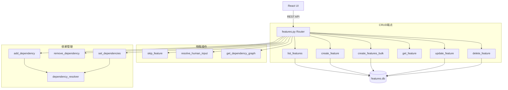

# `features.py` -- 功能特性管理 API 路由

> 源文件路径: `server/routers/features.py`

## 功能概述

`features.py` 实现了功能特性(Feature)的完整管理 API,挂载在 `/api/projects/{project_name}/features` 路径下。它支持功能的 CRUD 操作、批量创建、依赖关系管理、依赖图可视化查询、功能跳过以及人工输入请求的解决。

每个功能都存储在项目的 SQLite 数据库中(通过 SQLAlchemy ORM),包含优先级、分类、名称、描述、步骤、依赖关系和通过状态等字段。路由器提供了完善的依赖管理功能,包括添加/删除/设置依赖关系,并通过 `dependency_resolver` 模块进行循环依赖检测。

功能列表端点将功能按状态分为四类(待处理、进行中、已完成、等待人工输入),并实时计算每个功能的阻塞状态。删除功能时会自动清理其他功能中的引用依赖,防止出现永久阻塞的孤立依赖。

## 依赖关系

### 导入依赖

| 模块 | 说明 |
|------|------|
| `fastapi` | `APIRouter`, `HTTPException` |
| `server.schemas` | 功能和依赖相关的 Pydantic 模型 (11个) |
| `server.utils.project_helpers` | `get_project_path` 项目路径查找 |
| `server.utils.validation` | `validate_project_name` 项目名称校验 |
| `api.database` | `Feature` ORM 模型, `create_database` 数据库创建 (延迟导入) |
| `autoforge_paths` | `get_features_db_path` 数据库路径 (延迟导入) |
| `api.dependency_resolver` | `would_create_circular_dependency`, `MAX_DEPENDENCIES_PER_FEATURE` (延迟导入) |

### 被依赖

| 模块 | 引用内容 |
|------|----------|
| `server/routers/__init__.py` | `router` 导出为 `features_router` |
| `server/main.py` | 通过 `features_router` 注册到 FastAPI 应用 |

## 关键类/函数

### `get_db_session(project_dir: Path)`
- **类型**: 上下文管理器
- **参数**: `project_dir` - 项目目录路径
- **说明**: 为指定项目创建数据库会话,确保会话在异常时回滚并始终关闭。

### `feature_to_response(f, passing_ids) -> FeatureResponse`
- **参数**: `f` - Feature ORM 实例, `passing_ids` - 已通过特征 ID 集合 (可选)
- **返回值**: `FeatureResponse`
- **说明**: 将数据库模型转换为 API 响应,处理旧版 NULL 布尔值,动态计算阻塞状态和阻塞依赖列表。

### `list_features(project_name: str)`
- **路由**: `GET /api/projects/{project_name}/features`
- **返回值**: `FeatureListResponse` (含 pending, in_progress, done, needs_human_input 四个列表)
- **说明**: 按状态分类返回所有功能,按优先级排序。

### `create_feature(project_name, feature)`
- **路由**: `POST /api/projects/{project_name}/features`
- **返回值**: `FeatureResponse`
- **说明**: 创建单个功能。未指定优先级时自动分配为当前最大优先级+1。

### `create_features_bulk(project_name, bulk)`
- **路由**: `POST /api/projects/{project_name}/features/bulk`
- **返回值**: `FeatureBulkCreateResponse`
- **说明**: 批量创建功能,按序分配优先级。使用 `flush()` 而非 `commit()` 在事务内获取 ID,最终一次性提交。

### `get_dependency_graph(project_name)`
- **路由**: `GET /api/projects/{project_name}/features/graph`
- **返回值**: `DependencyGraphResponse` (含 nodes 和 edges)
- **说明**: 返回依赖图数据,适用于 React Flow 等图可视化库渲染。

### `update_feature(project_name, feature_id, update)`
- **路由**: `PATCH /api/projects/{project_name}/features/{feature_id}`
- **返回值**: `FeatureResponse`
- **说明**: 更新功能详情。已完成的功能不可编辑(不可变策略)。

### `delete_feature(project_name, feature_id)`
- **路由**: `DELETE /api/projects/{project_name}/features/{feature_id}`
- **说明**: 删除功能并自动清理其他功能中的引用依赖,返回受影响的功能列表。

### `skip_feature(project_name, feature_id)`
- **路由**: `PATCH /api/projects/{project_name}/features/{feature_id}/skip`
- **说明**: 将功能优先级设为最大值+1,移至队列末尾。

### `resolve_human_input(project_name, feature_id, response)`
- **路由**: `POST /api/projects/{project_name}/features/{feature_id}/resolve-human-input`
- **返回值**: `FeatureResponse`
- **说明**: 解决人工输入请求,验证必填字段,存储响应并将功能返回待处理队列。

### `add_dependency(project_name, feature_id, dep_id)`
- **路由**: `POST /api/projects/{project_name}/features/{feature_id}/dependencies/{dep_id}`
- **说明**: 添加依赖关系。验证自引用、存在性、最大数量限制和循环依赖。

### `remove_dependency(project_name, feature_id, dep_id)`
- **路由**: `DELETE /api/projects/{project_name}/features/{feature_id}/dependencies/{dep_id}`
- **说明**: 移除单个依赖关系。

### `set_dependencies(project_name, feature_id, update)`
- **路由**: `PUT /api/projects/{project_name}/features/{feature_id}/dependencies`
- **说明**: 一次性设置功能的所有依赖(替换模式),验证自引用、重复、存在性和循环依赖。

## 架构图

## 注意事项

1. **路由顺序**: 静态路径端点(`/bulk`, `/graph`)必须在参数化路径(`/{feature_id}`)之前声明,否则 FastAPI 会将 "bulk" 和 "graph" 解析为 feature_id。
2. **NULL 值处理**: `feature_to_response` 将旧版数据库中的 `NULL` 布尔字段视为 `False`,确保向后兼容。
3. **已完成功能不可变**: 已通过测试的功能不允许编辑,这是设计上的不可变策略。
4. **依赖清理**: 删除功能时自动清理所有引用该功能的依赖关系,防止产生永久阻塞。
5. **并发安全**: 批量创建中的优先级分配依赖 SQLite 的事务隔离,并发批量创建可能导致优先级重叠,但由于优先级可重排,这被认为是可接受的。
6. **循环依赖检测**: 使用 `api.dependency_resolver` 中的 Kahn 算法和 DFS 进行循环依赖检测,保证依赖图始终是有向无环图 (DAG)。
