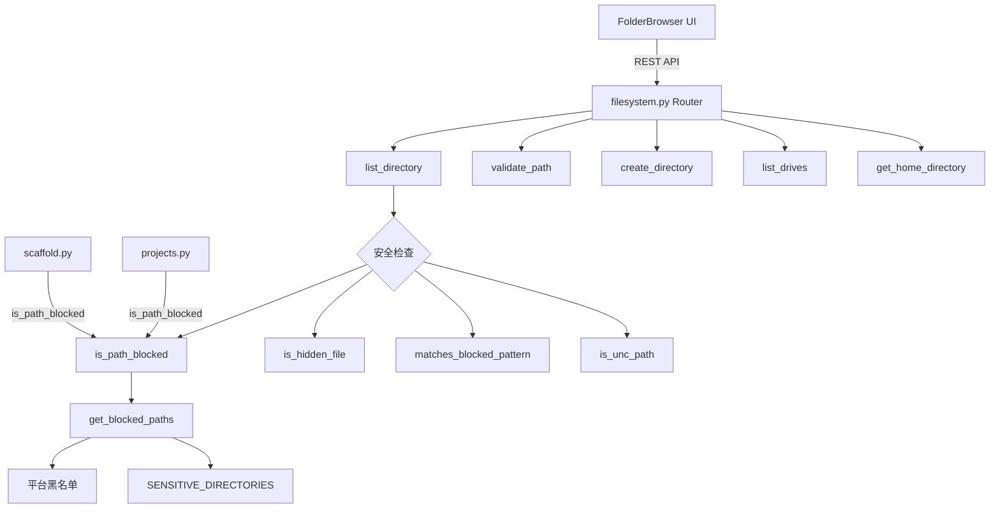

# `filesystem.py` -- 文件系统浏览 API 路由

> 源文件路径: `server/routers/filesystem.py`

## 功能概述

`filesystem.py` 实现了服务器端文件系统浏览 API,挂载在 `/api/filesystem` 路径下。它为 UI 中的项目文件夹选择器(FolderBrowser)提供后端支持,允许用户在创建项目时通过可视化界面浏览和选择目标目录。

该路由器实现了全面的安全控制:通过平台相关的目录黑名单(Windows/macOS/Linux 系统目录)和通用敏感目录黑名单(如 `.ssh`、`.aws`、`.gnupg` 等)阻止访问受保护的系统路径;通过隐藏文件模式匹配过滤敏感文件(如 `.env`、`.key`、`.pem`);通过 UNC 路径检测防止网络共享访问。

支持跨平台功能:在 Windows 上提供磁盘驱动器列表查询;在所有平台上支持路径验证(读写权限检查)和目录创建操作。

## 依赖关系

### 导入依赖

| 模块 | 说明 |
|------|------|
| `fastapi` | `APIRouter`, `HTTPException`, `Query` |
| `security` | `SENSITIVE_DIRECTORIES` 敏感目录集合 |
| `server.schemas` | `CreateDirectoryRequest`, `DirectoryEntry`, `DirectoryListResponse`, `DriveInfo`, `PathValidationResponse` |

### 被依赖

| 模块 | 引用内容 |
|------|----------|
| `server/routers/__init__.py` | `router` 导出为 `filesystem_router` |
| `server/main.py` | 通过 `filesystem_router` 注册到 FastAPI 应用 |
| `server/routers/projects.py` | `is_path_blocked` 用于项目创建时的路径安全检查 |
| `server/routers/scaffold.py` | `is_path_blocked` 用于脚手架操作的路径安全检查 |

## 关键类/函数

### 安全函数

#### `get_blocked_paths() -> frozenset[Path]`
- **返回值**: 所有被阻止路径的不可变集合
- **说明**: 组合平台特定黑名单和通用敏感目录黑名单。使用 `@functools.lru_cache(maxsize=1)` 缓存,因为平台和主目录在运行时不会改变。

#### `is_path_blocked(path: Path) -> bool`
- **参数**: `path` - 要检查的路径
- **返回值**: 路径是否被阻止
- **说明**: 检查路径是否恰好是或位于某个黑名单路径内。路径无法解析时视为阻止。被 `projects.py` 和 `scaffold.py` 也引用。

#### `is_hidden_file(path: Path) -> bool`
- **参数**: `path` - 文件/目录路径
- **返回值**: 是否为隐藏文件
- **说明**: 跨平台隐藏文件检测。Unix 检查点前缀,Windows 额外检查 `FILE_ATTRIBUTE_HIDDEN` 属性。

#### `matches_blocked_pattern(name: str) -> bool`
- **参数**: `name` - 文件名
- **返回值**: 是否匹配阻止模式
- **说明**: 检查文件名是否匹配预定义的敏感文件模式(如 `.env*`、`*.key`、`*.pem`、`*credentials*`、`*secrets*`)。

#### `is_unc_path(path_str: str) -> bool`
- **参数**: `path_str` - 路径字符串
- **返回值**: 是否为 UNC 路径
- **说明**: 检测 Windows 网络共享路径 (`\\` 或 `//` 前缀)。

### API 端点

#### `list_directory(path, show_hidden)`
- **路由**: `GET /api/filesystem/list`
- **参数**: `path` - 目录路径 (可选, 默认主目录), `show_hidden` - 是否显示隐藏文件
- **返回值**: `DirectoryListResponse`
- **说明**: 仅返回目录条目(用于文件夹选择)。包含子目录检测(`has_children`)、黑名单过滤和权限检查。Windows 平台额外返回驱动器列表。

#### `list_drives()`
- **路由**: `GET /api/filesystem/drives`
- **返回值**: `list[DriveInfo] | None`
- **说明**: Windows 专用端点,返回可用磁盘驱动器列表(含卷标)。非 Windows 平台返回 null。

#### `validate_path(path)`
- **路由**: `POST /api/filesystem/validate`
- **参数**: `path` - 要验证的路径
- **返回值**: `PathValidationResponse`
- **说明**: 验证路径的可访问性和可写性。用于创建项目前的路径预检。不存在的路径检查父目录的可写性。

#### `create_directory(request)`
- **路由**: `POST /api/filesystem/create-directory`
- **参数**: `request` - `CreateDirectoryRequest` (parent_path + name)
- **说明**: 在指定父目录中创建新目录。验证目录名(禁止 `..`、无效字符)、父目录存在性和权限。

#### `get_home_directory()`
- **路由**: `GET /api/filesystem/home`
- **返回值**: `{"path": ..., "display_path": ...}`
- **说明**: 返回用户主目录的 POSIX 和显示路径。

### 平台黑名单常量

#### `WINDOWS_BLOCKED` / `MACOS_BLOCKED` / `LINUX_BLOCKED`
- **说明**: 各平台的系统保护目录集合。

#### `UNIVERSAL_BLOCKED_RELATIVE`
- **说明**: 委托给 `security.py` 中的 `SENSITIVE_DIRECTORIES`,确保文件系统浏览器和 `EXTRA_READ_PATHS` 验证器共享同一数据源。

## 架构图

## 注意事项

1. **安全深度防御**: 多层安全检查 -- 平台系统目录黑名单、敏感目录黑名单、隐藏文件过滤、UNC 路径阻止、路径遍历防护。
2. **缓存优化**: `get_blocked_paths()` 使用 `lru_cache` 缓存,因为 `list_directory` 中每个目录条目都需要调用 `is_path_blocked`。
3. **仅目录模式**: `list_directory` 仅返回目录条目,不包含文件,因为其用途是文件夹选择。
4. **子目录检测**: `has_children` 字段通过尝试遍历子项来判断,权限不足时默认为无子目录,避免错误传播。
5. **共享安全数据源**: `UNIVERSAL_BLOCKED_RELATIVE` 直接引用 `security.py` 中的 `SENSITIVE_DIRECTORIES`,避免两处维护相同的黑名单。
6. **路径格式**: 所有返回的路径使用 POSIX 格式(正斜杠),确保跨平台一致性。
