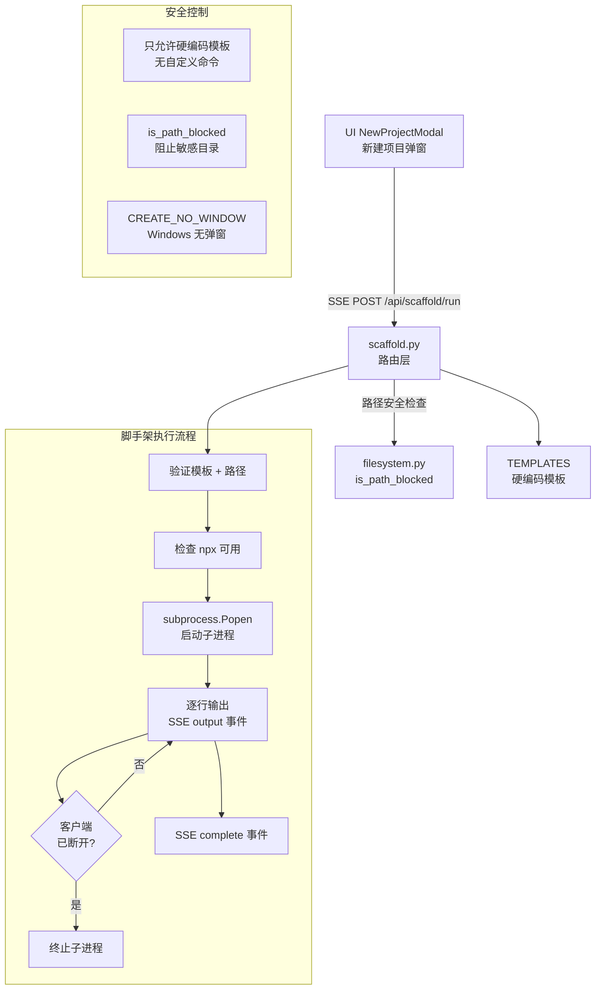

# `scaffold.py` -- 项目脚手架路由

> 源文件路径: `server/routers/scaffold.py`

## 功能概述

`scaffold.py` 提供了运行项目脚手架(Scaffold)命令的 SSE(Server-Sent Events) 流式端点。它支持通过预定义的模板命令创建项目骨架代码，例如使用 `create-agentic-app` 快速初始化一个 Next.js Agentic 应用。

该模块的核心安全设计是**硬编码模板**：所有可执行的脚手架命令都在 `TEMPLATES` 字典中预定义，不接受任何用户自定义命令。通过子进程方式执行命令，并将标准输出实时流式传输到前端。支持客户端断开检测，断开后自动终止子进程以避免资源泄漏。

路由前缀为 `/api/scaffold`。

## 依赖关系

### 导入依赖

| 模块 | 说明 |
|------|------|
| `fastapi` | 提供 `APIRouter`、`Request` |
| `fastapi.responses` | 提供 `StreamingResponse` 用于 SSE 流式响应 |
| `pydantic.BaseModel` | 用于定义请求数据模型 |
| `server.routers.filesystem` | 导入 `is_path_blocked` 函数进行路径安全检查 |

### 被依赖

| 模块 | 引用内容 |
|------|----------|
| `server/routers/__init__.py` | 导入 `router` 作为 `scaffold_router` 注册到 FastAPI 应用 |
| `server/main.py` | 通过 `__init__.py` 间接引用，注册到主应用路由 |
| `ui/src/components/NewProjectModal.tsx` | 前端通过 SSE 调用脚手架端点 |

## 关键类/函数

### 常量

| 常量 | 说明 |
|------|------|
| `TEMPLATES` | 硬编码的脚手架模板字典。当前包含 `"agentic-starter"` 模板，对应命令为 `["npx", "create-agentic-app@latest", ".", "-y", "-p", "npm", "--skip-git"]` |

### Pydantic 模型

#### `ScaffoldRequest`
- **字段**: `template: str` -- 模板名称；`target_path: str` -- 目标目录路径
- **说明**: 脚手架执行请求

### `_sse_event(data: dict) -> str`
- **参数**: `data` -- 要发送的事件数据
- **返回**: 格式化的 SSE 数据行（`data: {...}\n\n` 格式）
- **说明**: 将字典格式化为 SSE 协议的数据行

### `_stream_scaffold(template: str, target_path: str, request: Request)`
- **参数**: `template` -- 模板名称；`target_path` -- 目标路径；`request` -- FastAPI 请求对象
- **说明**: 异步生成器，执行脚手架命令并生成 SSE 事件流。流程如下：
  1. **模板验证**: 检查模板名称是否在 `TEMPLATES` 中
  2. **路径验证**: 解析路径、检查敏感目录阻止列表、验证目录存在性
  3. **工具检查**: 验证 `npx` 是否可用（Windows 上检查 `npx.cmd`）
  4. **命令构建**: 从模板获取命令数组，Windows 上自动添加 `.cmd` 后缀
  5. **子进程执行**: 通过 `subprocess.Popen` 启动命令，以目标路径为工作目录
  6. **输出流式传输**: 逐行读取 stdout 并发送 `output` 事件
  7. **断开检测**: 每行输出后检查客户端是否断开连接
  8. **完成通知**: 进程结束后发送 `complete` 事件（含退出码和成功标志）
  9. **清理**: finally 块中终止未退出的进程

**SSE 事件类型:**

| 类型 | 字段 | 说明 |
|------|------|------|
| `output` | `line: string` | 命令输出行 |
| `complete` | `success: bool, exit_code: int` | 命令完成 |
| `error` | `message: string` | 错误消息 |

### `run_scaffold(body: ScaffoldRequest, request: Request)` [POST `/run`]
- **返回**: `StreamingResponse`（MIME 类型 `text/event-stream`）
- **说明**: 脚手架执行端点。返回 SSE 流式响应，设置了 `Cache-Control: no-cache` 和 `X-Accel-Buffering: no` 头部以确保实时传输

## 架构图

## 注意事项

1. **只允许硬编码模板**: 这是最核心的安全设计。`TEMPLATES` 字典中预定义了所有允许的命令，用户只能选择模板名称，不能传入自定义命令。这从根本上防止了命令注入攻击。

2. **跨平台适配**:
   - Windows 上 `npx` 需要替换为 `npx.cmd`
   - Windows 上使用 `CREATE_NO_WINDOW` 创建标志避免弹出命令行窗口
   - 路径解析使用 `Path.resolve()` 确保跨平台一致性

3. **客户端断开处理**: 每次输出行后都检查 `request.is_disconnected()`，如果客户端已断开则跳出循环。`finally` 块确保子进程在任何情况下都会被清理（先 `terminate`，超时后 `kill`）。

4. **stdin 关闭**: 子进程的 `stdin` 设置为 `subprocess.DEVNULL`，防止命令等待用户输入导致进程挂起。

5. **事件循环协作**: `await asyncio.sleep(0)` 在每行输出后让出控制权给事件循环，确保断开检测和其他异步任务能够及时执行。

6. **路径安全**: 使用 `filesystem.is_path_blocked` 检查目标路径是否指向敏感目录（如 `.ssh`、`.aws` 等），复用了文件系统浏览器的安全机制。
