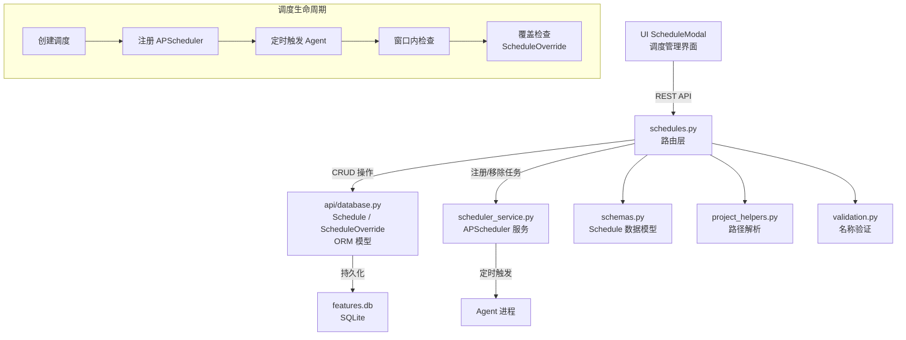

# `schedules.py` -- 定时调度管理路由

> 源文件路径: `server/routers/schedules.py`

## 功能概述

`schedules.py` 提供了 Agent 定时调度的完整 CRUD REST API 端点。用户可以为每个项目创建基于时间的调度规则，指定 Agent 在哪些日期和时段自动运行。调度信息持久化在 SQLite 数据库中，并通过 APScheduler 服务实现实际的定时触发。

该模块实现了调度管理的核心业务逻辑，包括：创建/读取/更新/删除调度记录、计算下次运行时间、判断当前是否处于调度窗口内，以及在创建启用状态的调度时立即启动 Agent（如果当前恰好在调度窗口内）。每个项目最多允许 50 个调度，防止资源耗尽。

路由前缀为 `/api/projects/{project_name}/schedules`，所有端点通过项目名称关联到对应的 SQLite 数据库。

## 依赖关系

### 导入依赖

| 模块 | 说明 |
|------|------|
| `fastapi` | 提供 `APIRouter` 和 `HTTPException` |
| `sqlalchemy.orm.Session` | SQLAlchemy 数据库会话 |
| `server.schemas` | 提供 `ScheduleCreate`、`ScheduleUpdate`、`ScheduleResponse`、`ScheduleListResponse`、`NextRunResponse` 数据模型 |
| `server.utils.project_helpers` | 通过 `get_project_path` 将项目名称解析为文件系统路径 |
| `server.utils.validation` | 通过 `validate_project_name` 验证项目名称合法性 |
| `api.database` | 提供 `Schedule`、`ScheduleOverride` ORM 模型及 `create_database` 函数（延迟导入） |
| `server.services.scheduler_service` | 通过 `get_scheduler` 获取 APScheduler 服务实例（延迟导入） |

### 被依赖

| 模块 | 引用内容 |
|------|----------|
| `server/routers/__init__.py` | 导入 `router` 作为 `schedules_router` 注册到 FastAPI 应用 |
| `server/main.py` | 通过 `__init__.py` 间接引用，注册到主应用路由 |
| `ui/src/lib/api.ts` | 前端通过 REST API 调用调度管理端点 |

## 关键类/函数

### 常量

| 常量 | 值 | 说明 |
|------|-----|------|
| `MAX_SCHEDULES_PER_PROJECT` | `50` | 每个项目的最大调度数量，防止资源耗尽 |

### `_schedule_to_response(schedule: ScheduleModel) -> ScheduleResponse`
- **参数**: `schedule` -- SQLAlchemy Schedule ORM 对象
- **返回**: Pydantic `ScheduleResponse` 模型
- **说明**: 使用 `model_validate` 将 ORM 对象转换为 Pydantic 响应模型，正确处理 SQLAlchemy Column 描述符到 Python 类型的转换

### `_get_db_session(project_name: str) -> Generator[Tuple[Session, Path], None, None]`
- **参数**: `project_name` -- 项目名称
- **返回**: 上下文管理器，yield `(Session, Path)` 元组
- **异常**: 项目未找到时抛出 `HTTPException(404)`
- **说明**: 为指定项目创建数据库会话的上下文管理器。自动处理项目名称验证、路径查找、数据库连接创建，并在异常时自动回滚，最终关闭会话

### `list_schedules(project_name: str) -> ScheduleListResponse` [GET `""`]
- **说明**: 获取项目的所有调度记录，按开始时间排序

### `create_schedule(project_name: str, data: ScheduleCreate) -> ScheduleResponse` [POST `""`]
- **说明**: 创建新调度。包含以下业务逻辑：
  1. 检查是否超过 50 条调度限制
  2. 创建数据库记录
  3. 若调度为启用状态，注册到 APScheduler
  4. 若当前正处于调度窗口内且无手动停止覆盖，立即启动 Agent

### `get_next_scheduled_run(project_name: str) -> NextRunResponse` [GET `/next`]
- **说明**: 计算项目下次调度运行的时间。遍历所有启用的调度，区分当前活跃窗口和未来窗口，考虑手动停止覆盖(ScheduleOverride)的影响

### `get_schedule(project_name: str, schedule_id: int) -> ScheduleResponse` [GET `/{schedule_id}`]
- **说明**: 按 ID 获取单条调度记录

### `update_schedule(project_name: str, schedule_id: int, data: ScheduleUpdate) -> ScheduleResponse` [PATCH `/{schedule_id}`]
- **说明**: 更新调度。使用 `model_dump(exclude_unset=True)` 实现部分更新（只更新请求中明确提供的字段）。更新后同步更新 APScheduler 中的任务

### `delete_schedule(project_name: str, schedule_id: int)` [DELETE `/{schedule_id}`]
- **说明**: 删除调度。先从 APScheduler 移除定时任务，再从数据库删除记录

### `_calculate_window_end(schedule, now: datetime) -> datetime`
- **参数**: `schedule` -- 调度对象；`now` -- 当前 UTC 时间
- **返回**: 当前窗口的结束时间
- **说明**: 根据调度的开始时间和持续时长计算当前活跃窗口的结束时间。处理跨天窗口的情况

### `_calculate_next_start(schedule, now: datetime) -> datetime | None`
- **参数**: `schedule` -- 调度对象；`now` -- 当前 UTC 时间
- **返回**: 下次开始时间，如果 7 天内无活跃日则返回 `None`
- **说明**: 计算调度的下一次启动时间，考虑每周活跃日的配置，在 7 天范围内查找下一个匹配日

## 架构图

## 注意事项

1. **延迟导入模式**: `api.database` 和 `scheduler_service` 使用延迟导入（在函数内部导入），避免循环依赖和启动时的模块加载顺序问题。

2. **创建即启动**: 创建启用状态的调度时，如果当前恰好处于调度窗口内，会立即启动 Agent，而不是等到 cron 的下一次触发。这提供了更好的用户体验。

3. **ScheduleOverride 机制**: 通过 `ScheduleOverride` 表支持手动停止覆盖，用户可以在调度窗口内临时停止 Agent 而不影响调度配置。覆盖记录有过期时间。

4. **部分更新语义**: `PATCH` 端点使用 `exclude_unset=True` 确保只更新请求中明确包含的字段，允许发送 `{"model": null}` 来清除值，区别于完全省略该字段。

5. **资源限制**: 每个项目最多 50 个调度 (`MAX_SCHEDULES_PER_PROJECT`)，防止恶意或意外创建大量调度导致资源耗尽。
