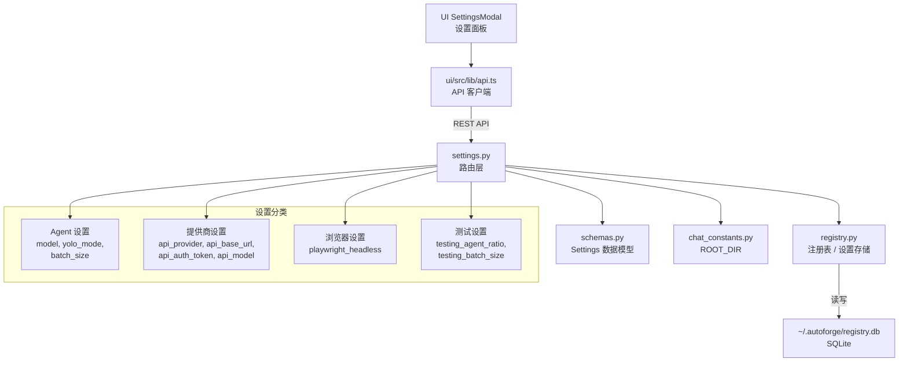

# `settings.py` -- 全局设置管理路由

> 源文件路径: `server/routers/settings.py`

## 功能概述

`settings.py` 提供了 AutoForge 全局设置的 REST API 端点。全局设置存储在注册表数据库(`registry.db`)中，跨所有项目共享，包括模型选择、YOLO 模式、批处理大小、API 提供商配置等。

该模块是 UI 设置面板(SettingsModal)的后端支撑，负责三类功能：一是可用 AI 模型和 API 提供商的查询；二是全局设置的读取和更新；三是切换 API 提供商时的自动化配置（如自动设置 base URL 和默认模型）。支持 Claude（默认）、GLM（智谱AI）、Ollama（本地模型）、Kimi（月之暗面）等多个 API 提供商。

路由前缀为 `/api/settings`。

## 依赖关系

### 导入依赖

| 模块 | 说明 |
|------|------|
| `fastapi` | 提供 `APIRouter` |
| `server.schemas` | 提供 `ModelInfo`、`ModelsResponse`、`ProviderInfo`、`ProvidersResponse`、`SettingsResponse`、`SettingsUpdate` 数据模型 |
| `server.services.chat_constants` | 提供 `ROOT_DIR` 根目录路径 |
| `registry` | 提供 `API_PROVIDERS`、`AVAILABLE_MODELS`、`DEFAULT_MODEL`、`get_all_settings`、`get_setting`、`set_setting` 设置存储函数 |

### 被依赖

| 模块 | 引用内容 |
|------|----------|
| `server/routers/__init__.py` | 导入 `router` 作为 `settings_router` 注册到 FastAPI 应用 |
| `server/main.py` | 通过 `__init__.py` 间接引用，注册到主应用路由 |
| `ui/src/lib/api.ts` | 前端通过 REST API 调用设置管理端点 |

## 关键类/函数

### 辅助函数

#### `_parse_yolo_mode(value: str | None) -> bool`
- **说明**: 将存储的字符串值解析为布尔值。默认为 `False`

#### `_parse_int(value: str | None, default: int) -> int`
- **说明**: 安全解析整数设置值，解析失败时返回默认值

#### `_parse_bool(value: str | None, default: bool = False) -> bool`
- **说明**: 安全解析布尔设置值，值为 "true"（不区分大小写）时返回 `True`

### REST 端点

#### `get_available_providers()` [GET `/providers`]
- **返回**: `ProvidersResponse`
- **说明**: 获取所有可用的 API 提供商列表。从 `registry.API_PROVIDERS` 读取提供商定义，返回每个提供商的 ID、名称、base URL、可用模型列表、默认模型和是否需要认证令牌

#### `get_available_models()` [GET `/models`]
- **返回**: `ModelsResponse`
- **说明**: 获取当前选中 API 提供商的可用模型列表。如果当前提供商不是 Claude，则返回该提供商特定的模型列表；否则返回 Claude 的默认模型列表

#### `get_settings()` [GET `""`]
- **返回**: `SettingsResponse`
- **说明**: 获取当前全局设置，包括:
  - `yolo_mode` -- YOLO 模式开关
  - `model` -- 当前选中的模型
  - `glm_mode` / `ollama_mode` -- 派生布尔值，基于 `api_provider` 计算
  - `testing_agent_ratio` -- 测试 Agent 比例
  - `playwright_headless` -- Playwright 是否无头模式
  - `batch_size` / `testing_batch_size` -- 编码/测试批处理大小
  - `api_provider` -- 当前 API 提供商
  - `api_base_url` -- API base URL
  - `api_has_auth_token` -- 是否已设置认证令牌（布尔值，不返回令牌本身）
  - `api_model` -- API 提供商指定的模型

#### `update_settings(update: SettingsUpdate)` [PATCH `""`]
- **返回**: `SettingsResponse`
- **说明**: 更新全局设置。支持部分更新（只更新请求中包含的字段）。切换 API 提供商时包含以下自动化逻辑：
  1. 如果新提供商定义了 base URL，自动设置 `api_base_url`
  2. 如果新提供商有默认模型且请求中未指定模型，自动设置 `api_model`

## 架构图

## 注意事项

1. **设置存储为字符串**: `registry` 模块将所有设置值存储为字符串。本路由中的 `_parse_*` 辅助函数负责将字符串转换为适当的 Python 类型。

2. **认证令牌安全**: `api_auth_token` 不会在 GET 响应中返回，只返回 `api_has_auth_token` 布尔值表示是否已设置。这防止了令牌泄露。

3. **提供商切换自动化**: 切换 API 提供商时自动配置 base URL 和默认模型，减少用户手动配置的负担。但只在提供商实际发生变化时才触发自动配置。

4. **glm_mode 和 ollama_mode**: 这两个字段是从 `api_provider` 派生的布尔值，提供向后兼容。最初 GLM 和 Ollama 是独立的模式开关，后来统一为提供商模型。

5. **MIME 类型修复**: 文件开头包含 `mimetypes.add_type("text/javascript", ".js", True)`，修复 Windows 系统上静态文件服务的 MIME 类型问题。虽然这不属于设置路由的逻辑，但必须在 StaticFiles 挂载前执行。

6. **sys.path 操作**: 为了导入位于项目根目录的 `registry` 模块，需要将根目录加入 `sys.path`。这是当前项目结构的一个技术约束。
