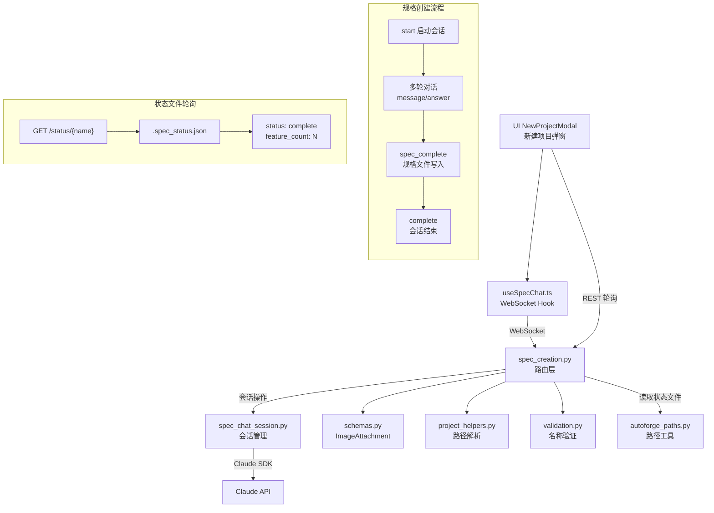

# `spec_creation.py` -- 应用规格创建路由

> 源文件路径: `server/routers/spec_creation.py`

## 功能概述

`spec_creation.py` 提供了交互式应用规格(App Spec)创建的 WebSocket 和 REST API 端点。当用户创建新项目时，可以通过与 Claude 的对话式交互来生成应用规格文件(`app_spec.txt`)，该文件定义了项目的所有功能特性和实现要求。

该模块包含两部分功能：REST 端点用于管理创建会话的生命周期（查询状态、取消会话）和检查规格文件的生成状态；WebSocket 端点实现实时的对话式交互，支持文本消息、图片附件、结构化问答等多种交互模式。在 Claude 完成规格编写后，会发出 `spec_complete` 事件通知前端。

路由前缀为 `/api/spec`，WebSocket 端点为 `/api/spec/ws/{project_name}`。

## 依赖关系

### 导入依赖

| 模块 | 说明 |
|------|------|
| `fastapi` | 提供 `APIRouter`、`HTTPException`、`WebSocket`、`WebSocketDisconnect` |
| `pydantic` | 提供 `BaseModel` 和 `ValidationError` |
| `server.schemas` | 提供 `ImageAttachment` 图片附件数据模型 |
| `server.services.spec_chat_session` | 提供 `SpecChatSession` 类及 `create_session`、`get_session`、`list_sessions`、`remove_session` 会话管理函数 |
| `server.utils.project_helpers` | 通过 `get_project_path` 将项目名称解析为文件系统路径 |
| `server.utils.validation` | 通过 `validate_project_name` 和 `is_valid_project_name` 验证项目名称 |
| `autoforge_paths` | 通过 `get_prompts_dir` 获取规格状态文件路径（延迟导入） |

### 被依赖

| 模块 | 引用内容 |
|------|----------|
| `server/routers/__init__.py` | 导入 `router` 作为 `spec_creation_router` 注册到 FastAPI 应用 |
| `server/main.py` | 通过 `__init__.py` 间接引用，注册到主应用路由 |
| `ui/src/hooks/useSpecChat.ts` | 前端通过 WebSocket 连接规格创建聊天端点 |

## 关键类/函数

### Pydantic 模型

| 模型 | 说明 |
|------|------|
| `SpecSessionStatus` | 会话状态，包含 `project_name`、`is_active`、`is_complete`、`message_count` |
| `SpecFileStatus` | 规格文件状态，包含 `exists`、`status`（complete/in_progress/not_started）、`feature_count`、`timestamp`、`files_written` |

### REST 端点

#### `list_spec_sessions()` [GET `/sessions`]
- **返回**: `list[str]` -- 活跃会话的项目名称列表

#### `get_session_status(project_name: str)` [GET `/sessions/{project_name}`]
- **返回**: `SpecSessionStatus`
- **说明**: 获取规格创建会话的状态信息

#### `cancel_session(project_name: str)` [DELETE `/sessions/{project_name}`]
- **说明**: 取消并移除规格创建会话

#### `get_spec_file_status(project_name: str)` [GET `/status/{project_name}`]
- **返回**: `SpecFileStatus`
- **说明**: 通过读取项目目录下的 `.spec_status.json` 文件检查规格创建进度。该端点用于前端轮询，检测 Claude 是否已完成规格文件的编写。Claude 会在完成所有规格工作后写入此状态文件

### WebSocket 端点

#### `spec_chat_websocket(websocket: WebSocket, project_name: str)` [WS `/ws/{project_name}`]
- **说明**: 规格创建的交互式 WebSocket 端点

**客户端 -> 服务器:**

| 类型 | 字段 | 说明 |
|------|------|------|
| `start` | -- | 启动规格创建会话 |
| `message` | `content: string, attachments?: list` | 发送用户消息，可附带图片 |
| `answer` | `answers: dict, tool_id: string` | 回答结构化问题 |
| `ping` | -- | 心跳保活 |

**服务器 -> 客户端:**

| 类型 | 字段 | 说明 |
|------|------|------|
| `text` | `content: string` | Claude 的文本流式块 |
| `question` | `questions: list, tool_id: string` | 结构化问题 |
| `spec_complete` | `path: string` | 规格文件创建完成 |
| `file_written` | `path: string` | 其他文件写入完成 |
| `complete` | `path?: string` | 整个会话完成 |
| `response_done` | -- | 单次响应完成 |
| `error` | `content: string` | 错误消息 |
| `pong` | -- | 心跳响应 |

## 架构图

## 注意事项

1. **spec_complete 与 complete 的区别**: `spec_complete` 表示规格文件本身已写入磁盘，但 Claude 可能还在写入其他文件。`complete` 在 `response_done` 之后发送，表示整个会话真正结束。

2. **图片附件支持**: `message` 类型消息支持 `attachments` 字段携带图片数据（通过 `ImageAttachment` 模型验证）。允许空文本内容但必须至少有文本或附件之一。

3. **状态文件轮询**: `GET /status/{project_name}` 端点读取 `.spec_status.json` 文件来检测 Claude 的工作进度。这是一种轮询机制，作为 WebSocket 事件的补充。

4. **会话保持**: 与 `assistant_chat.py` 类似，WebSocket 断开连接时不销毁会话，允许用户重新连接后恢复。

5. **spec_complete 跟踪逻辑**: WebSocket 处理中使用 `spec_complete_received` 标志跟踪规格是否完成，在 `response_done` 到达后才发送最终的 `complete` 事件，确保所有中间内容都已传输。
