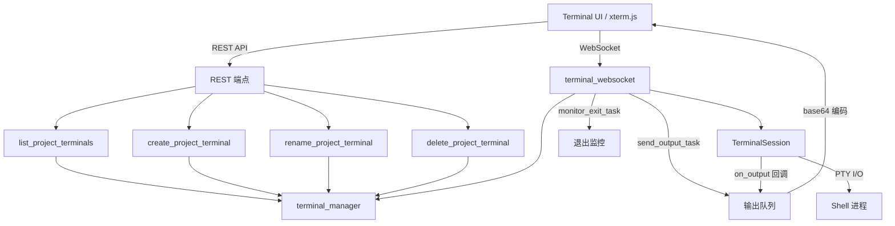

# `terminal.py` -- 交互式终端 API 路由

> 源文件路径: `server/routers/terminal.py`

## 功能概述

`terminal.py` 实现了交互式终端的 REST 和 WebSocket API,挂载在 `/api/terminal` 路径下。它为 UI 中的多标签终端组件(Terminal/TerminalTabs)提供后端支持,允许用户在浏览器中直接操作项目目录下的真实 shell 终端。

该路由器提供两类接口:REST 端点用于终端元数据管理(创建、列表、重命名、删除);WebSocket 端点 `/ws/{project_name}/{terminal_id}` 用于双向实时终端 I/O。WebSocket 协议支持 base64 编码的输入输出数据、终端窗口尺寸调整和心跳保活。

终端会话采用延迟启动模式:WebSocket 连接建立后不立即创建 PTY,而是等待客户端发送第一个 `resize` 消息时才以正确的终端尺寸启动 PTY,避免初始尺寸不匹配导致的显示问题。多个客户端可以连接到同一个终端会话,最后一个客户端断开时才会停止会话。

## 依赖关系

### 导入依赖

| 模块 | 说明 |
|------|------|
| `fastapi` | `APIRouter`, `HTTPException`, `WebSocket`, `WebSocketDisconnect` |
| `pydantic` | `BaseModel` 请求/响应模型 |
| `server.services.terminal_manager` | 终端会话管理函数 (6个) |
| `server.utils.project_helpers` | `get_project_path` 项目路径查找 |
| `server.utils.validation` | `is_valid_project_name` 项目名称校验 |

### 被依赖

| 模块 | 引用内容 |
|------|----------|
| `server/routers/__init__.py` | `router` 导出为 `terminal_router` |
| `server/main.py` | 通过 `terminal_router` 注册到 FastAPI 应用 |

## 关键类/函数

### 辅助类

#### `TerminalCloseCode`
- **说明**: WebSocket 关闭码常量类。
- **常量**: `INVALID_PROJECT_NAME = 4000`, `PROJECT_NOT_FOUND = 4004`, `FAILED_TO_START = 4500`

#### `CreateTerminalRequest(BaseModel)`
- **字段**: `name` (可选字符串)
- **说明**: 创建终端的请求体。

#### `RenameTerminalRequest(BaseModel)`
- **字段**: `name` (字符串)
- **说明**: 重命名终端的请求体。

#### `TerminalInfoResponse(BaseModel)`
- **字段**: `id`, `name`, `created_at`
- **说明**: 终端信息响应模型。

### `validate_terminal_id(terminal_id: str) -> bool`
- **参数**: `terminal_id` - 终端 ID
- **返回值**: 是否有效
- **说明**: 使用正则 `^[a-zA-Z0-9]{1,16}$` 校验终端 ID 格式。

### REST 端点

#### `list_project_terminals(project_name)`
- **路由**: `GET /api/terminal/{project_name}`
- **返回值**: `list[TerminalInfoResponse]`
- **说明**: 列出项目的所有终端。如果没有终端则自动创建一个默认终端。

#### `create_project_terminal(project_name, request)`
- **路由**: `POST /api/terminal/{project_name}`
- **返回值**: `TerminalInfoResponse`
- **说明**: 为项目创建新终端,可选自定义名称。

#### `rename_project_terminal(project_name, terminal_id, request)`
- **路由**: `PATCH /api/terminal/{project_name}/{terminal_id}`
- **返回值**: `TerminalInfoResponse`
- **说明**: 重命名终端。

#### `delete_project_terminal(project_name, terminal_id)`
- **路由**: `DELETE /api/terminal/{project_name}/{terminal_id}`
- **说明**: 删除终端,先停止运行中的会话再删除元数据。

### WebSocket 端点

#### `terminal_websocket(websocket, project_name, terminal_id)`
- **路由**: `WS /api/terminal/ws/{project_name}/{terminal_id}`
- **说明**: 交互式终端 WebSocket 端点,实现双向 PTY 通信。

**客户端 -> 服务器消息协议**:
| 类型 | 格式 | 说明 |
|------|------|------|
| `input` | `{"type": "input", "data": "<base64>"}` | 键盘输入 (base64 编码, 上限 64KB) |
| `resize` | `{"type": "resize", "cols": 80, "rows": 24}` | 终端窗口尺寸调整 |
| `ping` | `{"type": "ping"}` | 心跳保活 |

**服务器 -> 客户端消息协议**:
| 类型 | 格式 | 说明 |
|------|------|------|
| `output` | `{"type": "output", "data": "<base64>"}` | PTY 输出 (base64 编码) |
| `exit` | `{"type": "exit", "code": 0}` | Shell 进程退出 |
| `pong` | `{"type": "pong"}` | 心跳响应 |
| `error` | `{"type": "error", "message": "..."}` | 错误消息 |

**内部实现**:
- `send_output_task`: 后台任务,从输出队列取出数据并发送到 WebSocket
- `monitor_exit_task`: 后台任务,监控终端会话是否退出
- `on_output`: 回调函数,将 PTY 输出放入异步队列
- 延迟启动: 等待第一个 `resize` 消息后再创建 PTY,确保尺寸正确
- 尺寸限制: cols 范围 10-500, rows 范围 5-200

## 架构图

## 注意事项

1. **延迟启动模式**: PTY 不在 WebSocket 连接时立即创建,而是等待客户端发送第一个 `resize` 消息。这确保 PTY 从一开始就使用正确的终端尺寸,避免 xterm.js 初始化后的尺寸不匹配问题。
2. **输入大小限制**: base64 编码的输入数据限制为 64KB,防止 DoS 攻击。
3. **多客户端支持**: 多个 WebSocket 客户端可连接同一终端会话。通过引用计数(output callbacks 数量)管理生命周期,仅在最后一个客户端断开时停止会话。
4. **安全校验**: WebSocket 先接受连接再校验参数,避免出现不透明的 403 错误。无效参数时发送错误消息后使用自定义关闭码断开。
5. **终端 ID 格式**: 仅允许 1-16 位字母数字字符,防止注入攻击。
6. **资源清理**: `finally` 块确保后台任务被取消、输出回调被移除、必要时终端会话被停止,防止资源泄漏。
7. **尺寸约束**: 终端列数限制在 10-500,行数限制在 5-200,防止异常值导致 PTY 问题。
