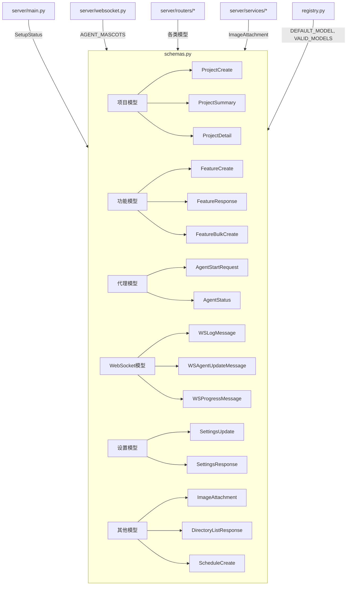

# `schemas.py` -- API 请求/响应 Pydantic 数据模型

> 源文件路径: `server/schemas.py`

## 功能概述

`schemas.py` 是整个 FastAPI 服务器的数据模型定义文件,使用 Pydantic v2 定义了所有 REST API 端点的请求和响应模型。这些模型提供自动数据验证、序列化/反序列化以及 OpenAPI 文档生成。

文件按功能模块组织,涵盖项目管理、功能特性、依赖图、代理控制、系统设置、WebSocket 消息、规格聊天、文件系统浏览、设置管理、开发服务器和定时调度等完整的数据模型体系。每个模型都包含字段级别的验证规则,如正则模式匹配、取值范围约束、base64 编码校验等。

该文件还定义了系统中使用的关键常量和类型别名,如 `AgentState` 状态类型、`AgentType` 代理类型和 `AGENT_MASCOTS` 吉祥物名称列表,这些在多代理跟踪和 WebSocket 消息中被广泛引用。

## 依赖关系

### 导入依赖

| 模块 | 说明 |
|------|------|
| `pydantic` | `BaseModel`, `Field`, `field_validator` 数据验证框架 |
| `registry` | `DEFAULT_MODEL`, `VALID_MODELS` 模型常量 (单一事实来源) |

### 被依赖

| 模块 | 引用内容 |
|------|----------|
| `server/main.py` | `SetupStatus` |
| `server/websocket.py` | `AGENT_MASCOTS` |
| `server/routers/projects.py` | `ProjectCreate`, `ProjectDetail`, `ProjectPrompts`, `ProjectPromptsUpdate`, `ProjectSettingsUpdate`, `ProjectStats`, `ProjectSummary` |
| `server/routers/features.py` | `DependencyGraphEdge`, `DependencyGraphNode`, `DependencyGraphResponse`, `DependencyUpdate`, `FeatureBulkCreate`, `FeatureBulkCreateResponse`, `FeatureCreate`, `FeatureListResponse`, `FeatureResponse`, `FeatureUpdate`, `HumanInputResponse` |
| `server/routers/agent.py` | `AgentActionResponse`, `AgentStartRequest`, `AgentStatus` |
| `server/routers/filesystem.py` | `CreateDirectoryRequest`, `DirectoryEntry`, `DirectoryListResponse`, `DriveInfo`, `PathValidationResponse` |
| `server/routers/settings.py` | `ModelInfo`, `ModelsResponse`, `ProviderInfo`, `ProvidersResponse`, `SettingsResponse`, `SettingsUpdate` |
| `server/routers/devserver.py` | 开发服务器相关模型 |
| `server/routers/schedules.py` | 调度相关模型 |
| `server/routers/spec_creation.py` | `ImageAttachment` |
| `server/routers/expand_project.py` | `ImageAttachment` |
| `server/services/spec_chat_session.py` | `ImageAttachment` |
| `server/services/expand_chat_session.py` | `ImageAttachment` |

## 关键类/函数

### 项目模型

#### `ProjectCreate(BaseModel)`
- **字段**: `name` (1-50字符, 字母数字加下划线连字符), `path` (绝对路径), `spec_method` ("claude" | "manual")
- **说明**: 创建项目的请求模型,`name` 使用正则限制防止路径遍历。

#### `ProjectSummary(BaseModel)` / `ProjectDetail(BaseModel)`
- **字段**: `name`, `path`, `has_spec`, `stats`, `default_concurrency`
- **说明**: 项目列表/详情响应模型。`ProjectDetail` 额外包含 `prompts_dir`。

#### `ProjectSettingsUpdate(BaseModel)`
- **字段**: `default_concurrency` (1-5, 可选)
- **说明**: 更新项目级设置,带取值范围验证。

### 功能特性模型

#### `FeatureResponse(FeatureBase)`
- **字段**: `id`, `priority`, `passes`, `in_progress`, `blocked` (计算字段), `blocking_dependencies`, `needs_human_input`, `human_input_request`, `human_input_response`
- **说明**: 功能响应模型,`blocked` 和 `blocking_dependencies` 为运行时计算字段。

#### `FeatureBulkCreate(BaseModel)`
- **字段**: `features` (FeatureCreate 列表), `starting_priority` (可选)
- **说明**: 批量创建功能的请求模型。

### 代理模型

#### `AgentStartRequest(BaseModel)`
- **字段**: `yolo_mode`, `model`, `parallel_mode` (已弃用), `max_concurrency` (1-5), `testing_agent_ratio` (0-3)
- **说明**: 启动代理请求,所有字段均为可选,未提供时使用全局设置默认值。`model` 验证器支持 Claude 模型列表校验和替代供应商的任意模型名。

#### `AgentStatus(BaseModel)`
- **字段**: `status` (stopped|running|paused|crashed|pausing|paused_graceful), `pid`, `started_at`, `yolo_mode`, `model`, `max_concurrency`, `testing_agent_ratio`
- **说明**: 代理当前状态的响应模型。

### WebSocket 消息模型

#### `WSLogMessage` / `WSAgentStatusMessage` / `WSAgentUpdateMessage` / `WSProgressMessage`
- **说明**: 定义 WebSocket 推送消息的结构化类型,每种消息通过 `type` 字段的字面量值进行区分。

### 设置模型

#### `SettingsUpdate(BaseModel)`
- **字段**: `yolo_mode`, `model`, `testing_agent_ratio`, `playwright_headless`, `batch_size` (1-15), `testing_batch_size` (1-15), `api_provider`, `api_base_url`, `api_auth_token` (只写), `api_model`
- **说明**: 全局设置更新请求,`api_auth_token` 是只写字段,永远不会在响应中返回。

### 常量

#### `AgentState`
- **类型**: `Literal["idle", "thinking", "working", "testing", "success", "error", "struggling"]`
- **说明**: 代理状态类型,用于多代理跟踪。

#### `AGENT_MASCOTS`
- **值**: `["Spark", "Fizz", "Octo", "Hoot", "Buzz"]`
- **说明**: 代理吉祥物名称列表,按索引分配。

#### `MAX_IMAGE_SIZE`
- **值**: `5 * 1024 * 1024` (5 MB)
- **说明**: 规格聊天中图片附件的最大文件大小限制。

## 架构图

## 注意事项

1. **模型常量来源**: `VALID_MODELS` 和 `DEFAULT_MODEL` 从 `registry` 模块导入,确保整个系统使用统一的模型列表。导入时会将项目根目录加入 `sys.path`。
2. **安全验证**: 多处使用 `field_validator` 装饰器进行严格的输入校验,包括 URL 协议前缀检查、base64 大小限制、并发度范围约束等。
3. **弃用字段**: `AgentStartRequest.parallel_mode` 已标记为弃用,建议使用 `max_concurrency` 替代。
4. **只写字段**: `SettingsUpdate.api_auth_token` 用于写入 API 认证令牌但永远不会在 `SettingsResponse` 中返回,以防止凭证泄露。
5. **向后兼容**: `FeatureResponse` 中的 `blocked` 和 `blocking_dependencies` 是运行时计算的字段,不存储于数据库,通过 `Config.from_attributes = True` 支持 ORM 模型转换。
