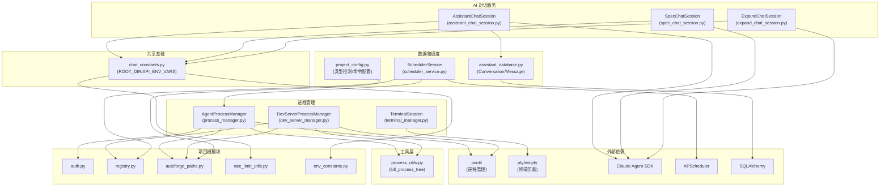

# server/services/ -- 业务逻辑服务

## 目录概述

`services/` 目录包含所有业务逻辑服务,负责进程管理、终端会话、AI 对话、定时调度等核心功能。路由层将请求委托给此层执行,此层再调用底层工具函数和外部模块。

## 文件列表

| 文件 | 大小 | 职责说明 |
|------|------|---------|
| `__init__.py` | 0.8 KB | 汇总导出 AgentProcessManager、TerminalSession、project_config 等 |
| `process_manager.py` | 26.9 KB | 代理子进程生命周期管理(启动/停止/暂停/恢复) |
| `dev_server_manager.py` | 18.2 KB | 开发服务器子进程生命周期管理(启动/停止) |
| `terminal_manager.py` | 24.0 KB | PTY 终端会话管理(Windows winpty + Unix pty) |
| `project_config.py` | 8.5 KB | 项目类型检测和开发命令配置 |
| `scheduler_service.py` | 16.1 KB | APScheduler 定时调度服务(启动/停止代理) |
| `assistant_chat_session.py` | 18.9 KB | 助手对话会话(Claude SDK + MCP 工具) |
| `assistant_database.py` | 8.6 KB | 助手对话持久化(SQLAlchemy 模型 + CRUD) |
| `spec_chat_session.py` | 14.3 KB | Spec 创建对话会话(7 阶段引导) |
| `expand_chat_session.py` | 18.5 KB | 项目扩展对话会话(功能创建追踪) |
| `chat_constants.py` | 3.4 KB | 共享常量和辅助函数 |

---

## 各服务详细说明

### process_manager.py -- 代理进程管理

**核心类:** `AgentProcessManager`

管理单个项目的代理子进程完整生命周期,提供跨平台支持(Windows + macOS + Linux)。

**状态机:**

```
stopped -> running -> paused -> running -> stopped
                   -> crashed
                   -> pausing -> paused_graceful -> running
```

**核心方法:**

| 方法 | 说明 |
|------|------|
| `start()` | 启动代理子进程,构建命令行参数,创建锁文件,开始输出流 |
| `stop()` | 停止代理,终止整个进程树(SIGTERM -> SIGKILL),清理锁文件 |
| `pause()` | 通过 `psutil.suspend()` 暂停进程 |
| `resume()` | 通过 `psutil.resume()` 恢复进程 |
| `graceful_pause()` | 写入 drain 信号文件,编排器会在当前工作完成后暂停 |
| `graceful_resume()` | 删除 drain 信号文件,编排器恢复调度 |
| `healthcheck()` | 检查进程是否存活,自动将意外终止的进程标记为 crashed |

**锁文件机制:**
- 路径: `.autoforge/.agent.lock`
- 内容格式: `{PID}:{CREATE_TIME}` (新格式) 或 `{PID}` (旧格式)
- 创建方式: 使用 `os.open(O_CREAT | O_EXCL)` 原子操作,防止 TOCTOU 竞态
- PID 复用检测: 通过 `psutil.Process.create_time()` 验证进程身份

**输出流处理:**
- 使用 `asyncio.run_in_executor()` 异步读取阻塞的 `readline()`
- 输出经过 `sanitize_output()` 过滤敏感数据
- 检测认证错误(`is_auth_error`)并广播帮助信息
- 检测优雅暂停状态转换(`All agents drained - paused.`)

**特性清理:**
- `_cleanup_stale_features()`: 当代理停止/崩溃时,重置所有 `in_progress=True` 的功能为非进行中状态

**全局注册表函数:**
- `get_manager(project_name, project_dir, root_dir)` -- 线程安全的单例获取
- `cleanup_all_managers()` -- 服务器关闭时停止所有代理
- `cleanup_orphaned_locks()` -- 清理孤立锁文件(启动时调用)

### dev_server_manager.py -- 开发服务器管理

**核心类:** `DevServerProcessManager`

AgentProcessManager 的简化版本,专为开发服务器设计。

**与 AgentProcessManager 的区别:**
- 无暂停/恢复功能(开发服务器不需要)
- 增加 URL 检测(从输出中解析 `http://localhost:XXXX` 模式)
- 更简单的状态: `stopped` | `running` | `crashed`
- 更严格的命令安全检查(阻止 Shell 操作符和 Shell 运行器)

**URL 检测模式:**
- `http://localhost:3000` / `http://127.0.0.1:5173`
- `http://[::1]:3000` (IPv6 localhost)
- `http://0.0.0.0:3000` (绑定所有接口)

**安全措施:**
- 阻止 Shell 操作符: `&&`, `||`, `;`, `|`, `` ` ``, `$(`, `&`, `>`, `<`, `^`, `%`
- 阻止换行注入(cmd.exe 将换行解释为命令分隔符)
- 阻止直接 Shell 运行器: `sh`, `bash`, `zsh`, `cmd`, `powershell`, `pwsh`
- Windows 自动添加 `.cmd` 后缀(npm/pnpm/yarn/npx)

**全局注册表函数:**
- `get_devserver_manager(project_name, project_dir)` -- 线程安全的单例获取
- `cleanup_all_devservers()` -- 服务器关闭时停止所有开发服务器
- `cleanup_orphaned_devserver_locks()` -- 清理孤立锁文件

### terminal_manager.py -- 终端会话管理

**核心类:** `TerminalSession`

管理单个 PTY 终端会话,提供跨平台支持。

**平台支持:**
- **Windows**: 使用 `pywinpty` (ConPTY) 包,通过 `WinPtyProcess.spawn()` 创建 PTY
- **Unix/macOS**: 使用内置 `pty.fork()` + `fcntl` + `termios` + `select` 模块

**核心方法:**

| 方法 | 说明 |
|------|------|
| `start(cols, rows)` | 启动 PTY 进程(根据平台选择实现) |
| `write(data)` | 向 PTY 写入输入(Windows 需要 bytes -> str 转换) |
| `resize(cols, rows)` | 调整终端尺寸(通过 `TIOCSWINSZ` ioctl 或 `setwinsize`) |
| `stop()` | 停止 PTY 进程(Unix: SIGTERM -> SIGKILL + waitpid 防僵尸) |

**输出读取:**
- Windows: `run_in_executor(pty.read)` + `asyncio.sleep(0.01)` 防空转
- Unix: `run_in_executor(select + os.read)` 带 100ms 超时
- 输出以 raw bytes 发送给回调(非行缓冲)

**全局管理函数:**

| 函数 | 说明 |
|------|------|
| `create_terminal(project_name, name)` | 创建终端元数据(自动编号: Terminal 1, 2, ...) |
| `list_terminals(project_name)` | 列出项目终端 |
| `rename_terminal(project_name, id, name)` | 重命名终端 |
| `delete_terminal(project_name, id)` | 删除终端及其会话 |
| `get_terminal_session(project_name, dir, id)` | 获取或创建会话实例 |
| `remove_terminal_session(project_name, id)` | 移除会话 |
| `stop_terminal_session(project_name, id)` | 停止并移除会话 |
| `cleanup_all_terminals()` | 清理所有会话(服务器关闭时调用) |

**数据结构:** 双层字典 `Dict[project_name, Dict[terminal_id, TerminalSession]]` + 元数据列表 `Dict[project_name, List[TerminalInfo]]`

### project_config.py -- 项目配置

**核心功能:** 项目类型自动检测和开发命令管理。

**项目类型检测规则:**

| 优先级 | 检测条件 | 类型 | 默认命令 |
|--------|---------|------|---------|
| 1 | `package.json` + 含 `next` 依赖 | Node.js (Next.js) | `npm run dev` |
| 2 | `package.json` + 含 `vite` 依赖 | Node.js (Vite) | `npm run dev` |
| 3 | `package.json` + scripts.dev 存在 | Node.js | `npm run dev` |
| 4 | `package.json` + scripts.start 存在 | Node.js | `npm start` |
| 5 | `pyproject.toml` + uvicorn 依赖 | Python (FastAPI) | `uvicorn main:app --reload` |
| 6 | `Cargo.toml` | Rust | `cargo run` |
| 7 | `go.mod` | Go | `go run .` |
| 8 | `requirements.txt` | Python | `python main.py` |
| 9 | `pyproject.toml` | Python | `python main.py` |

**配置持久化:** 自定义命令存储在 `.autoforge/config.json` 中。

**导出函数:**
- `detect_project_type(project_dir)` -- 返回类型和默认命令
- `get_dev_command(project_dir)` -- 获取自定义命令(如有)
- `set_dev_command(project_dir, command)` -- 设置自定义命令
- `clear_dev_command(project_dir)` -- 清除自定义命令
- `get_default_dev_command(project_dir)` -- 获取检测到的默认命令
- `get_project_config(project_dir)` -- 获取完整配置

### scheduler_service.py -- 调度服务

**核心类:** `SchedulerService`

基于 APScheduler 的自动化代理调度服务。

**作业类型(每个调度创建 2 个 CronTrigger 作业):**
1. **Start 作业**: 在 `start_time` 触发,启动代理
2. **Stop 作业**: 在 `start_time + duration_minutes` 触发,停止代理

**关键方法:**

| 方法 | 说明 |
|------|------|
| `start()` | 启动调度器,检查遗漏窗口,加载所有调度 |
| `stop()` | 优雅关闭调度器 |
| `add_schedule(name, schedule, path)` | 注册调度(start + stop 两个作业) |
| `remove_schedule(schedule_id)` | 移除调度的两个作业 |
| `_start_agent(name, path, schedule)` | 内部方法,启动代理并应用调度设置 |
| `_stop_agent(name, schedule_id)` | 内部方法,停止代理并记录覆盖 |

**崩溃恢复:**
- 最大重试次数: `MAX_CRASH_RETRIES = 3`
- 退避基数: `CRASH_BACKOFF_BASE = 10` 秒
- 指数退避: `10s`, `40s`, `90s` (base * retry^2)

**手动覆盖追踪:**
- 使用 `ScheduleOverride` 模型记录用户手动停止操作
- 覆盖有效期至当前窗口结束
- `_is_within_window()` 判断当前时间是否在调度活动窗口内

**服务器重启恢复:**
- `_check_missed_windows_on_startup()`: 启动时检查是否处于某个调度的活动窗口内
- 如果是且无手动停止覆盖,则立即启动代理(补偿错过的 cron 触发)

### assistant_chat_session.py -- 助手对话

**核心类:** `AssistantChatSession`

管理只读代码分析助手的对话会话。

**MCP 工具权限:**

只读工具(始终可用):
- `mcp__features__feature_get_stats` -- 获取进度统计
- `mcp__features__feature_get_by_id` -- 获取单个功能
- `mcp__features__feature_get_ready` -- 获取就绪功能
- `mcp__features__feature_get_blocked` -- 获取阻塞功能

功能管理工具(可选启用):
- `mcp__features__feature_create` -- 创建功能
- `mcp__features__feature_create_bulk` -- 批量创建
- `mcp__features__feature_skip` -- 跳过功能

**系统提示构建:**
- 包含 `app_spec.txt` 内容作为项目上下文
- 指令: 可以读取代码和查询功能,不能修改文件
- 使用 `claude_agent_sdk.ClaudeSDKClient` 与 Claude CLI 交互

**对话持久化:**
- 每个消息存储到 `assistant.db`(通过 `assistant_database` 模块)
- 支持多轮对话,每轮对话有独立 `conversation_id`
- 重连后恢复历史消息上下文

**速率限制处理:**
- 使用 `check_rate_limit_error()` 检测限流异常
- 通过 `parse_retry_after()` 提取重试等待时间
- 向客户端发送限流错误消息

### assistant_database.py -- 对话持久化

**SQLAlchemy 模型:**

| 模型 | 表名 | 字段 |
|------|------|------|
| `Conversation` | `conversations` | id, project_name, title, created_at, updated_at |
| `ConversationMessage` | `conversation_messages` | id, conversation_id(FK), role, content, created_at |

**引擎缓存:**
- 使用 `Dict[posix_path, Engine]` 缓存,避免重复创建引擎
- `threading.Lock` 保证线程安全
- 每个项目的 `assistant.db` 文件独立存储在 `.autoforge/` 目录

**CRUD 函数:**
- `create_conversation(project_dir, project_name)` -- 创建对话
- `add_message(project_dir, conversation_id, role, content)` -- 添加消息
- `get_conversations(project_dir, project_name)` -- 列出对话
- `get_messages(project_dir, conversation_id)` -- 获取消息
- `delete_conversation(project_dir, conversation_id)` -- 删除对话(级联删除消息)

### spec_chat_session.py -- Spec 创建对话

**核心类:** `SpecChatSession`

使用 `create-spec.md` 技能引导用户通过 7 个阶段创建应用规格说明。

**7 个阶段:**
1. 项目概述(名称、描述、受众)
2. 参与级别(快速 vs 详细模式)
3. 技术偏好
4. 功能探索(主要交互阶段)
5. 技术细节(推导或讨论)
6. 成功标准
7. 审批和确认

**特殊能力:**
- 支持图片附件(通过 `make_multimodal_message` 构建多模态消息)
- 输出解析: 从 Claude 响应中提取结构化问题(`<question>` 标签)
- Spec 完成检测: 监听文件写入工具调用,写入 `.spec_status.json` 状态文件

### expand_chat_session.py -- 项目扩展对话

**核心类:** `ExpandChatSession`

使用 `expand-project.md` 技能通过自然语言向现有项目添加功能。

**与 SpecChatSession 的区别:**
- 读取现有 `app_spec.txt` 作为上下文(而非从零创建)
- 使用 Feature MCP 工具创建功能(而非写入 spec 文件)
- 追踪 `features_created` 计数(通过监听 `tool_call` 类型)
- 使用 `expand-project.md` 技能(而非 `create-spec.md`)

**MCP 工具权限:**
- `mcp__features__feature_create` -- 创建单个功能
- `mcp__features__feature_create_bulk` -- 批量创建功能
- `mcp__features__feature_get_stats` -- 获取当前进度

### chat_constants.py -- 共享常量

**常量:**
- `ROOT_DIR`: 项目根目录路径(`Path(__file__).parent.parent.parent`)
- `API_ENV_VARS`: 从 `env_constants.py` 重新导出的 API 环境变量列表

**辅助函数:**

| 函数 | 说明 |
|------|------|
| `check_rate_limit_error(exc)` | 检查异常是否为速率限制错误,返回 `(is_rate_limit, retry_seconds)` |
| `safe_receive_response(client, log)` | 包装 `client.receive_response()`,跳过 `MessageParseError`(最多 50 次) |
| `make_multimodal_message(content_blocks)` | 构建包含文本和图片的多模态用户消息 |

**`MessageParseError` 处理逻辑:**
Claude CLI 可能发出 SDK 无法识别的消息类型(如 `rate_limit_event`),这会导致 `MessageParseError` 中断异步生成器。`safe_receive_response` 捕获这种错误并重启 `receive_response()`,利用 SDK 的缓冲内存通道继续读取后续消息。

---

## 架构图



---

## 依赖关系

### 服务间依赖

| 服务 | 依赖 |
|------|------|
| `scheduler_service` | `process_manager`(通过 `get_manager` 启动/停止代理) |
| `assistant_chat_session` | `assistant_database`(对话持久化) |
| `assistant_chat_session` | `chat_constants`(ROOT_DIR, 辅助函数) |
| `spec_chat_session` | `chat_constants`(ROOT_DIR, make_multimodal_message, safe_receive_response) |
| `expand_chat_session` | `chat_constants`(同上) |
| `process_manager` | `utils/process_utils`(kill_process_tree) |
| `dev_server_manager` | `utils/process_utils`(kill_process_tree) |

### 进程管理器对比

| 特性 | AgentProcessManager | DevServerProcessManager |
|------|---------------------|------------------------|
| 暂停/恢复 | 支持(硬暂停 + 优雅暂停) | 不支持 |
| URL 检测 | 不支持 | 支持(从输出解析) |
| 认证错误检测 | 支持 | 不支持 |
| 功能清理 | 支持(重置 in_progress) | 不支持 |
| 锁文件格式 | `PID:CREATE_TIME` | 仅 `PID` |
| 状态数量 | 6 种 | 3 种 |
| 命令安全检查 | 无(使用固定命令模板) | 多层验证(白名单+结构+操作符) |
| Playwright 集成 | 支持(headless 设置) | 无 |

---

## 关键模式

### 进程树终止

`process_manager` 和 `dev_server_manager` 都使用 `kill_process_tree()` 确保杀死整个进程树,而不仅仅是父进程。这对于 Windows 尤其重要,因为 `subprocess.terminate()` 只杀死直接进程,会留下孤立的子进程。

### 回调广播模式

所有三个进程管理服务(Agent、DevServer、Terminal)采用相同的回调模式:
1. 使用 `Set[Callable]` 存储回调,支持多个 WebSocket 客户端
2. `threading.Lock` 保护回调集合的线程安全
3. 广播时先复制集合,再逐个调用(防止回调中修改集合)
4. `_safe_callback()` 包装异常处理,单个回调失败不影响其他

### Claude SDK 客户端配置

三个 AI 对话服务(`assistant`、`spec`、`expand`)使用 Claude Agent SDK 的相同模式:
1. 检测 Claude CLI 路径(`shutil.which("claude")`)
2. 构建 `ClaudeAgentOptions` 配置(model, allowed_tools, cwd, system_prompt)
3. 通过 `ClaudeSDKClient` 发送查询并流式接收响应
4. 使用 `safe_receive_response()` 处理 `MessageParseError`
5. 使用 `check_rate_limit_error()` 处理速率限制

### 环境变量转发

AI 对话服务需要将 API 密钥等环境变量转发给 Claude CLI 子进程。`chat_constants.py` 从 `env_constants.py` 导入 `API_ENV_VARS` 列表,确保所有服务使用统一的环境变量集合。
