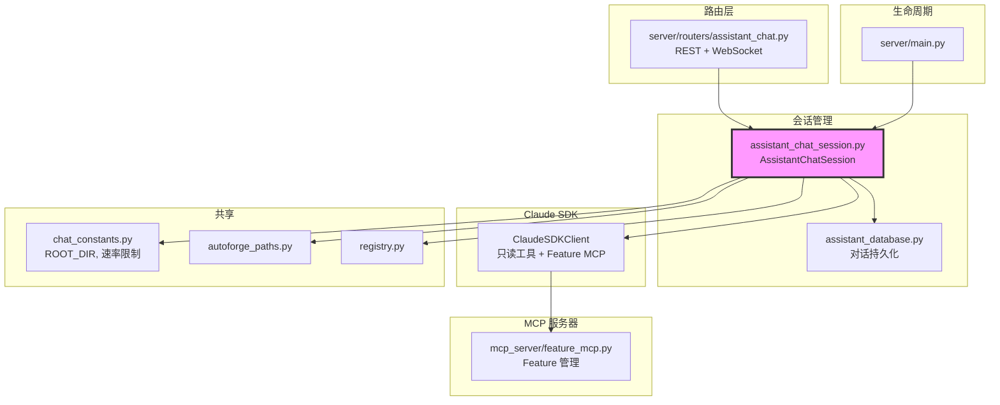

# `assistant_chat_session.py` — 项目助手对话会话管理

> 源文件路径: `server/services/assistant_chat_session.py`

## 功能概述

`assistant_chat_session.py` 实现了项目只读助手（Assistant）的对话会话管理。助手可以回答关于代码库和 Feature 的问题，创建和管理 Feature 积压列表，但不能修改任何源代码文件。

该模块通过 Claude Agent SDK 创建受限的 Claude 客户端实例，只允许使用只读工具（Read、Glob、Grep、WebFetch、WebSearch）和 Feature 管理 MCP 工具（feature_get_stats、feature_create、feature_skip 等）。对话历史持久化到 SQLite 数据库（通过 `assistant_database` 模块），支持会话恢复——恢复时将历史消息作为上下文注入首条消息。

会话采用全局注册表管理，每个项目同时只有一个活跃会话。创建新会话时自动关闭旧会话，确保资源正确释放。

## 依赖关系

### 导入依赖

| 模块 | 说明 |
|------|------|
| `json` | JSON 序列化（安全设置文件） |
| `logging` | 日志记录 |
| `os` | 环境变量读取 |
| `shutil` | Claude CLI 查找 |
| `sys` | 模块路径 |
| `threading` | 会话注册表线程安全 |
| `datetime` | 会话创建时间 |
| `pathlib.Path` | 路径操作 |
| `claude_agent_sdk` | Claude Agent SDK（`ClaudeAgentOptions`, `ClaudeSDKClient`） |
| `dotenv` | 环境变量加载 |
| `.assistant_database` | 对话持久化（`add_message`, `create_conversation`, `get_messages`） |
| `.chat_constants` | 共享常量和工具函数（`ROOT_DIR`, `check_rate_limit_error`, `safe_receive_response`） |
| `autoforge_paths` | 路径解析（提示词目录、设置文件路径） |
| `registry` | API 配置（`DEFAULT_MODEL`, `get_effective_sdk_env`） |

### 被依赖

| 模块 | 引用内容 |
|------|----------|
| `server/routers/assistant_chat.py` | 导入 `AssistantChatSession`, `get_session`, `create_session`, `remove_session`, `list_sessions` |
| `server/main.py` | 导入 `cleanup_all_sessions`（别名 `cleanup_assistant_sessions`） |

## 关键类/函数

### `get_system_prompt(project_name, project_dir) -> str`

- **说明**: 生成助手的系统提示词，包含项目上下文（从 `app_spec.txt` 加载，超过 5000 字符时截断）、可用工具说明、Feature 创建指南等

### 常量

- `READONLY_FEATURE_MCP_TOOLS` — 只读 Feature 工具列表（stats、get_by_id、get_ready、get_blocked）
- `FEATURE_MANAGEMENT_TOOLS` — Feature 管理工具（create、create_bulk、skip）
- `INTERACTIVE_TOOLS` — 交互式工具（ask_user，用于向用户展示选择题）
- `READONLY_BUILTIN_TOOLS` — 只读内置工具（Read、Glob、Grep、WebFetch、WebSearch）

### `class AssistantChatSession`

#### `__init__(self, project_name, project_dir, conversation_id=None)`

- **参数**:
  - `project_name: str` — 项目名称
  - `project_dir: Path` — 项目目录
  - `conversation_id: Optional[int]` — 恢复已有对话的 ID

#### `async start(self) -> AsyncGenerator[dict, None]`

- **Yields**: 消息块（`conversation_created`、`text`、`response_done`、`error`）
- **说明**:
  1. 创建或恢复对话（数据库）
  2. 生成安全设置文件（无 Bash、bypassPermissions）
  3. 配置 Feature MCP 服务器
  4. 将系统提示词写入 `CLAUDE.md`（避免 Windows 命令行长度限制）
  5. 创建 Claude SDK 客户端
  6. 新对话发送问候语，恢复对话跳过问候

#### `async send_message(self, user_message) -> AsyncGenerator[dict, None]`

- **Yields**: 消息块（`text`、`tool_call`、`question`、`response_done`、`error`）
- **说明**: 存储用户消息到数据库，恢复的对话在首次消息中注入最近 35 条历史记录作为上下文

#### `async _query_claude(self, message) -> AsyncGenerator[dict, None]`

- **说明**: 内部查询方法，处理文本响应和工具调用。拦截 `ask_user` 工具调用并转为 `question` 类型消息。完整响应存入数据库

### 模块级会话管理

#### `get_session(project_name) -> Optional[AssistantChatSession]`

#### `async create_session(project_name, project_dir, conversation_id=None) -> AssistantChatSession`

- **说明**: 创建新会话，自动关闭同项目的旧会话

#### `async remove_session(project_name) -> None`

#### `async cleanup_all_sessions() -> None`

- **说明**: 关闭所有活跃会话，服务器关闭时调用

## 架构图

## 注意事项

1. **只读安全**: 助手只能使用 Read/Glob/Grep 文件工具和指定的 Feature MCP 工具，无法修改文件或执行 Bash 命令
2. **系统提示词长度**: 通过写入 `CLAUDE.md` 文件并使用 `setting_sources=["project"]` 加载，绕过 Windows 8191 字符命令行限制
3. **对话恢复**: 恢复对话时将最近 35 条消息（每条截断到 500 字符）作为上下文注入，避免上下文过长
4. **ask_user 工具**: 拦截 `ask_user` MCP 工具调用，转换为 UI 可渲染的选择题格式
5. **速率限制**: 通过 `check_rate_limit_error` 检测速率限制错误，向用户返回友好提示
6. **MessageParseError 处理**: 通过 `safe_receive_response` 跳过 Claude CLI 发出的未知消息类型（如 `rate_limit_event`），防止中断响应流
