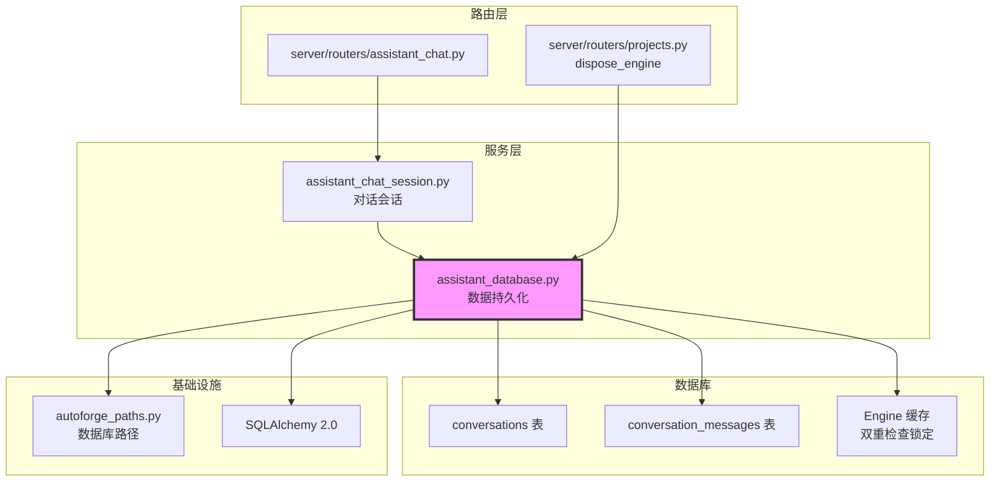

# `assistant_database.py` — 助手对话持久化数据库

> 源文件路径: `server/services/assistant_database.py`

## 功能概述

`assistant_database.py` 提供助手对话的 SQLite 持久化功能。每个项目拥有独立的 `assistant.db` 数据库文件，存储在项目的 `.autoforge/` 目录下。数据库包含两个表：`conversations`（对话）和 `conversation_messages`（对话消息），使用 SQLAlchemy 2.0 风格的声明式模型。

模块实现了线程安全的数据库引擎缓存机制，避免频繁创建连接。使用双重检查锁定（Double-Checked Locking）模式，在保证线程安全的同时优化性能。提供完整的 CRUD 操作：创建/查询/删除对话，添加/查询消息，以及自动生成对话标题（取首条用户消息的前 50 个字符）。

## 依赖关系

### 导入依赖

| 模块 | 说明 |
|------|------|
| `logging` | 日志记录 |
| `threading` | 引擎缓存线程安全锁 |
| `datetime` | UTC 时间戳 |
| `pathlib.Path` | 路径操作 |
| `sqlalchemy` | ORM 框架（Column、关系、引擎、会话工厂） |
| `autoforge_paths` | 助手数据库路径解析 |

### 被依赖

| 模块 | 引用内容 |
|------|----------|
| `server/services/assistant_chat_session.py` | 导入 `add_message`, `create_conversation`, `get_messages` |
| `server/routers/projects.py` | 导入 `dispose_engine`（删除项目时释放数据库锁） |
| `server/routers/assistant_chat.py` | 间接使用（通过 assistant_chat_session） |

## 关键类/函数

### `class Base(DeclarativeBase)`

- **说明**: SQLAlchemy 2.0 风格声明式基类

### `class Conversation(Base)`

对话表模型。

| 字段 | 类型 | 说明 |
|------|------|------|
| `id` | `Integer` (PK) | 对话 ID |
| `project_name` | `String(100)` | 项目名称（索引） |
| `title` | `String(200)` | 对话标题（可选，自动从首条用户消息生成） |
| `created_at` | `DateTime` | 创建时间（UTC） |
| `updated_at` | `DateTime` | 更新时间（UTC，添加消息时自动更新） |
| `messages` | relationship | 关联的消息列表（级联删除） |

### `class ConversationMessage(Base)`

对话消息表模型。

| 字段 | 类型 | 说明 |
|------|------|------|
| `id` | `Integer` (PK) | 消息 ID |
| `conversation_id` | `Integer` (FK) | 所属对话 ID（索引） |
| `role` | `String(20)` | 角色（"user" / "assistant" / "system"） |
| `content` | `Text` | 消息内容 |
| `timestamp` | `DateTime` | 消息时间（UTC） |

### `get_engine(project_dir: Path) -> Engine`

- **说明**: 获取或创建项目的 SQLAlchemy 引擎，使用双重检查锁定缓存
- **配置**: `check_same_thread=False`（允许跨线程使用），`timeout=30`（等待锁超时）

### `dispose_engine(project_dir: Path) -> bool`

- **返回值**: 是否有引擎被释放
- **说明**: 释放缓存的数据库引擎，关闭所有连接。在 Windows 上删除数据库文件前必须调用，否则文件锁无法释放

### `create_conversation(project_dir, project_name, title=None) -> Conversation`

- **说明**: 创建新对话，返回刷新后的 Conversation 对象（包含自增 ID）

### `get_conversations(project_dir, project_name) -> list[dict]`

- **说明**: 获取项目的所有对话及消息计数。使用子查询避免 N+1 查询问题，按 `updated_at` 降序排列

### `get_conversation(project_dir, conversation_id) -> Optional[dict]`

- **说明**: 获取单个对话的完整信息（含所有消息，按时间排序）

### `delete_conversation(project_dir, conversation_id) -> bool`

- **说明**: 删除对话及其所有消息（级联删除）

### `add_message(project_dir, conversation_id, role, content) -> Optional[dict]`

- **说明**: 向对话添加消息。自动更新 `updated_at` 时间戳，首条用户消息自动生成对话标题

### `get_messages(project_dir, conversation_id) -> list[dict]`

- **说明**: 获取对话的所有消息，按时间升序排列

## 架构图

## 注意事项

1. **每项目独立数据库**: 每个项目有自己的 `assistant.db`，避免跨项目数据混淆
2. **引擎缓存**: 使用 `_engine_cache` 字典缓存 SQLAlchemy 引擎，避免重复创建。路径使用 `as_posix()` 格式确保跨平台一致性
3. **双重检查锁定**: `get_engine()` 先无锁检查缓存，命中则直接返回；未命中时加锁再次检查，避免重复创建
4. **Windows 文件锁**: 删除项目前必须调用 `dispose_engine()` 释放数据库连接，否则 Windows 上文件无法删除
5. **UTC 时间**: 使用 `datetime.now(timezone.utc)` 替代已弃用的 `datetime.utcnow()`
6. **N+1 查询优化**: `get_conversations()` 使用子查询 + outerjoin 一次性获取消息计数
7. **自动标题**: 首条用户消息的前 50 个字符自动设为对话标题
