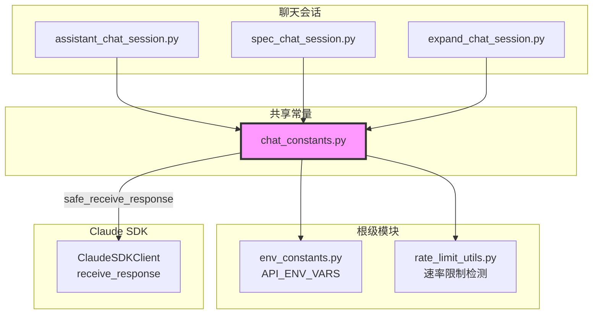

# `chat_constants.py` — 聊天会话共享常量与工具函数

> 源文件路径: `server/services/chat_constants.py`

## 功能概述

`chat_constants.py` 是所有聊天会话类型（助手、规范创建、项目扩展）的共享常量和工具函数模块。它定义了 AutoForge 仓库根目录常量 `ROOT_DIR`，重新导出了 `API_ENV_VARS`（来自 `env_constants.py`），并提供三个关键工具函数。

`check_rate_limit_error` 函数检测异常是否为速率限制错误，同时智能地排除 `MessageParseError`（SDK 无法识别的 CLI 消息类型，如 `rate_limit_event`）的误判。`safe_receive_response` 是 `client.receive_response()` 的安全包装器，在遇到 `MessageParseError` 时自动重试而不中断响应流。`make_multimodal_message` 构造符合 Claude Agent SDK 格式的多模态用户消息。

## 依赖关系

### 导入依赖

| 模块 | 说明 |
|------|------|
| `logging` | 日志记录 |
| `sys` | 模块路径管理 |
| `pathlib.Path` | 路径操作 |
| `env_constants` | 环境变量常量（`API_ENV_VARS`） |
| `rate_limit_utils` | 速率限制检测（`is_rate_limit_error`, `parse_retry_after`） |

### 被依赖

| 模块 | 引用内容 |
|------|----------|
| `server/services/assistant_chat_session.py` | 导入 `ROOT_DIR`, `check_rate_limit_error`, `safe_receive_response` |
| `server/services/spec_chat_session.py` | 导入 `ROOT_DIR`, `check_rate_limit_error`, `make_multimodal_message`, `safe_receive_response` |
| `server/services/expand_chat_session.py` | 导入 `ROOT_DIR`, `check_rate_limit_error`, `make_multimodal_message`, `safe_receive_response` |

## 关键类/函数

### 常量

#### `ROOT_DIR: Path`

- **值**: `Path(__file__).parent.parent.parent`
- **说明**: AutoForge 仓库根目录路径，用于定位技能文件、模板等资源

#### `API_ENV_VARS` (重新导出)

- **来源**: `env_constants.py`
- **说明**: Claude CLI 子进程需要转发的环境变量列表。通过重新导出保持向后兼容

### `check_rate_limit_error(exc: Exception) -> tuple[bool, int | None]`

- **参数**: `exc` — 异常对象
- **返回值**: `(is_rate_limit, retry_seconds)` — 是否为速率限制，以及建议的重试等待秒数
- **说明**:
  - `MessageParseError` 总是返回 `(False, None)`（SDK 不认识的 CLI 消息类型，非真正的速率限制错误）
  - 其他异常：使用 `is_rate_limit_error` 匹配已知速率限制模式，并尝试用 `parse_retry_after` 解析重试时间

### `async safe_receive_response(client, log) -> AsyncGenerator`

- **参数**:
  - `client` — Claude SDK 客户端
  - `log` — Logger 实例
- **说明**: 包装 `client.receive_response()`，当遇到 `MessageParseError` 时记录警告并重新调用 `receive_response()` 继续接收剩余消息。最多重试 50 次，防止无限循环
- **原理**: Claude CLI 可能发出 SDK 不认识的消息类型（如 `rate_limit_event`），SDK 抛出 `MessageParseError` 后异步生成器终止，但 CLI 子进程仍在运行，SDK 的缓冲内存通道中还有数据可读

### `async make_multimodal_message(content_blocks: list[dict]) -> AsyncGenerator[dict, None]`

- **参数**: `content_blocks` — 内容块列表（文本和/或图片）
- **说明**: 生成符合 Claude Agent SDK `query()` 方法格式的异步生成器，包装为 `{type: "user", message: {...}, session_id: "default"}` 格式

## 架构图

## 注意事项

1. **MessageParseError 的特殊处理**: 这是关键的防御逻辑。`rate_limit_event` 消息类型虽然名称中包含 "rate_limit"，但它是 CLI 的信息性事件而非错误，`MessageParseError` 不应被视为速率限制
2. **safe_receive_response 的重试逻辑**: 使用 `while True` 循环和 `max_retries` 上限。每次 `MessageParseError` 后重新启动 `receive_response()` 迭代器，不会丢失数据因为 SDK 使用缓冲内存通道
3. **sys.path 注入**: 模块启动时将仓库根目录加入 `sys.path`，以便导入根级模块（`env_constants`、`rate_limit_utils`）
4. **向后兼容**: `API_ENV_VARS` 从 `env_constants.py` 重新导出，保持原有 `from .chat_constants import API_ENV_VARS` 导入路径可用
5. **multimodal 消息格式**: `make_multimodal_message` 生成的消息格式必须与 Claude Agent SDK 的 `query()` 方法预期的 `AsyncIterable[dict]` 格式完全匹配
