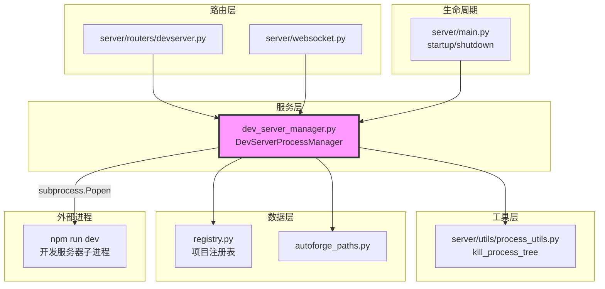

# `dev_server_manager.py` — 开发服务器进程管理器

> 源文件路径: `server/services/dev_server_manager.py`

## 功能概述

`dev_server_manager.py` 是专门为开发服务器（dev server）设计的进程管理器，是 `AgentProcessManager` 的简化版本。它管理每个项目的开发服务器子进程（如 `npm run dev`、`cargo run` 等），提供启动和停止功能。

与 Agent 进程管理器不同，开发服务器管理器不需要暂停/恢复功能，但增加了 URL 自动检测能力——通过正则表达式从输出中识别 `http://localhost:XXXX` 模式的 URL，使 UI 可以直接提供预览链接。该模块同样实现了敏感信息过滤、锁文件防重复启动、进程树终止和输出流广播等功能。

安全方面，模块严格过滤命令中的 Shell 操作符和元字符（`&&`、`||`、`;`、`|`、反引号、`$(` 等），并阻止直接使用 Shell 解释器（sh、bash、cmd 等），防止命令注入攻击。

## 依赖关系

### 导入依赖

| 模块 | 说明 |
|------|------|
| `asyncio` | 异步任务调度 |
| `logging` | 日志记录 |
| `re` | 正则表达式（URL 检测、敏感信息过滤） |
| `shlex` | 命令行安全解析 |
| `subprocess` | 子进程创建和管理 |
| `sys` | 平台检测 |
| `threading` | 线程安全锁 |
| `datetime` | 时间戳记录 |
| `pathlib.Path` | 路径操作 |
| `psutil` | 进程存活检测和锁文件验证 |
| `registry` | 项目注册表（`list_registered_projects`） |
| `server.utils.process_utils` | 进程树终止工具（`kill_process_tree`） |
| `autoforge_paths` | 路径解析（锁文件路径） |

### 被依赖

| 模块 | 引用内容 |
|------|----------|
| `server/routers/devserver.py` | 导入 `get_devserver_manager` |
| `server/websocket.py` | 导入 `get_devserver_manager`，WebSocket 中获取管理器 |
| `server/main.py` | 导入 `cleanup_all_devservers` 和 `cleanup_orphaned_devserver_locks` |
| `test_devserver_security.py` | 测试中导入 `DevServerProcessManager` |

## 关键类/函数

### `sanitize_output(line: str) -> str`

- **说明**: 过滤输出中的敏感信息（与 process_manager 相同的模式列表）

### `extract_url(line: str) -> str | None`

- **参数**: `line` — 输出行
- **返回值**: 检测到的 URL 或 `None`
- **说明**: 使用 `URL_PATTERNS` 匹配 localhost URL（支持 IPv4、IPv6、0.0.0.0）

### `class DevServerProcessManager`

管理单个项目的开发服务器子进程。

#### `async start(self, command: str) -> tuple[bool, str]`

- **参数**: `command` — 启动命令（如 "npm run dev"）
- **返回值**: `(success, message)`
- **说明**:
  1. 检查 Shell 操作符和元字符（`&&`、`||`、`;`、`|`、`` ` ``、`$(`、`&`、`>`、`<`、`^`、`%`）
  2. 阻止换行注入（cmd.exe 将换行解释为命令分隔符）
  3. 阻止直接使用 Shell 解释器
  4. 使用 `shlex.split()` 安全解析命令为参数列表
  5. Windows 上自动为 npm/pnpm/yarn/npx 添加 `.cmd` 后缀
  6. 使用 `shell=False` 启动子进程

#### `async stop(self) -> tuple[bool, str]`

- **说明**: 使用 `kill_process_tree` 终止整个进程树，对于 Node.js 等会派生子进程的开发服务器尤为重要

#### `detected_url` (property)

- **类型**: `str | None`
- **说明**: 从输出中自动检测到的开发服务器 URL

### `get_devserver_manager(project_name, project_dir) -> DevServerProcessManager`

- **说明**: 线程安全地获取或创建项目的开发服务器管理器，使用复合键防止交叉污染

### `cleanup_orphaned_devserver_locks() -> int`

- **说明**: 清理所有注册项目的孤立开发服务器锁文件

### `async cleanup_all_devservers() -> None`

- **说明**: 停止所有运行中的开发服务器

## 架构图

## 注意事项

1. **命令注入防御**: 多层防御策略——阻止 Shell 操作符、阻止换行注入、阻止 Shell 解释器、使用 `shell=False`
2. **Windows cmd.exe 风险**: 即使 `shell=False`，Windows 上的 `.cmd`/`.bat` 文件仍通过 `cmd.exe` 执行（CPython 限制），因此元字符阻止至关重要
3. **URL 检测**: 仅在首次检测到 URL 时记录，避免重复检测影响性能
4. **锁文件验证**: 通过检查进程的工作目录（`proc.cwd()`）与项目目录是否一致来验证锁文件有效性，避免 PID 回收导致的误判
5. **进程树终止**: 开发服务器（特别是 Node.js）通常会派生子进程，必须终止整个进程树
