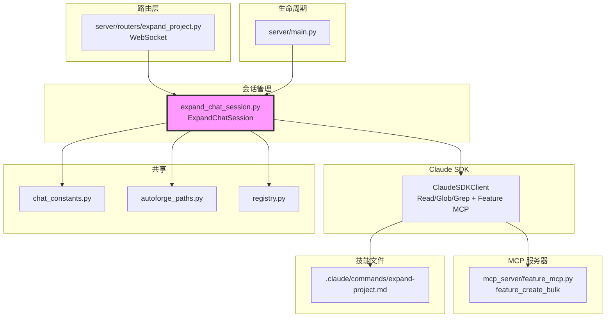

# `expand_chat_session.py` — 项目扩展对话会话管理

> 源文件路径: `server/services/expand_chat_session.py`

## 功能概述

`expand_chat_session.py` 管理交互式的项目扩展（expand）对话。与 `SpecChatSession`（创建全新规范）不同，扩展会话用于向已有项目添加新的 Feature。它读取现有的 `app_spec.txt` 作为上下文，通过与用户的自然语言对话来定义新功能，然后由 Claude 调用 Feature MCP 工具直接创建 Feature。

该会话使用 `expand-project.md` 技能文件引导对话流程，具有受限的权限：只能读取文件（Read/Glob/Grep）和创建 Feature（通过 MCP 工具），不能修改源代码。使用 `asyncio.Lock` 防止并发查询破坏响应流，支持多模态输入（图片附件）。

## 依赖关系

### 导入依赖

| 模块 | 说明 |
|------|------|
| `asyncio` | 异步锁（`_query_lock`） |
| `json` | JSON 序列化（安全设置文件） |
| `logging` | 日志记录 |
| `os` | 环境变量读取 |
| `shutil` | Claude CLI 查找 |
| `sys` | Python 可执行文件路径 |
| `threading` | 会话注册表线程安全 |
| `uuid` | 唯一设置文件名生成 |
| `datetime` | 时间戳记录 |
| `pathlib.Path` | 路径操作 |
| `claude_agent_sdk` | Claude Agent SDK |
| `dotenv` | 环境变量加载 |
| `..schemas` | `ImageAttachment` 数据模型 |
| `.chat_constants` | 共享常量和工具函数 |
| `autoforge_paths` | 路径解析 |
| `registry` | API 配置 |

### 被依赖

| 模块 | 引用内容 |
|------|----------|
| `server/routers/expand_project.py` | 导入 `ExpandChatSession`, `get_expand_session`, `create_expand_session`, `remove_expand_session` |
| `server/main.py` | 导入 `cleanup_all_expand_sessions` |

## 关键类/函数

### 常量

- `EXPAND_FEATURE_TOOLS` — 扩展会话可用的 Feature MCP 工具：`feature_create`、`feature_create_bulk`、`feature_get_stats`

### `class ExpandChatSession`

#### `__init__(self, project_name, project_dir)`

- **属性**:
  - `features_created: int` — 本次会话创建的 Feature 数量
  - `created_feature_ids: list[int]` — 已创建 Feature 的 ID 列表
  - `_query_lock: asyncio.Lock` — 防止并发查询

#### `async close(self) -> None`

- **说明**: 关闭 Claude 客户端，清理临时安全设置文件

#### `async start(self) -> AsyncGenerator[dict, None]`

- **Yields**: 消息块（`text`、`error`、`response_done`）
- **说明**:
  1. 加载 `expand-project.md` 技能文件
  2. 验证项目已有 `app_spec.txt`
  3. 查找并验证 Claude CLI
  4. 创建唯一的安全设置文件（sandbox 启用，只允许 Read/Glob + Feature MCP）
  5. 配置 Feature MCP 服务器
  6. 创建 Claude SDK 客户端（`bypassPermissions` 模式）
  7. 发起对话

#### `async send_message(self, user_message, attachments=None) -> AsyncGenerator[dict, None]`

- **Yields**: 消息块（`text`、`features_created`、`expansion_complete`、`error`、`response_done`）
- **说明**: 使用 `_query_lock` 串行化查询，防止并发消息破坏响应流

#### `async _query_claude(self, message, attachments=None) -> AsyncGenerator[dict, None]`

- **说明**: Feature 创建完全由 Claude 通过 MCP 工具调用完成，无需文本解析

### 模块级会话管理

#### `get_expand_session(project_name) -> Optional[ExpandChatSession]`

#### `async create_expand_session(project_name, project_dir) -> ExpandChatSession`

#### `async remove_expand_session(project_name) -> None`

#### `async cleanup_all_expand_sessions() -> None`

## 架构图

## 注意事项

1. **前置条件**: 项目必须已有 `app_spec.txt`，否则启动失败。全新项目应先使用 `SpecChatSession` 创建规范
2. **查询锁**: 使用 `asyncio.Lock` 串行化 Claude 查询，防止并发消息导致响应流交叉混乱
3. **唯一设置文件**: 每个会话使用 UUID 生成唯一的安全设置文件路径，避免多会话冲突
4. **Sandbox 启用**: 与 `SpecChatSession`（禁用 sandbox）不同，扩展会话启用了 sandbox，因为不需要文件写入
5. **system_prompt 方式不同**: 使用 `system_prompt` 参数直接传递（非写入 CLAUDE.md），因为扩展提示词通常较短
6. **资源清理**: `close()` 方法不仅关闭 Claude 客户端，还删除临时安全设置文件
